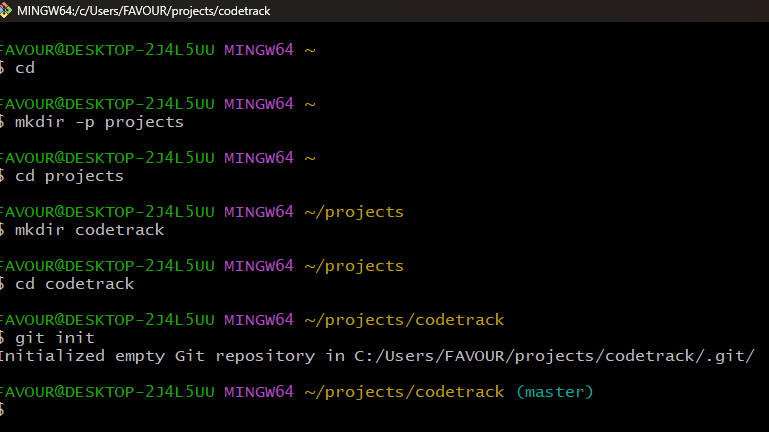
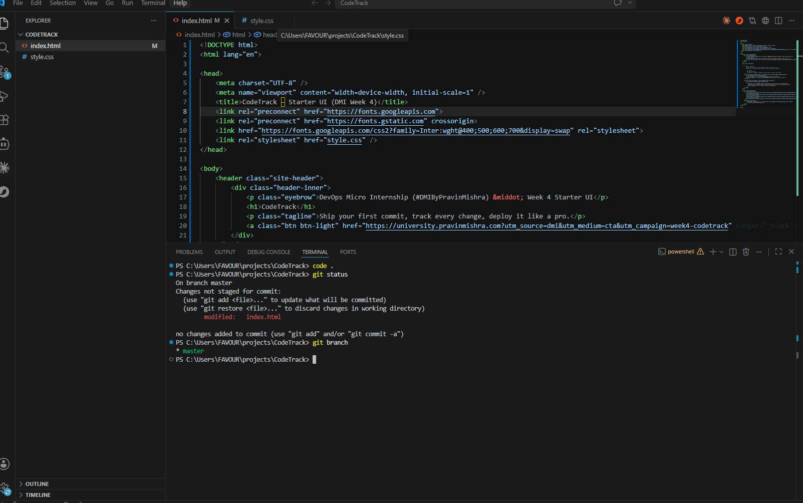

# Week 04 — GitHub & Version Control

Part of the DevOps Micro Internship (DMI) Cohort 3 with Agentic AI

---

## Purpose

This week you learned Git and GitHub — the foundation of every DevOps workflow. Complete all tasks below and update your progress in the main [README.md](../README.md).

---

# Task 1 — Create Your GitHub Account & Profile

## Goal

Set up your GitHub profile professionally.

### Evidence

#### What I did

Created a GitHub account (Favourcloud) and set up a professional profile with bio, location, and profile picture. The profile includes my full name, a professional bio describing my DevOps journey, and links to my projects.

#### Screenshot 1 — Your GitHub profile

GitHub Profile URL: **https://github.com/Favourcloud**

_(Screenshot placed in `screenshots/assignment4-github-profile.png`)_

---

# Task 2 — Initialize a Repository

## Goal

Create this repository, clone it locally, and make your first commit.

### Commands I used

```bash
# Create and initialize the CodeTrack project
mkdir CodeTrack && cd CodeTrack
git init
git config --local user.name "Favour Eze"
git config --local user.email "favourcloud@example.com"

# Create initial files
echo "# CodeTrack" > README.md
touch index.html style.css

# Stage and commit
git add .
git commit -m "initial commit: CodeTrack project scaffold with README, HTML, and CSS"
```

### Evidence

#### Screenshot 2 — Output of your first commit



Additional commit evidence:


---

# Task 3 — Branching & Pull Request

## Goal

Create a branch, make a change, and open a Pull Request.

### Evidence

#### What I did

Created a feature branch `feature/contact-page` in the CodeTrack project, added a `contact.html` page, committed the change, and merged it back to `main`. Also contributed to the shared `devops-micro-internship-interviews` repository using the standard open-source collaboration workflow: forked → cloned → branched → committed → opened a PR.

**Branching workflow for CodeTrack:**

```bash
git checkout -b feature/contact-page
# Created contact.html
git add contact.html
git commit -m "feat: add contact page"
git checkout main
git merge feature/contact-page
```

**Open-source collaboration PR:**

```bash
# Forked pravinmishraaws/devops-micro-internship-interviews to Favourcloud
git clone https://github.com/Favourcloud/devops-micro-internship-interviews.git
cd devops-micro-internship-interviews
git remote add upstream https://github.com/pravinmishraaws/devops-micro-internship-interviews.git
git checkout -b feature-readme-update
# Edited pull_request.md to add my name to student list
git commit -m "docs: add my name to student list"
git push -u origin feature-readme-update
```

#### PR Link

https://github.com/Favourcloud/devops-micro-internship-interviews/pull/new/feature-readme-update

#### Screenshot 3 — Your Pull Request

_(Screenshots in `screenshots/assignment5-pr.png`)_

Branch pushed successfully to fork. PR can be created from the Compare & pull request banner on GitHub.

---

# Task 4 — LinkedIn Post

## Goal

Publish a LinkedIn post summarizing what you learned this week.

### Evidence

#### LinkedIn Post URL

_(Add your LinkedIn post URL here after publishing)_

---

## Key Learnings

- Git is the foundation of all DevOps workflows — version control ensures every change is tracked, reversible, and collaborative.
- The `.git` folder is the "brain" of a repository, storing all commit history, configuration, and object data.
- Branching and merging enable parallel work without breaking the main codebase — feature branches are essential for professional development.
- Forking, cloning, and Pull Requests form the backbone of open-source collaboration — the upstream/origin model keeps contributions clean.
- Git hooks (like pre-commit) can act as automated safety nets, blocking secrets and large files before they enter the repository.
- AI-assisted Git workflows (like Claude Code's `/pr-ready` skill) can augment human judgment by drafting PR descriptions and flagging potential issues.

---

## All Week 04 Assignments Completed

| #   | Assignment                                                  | Status           |
| --- | ----------------------------------------------------------- | ---------------- |
| 1   | CodeTrack: Initial Git Setup (Local Only)                   | ✅ Complete      |
| 2   | CodeTrack: Tracking, Staging, Committing + Deploy to EC2    | ✅ Complete      |
| 3   | CodeTrack: Branching Workflow (Add & Verify a Contact Page) | ✅ Complete      |
| 4   | GitHub Account, Exploration & Professional Profile Setup    | ✅ Complete      |
| 5   | Open-Source Collaboration: Fork, Clone, Sync & Pull Request | ✅ Complete      |
| 6   | Building an AI-Assisted Git Safety Net (PR Ready Check)     | ✅ Complete      |
| 7   | GitHub & Version Control (Consolidated Summary)             | ✅ This document |

### Screenshots

| Screenshot                                   | File                                       |
| -------------------------------------------- | ------------------------------------------ |
| Git init & first commit                      | `screenshots/assignment1-git-init.png`     |
| Git workflow (tracking, staging, committing) | `screenshots/assignment2-git-workflow.png` |
| Git hook test                                | `screenshots/assignment6-hook-test.png`    |
| VS Code pre-commit hook                      | `screenshots/screenshot2-vscode-hook.png`  |

---

_Part of the [DevOps Micro Internship with Agentic AI](https://www.linkedin.com/in/pravin-mishra-aws-trainer/) by Pravin Mishra — Join: https://discord.pravinmishra.com/_
