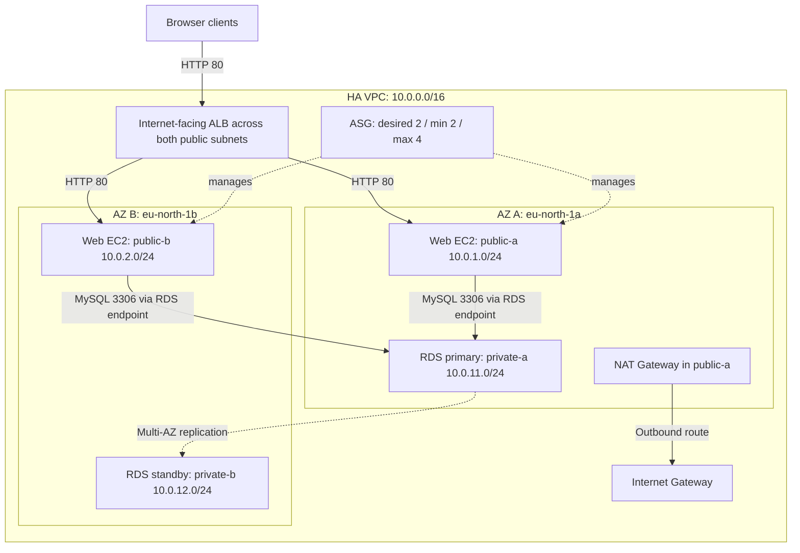
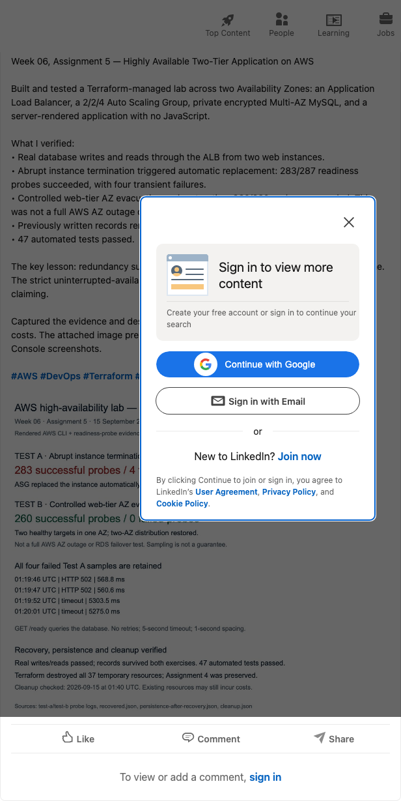

# Assignment 5 — Deploy a Highly Available Two-Tier Application on AWS (VPC + ALB + ASG + Multi-AZ RDS)

Part of the DevOps Micro Internship (DMI) Cohort 3 with Agentic AI

---

## Purpose

In this assignment, you will design and deploy a highly available two-tier web application on AWS: highly available networking across two Availability Zones, an Application Load Balancer, an Auto Scaling Group for the web tier, and a private Multi-AZ RDS database. You must prove high availability with real failure tests.

## Reproducible deployment and real tests — 15 September 2026

A new, isolated Terraform lab was deployed in `us-east-1` without modifying Assignment 4. See the [implementation and runbook](assignment-05-ha/README.md) and [actual results with evidence](assignment-05-ha/RESULTS.md).

- Four subnets across two AZs, correct routes, least-privilege traffic paths, private encrypted Multi-AZ MySQL, an ALB and two healthy ASG instances were verified from AWS APIs. SSM replaced SSH administration; that rubric substitution is explicit.
- Real application writes and reads succeeded through the ALB from two instances. [Live application capture](assignment-05-ha/evidence/application-live.png).
- Abrupt termination triggered replacement, but **4 of 287 readiness probes failed**. Recovery is demonstrated; the strict zero-interruption criterion is **not**.
- Controlled web-tier AZ evacuation and restoration recorded **260 successful probes and no failures**. This was not a full AWS AZ outage or database failover test.
- [Architecture evidence](assignment-05-ha/evidence/architecture-evidence.png) and [test-results evidence](assignment-05-ha/evidence/availability-evidence.png) are clearly labeled renderings of actual redacted CLI data, not AWS Console screenshots.
- Terraform destroyed all 37 temporary lab resources after evidence capture. [Cleanup verification](assignment-05-ha/evidence/cleanup.json) confirms empty state, no residual resources in the checked categories and preservation of Assignment 4. The [LinkedIn post](https://www.linkedin.com/feed/update/urn:li:share:7505450519486767104/) is published and verified with its proof image; historical-image redaction remains pending. No grade is claimed.

The following 13 September audit and screenshots are retained as **historical evidence**, not as captures of this new deployment.

## Evidence audit — 13 September 2026

**Status: partial build; high availability is not yet demonstrated by the submitted evidence.** This review describes historical screenshots, not the current state of AWS resources. The task goals below are requirements, not completion claims.

The captures show a custom VPC, subnets, an available NAT Gateway, security-group rules, an RDS instance, a launch template, an ALB being provisioned, and ASG capacity settings. However, the target group has **zero registered/healthy targets and no associated load balancer**, the ASG capture shows **zero instances**, and the two running EC2 instances shown are **both in `eu-north-1a`**. Nginx welcome pages do not prove application/database operation or successful failure tests.

The security-group captures also show `vpc-0f7b4a0baa38141ca`, whereas the HA VPC and ALB use `vpc-04a8ea452467b0b49`. Confirm the final resource associations before treating these captures as one working deployment. Keep completion items unchecked until the missing evidence listed below is supplied.

---

# Task 1 — Create HA Networking (VPC + 4 Subnets + IGW + NAT + Route Tables)

## Goal

Build a VPC (10.0.0.0/16) with two public and two private subnets across two Availability Zones, an Internet Gateway, a NAT Gateway, and the matching public/private route tables.

### Evidence

#### Screenshot 1 — VPC details showing CIDR 10.0.0.0/16

---

#### Screenshot 2 — Subnet inventory, including the four named HA subnets

The inventory includes resources from more than one VPC. The HA subnet CIDRs are `10.0.1.0/24`, `10.0.2.0/24`, `10.0.11.0/24`, and `10.0.12.0/24`; the capture does not expose an Availability Zone column for all four.

---

#### Screenshot 3 — HA subnet details; public route-table evidence still needed

This is a subnet-details capture, not a route-table capture. It shows `epicbook-public-b` in `eu-north-1b`, but does not show an Internet Gateway default route or both public-subnet associations.

---

#### Screenshot 4 — Private route-table evidence missing

The previously linked image duplicated Screenshot 3. Supply the private route table showing `0.0.0.0/0` through the NAT Gateway and both private-subnet associations. Also supply the public default route through the attached Internet Gateway and both public-subnet associations.

---

#### Screenshot 5 — NAT Gateway status showing Available and the Elastic IP

---

# Task 2 — Create Security Groups (ALB, EC2, RDS) with Least Privilege

## Goal

Create `ha-alb-sg` (HTTP public), `ha-web-sg` (HTTP only from `ha-alb-sg`, SSH from your IP), and `ha-db-sg` (database port only from `ha-web-sg`).

### Evidence

#### Screenshot 6 — ALB Security Group inbound rules

---

#### Screenshot 7 — EC2 Security Group inbound rules showing the ALB Security Group reference and SSH from one IPv4 address

---

#### Screenshot 8 — RDS Security Group inbound rule showing the database port allowed only from the EC2 Security Group

The rule shapes match the least-privilege requirement. However, the web and DB security-group captures show the other VPC (`vpc-0f7b4a0baa38141ca`). Supply the final groups and resource attachments for the HA VPC; these images alone do not establish that the required deployment can communicate.

---

# Task 3 — Deploy Database Tier (RDS Multi-AZ in Private Subnets)

## Goal

Launch a private, Multi-AZ RDS database (MySQL or PostgreSQL) using the private DB Subnet Group and `ha-db-sg`.

### Evidence

#### Screenshot 9 — RDS database inventory; Multi-AZ and public-access settings not shown

---

#### Screenshot 10 — Available ha-mysql-db instance and connection instructions

Neither capture explicitly shows **Multi-AZ = Yes**, **Publicly accessible = No**, the DB subnet-group membership, or the attached DB security group. The disabled Internet access gateway shown in Screenshot 10 is not a substitute for the RDS public-access setting. Supply those settings and verify the database belongs to the intended HA VPC.

---

# Task 4 — Build a Launch Template (User Data Installs App + Connects to DB)

## Goal

Create a Launch Template whose user data installs the web-server runtime, deploys the application, configures the database connection, and starts the required services.

### Evidence

#### Screenshot 11 — Launch Template metadata and instance settings

User data is not visible. Supply a redacted user-data snippet and bootstrap/service results that demonstrate application deployment and database configuration.

---

#### Screenshot 12 — Default Nginx page at an EC2 public IP

This proves only that Nginx served its default page at the captured time. It does not demonstrate the application, a database connection, or that this instance was launched from the required template/version.

---

# Task 5 — Create an Application Load Balancer (ALB) Across 2 Public Subnets

## Goal

Create an internet-facing ALB across both public subnets with an HTTP listener and a healthy instance target group.

### Evidence

#### Screenshot 13 — Internet-facing ALB provisioning across two subnets and Availability Zones

The captured DNS name is `ha-alb-580187890.eu-north-1.elb.amazonaws.com`. Status is **Provisioning**, so this is not proof that the endpoint was serving the application. The subnet names/layout are visible, but their public routing still needs the Task 1 evidence.

---

#### Screenshot 14 — HTTP target group with no registered targets

Supply the ALB in **Active** state, its HTTP listener forwarding to the intended target group, and healthy registered targets. This capture shows HTTP port 80 and health-check configuration, but does not satisfy the healthy-target requirement.

---

# Task 6 — Create Auto Scaling Group (ASG) in 2 Public Subnets

## Goal

Create an Auto Scaling Group from the Launch Template across both public subnets, with desired capacity 2, minimum 2, and maximum 4, registered to the ALB target group.

### Evidence

#### Screenshot 15 — ASG capacity configured as desired 2, minimum 2, maximum 4

The capture indicates two Availability Zones, but shows **0 instances** and **Updating capacity**. Supply successful ASG activity, actual subnet selection, target-group integration, and two healthy InService instances.

---

#### Screenshot 16 — Two running EC2 instances in the same Availability Zone

Both running instances are in `eu-north-1a`; this does not prove distribution across two AZs or ASG membership.

---

# Task 7 — Configure App to Use RDS + Validate Read/Write

## Goal

Confirm the application communicates with the RDS database through the ALB DNS name with at least one read and one write operation.

### Evidence

#### Screenshot 17 — Application through ALB evidence missing

The previously linked image duplicated the EC2 inventory in Screenshot 16. Supply an actual application page with the ALB DNS name visible in the browser.

---

#### Screenshot 18 — Default Nginx page; database read/write evidence missing

Supply a write through the application and a subsequent read of the saved record through the ALB, with credentials redacted. The Nginx page is not database-operation evidence.

---

# Task 8 — High Availability Tests (Must Do Both)

## Goal

Test A: terminate one web instance and confirm the Auto Scaling Group replaces it automatically without interrupting the ALB.

Test B: simulate an Availability Zone impact (stop, detach, or reduce desired capacity in one AZ) and confirm the application stays available.

### Evidence

#### Screenshot 19 — EC2 showing the terminated instance and the newly launched instance; timestamps are helpful

**Missing.** The previous image was another copy of the Nginx welcome page. Supply the terminated instance ID and timestamp, ASG replacement activity, and the replacement instance ID.

---

#### Screenshot 20 — Target group showing healthy targets after replacement

**Missing.** The previous image showed a Week 5 Jira backlog. Supply healthy target status after the ASG replacement.

---

#### Screenshot 21 — Evidence that an instance was removed, detached, placed in Standby, or stopped in one Availability Zone

**Missing.** The previous image showed a Week 5 Jira issue. Supply the affected web instance, AZ, action, and timestamp for the AZ-impact test.

---

#### Screenshot 22 — Browser showing that the ALB DNS endpoint still works during the change

**Missing.** The previous image path did not exist. Supply timestamped application responses through the ALB during each test, including database operation where applicable. A single successful request after recovery does not prove uninterrupted availability.

---

# Task 9 — Architecture and Test-Results Summary

## Goal

Summarize the VPC/subnet layout, the ALB and Auto Scaling Group setup, the private Multi-AZ RDS setup, and the results of both high-availability tests.

### Evidence

#### Diagram 23 — Intended architecture; deployment and failure-test evidence remain incomplete

This diagram documents the assignment's target design. It is not a claim that the captured resources already implement it. In particular, the captures do not establish the private-subnet AZ mapping, Multi-AZ RDS configuration, ASG membership, or working traffic paths.

Intended routing: both public subnets use an Internet Gateway default route; both private subnets use the NAT Gateway default route. A single zonal NAT Gateway is an outbound-connectivity dependency if its AZ fails; it does not provide redundant egress across AZs. The private RDS endpoint accepts database traffic from the web security group only. Primary/standby placement above is illustrative and can change after failover.

---

### Notes

| Area | What the captures establish | Remaining proof |
| --- | --- | --- |
| Networking | HA VPC CIDR, four named subnet CIDRs, two ALB subnet/AZ selections, available NAT Gateway | IGW attachment, routes and subnet associations, private-subnet AZs |
| Security groups | HTTP from the ALB group, SSH from a single address, MySQL from the web group | Correct VPC and actual group attachments for the final deployment |
| Web tier | Launch template exists; Nginx responds at one EC2 public IP | User data, application bootstrap, template/version provenance, two healthy ASG instances across AZs |
| ALB / ASG | ALB provisioning across two AZs; ASG capacity set to 2/2/4 | Active listener and attached healthy target group; successful ASG launches and integration |
| Database | Available MySQL instance and connection instructions | Private access, Multi-AZ enabled, DB subnet/security groups, application read/write |
| Test A: instance failure | No valid failure/replacement evidence submitted | Termination and replacement activity, healthy targets, timestamped ALB application responses |
| Test B: AZ impact | No valid AZ-impact evidence submitted | AZ-specific action, surviving healthy targets in the other AZ, timestamped ALB application responses |

Neither HA test can be reported as passed from the current evidence. Restore and verify the baseline deployment before running either test; record the action, timestamps, observed application responses, and recovery result separately for each test.

---

# LinkedIn Post (Required)

## Goal

Publish a LinkedIn post about the high-availability build, including the ALB URL (or a redacted screenshot), three to five lines on what you built and how you tested high availability, and one proof screenshot.

## Evidence

#### LinkedIn Post URL

**Published and verified on 15 September 2026:** [Assignment 5 — EZE FAVOUR's LinkedIn post](https://www.linkedin.com/feed/update/urn:li:share:7505450519486767104/).

The public post covers the two-tier Terraform build, actual database operations, both resilience exercises, four failed Test A probes, 260 successful Test B probes, and verified teardown. It includes a clearly labeled CLI/probe-derived proof image with alternative text. It does not claim zero downtime or a live ALB after teardown. Publication was confirmed in the signed-in browser and independently checked in a guest browser; see [verification metadata and published text](assignment-05-ha/evidence/linkedin-publication.json).

Historical, unverified link: [previously submitted short link](https://lnkd.in/p/eCyHf-sv). It is not used as evidence for this publication.

---

#### Screenshot of LinkedIn post

This is an actual screenshot of the published post from an unauthenticated browser, after its attachment loaded—not a reconstructed LinkedIn interface. The attached [proof image](assignment-05-ha/evidence/linkedin-proof.png) is rendered from the recorded CLI/probe results and explicitly labeled accordingly.

The previously linked `image-1.png` describes the **three-tier Book Review capstone (Assignment 6)** and remains excluded from Assignment 5 evidence.

---

# Submission Instructions

- Add all required screenshots in your submission
- Do not expose passwords, connection strings, private keys, or account IDs

The existing console captures display AWS account IDs, including inside ARNs. These source images have not been changed by this documentation audit. Prepare redacted copies before declaring the submission free of sensitive data; the corresponding checklist item remains unchecked.

---

# Completion Checklist

Checked technical items below refer to the **15 September Terraform lab and its new API-derived evidence**, not to the historical screenshots. Resources were temporary; consult the results report for cleanup state. Exact console-screenshot formatting and the SSM-for-SSH substitution still need instructor acceptance if the rubric is literal.

- [x] Task 1: VPC, four subnets, IGW, NAT Gateway, and route tables created and verified ([baseline](assignment-05-ha/evidence/baseline.json))
- [x] Task 2: Least-privilege ALB, EC2, and RDS security groups verified; SSM used instead of opening SSH ([architecture](assignment-05-ha/evidence/architecture-evidence.png))
- [x] Task 3: Private, encrypted Multi-AZ RDS verified ([DB and standby evidence](assignment-05-ha/evidence/test-a-after.json))
- [x] Task 4: Self-configuring Launch Template tested by initial ASG instances and automatic replacements ([Terraform bootstrap](assignment-05-ha/terraform/bootstrap.sh.tftpl))
- [x] Task 5: Active ALB verified across both public subnets ([baseline](assignment-05-ha/evidence/baseline.json))
- [x] Task 6: ASG 2/2/4 with two healthy instances across two AZs verified ([recovery](assignment-05-ha/evidence/recovered.json))
- [x] Task 7: Real application write/read through ALB verified from both instances ([result](assignment-05-ha/evidence/read-write-baseline.json))
- [ ] Task 8: Both exercises ran, but Test A's strict zero-interruption requirement was not met (4 failed probes); see [actual results](assignment-05-ha/RESULTS.md)
- [x] Task 9: Architecture, actual test results, limitations and remaining requirements documented ([report](assignment-05-ha/RESULTS.md))
- [x] LinkedIn post published with proof image and URL recorded ([post](https://www.linkedin.com/feed/update/urn:li:share:7505450519486767104/), [screenshot](assignment-05-ha/evidence/linkedin-post.png))
- [ ] No sensitive data exposed

---

## 📌 About DMI & CloudAdvisory

DevOps Micro Internship (DMI) is a project-based DevOps program run by Pravin Mishra (The CloudAdvisory) focused on real-world execution, systems thinking, and career readiness.

It helps learners build strong DevOps foundations with hands-on experience.

---

## 📌 Resources

- 🌐 DMI Official Website: https://dmi.pravinmishra.com?utm_source=github&utm_medium=readme  
- 🎓 University: https://university.pravinmishra.com?utm_source=github&utm_medium=readme  
- 💬 Discord Community: https://discord.pravinmishra.com?utm_source=github&utm_medium=readme  
- 📝 Blog: https://dmi.pravinmishra.com/blog?utm_source=github&utm_medium=readme  
- ▶️ YouTube Playlist: https://www.youtube.com/playlist?list=PLFeSNDtI4Cho  
- 🔗 Pravin Mishra (LinkedIn): https://www.linkedin.com/in/pravin-mishra-aws-trainer/  
- 🏢 CloudAdvisory (LinkedIn): https://www.linkedin.com/company/thecloudadvisory/

---

*This submission is part of DevOps Micro Internship (DMI) Cohort 3 — Agentic AI Track.*
---
