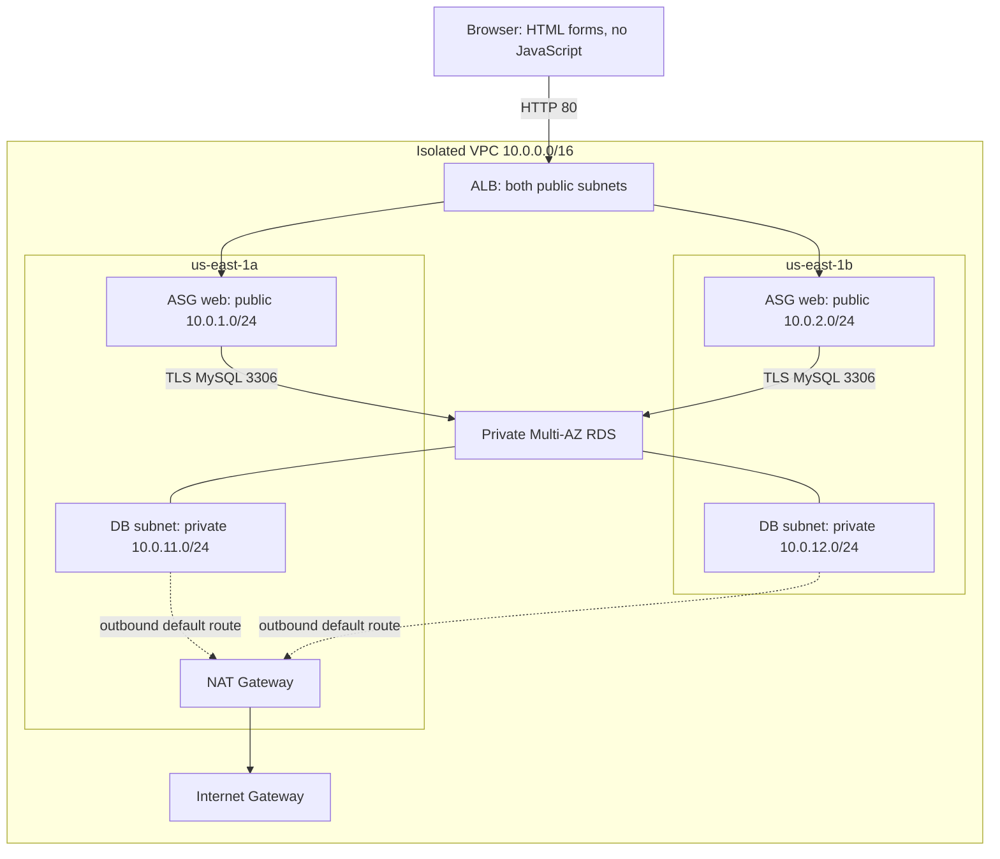

# Assignment 5 — reproducible, temporary HA lab

This Terraform project builds an **isolated** VPC rather than modifying Assignment 4. It is an educational HTTP deployment, not a production service. Deployment and test results belong in `evidence/`; historical screenshots in the parent assignment are not proof of this build.

**Recorded run:** [Actual results and remaining submission requirements](RESULTS.md). Test A recovered but had four failed probes; Test B had 260 successful probes. Do not equate those results with a guarantee of zero downtime.

## Architecture

- Two public subnets (`10.0.1.0/24`, `10.0.2.0/24`) and two private subnets (`10.0.11.0/24`, `10.0.12.0/24`) in separate AZs, inside `10.0.0.0/16`.
- Internet-facing ALB and ASG in both public subnets, capacity **2 / 2 / 4**. Only the ALB security group can reach web port 80.
- Ubuntu 22.04, Nginx, non-root systemd Python service, server-rendered HTML forms, **no JavaScript**. The launch template embeds the app in compressed cloud-init user data.
- Private, encrypted **MySQL 8.4 Multi-AZ RDS**, with a subnet group covering both private AZs. MySQL ingress only from the web security group; TLS and server certificate verification required.
- RDS generates its master password in Secrets Manager. EC2 retrieves it via a narrowly scoped instance role; no password in source code, user data, outputs or Terraform variables. The local environment file is root-readable only and systemd passes it to the service.
- SSM manages instances without SSH keys. SSH is closed by default (a deliberate safer alternative to the assignment's requested operator `/32` rule). `ssh_cidr` can add a `/32` rule, but a key pair is not provisioned.
- Single NAT Gateway for private-subnet outbound routing as requested. **Not redundant egress**: loss of its AZ would affect outbound access. The database does not need NAT for traffic from the web tier.



## Prerequisites and safety

Use Terraform >=1.13, AWS CLI and Python 3. Authenticate locally using a least-privilege role or SSO; never paste credentials into files or chat. The deployment region defaults to `us-east-1`.

This lab creates chargeable resources. Do not assume free-tier eligibility. Read-only AWS Price List queries on **15 September 2026**, matched to the Terraform configuration in `us-east-1`, give the following 730-hour monthly planning baseline. See the [SKU/rate record and assumptions](evidence/retest-cost-estimate.json).

| Component | Baseline quantity | Estimated monthly USD |
| --- | --- | ---: |
| Linux `t3.micro` web instances | 2 | 15.18 |
| MySQL `db.t3.micro` Multi-AZ pair | 1 pair | 24.82 |
| Web gp3 EBS | 20 GB total | 1.60 |
| RDS Multi-AZ gp3 storage | 20 GB, replicated rate | 4.60 |
| Zonal NAT Gateway | 1 | 32.85 |
| ALB | 1 | 16.43 |
| ALB capacity allowance | 1 LCU | 5.84 |
| Public IPv4 | 5: two web, two ALB minimum, one NAT | 18.25 |
| Managed database secret | 1 | 0.40 |
| **Baseline subtotal** | | **119.97** |

Four continuously running web instances, their EBS and two additional public IPs raise that subtotal to **$144.05/month**. The RDS Multi-AZ rates already cover the standby; do not double them again. An LCU is a planning allowance, not a usage cap. NAT data, inter-AZ/internet traffic, CPU surplus credits, logs, backup overage, API requests, extra ALB capacity/IPs, taxes and existing Assignment 4 charges are additional. The earlier $140–$180 range included headroom; neither range is a guaranteed maximum.

Useful pricing references: [EC2](https://aws.amazon.com/ec2/pricing/on-demand/), [EBS](https://aws.amazon.com/ebs/pricing/), [ALB](https://aws.amazon.com/elasticloadbalancing/pricing/), [VPC/NAT/IPv4](https://aws.amazon.com/vpc/pricing/), [RDS MySQL](https://aws.amazon.com/rds/mysql/pricing/), [Secrets Manager](https://aws.amazon.com/secrets-manager/pricing/). This is a planning estimate, not an invoice or free-tier claim.

Terraform state, saved plans and local logs are ignored by Git. They can contain sensitive metadata even though RDS manages the password. Protect them. Never delete state while resources still exist. Existing Assignment 4 resources are not imported into this state and must not be destroyed by it.

## Validate and deploy

From this directory, with `terraform` on PATH:

```sh
python3 -m unittest discover -s app -p 'test_*.py' -v
python3 -m unittest discover -s scripts -p 'test_*.py' -v
terraform -chdir=terraform init
terraform -chdir=terraform fmt -check
terraform -chdir=terraform validate
env -u TF_CLI_ARGS -u TF_CLI_ARGS_test AWS_EC2_METADATA_DISABLED=true CHECKPOINT_DISABLE=1 \
  terraform -chdir=terraform test -filter=architecture.tftest.hcl -no-color
```

Every run in `architecture.tftest.hcl` must remain explicitly `command = plan`, with the default AWS provider mocked. Mocking AWS **does not** prevent the built-in `terraform_data` resource from executing `local-exec` during an apply test.

Only after separate deployment/test approval, create a fresh timestamped directory for this run's snapshots, probes and action record. Run from this assignment directory. `mkdir` deliberately has no `-p`: if the timestamp already exists, stop and choose a new timestamp; do not reuse the directory. Keep the absolute `RUN_DIR` value for later commands and copy it to the monitor terminal.

```sh
RUN_DIR="$(pwd)/evidence/$(date -u +%Y%m%dT%H%M%SZ)"
mkdir "$RUN_DIR" || exit 1
export RUN_DIR
printf 'Evidence directory: %s\n' "$RUN_DIR"
terraform -chdir=terraform plan -out=baseline.tfplan
terraform -chdir=terraform apply baseline.tfplan
terraform -chdir=terraform output url
python3 scripts/snapshot.py "$RUN_DIR/baseline.json"
```

Wait for two healthy ALB targets in different AZs. `/health` checks the web process (ALB/ASG health); `/ready` performs a database query (end-to-end readiness). Keeping these separate avoids replacing every web instance during a transient database outage. No scaling policy is configured; the assignment's 2/2/4 capacity and automatic replacement are the focus.

Use the HTML form through the ALB to add a **synthetic** book, then read it back. The public lab is unauthenticated and HTTP only: never enter personal information or real records. Production would require HTTPS, authentication, WAF/rate controls, application-specific DB credentials, automated credential refresh, durable immutable deployment artifacts and appropriate backups. The lab deliberately uses the generated DB administrator credential for bootstrap and application queries; it is not a least-privilege database-user example.

## Test A — real instance termination

All infrastructure mutations, including fault injection, go through Terraform. An opt-in `terraform_data` provisioner checks the exact instance ID, lab VPC, project tag, ASG membership/capacity and two healthy targets before issuing a one-instance EC2 termination. Use credentials restricted to this lab's resources. The AWS provider has no native action for terminating one dynamically managed ASG member without reducing desired capacity.

An initial FIS template attempt was rejected because this account was not subscribed (`SubscriptionRequiredException`). No FIS experiment ran or subscription was enabled. The final implementation does not require FIS.

1. Save the current snapshot in the fresh directory:

   ```sh
   : "${RUN_DIR:?Set RUN_DIR to the fresh directory created above}"
   python3 scripts/snapshot.py "$RUN_DIR/test-a-before.json"
   ```

2. Start `monitor.py` in a separate terminal before injecting the fault. Work from this assignment directory and set `RUN_DIR` to the **same absolute path** printed above (a new terminal does not inherit it automatically):

   ```sh
   : "${RUN_DIR:?Copy the absolute RUN_DIR from the first terminal}"
   python3 scripts/monitor.py "$(terraform -chdir=terraform output -raw url)" "$RUN_DIR/test-a-probes.jsonl" --duration 1800 --stop-file "$RUN_DIR/test-a.stop"
   ```

3. Review and apply the opt-in test. The evidence destination is required when termination is enabled; there is no historical-path default. The environment variable below supplies the string to Terraform safely, including spaces or shell metacharacters, and the saved plan retains it:

   ```sh
   # Replace INSTANCE_ID with one exact member from the current ASG snapshot.
   TF_VAR_replacement_evidence_path="$RUN_DIR/experiment.json" \
     terraform -chdir=terraform plan -var='replacement_test=true' -var='replacement_instance_id=INSTANCE_ID' -out=test-a.tfplan
   ```

   Stop if planning fails; never apply a stale plan. Review the newly saved plan, then separately apply it:

   ```sh
   terraform -chdir=terraform apply test-a.tfplan
   ```

4. Confirm the old instance is terminated, a new instance ID becomes InService, and both ALB targets are healthy across two AZs. Save the after snapshot; the action record is already at `$RUN_DIR/experiment.json`. Stop the monitor cleanly:

   ```sh
   python3 scripts/snapshot.py "$RUN_DIR/test-a-after.json"
   touch "$RUN_DIR/test-a.stop"
   ```

5. Restore defaults with a reviewed Terraform plan/apply. This removes the one-shot run marker, not the evidence file. A later opt-in would run another termination test; never enable it unintentionally. Changing only the evidence path does not trigger a new action while a successfully completed marker remains.

`run-experiment.py` is invoked by Terraform only; do not run it manually. Terraform passes `replacement_evidence_path` as `ACTION_EVIDENCE_PATH`, never as shell command text. Relative destinations are relative to the **Terraform working directory**; the commands above use an absolute path to avoid ambiguity. After validating the target, the runner exclusively creates a new action record and flushes/syncs its `prepared` state **before** calling EC2 termination for the exact ID without decrementing ASG desired capacity. Existing files (including historical `evidence/experiment.json`), directories and symlinks are refused without termination; concurrent invocations using the same path cannot both reserve it. Updates use only the file descriptor reserved by that invocation.

The record becomes `accepted` only after an EC2 response, or `unconfirmed` if the call/response fails. Reservations remain after failures, and there is no automatic retry. A crash or failed evidence update can leave a `prepared`, empty or incomplete record even if AWS received the request: inspect the actual instance state using read-only checks before considering another separately approved action with a fresh path and plan. **Never delete or overwrite the old record to force a retry.** Independent paths do not prevent two separately configured actions from targeting the same instance; serialize approved drills.

The runner also refuses mismatched resources and unstable baselines. An abrupt loss can cause failed requests before ALB health detection. **Record failures; never call eventual recovery “zero downtime.”** Monitoring uses one-second spacing with a five-second request timeout and no retry; sampling cannot prove every request succeeded.

## Test B — controlled web-tier AZ evacuation

Keep the same fresh `RUN_DIR` for this deployment. Save a before snapshot:

```sh
python3 scripts/snapshot.py "$RUN_DIR/test-b-before.json"
```

Start another readiness monitor in the separate terminal with that same `RUN_DIR`:

```sh
python3 scripts/monitor.py "$(terraform -chdir=terraform output -raw url)" "$RUN_DIR/test-b-probes.jsonl" --duration 1800 --stop-file "$RUN_DIR/test-b.stop"
```

Then review and apply:

```sh
terraform -chdir=terraform plan -var='web_az_indexes=[1]' -out=test-b.tfplan
terraform -chdir=terraform apply test-b.tfplan
```

Wait until no ASG instance remains in AZ A and two healthy instances serve from AZ B. Save the during snapshot with `python3 scripts/snapshot.py "$RUN_DIR/test-b-evacuated.json"`. Restore the default `[0,1]` subnet selection with a reviewed plan/apply, wait for a healthy instance in each AZ, save recovery with `python3 scripts/snapshot.py "$RUN_DIR/recovered.json"`, then stop monitoring with `touch "$RUN_DIR/test-b.stop"`.

This is a **controlled evacuation of one web-tier AZ**, not a real AWS AZ failure, network partition, abrupt simultaneous loss, or RDS failover test. ASG may launch replacement capacity before removing the old instance. Preserve that distinction in the report and LinkedIn post.

## Teardown

```sh
terraform -chdir=terraform plan -destroy -out=cleanup.tfplan
terraform -chdir=terraform apply cleanup.tfplan
terraform -chdir=terraform state list
```

**All lab data will be deleted**; final DB snapshots and deletion protection are disabled intentionally for this disposable lab. Capture evidence first. The RDS error log group is explicitly Terraform-managed so teardown removes it too; still check for residual resources. Keep Assignment 4 untouched. Do not publish an ALB URL as live after teardown.

The recorded run was destroyed and independently checked; see [cleanup evidence](evidence/cleanup.json). `python3 scripts/verify-cleanup.py` repeats read-only checks for this specific run (`dmi-a5-ha`, `us-east-1`) and its preserved Assignment 4 resources. It writes evidence only when every check passes. Adapt the recorded identifiers before using it for a different deployment. Set `TF_BIN` to an absolute Terraform binary path if it is not on PATH.

To recheck the recorded architectural evidence without deploying resources:

```sh
python3 scripts/verify-snapshot.py evidence/baseline.json
python3 scripts/verify-snapshot.py evidence/test-a-after.json
python3 scripts/verify-snapshot.py evidence/test-b-evacuated.json --web-az-count 1
python3 scripts/verify-snapshot.py evidence/recovered.json
```

For another experiment, create a new timestamped directory as above rather than overwriting this run's records. Do not reuse old action records, probe files or monitor stop markers; preserve them with their original run.

## Local resilience follow-up and proposed retest

The post-run application handles SIGTERM by stopping new admission and giving active handlers up to **10 seconds** to finish. Local HTTP/subprocess tests verify completed responses, bounded draining and clean exit. This helps orderly service shutdown, not abrupt host loss, and is not coordinated ALB target draining. The monitor now records malformed/truncated HTTP protocol errors as failed samples and continues sampling; it does not retry requests or discard failures.

**No new AWS test has run.** These changes do not alter the recorded 283/287 or 260/260 results, and must not be presented as proof that the strict zero-interruption gap is fixed.

Before another deployment:

1. Obtain the user's explicit approval for the test scope and a **proposed $5 planning allowance**. It is not an enforced cap, and is not approved by this document. A four-hour normalized baseline/surge equivalent is about **$0.66–$0.79**, before the extras and billing minimums listed above. The allowance provides contingency, not a guarantee.
2. Resolve the [instructor questions](RESULTS.md#rubric-questions-awaiting-instructor-confirmation). Do not pay for another run merely to chase a lucky zero-failure sample. Clarify the success criterion for abrupt termination versus orderly draining.
3. Validate locally, review a fresh Terraform plan and use a new timestamped evidence directory. Adapt cleanup verification to the new run's exact resource IDs before proceeding; leave Assignment 4 excluded.
4. Start the clock with deployment. Abort testing if two healthy targets across AZs and working database reads/writes are not established within **60 minutes**. Retain unchanged first-attempt probe settings: five-second timeout, one-second spacing, no retries.
5. If approved, record Test A and Test B separately with timestamps and console/API evidence. Count every failure. Any orderly SIGTERM/draining exercise is an additional test, not a replacement label for abrupt EC2 termination or a full AZ outage.
6. Begin reviewed Terraform teardown no later than **120 minutes** after deployment starts, reserving the rest of a **four-hour target window** for cleanup. Continue supervised cleanup if deletion takes longer; do not delete state or abandon resources to meet the clock. Confirm empty state and lab-scoped residual checks, preserve Assignment 4, then report final observations and later billing separately.

No timer, budget alarm or automatic cost cutoff has been installed. AWS billing/alerts can lag; they cannot guarantee the proposed allowance will not be exceeded. No AWS redeployment is authorized by these instructions alone.

## Submission

Keep checks incomplete until backed by actual evidence. The JSON snapshots deliberately redact account IDs (including ARN account segments), exclude secret values, and retain resource IDs/AZs for traceability. Add matching redacted screenshots where the assignment explicitly requests screenshots.

The user-authorized [LinkedIn post](https://www.linkedin.com/feed/update/urn:li:share:7505450519486767104/) was published and verified on 15 September 2026 with an evidence image and alternative text. See the [actual post screenshot](evidence/linkedin-post.png), [publication record](evidence/linkedin-publication.json), and [proof graphic source](evidence/linkedin-proof.svg). The proof graphic is a labeled rendering of actual CLI/probe results, not an AWS Console screenshot. Publication does not imply a grade or satisfaction of the outstanding availability/rubric requirements. All 20 historical Assignment 5 PNGs were reviewed; 17 now have opaque redactions of account details, the database connection command and the operator IP where present. The [redaction manifest](evidence/historical-redactions.json) records masks, hashes, pixel-integrity checks and OCR limitations. Earlier Git history and other assignments were not scrubbed or certified; the broad “No sensitive data exposed” checkbox remains unchecked.
