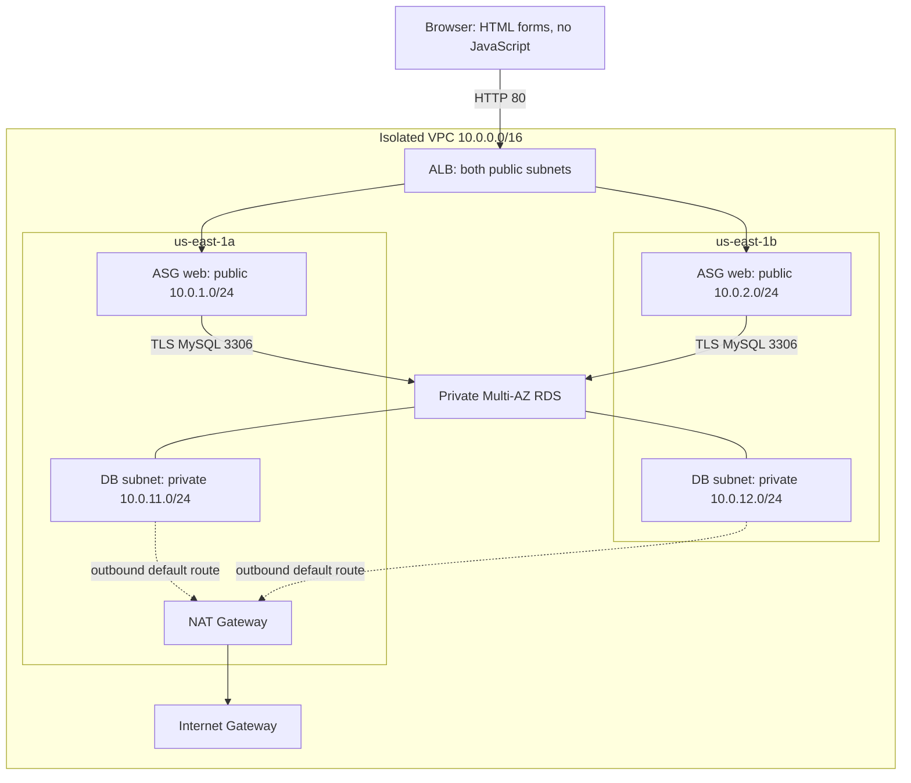

# Assignment 5 — reproducible, temporary HA lab

This Terraform project builds an **isolated** VPC rather than modifying Assignment 4. It is an educational HTTP deployment, not a production service. Deployment and test results belong in `evidence/`; historical screenshots in the parent assignment are not proof of this build.

**Recorded run:** [Actual results and remaining submission requirements](RESULTS.md). Test A recovered but had four failed probes; Test B had 260 successful probes. Do not equate those results with a guarantee of zero downtime.

## Architecture

- Two public subnets (`10.0.1.0/24`, `10.0.2.0/24`) and two private subnets (`10.0.11.0/24`, `10.0.12.0/24`) in separate AZs, inside `10.0.0.0/16`.
- Internet-facing ALB and ASG in both public subnets, capacity **2 / 2 / 4**. Only the ALB security group can reach web port 80.
- Ubuntu 22.04, Nginx, non-root systemd Python service, server-rendered HTML forms, **no JavaScript**. The launch template embeds the app in compressed cloud-init user data.
- Private, encrypted **MySQL 8.4 Multi-AZ RDS**, with a subnet group covering both private AZs. MySQL ingress only from the web security group; TLS and server certificate verification required.
- RDS generates its master password in Secrets Manager. EC2 retrieves it via a narrowly scoped instance role; no password in source code, user data, outputs or Terraform variables. The local environment file is root-readable only and systemd passes it to the service.
- SSM manages instances without SSH keys. SSH is closed by default (a deliberate safer alternative to the assignment's optional operator `/32` rule). `ssh_cidr` can add a `/32` rule, but a key pair is not provisioned.
- Single NAT Gateway for private-subnet outbound routing as requested. **Not redundant egress**: loss of its AZ would affect outbound access. The database does not need NAT for traffic from the web tier.



## Prerequisites and safety

Use Terraform >=1.13, AWS CLI and Python 3. Authenticate locally using a least-privilege role or SSO; never paste credentials into files or chat. The deployment region defaults to `us-east-1`.

This lab creates chargeable resources. Do not assume free-tier eligibility. A rough on-demand planning range is **$140–$180/month** if left running continuously, before tax and substantial traffic. Actual account pricing/credits determine the bill. ALB hours/LCUs, NAT hours/data, Multi-AZ RDS compute/storage, two EC2 instances, EBS, public IPv4, Secrets Manager and logs all contribute. The intended run is a short lab followed by teardown, not a month-long deployment.

Useful pricing references: [ALB](https://aws.amazon.com/elasticloadbalancing/pricing/), [VPC/NAT/IPv4](https://aws.amazon.com/vpc/pricing/), [RDS MySQL](https://aws.amazon.com/rds/mysql/pricing/), [FIS](https://aws.amazon.com/fis/pricing/). This is a planning estimate, not a billing guarantee.

Terraform state, saved plans and local logs are ignored by Git. They can contain sensitive metadata even though RDS manages the password. Protect them. Never delete state while resources still exist. Existing Assignment 4 resources are not imported into this state and must not be destroyed by it.

## Validate and deploy

From this directory, with `terraform` on PATH:

```sh
python3 -m unittest discover -s app -p 'test_*.py' -v
python3 -m unittest discover -s scripts -p 'test_*.py' -v
terraform -chdir=terraform init
terraform -chdir=terraform fmt -check
terraform -chdir=terraform validate
terraform -chdir=terraform test
terraform -chdir=terraform plan -out=baseline.tfplan
terraform -chdir=terraform apply baseline.tfplan
terraform -chdir=terraform output url
python3 scripts/snapshot.py evidence/baseline.json
```

Wait for two healthy ALB targets in different AZs. `/health` checks the web process (ALB/ASG health); `/ready` performs a database query (end-to-end readiness). Keeping these separate avoids replacing every web instance during a transient database outage. No scaling policy is configured; the assignment's 2/2/4 capacity and automatic replacement are the focus.

Use the HTML form through the ALB to add a **synthetic** book, then read it back. The public lab is unauthenticated and HTTP only: never enter personal information or real records. Production would require HTTPS, authentication, WAF/rate controls, application-specific DB credentials, automated credential refresh, durable immutable deployment artifacts and appropriate backups. The lab deliberately uses the generated DB administrator credential for bootstrap and application queries; it is not a least-privilege database-user example.

## Test A — real instance termination

All infrastructure mutations, including fault injection, go through Terraform. An opt-in `terraform_data` provisioner checks the exact instance ID, lab VPC, project tag, ASG membership/capacity and two healthy targets before issuing a one-instance EC2 termination. Use credentials restricted to this lab's resources. The AWS provider has no native action for terminating one dynamically managed ASG member without reducing desired capacity.

An initial FIS template attempt was rejected because this account was not subscribed (`SubscriptionRequiredException`). No FIS experiment ran or subscription was enabled. The final implementation does not require FIS.

1. Save `evidence/test-a-before.json` with `snapshot.py`.
2. Start `monitor.py` in a separate terminal before injecting the fault:

   ```sh
   python3 scripts/monitor.py "$(terraform -chdir=terraform output -raw url)" evidence/test-a-probes.jsonl --duration 1800 --stop-file evidence/test-a.stop
   ```

3. Review and apply the opt-in test:

   ```sh
   # Replace INSTANCE_ID with one exact member from the current ASG snapshot.
   terraform -chdir=terraform plan -var='replacement_test=true' -var='replacement_instance_id=INSTANCE_ID' -out=test-a.tfplan
   terraform -chdir=terraform apply test-a.tfplan
   ```

4. Confirm the old instance is terminated, a new instance ID becomes InService, and both ALB targets are healthy across two AZs. Save `evidence/test-a-after.json` and EC2 termination evidence. Create `evidence/test-a.stop` to finish the monitor cleanly.
5. Restore defaults with a reviewed Terraform plan/apply. This removes the one-shot run marker. A later opt-in would run another termination test; never enable it unintentionally.

`run-experiment.py` is invoked by Terraform only; do not run it manually. It validates the target, records the action timestamp, then calls EC2 termination for that exact ID without decrementing ASG desired capacity. It refuses mismatched resources and unstable baselines. An abrupt loss can cause failed requests before ALB health detection. **Record failures; never call eventual recovery “zero downtime.”** Monitoring uses one-second spacing with a five-second request timeout and no retry; sampling cannot prove every request succeeded.

## Test B — controlled web-tier AZ evacuation

Save a before snapshot, start another readiness monitor, then apply:

```sh
terraform -chdir=terraform plan -var='web_az_indexes=[1]' -out=test-b.tfplan
terraform -chdir=terraform apply test-b.tfplan
```

Wait until no ASG instance remains in AZ A and two healthy instances serve from AZ B. Save the during snapshot and probe evidence. Restore the default `[0,1]` subnet selection with a reviewed plan/apply, wait for a healthy instance in each AZ, save the recovery snapshot, then stop monitoring.

This is a **controlled evacuation of one web-tier AZ**, not a real AWS AZ failure, network partition, abrupt simultaneous loss, or RDS failover test. ASG may launch replacement capacity before removing the old instance. Preserve that distinction in the report and LinkedIn post.

## Teardown

```sh
terraform -chdir=terraform plan -destroy -out=cleanup.tfplan
terraform -chdir=terraform apply cleanup.tfplan
terraform -chdir=terraform state list
```

**All lab data will be deleted**; final DB snapshots and deletion protection are disabled intentionally for this disposable lab. Capture evidence first. The RDS error log group is explicitly Terraform-managed so teardown removes it too; still check for residual resources. Keep Assignment 4 untouched. Do not publish an ALB URL as live after teardown.

The recorded run was destroyed and independently checked; see [cleanup evidence](evidence/cleanup.json). `python3 scripts/verify-cleanup.py` repeats read-only checks for this specific run (`dmi-a5-ha`, `us-east-1`) and its preserved Assignment 4 resources. It writes evidence only when every check passes. Adapt the recorded identifiers before using it for a different deployment. Set `TF_BIN` to an absolute Terraform binary path if it is not on PATH.

To recheck the recorded architectural evidence without deploying resources:

```sh
python3 scripts/verify-snapshot.py evidence/baseline.json
python3 scripts/verify-snapshot.py evidence/test-a-after.json
python3 scripts/verify-snapshot.py evidence/test-b-evacuated.json --web-az-count 1
python3 scripts/verify-snapshot.py evidence/recovered.json
```

For another experiment, use a fresh evidence directory rather than overwriting this run's records, and remove stale monitor stop markers before starting.

## Submission

Keep checks incomplete until backed by actual evidence. The JSON snapshots deliberately redact account IDs (including ARN account segments), exclude secret values, and retain resource IDs/AZs for traceability. Add matching redacted screenshots where the assignment explicitly requests screenshots. A LinkedIn post requires the user's publication and its real URL; no publication or grade is implied by the code or tests here.
