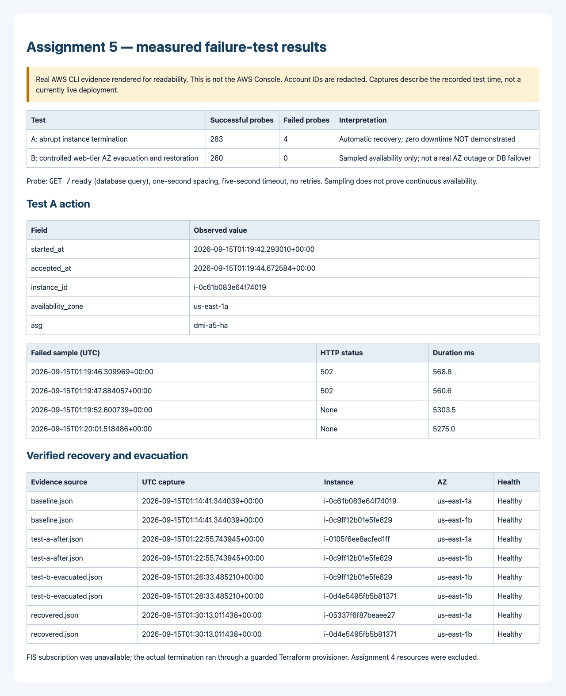

# Assignment 5 — actual deployment and resilience results

**Run date: 15 September 2026 (UTC).** An isolated Terraform lab was deployed and tested in `us-east-1`. This report makes no grade guarantee and does not claim uninterrupted availability.

## Outcome

| Check | Actual result | Evidence |
| --- | --- | --- |
| HA network | Four subnets across `us-east-1a` and `us-east-1b`; public IGW routes, private NAT routes | [Baseline snapshot](evidence/baseline.json), [rendered architecture capture](evidence/architecture-evidence.png) |
| Security | ALB → web port 80; web → DB port 3306; private DB, encrypted storage, IMDSv2, verified MySQL TLS | Terraform and baseline snapshot |
| Database | MySQL **8.4.9**, Multi-AZ, available, not publicly accessible | Baseline; [later snapshot](evidence/test-a-after.json) explicitly reports primary `us-east-1b`, standby `us-east-1a` |
| Web tier | Two healthy instances in different AZs; ASG **min 2 / desired 2 / max 4** | Baseline, [recovered snapshot](evidence/recovered.json) |
| Application | Real HTML-form insert, then read of that row from two distinct web instances | [Baseline read/write](evidence/read-write-baseline.json), [live app screenshot](evidence/application-live.png), [mobile screenshot](evidence/application-mobile.png) |
| Test A: abrupt termination | Automatic replacement succeeded; **283/287 probes succeeded, 4 failed** | [Action](evidence/experiment.json), [termination state](evidence/terminated-instance.json), [recovery](evidence/test-a-after.json), [all probes](evidence/test-a-probes.jsonl) |
| Test B: web-tier AZ evacuation | Two healthy instances served from `us-east-1b`, then two-AZ distribution restored; **260/260 probes succeeded** | [Evacuated snapshot](evidence/test-b-evacuated.json), [read/write during evacuation](evidence/read-write-evacuated.json), [recovery](evidence/recovered.json), [all probes](evidence/test-b-probes.jsonl) |
| Data persistence | Records written before termination and during evacuation remained readable after restoration | [Persistence result](evidence/persistence-after-recovery.json) |
| Terraform drift | No changes required after restoring defaults, before teardown | Verified with `terraform plan -detailed-exitcode` (exit 0) |
| Local validation | 30 app tests, 12 monitoring/termination-guard tests, 5 mocked Terraform tests passed | Reproducible commands in README |
| LinkedIn publication | Published as EZE FAVOUR with actual results, limitations and proof image | [Live post](https://www.linkedin.com/feed/update/urn:li:share:7505450519486767104/), [actual screenshot](evidence/linkedin-post.png), [verification record](evidence/linkedin-publication.json) |

**Task 8's strict “without interruption” criterion is not met by Test A.** Recovery and redundancy worked, but four failed probes must not be relabeled as zero downtime. Task 9 is a results summary, not a declaration that every requirement passed.

## Test A timeline

- Monitoring: **01:15:26–01:23:15 UTC**, `GET /ready` performing a database query, no retries.
- Termination accepted: **01:19:44 UTC**, instance `i-0c61b083e64f74019` in `us-east-1a`; desired ASG capacity was not decremented.
- Two HTTP **502** responses were observed at **01:19:46** and **01:19:47**. Two probes beginning at **01:19:52** and **01:20:01** timed out after five seconds.
- Replacement `i-0105f6ee8acfed1ff` and surviving `i-0c9ff12b01e5fe629` were observed healthy across two AZs by **01:22:49 UTC**. The recovery snapshot was captured at **01:22:55 UTC**.
- Exact durations are observations, not a contractual recovery-time guarantee. Requests may fail while an abrupt target loss is detected. Planned draining, appropriate health-check tuning and retry/error-budget design are follow-up considerations; none was silently added to hide this run's errors.

An initial AWS FIS template request failed with `SubscriptionRequiredException`. No FIS experiment ran or subscription was enabled. The actual test used a Terraform-triggered, exact-instance EC2 termination after checking VPC, project tag, ASG membership/capacity and both healthy targets. Temporary FIS IAM resources were removed through Terraform.

## Test B scope and timeline

- Monitoring: **01:23:35–01:30:35 UTC**, 260 successful database-readiness probes, no observed failures.
- Terraform temporarily restricted the ASG subnet selection to AZ B. It did **not** remove an ALB subnet or change RDS.
- At **01:26:33 UTC**, the snapshot showed `i-0c9ff12b01e5fe629` and `i-0d4e5495fb5b81371` in `us-east-1b`; an additional form write/read passed there.
- After restoring default subnet selection, the **01:30:13 UTC** snapshot showed healthy `i-05337f6f87beaee27` in `us-east-1a` and `i-0d4e5495fb5b81371` in `us-east-1b`.
- This was **controlled web-tier AZ evacuation**, not an abrupt AWS AZ outage, network partition or RDS failover exercise. ASG could launch new capacity before removing old capacity. Zero failed samples do not prove that every possible request succeeded.

## Evidence integrity

- The architecture and availability screenshots are **rendered AWS CLI evidence**, explicitly labeled as such—not fabricated AWS Console captures. The application images were captured from the live ALB with JavaScript disabled.
- The first RDS snapshot showed `MultiAZ: true` but had not yet populated secondary-AZ metadata. It is preserved unchanged; subsequent snapshots explicitly show the standby AZ.
- Probe logs include failures without retries or filtering. Sampling uses a one-second pause after each request, so it is not precisely one request per second; request duration and timeout extend the spacing.
- Account IDs are redacted from new snapshots and ARN segments. Passwords, private keys and secret values are excluded. Resource IDs remain for traceability.
- The parent assignment's historical PNGs were reviewed after publication: **20 inspected, 17 redacted, 38 opaque masks**. Account headers/IDs, account-bearing ARN fields, one database connection command and the operator IP were masked where present. Changed images have no retained metadata; pixels outside the declared masks remain identical. A second local OCR pass found no targeted account patterns in those images; six current evidence PNGs and Assignment 5 implementation text were also checked against the original account identifiers. See the [hash/coordinate manifest](evidence/historical-redactions.json). OCR is heuristic, and this is not a guarantee that every possible identifier is detected.
- These are edits to the **current image versions**, not to the earlier Git history. Old commits/caches and other assignments may retain original identifiers. No history rewrite was performed; the repository-wide “No sensitive data exposed” claim remains unverified.

## Teardown and cost

**Teardown verified on 15 September 2026 at 01:40 UTC:** Terraform destroyed all 37 managed lab resources. [Read-only cleanup verification](evidence/cleanup.json) confirms empty Terraform state and no remaining lab resources in the 18 checked categories, including RDS, ALB, ASG, NAT, EIPs, VPC, launch templates, IAM roles/profiles and database logs. The lab's synthetic database records were deleted without a final snapshot. Assignment 4 was excluded: its original EC2 instance is still running in its original VPC and `epicbook-db` remains available, private and single-AZ.

The captured ALB URL is historical evidence and must not be advertised as live after teardown. A rough continuously running cost estimate is $140–$180/month before traffic/tax and account credits; no free-tier or zero-bill guarantee is made. Final charges can lag resource deletion. Existing Assignment 4 resources can still incur charges.

## Remaining submission items

1. Resolve the strict zero-interruption gap in Test A; local graceful-shutdown improvements are not proof that abrupt target loss is interruption-free.
2. Obtain instructor acceptance of the evidence, administration and LinkedIn-format substitutions below, or supply the exact required alternatives.
3. Review the broader repository and agree on any history cleanup before checking “No sensitive data exposed.” Current Assignment 5 historical images are now redacted; earlier commits and other assignments have not been scrubbed or certified.

## Local follow-up — not a new AWS test

After the recorded run and LinkedIn publication, the application was updated to handle SIGTERM with up to **10 seconds** of active-request draining and to reject new admission while stopping. The monitor now records HTTP protocol exceptions as failures and continues sampling without retrying. These changes address orderly shutdown and monitoring completeness, **not** the ALB's detection/routing window after abrupt EC2 loss.

Local verification passed **35 application tests, 15 monitoring/termination-guard tests and 5 mocked Terraform tests (55 total)**, with Python warnings treated as errors. Terraform formatting and validation also passed. The additional tests cover bounded draining, real subprocess SIGTERM, rejected new work, worker-start failures and malformed/truncated HTTP monitoring responses.

The earlier **47-test** result and published post remain accurate for that earlier revision. No old probe records, test totals or published claims were rewritten. No AWS redeployment or new HA result is implied.

A [source-backed cost estimate](evidence/retest-cost-estimate.json) gives a fixed planning baseline of **$119.97/month**, or **$144.05/month** with four web instances throughout, before variable charges/tax. The [bounded retest runbook](README.md#local-resilience-follow-up-and-proposed-retest) proposes a **$5 allowance**, explicit approval, a 60-minute unhealthy-baseline abort, teardown beginning by 120 minutes and a four-hour target including cleanup. This allowance is **not approved or enforced**. No timer or budget alarm was installed. Clarify the criterion before spending money on another run.

### Rubric questions awaiting instructor confirmation

The source assignment explicitly requests console-style screenshots, SSH from an operator IP, an uninterrupted abrupt-termination test and a short LinkedIn post with an ALB URL (or redacted screenshot) plus proof. No instructor response has been received or invented. Ask:

- May the timestamped AWS API JSON and clearly labeled CLI-derived graphics replace the individual console captures? If not, which exact views must be captured in an approved future run?
- Is SSM with no inbound SSH accepted instead of an SSH `/32` rule and key-based administration?
- For abrupt EC2 termination, is the criterion zero failed **first-attempt** ALB requests, or recovery within a defined window? The current four failures do not meet the former. Orderly draining and client retries must be evaluated separately, not substituted silently.
- Is the already-published, longer results post with a CLI-derived proof graphic accepted? It does not include the former ALB URL or an ALB application-page screenshot. If the three-to-five-line/endpoint-screenshot format is mandatory, revise the existing post and refresh its evidence after approval; do not publish a duplicate or advertise the destroyed endpoint as live.

## LinkedIn publication — verified

Published as **EZE FAVOUR**, audience **Anyone**, with the user's authorization: [view the actual post](https://www.linkedin.com/feed/update/urn:li:share:7505450519486767104/).

LinkedIn displayed “Post successful.” The signed-in browser verified the published text and loaded evidence image at **2026-09-15T02:21:49.316Z**. A separate guest browser also displayed the public post and loaded attachment. See the [publication record](evidence/linkedin-publication.json) and [actual post screenshot](evidence/linkedin-post.png).

The attached [proof image](evidence/linkedin-proof.png) was rendered from the recorded CLI/probe results using this [self-contained SVG source](evidence/linkedin-proof.svg). It includes all four failed Test A samples, both probe totals, limitations and verified cleanup. It is not an AWS Console screenshot. The local PNG and uploaded PNG share the same SVG content; their encoded bytes may differ. The post screenshot is a separate, real browser capture, not a reconstructed interface.

### Published text

> Week 06, Assignment 5 — Highly Available Two-Tier Application on AWS
>
> Built and tested a Terraform-managed lab across two Availability Zones: an Application Load Balancer, a 2/2/4 Auto Scaling Group, private encrypted Multi-AZ MySQL, and a server-rendered application with no JavaScript.
>
> What I verified:
> • Real database writes and reads through the ALB from two web instances.
> • Abrupt instance termination triggered automatic replacement: 283/287 readiness probes succeeded, with four transient failures.
> • Controlled web-tier AZ evacuation and restoration: 260/260 probes succeeded. This was not a full AWS AZ outage or an RDS failover test.
> • Previously written records remained readable after recovery.
> • 47 automated tests passed.
>
> The key lesson: redundancy supports recovery, but it does not guarantee zero downtime. The strict uninterrupted-availability requirement remains a follow-up—not a result I am claiming.
>
> Captured the evidence and destroyed all 37 temporary lab resources to limit ongoing costs. The attached image presents the recorded CLI and probe evidence, not AWS Console screenshots.
>
> #AWS #DevOps #Terraform #HighAvailability #CloudComputing #LearningInPublic
