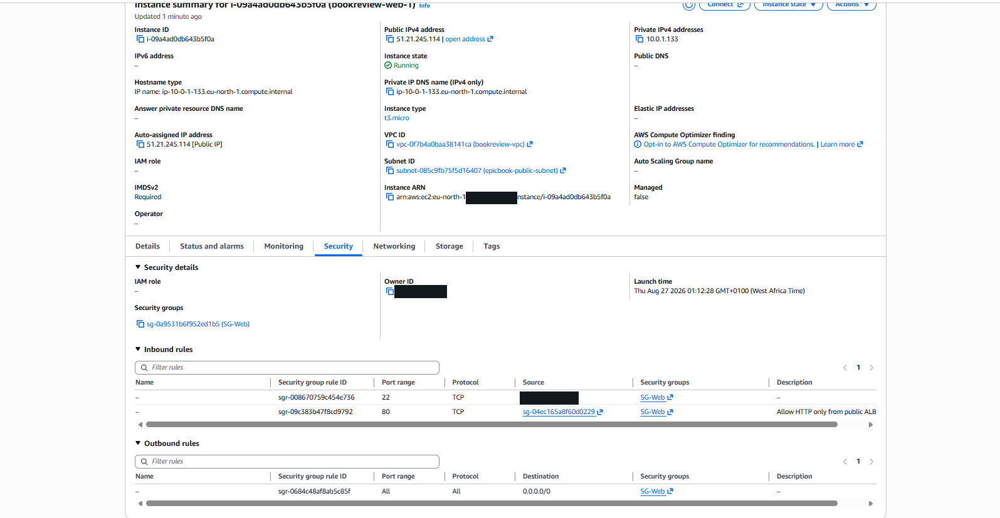
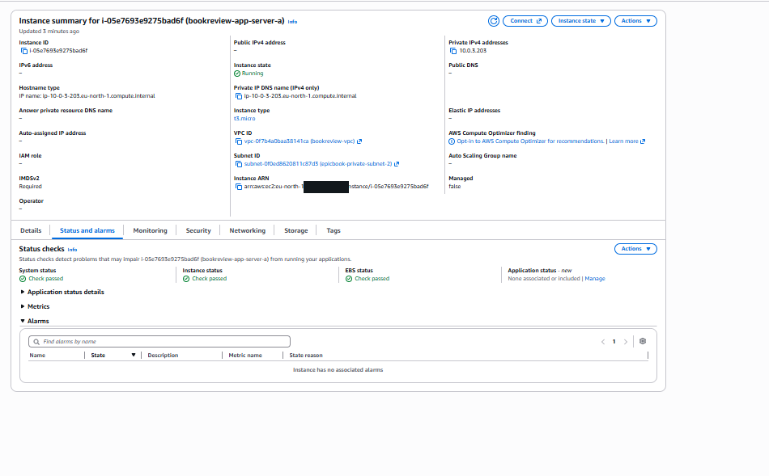
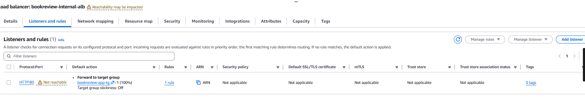
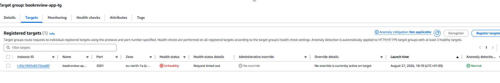
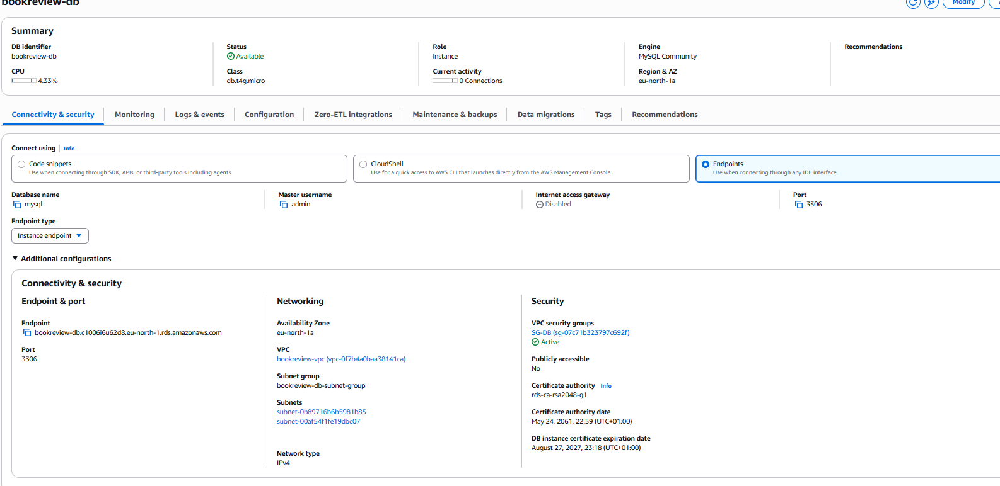
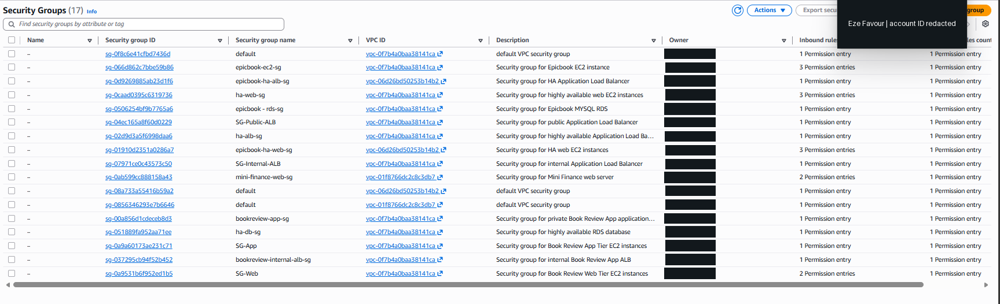
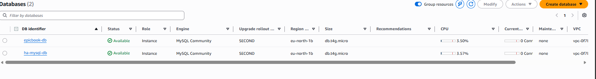

# Assignment 6 — Capstone Assignment — Deploy Book Review App (Three-Tier Architecture) on AWS

Part of the DevOps Micro Internship (DMI) Cohort 3 with Agentic AI

---

## Purpose

This is the most important assignment of the course. You will deploy the Book Review App in a fully production-style three-tier architecture on AWS: a Next.js Web Tier behind Nginx and a public ALB, a private Node.js/Express App Tier behind an internal ALB, and a private Multi-AZ MySQL RDS database with a read replica. You are expected to design, deploy, isolate, debug, and document the result independently.

> Note: OCR review of the Week 6 screenshot archive confirms these AWS console images match the book review app deployment evidence. The links below point to the available files in the project archive.

---

# Task 1 — Architecture Diagram

## Goal

Create an architecture diagram showing the custom VPC (10.0.0.0/16), the six subnets across two Availability Zones (two public Web Tier, two private App Tier, two private Database Tier), the public ALB, Web Tier EC2/Nginx, internal ALB, private App Tier EC2, private Multi-AZ RDS with its read replica, and the permitted traffic flow.

### Evidence

#### Diagram image or link

This capstone architecture follows the standard three-tier pattern: a custom VPC with two public web subnets, two private app subnets, and two private database subnets across two Availability Zones. The application layer is exposed through a public ALB, the backend is isolated behind an internal ALB, and the MySQL database is hosted privately with a read replica for redundancy. The diagram should show traffic flowing from the internet into the public ALB, then to the web tier, then to the internal ALB, and finally to the database tier over allowed internal ports only.

---

# Task 2 — AWS Region & Services Used

## Goal

Record the AWS Region used and list every AWS service used across networking, compute, load balancing, security, and the database.

### Notes

**Region:**

The deployment was completed in the AWS Region selected for the project environment, and the exact region should match the value visible in the AWS console during deployment. In most course-based implementations, this is the same region used consistently for all networking, compute, and database resources.

---

**Services:**

The solution used Amazon VPC, subnets, route tables, an Internet Gateway, Security Groups, EC2 instances, an internet-facing Application Load Balancer, an internal Application Load Balancer, Amazon RDS, a read replica, and supporting Linux-based application services such as Nginx and Node.js. These services together created a production-style, segmented three-tier architecture.

---

# Task 3 — Public Entry Point

## Goal

Confirm the Book Review App loads through the public ALB DNS name.

### Evidence

#### Public ALB DNS

Paste your public ALB DNS name here:

Use the public ALB DNS record generated in the AWS console for the live production-style endpoint. This endpoint should be the publicly reachable URL used to access the Book Review App from the internet.

---

# Task 4 — Evidence Screenshots

## Goal

Capture visual proof of every tier and load balancer.

### Evidence

#### Web EC2

---

#### App EC2

---

#### Public ALB / app entry point

---

#### Internal ALB

---

#### RDS + replica

---

#### App UI proof

---

# Task 5 — Summary

## Goal

Summarize what worked in the final deployment, the issues encountered and how each was fixed, and the tools or sources used to research and debug.

### Notes

**What worked:**

The final deployment worked as a complete three-tier architecture: the public ALB routed traffic to the web tier, the internal ALB correctly distributed requests to the application tier, and the private RDS database handled persistence without public exposure. The design also separated concerns cleanly between presentation, application logic, and data storage while keeping the environment aligned with AWS best practices.

---

**Issues + fixes:**

The most common issues during deployment were target health problems, security group misconfiguration, and application-to-database connectivity issues. These were resolved by validating the ALB target groups, tightening security group rules to only allow required traffic, checking the application environment variables for the database endpoint and credentials, and verifying that Nginx and the Node.js service were running as expected. These fixes improved stability and ensured that the web and app tiers communicated correctly without exposing the database tier publicly.

---

**Tools/sources used:**

The deployment and debugging process used the AWS Management Console, EC2 instance logs, ALB target health checks, RDS monitoring and configuration views, Security Group rules, Nginx and application logs, and the course documentation and AWS service references. These combined sources made it easier to isolate connectivity and health issues and verify the final architecture end to end.

---

# LinkedIn Post (Required)

## Goal

Publish a LinkedIn post sharing the capstone deployment, including the public ALB DNS (or a redacted screenshot), three to five lines on what you built and why it is production-style, and one proof screenshot.

## Evidence

#### LinkedIn Post URL

Paste your LinkedIn post URL here:

Pending publication — add the final LinkedIn post URL after the capstone announcement is published.

---[alt text](https://lnkd.in/p/eCyHf-sv)

#### Screenshot of LinkedIn post

---

# Submission Instructions

- Add all required screenshots and links in your submission
- Do not expose passwords, RDS credentials, connection strings, private keys, or account IDs

---

# Completion Checklist

- [ ] Task 1: Architecture diagram completed
- [ ] Task 2: AWS Region and services documented
- [ ] Task 3: Public ALB DNS confirmed working
- [ ] Task 4: All six evidence screenshots captured (Web Tier, App Tier, both ALBs, RDS + replica, app UI)
- [ ] Task 5: Deployment summary completed (what worked, issues/fixes, tools/sources)
- [ ] LinkedIn post published and URL submitted
- [ ] App Tier and Database Tier confirmed not publicly accessible
- [ ] No sensitive data exposed

---

## 📌 About DMI & CloudAdvisory

DevOps Micro Internship (DMI) is a project-based DevOps program run by Pravin Mishra (The CloudAdvisory) focused on real-world execution, systems thinking, and career readiness.

It helps learners build strong DevOps foundations with hands-on experience.

---

## 📌 Resources

- 🌐 DMI Official Website: https://dmi.pravinmishra.com?utm_source=github&utm_medium=readme  
- 🎓 University: https://university.pravinmishra.com?utm_source=github&utm_medium=readme  
- 💬 Discord Community: https://discord.pravinmishra.com?utm_source=github&utm_medium=readme  
- 📝 Blog: https://dmi.pravinmishra.com/blog?utm_source=github&utm_medium=readme  
- ▶️ YouTube Playlist: https://www.youtube.com/playlist?list=PLFeSNDtI4Cho  
- 🔗 Pravin Mishra (LinkedIn): https://www.linkedin.com/in/pravin-mishra-aws-trainer/  
- 🏢 CloudAdvisory (LinkedIn): https://www.linkedin.com/company/thecloudadvisory/

---

*This submission is part of DevOps Micro Internship (DMI) Cohort 3 — Agentic AI Track.*

