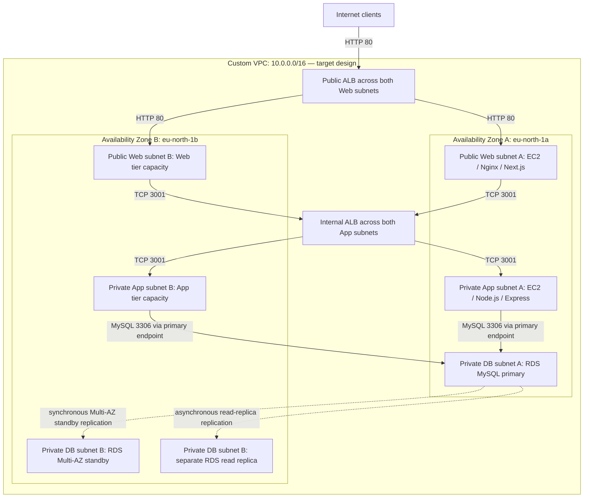
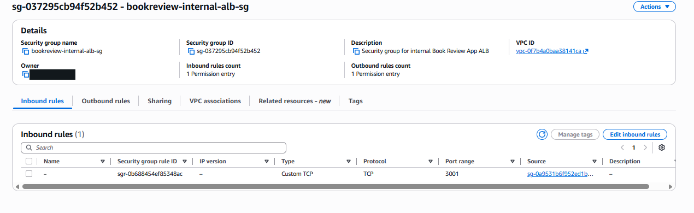
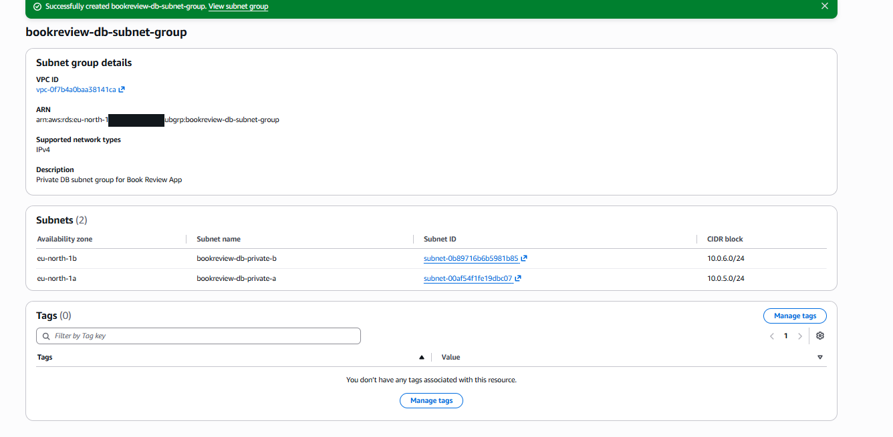
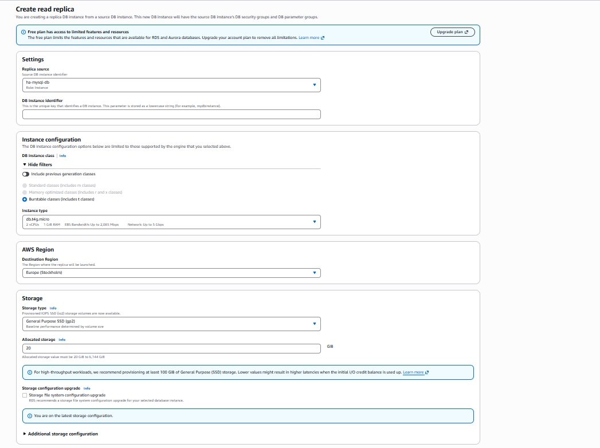
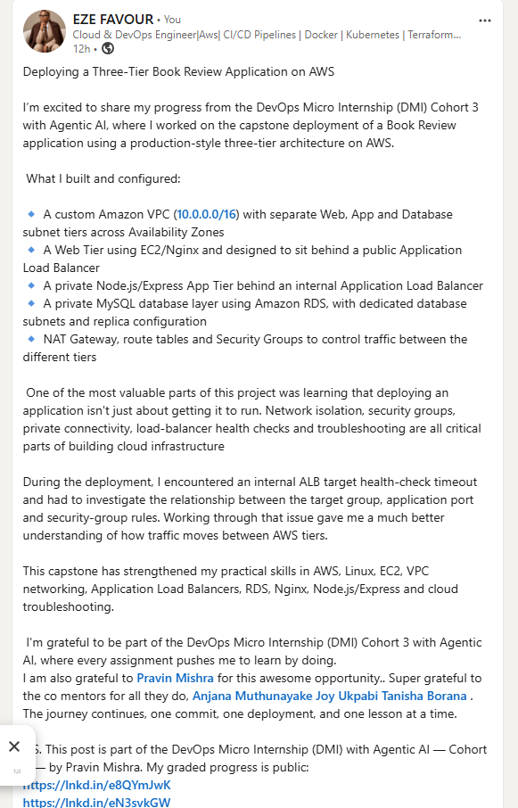

# Assignment 6 — Capstone Assignment — Deploy Book Review App (Three-Tier Architecture) on AWS

Part of the DevOps Micro Internship (DMI) Cohort 3 with Agentic AI

---

## Purpose

This is the most important assignment of the course. You will deploy the Book Review App in a fully production-style three-tier architecture on AWS: a Next.js Web Tier behind Nginx and a public ALB, a private Node.js/Express App Tier behind an internal ALB, and a private Multi-AZ MySQL RDS database with a read replica. You are expected to design, deploy, isolate, debug, and document the result independently.

## Current verification — 15 September 2026

**Status: existing deployment partially verified; no new deployment or remediation performed.** Before rebuilding anything, 18 read-only AWS API queries checked the two named Book Review VPCs. The [timestamped, redacted preflight record](assignment-06-capstone/evidence/preflight-2026-09-15.json) is current API evidence, not a browser test or replacement for the required console screenshots.

| Requirement | Observed now | Remaining work |
| --- | --- | --- |
| Existing capstone location | `bookreview-vpc` in **`eu-north-1`**, `vpc-0f7b4a0baa38141ca` | Reuse this deployment rather than build a duplicate in another region. |
| Six subnets across two AZs | Two Web subnets route to an Internet Gateway; two App subnets route to NAT; two DB subnets have only the VPC-local route. | Capture the route/subnet console views. Names inherited from older work are not reliable tier labels; use IDs and routes. |
| Web and App instances | One running `t3.micro` per tier, both in `eu-north-1a`; the App instance has no public IPv4 or IPv6 address. | Inspect Nginx/Next.js/runtime configuration through approved administrative access. One instance per tier is **not AZ-redundant compute**. |
| Internal ALB and app target | Internal scheme, active, two AZs; `bookreview-app-tg` reports **healthy** on port `3001`, health path `/health`. | Capture the actual response and current application revision. The earlier timeout is no longer observed, but its cause and remediation were not established by this check. |
| Primary database | `bookreview-db` is available, MySQL `8.4.9`, `db.t4g.micro`, **Multi-AZ**, encrypted and **not publicly accessible**, with 20 GB gp2 storage and one-day backup retention. Its attached SG permits MySQL from `SG-App`. | Verify application write/read and persistence; a healthy ALB target alone does not establish database functionality. |
| Public ALB | **Absent from the capstone VPC.** An existing `SG-Public-ALB` is allowed into `SG-Web` on port 80. | Provision the public ALB/listener/web target group through reviewed Terraform, then prove the UI works at its DNS name. |
| Read replica | The primary lists **no read replicas**. | Provision and verify a separate private encrypted read replica; the Multi-AZ standby is not a read replica. |
| Administrative access | The only configured CLI profile is `default`, resolving to **root**. Neither capstone instance appears in the scoped SSM managed-instance query, and neither has an instance profile. | Establish approved non-root deployment access and a safe runtime-inspection path before infrastructure or application changes. Do not open SSH to the world. |

The other `bookreview-vpc` in **`us-east-1`** has no instances, load balancers, target groups, databases or NAT gateways in the scoped queries. That is not an account-wide cleanup claim. The Stockholm VPC also contains an available **`ha-mysql-db`**, which is outside this capstone's change scope. Existing instances, NAT, ALB and databases can continue to incur charges. **No resource was created, changed, stopped or deleted**, and Assignment 4 and the isolated Assignment 5 lab were not altered.

### Application prerequisites checked, not deployed

The course links to [the instructor's Book Review repository](https://github.com/pravinmishraaws/book-review-app), inspected at revision `84280063bea7ccd5144dafa2b969ec4e2e69ffbb`. This is a reference revision, **not a verified revision of the running servers**. No upstream JavaScript, committed `.env`, or vendored `node_modules` was copied into this repository; no application dependencies were installed.

- The [reference backend](https://github.com/pravinmishraaws/book-review-app/blob/84280063bea7ccd5144dafa2b969ec4e2e69ffbb/backend/src/server.js) defaults to port **5000**, while this ALB targets **3001**. Confirm the live `PORT` and listening address rather than replacing the currently healthy process blindly. That source file does not declare `/health`; inspect the deployed implementation before changing its health check.
- The [frontend API client](https://github.com/pravinmishraaws/book-review-app/blob/84280063bea7ccd5144dafa2b969ec4e2e69ffbb/frontend/src/services/api.js) uses `NEXT_PUBLIC_API_URL` and appends `/users`, `/books` and `/reviews`; the backend mounts them below `/api`. A candidate same-origin setup is a **build-time `/api` base** with Nginx forwarding `/api/...` unchanged to the internal ALB. Validate this end to end; do not put a private ALB hostname in browser-facing configuration or silently trust the conflicting upstream comment about `/api`.
- The [database configuration](https://github.com/pravinmishraaws/book-review-app/blob/84280063bea7ccd5144dafa2b969ec4e2e69ffbb/backend/src/config/db.js) uses `DB_HOST`, `DB_NAME`, `DB_PASS`, `DB_PORT` and `DB_USER`. Do not publish their live values. It does not configure a Sequelize replication pool: creating a replica alone does not route application reads to it.
- The reference backend invokes schema synchronization with `alter: true` during startup. Review schema/data impact before restarting with a different revision. Review dependency support/security and configuration before public exposure; no production-readiness or security certification is claimed.

### Proposed additions and approval gates

The [Stockholm pricing record](assignment-06-capstone/evidence/incremental-cost-estimate.json) models **only** one new public ALB, a one-LCU allowance, two new public IPv4 addresses, and a private `db.t4g.micro` read replica with 20 GB gp2 storage:

| Proposed addition | Normalized monthly USD (730 hours) |
| --- | ---: |
| Public ALB | 17.48 |
| One used-LCU allowance | 5.55 |
| Two public IPv4 addresses | 7.30 |
| Single-AZ read-replica compute | 11.68 |
| Read-replica storage | 2.40 |
| **Incremental subtotal, calculated before rounding** | **44.40** |

The normalized four-hour equivalent is about **$0.24**, **not** a guaranteed bill or the cost of the whole lab. Existing resources, variable usage, billing minimums, taxes, additional compute and cleanup delays are excluded. Rounded rows can differ from the subtotal by one cent. A **$5 allowance for new additions is proposed, not approved or enforced**. The earlier Assignment 5 retest proposal does not authorize this spend; no timer or budget alarm was installed.

**Execution sequence — local preparation complete; cloud steps still pending:**

1. Establish approved non-root AWS access, an authorized way to inspect the existing web/app hosts, and explicit approval of spend, exact scope and cleanup/retention intent.
2. Capture the installed source revision, Nginx routing, process ports, health response and redacted configuration evidence. Confirm browser API routing and database access before overwriting any healthy service.
3. Review the locally validated **new-additions-only Terraform configuration** below. It references existing infrastructure read-only; do not import shared resources into its state. Local mock tests are complete, but no real AWS plan/apply or new cloud deployment has been performed.
4. Review the proposed plan, then apply only after approval. Prove public web-target health, UI login/CRUD using synthetic data, primary persistence, and the available replica's source relationship/private settings/replication. Do not claim application read splitting unless separately configured and tested.
5. Capture genuine, redacted console and browser proof under the learner's identity, update the historical sections below, and verify the existing LinkedIn post rather than publishing a duplicate.
6. For an approved short run, abort testing without a stable baseline by 60 minutes and start removing only new additions by 120 minutes, with a four-hour cleanup target. Continue supervised cleanup if needed; preserve the primary, shared VPC, `ha-mysql-db`, Assignment 4 and all pre-existing resources. Retain state and report residual resources honestly.

## Local preparation — 15 September 2026 (not deployed)

**Completed offline:** [Terraform configuration](assignment-06-capstone/terraform/main.tf), pinned provider lock, [26 mock-provider tests](assignment-06-capstone/terraform/architecture.tftest.hcl), and [13 plan-boundary tests](assignment-06-capstone/scripts/test_check_plan.py). Formatting, validation and all **39 automated tests passed**. The native Terraform mock plan also passed the boundary checker. The [local validation record](assignment-06-capstone/evidence/local-validation.json) identifies the tested files. None of this is a live AWS plan, application test, renewed AWS inventory or permission to spend.

### Exact ownership and guardrails

| State-owned resource | Purpose |
| --- | --- |
| `aws_lb.public` | New internet-facing `dmi-a6-public-alb` in the two existing Web subnets |
| `aws_lb_target_group.web` | New `dmi-a6-web` HTTP target group with `/` health check |
| `aws_lb_target_group_attachment.web` | Register only the existing Web instance on port 80 |
| `aws_lb_listener.http` | New HTTP port-80 listener forwarding to that target group |
| `aws_db_instance.replica` | New private, encrypted `dmi-a6-read-replica` of **`bookreview-db`**, using the existing DB subnet group and SG |
| `terraform_data.deployment_gate` | Local Terraform metadata and plan-time preconditions; **not an AWS resource** |

A clean creation plan must therefore have **six managed creates: five AWS resources and one local gate**. The VPC, all subnets/routes/security groups, Web instance, internal ALB, App instance and source databases are not managed resources in this state. No import, IAM change, SG-rule change, instance restart, source deployment or database migration is included. The replica is Single-AZ, inherits the primary's encrypted source data/key and 20 GiB allocation, and is not an application read-routing configuration. The source primary and `ha-mysql-db` must never be adopted into this state.

[Plan-time guards](assignment-06-capstone/terraform/guards.tf) require the expected account and a non-root user/assumed role; explicit scope/spending/cleanup approval; verified runtime readiness; the pinned Stockholm VPC; two-AZ subnet placement; ALB address capacity/IGW routes; isolated DB routes; expected running Web target/SG; and the private, encrypted, backed-up Multi-AZ Book Review source. They also check the existing Internet→ALB→Web HTTP rules and App-only DB ingress. Missing rules cause a stop, not automatic changes to shared groups.

The [example inputs](assignment-06-capstone/terraform/terraform.tfvars.example) leave **both approval flags false**. No resource uses approval-dependent `count` or `for_each`: revoking an acknowledgement does not produce an automatic teardown plan. The [$5 proposal](assignment-06-capstone/evidence/incremental-cost-estimate.json) remains **unapproved**, and no timer/budget alarm exists.

**Limits:** these checks are accident-prevention controls, not IAM authorization, a hard spending cap, a full network/security audit, or proof of the identity used later to apply a saved plan. Destroy can skip resource preconditions. Use an approved least-privilege non-root identity for **every** real command. This module provides **HTTP only**, one existing Web target and no new App capacity; it does not establish TLS, AZ-redundant compute or production readiness. Use disposable synthetic data only, never personal/reused credentials.

### Repeat the offline checks

From the repository root, with Terraform 1.13+ and Python 3 installed (`.tools/terraform` was used in this worktree):

```bash
A6=week-06-aws-cloud/assignment-06-capstone
terraform -chdir="$A6/terraform" init -backend=false
terraform -chdir="$A6/terraform" fmt -check -recursive
terraform -chdir="$A6/terraform" validate
AWS_EC2_METADATA_DISABLED=true terraform -chdir="$A6/terraform" test
python3 -B -m unittest discover -s "$A6/scripts" -p 'test_*.py' -v
```

Provider initialization may download the locked AWS provider from HashiCorp; the test suite uses **`mock_provider "aws"`** and synthetic account/role data, not AWS credentials. Test-only `true` flags do not approve a deployment.

### Authorized execution runbook — do not run yet

1. Resolve the pending approvals and administrative access above. Privately select the approved profile and `TF_VAR_expected_account_id`; verify its identity without publishing the account ID. Inspect the actual installed revision, dependencies, Nginx configuration, service ports and `/health` response. Confirm `/api` prefix preservation and schema-migration safety. Do not restart/replace a healthy backend from an unverified reference revision.
2. Recheck the scoped AWS inventory, source DB availability, target health and cost basis. Review all shared-resource owners. Confirm these new resource names are unused and the **dedicated A6 working directory/state** has no imported/shared resources. Use `umask 077` for plans/state and keep a protected recovery copy. Never reuse Assignment 4/5 state, blindly copy state between machines, or delete state before cleanup.
3. Only after explicit approval, copy the example to ignored `terraform.tfvars` and set the two acknowledgements locally. Initialize the dedicated local backend with `terraform init`, then save and inspect a **non-targeted** plan:

```bash
# Future authorized use only, from the repository root with the approved profile.
A6=week-06-aws-cloud/assignment-06-capstone
terraform -chdir="$A6/terraform" plan -out=additions.tfplan
terraform -chdir="$A6/terraform" show -json additions.tfplan > "$A6/terraform/additions.tfplan.json"
python3 "$A6/scripts/check_plan.py" "$A6/terraform/additions.tfplan.json" --mode create
terraform -chdir="$A6/terraform" show -no-color additions.tfplan
# STOP for human review of the exact plan, account, costs and lifecycle.
# Apply only that reviewed, unchanged saved plan after approval.
```

The [boundary checker](assignment-06-capstone/scripts/check_plan.py) rejects incomplete/errored/deferred plans, unpassed creation gates, unexpected managed addresses, imports/moves, updates, replacements, source substitutions and deletes during creation. It checks known ownership/settings, not the entire application or every possible Terraform value. Its success is **not** permission to apply. Raw plans/JSON/state contain identifiers and may contain secrets; they are ignored and must not be committed or attached publicly.

4. Capture the following **new, timestamped evidence** after an approved apply. Do not substitute mock output or the old replica-creation form:

| Verification | Required proof and pass condition |
| --- | --- |
| Public entry | Internet-facing/active ALB, both Web subnets, port-80 forwarding and healthy registered Web target; browser actually loads the UI at the ALB DNS |
| Same-origin API | Browser requests remain at the public origin under `/api/...`, reach the intended backend without prefix stripping, and contain no private ALB hostname; redact cookies/tokens |
| Synthetic user and CRUD | Register/login with disposable credentials; create a uniquely named test book/review, read it back, exercise the supported update/delete paths and confirm responses; never record passwords or bearer tokens |
| Primary persistence | Confirm the record through a separate authorized primary DB session and a fresh browser session; reload alone is not restart durability. Do not restart production/shared services or invoke startup schema alterations without separate approval |
| Replica | RDS available, correct source relationship and separate endpoint, private/encrypted settings; observe replication status/lag and read the same synthetic row through an authorized read-only replica connection. Replica existence alone is not replication proof |
| Isolation | Capture current SG attachments/rules, tier routes and App/DB non-public settings; retain the distinction between permitted traffic and a complete security audit |

An unavailable runtime/admin path is a blocker, not a reason to expose SSH/MySQL publicly. Remove only synthetic test records through the primary/application after evidence collection; allow deletion to replicate. Do not claim application read splitting, compute failover, an RDS failover test or a zero-downtime result unless separately demonstrated.

5. Follow the approved 60/120-minute stop rules and four-hour cleanup target. For teardown, keep the state and approved non-root profile, create a full **saved destroy plan in this A6 directory**, and run the checker in cleanup mode:

```bash
# Future authorized teardown only. Never run from an unrelated Terraform directory.
terraform -chdir="$A6/terraform" plan -destroy -out=cleanup.tfplan
terraform -chdir="$A6/terraform" show -json cleanup.tfplan > "$A6/terraform/cleanup.tfplan.json"
python3 "$A6/scripts/check_plan.py" "$A6/terraform/cleanup.tfplan.json" --mode cleanup
terraform -chdir="$A6/terraform" show -no-color cleanup.tfplan
# STOP for review: only the new AWS resources and local gate may be removed.
# Apply only that reviewed, unchanged saved cleanup plan after approval.
```

Cleanup accepts a subset for partial deployment failures and validates the new resources' names/ARNs and replica source. It must refuse shared resources even if present as no-ops. Deleting the disposable replica skips a final snapshot; **the source database/data remain**. If the replica was promoted or ownership/settings changed, stop and review rather than bypassing the checker. Confirm via AWS inventory that the additions are gone **and** the existing primary, `ha-mysql-db`, VPC and prior assignments remain; empty Terraform state alone is insufficient proof. Preserve state and report residual resources if cleanup is delayed.

### Historical screenshot privacy work

The [scoped redaction manifest](assignment-06-capstone/evidence/historical-redactions.json) records **11 inspections, five changed images and 24 opaque masks**. Account fields/ARN account components and an operator `/32` were masked; one conservative header mask is explicitly labeled. Dimensions and every pixel outside the declared masks were independently checked against the Git originals. Six images, including the unhealthy-target and LinkedIn captures, remain byte-identical. Changed PNGs have no metadata; post-redaction local OCR reported no remaining targeted matches.

This is **privacy editing of historical evidence**, not new console proof or an application fix. OCR is heuristic; older Git history, previously published copies and other assignments were not scrubbed. The broad no-sensitive-data checklist item therefore remains open.

## Evidence audit — 13 September 2026 (historical screenshots)

The assessment below records what the original screenshots proved at that time. The current API verification above supersedes their app-target and primary-database uncertainty, but does not manufacture missing UI/replica screenshots or a remediation history.

**Status: partial deployment with an unresolved application target-health failure in the submitted captures.** This audit describes historical evidence, not the current AWS environment. The web and app instances are running, and the Book Review RDS instance explicitly shows **Publicly accessible: No**. However, the app target on port `3001` is **Unhealthy — Request timed out**. No submitted capture establishes a working public ALB endpoint, the Book Review UI, Multi-AZ RDS configuration, or an available read replica.

The earlier screenshot mapping mislabeled an internal ALB as the public entry point, a security-group inventory as the app UI, and an unrelated RDS inventory as a LinkedIn post. The sections below correct those mappings and identify the remaining proof.

---

# Task 1 — Architecture Diagram

## Goal

Create an architecture diagram showing the custom VPC (10.0.0.0/16), the six subnets across two Availability Zones (two public Web Tier, two private App Tier, two private Database Tier), the public ALB, Web Tier EC2/Nginx, internal ALB, private App Tier EC2, private Multi-AZ RDS with its read replica, and the permitted traffic flow.

### Evidence

#### Diagram image or link

**Intended architecture.** This diagram documents the required design; it is not proof that every component was deployed or healthy. Only one web instance and one app instance appear in the submitted evidence, and the internal ALB scheme and database replication settings still need verification.



The standby and read replica are **separate database resources with different roles**: Multi-AZ provides failover, while a read replica supports read scaling and is not the Multi-AZ standby. Their placement is illustrative and can change. The replica needs its own endpoint and must be configured separately if the application is to use it for reads.

Intended security-group flow: internet to public ALB on port 80; public ALB group to Web group on port 80; Web group to internal ALB group on port 3001; internal ALB group to App group on port 3001; App group to DB group on port 3306. Restrict administrative access separately. Web subnets need Internet Gateway routing; App and DB subnets must not have direct Internet Gateway routes or public addresses. NAT may supply outbound access for private app bootstrap without exposing inbound access. These routing and attachment settings remain evidence requirements.

---

# Task 2 — AWS Region & Services Used

## Goal

Record the AWS Region used and list every AWS service used across networking, compute, load balancing, security, and the database.

### Notes

**Region:**

**Europe (Stockholm), `eu-north-1`.** The EC2 hostnames, RDS endpoint, target AZ, and DB subnet-group ARN identify this region. The DB subnet group lists `eu-north-1a` and `eu-north-1b`.

---

**Services:**

| Service/component | Evidence status |
| --- | --- |
| Amazon VPC and subnets | `bookreview-vpc` (`vpc-0f7b4a0baa38141ca`), web/app subnet attachments, and two DB subnets appear in console captures. The six-subnet inventory, VPC CIDR, and routes are not captured together. |
| Amazon EC2 | Running `bookreview-web-1` and `bookreview-app-server-a` instances are shown. |
| VPC security groups | Web inbound rules, an internal-ALB group's inbound rule, and a group inventory are shown. Full App/DB rules and final ALB attachments are not shown. |
| Elastic Load Balancing | `bookreview-internal-alb` listener forwards to `bookreview-app-tg`; the app target times out. Public ALB details and the internal ALB's **Scheme** field are missing. |
| Amazon RDS for MySQL | `bookreview-db`, its non-public setting, and a DB subnet group across two AZs are shown. A read-replica creation form is present, but completed replica creation and Multi-AZ configuration are unproven. |
| Internet Gateway, NAT Gateway, route tables | Described in the intended design and submitted post; deployment configuration is not established by these captures. |
| Nginx, Next.js, Node.js/Express | Required application software, not separate AWS services. Installation, service health, and end-to-end operation need runtime evidence. |

---

# Task 3 — Public Entry Point

## Goal

Confirm the Book Review App loads through the public ALB DNS name.

### Evidence

#### Public ALB DNS

**Still incomplete.** The 15 September API preflight found no public ALB in the capstone VPC. After an approved Terraform deployment, supply the Book Review public ALB's DNS name and a browser capture showing the application at that URL. Also capture its **Internet-facing** scheme, **Active** status, listener forwarding, and healthy web targets. An EC2 public IP or the ALB from the separate two-tier assignment is not this capstone's public ALB endpoint.

---

# Task 4 — Evidence Screenshots

These are the **historical captures** audited on 13 September. The current API record above establishes additional facts, but these images have not been replaced with new console or browser proof.

## Goal

Capture visual proof of every tier and load balancer.

### Evidence

#### Web EC2


The capture shows `bookreview-web-1` running with public IPv4 `51.21.245.114` and private IPv4 `10.0.1.133`. HTTP ingress references the public-ALB security group, while SSH is scoped to one IPv4 address. This does not prove that Nginx/Next.js is serving the application.

---

#### App EC2


The capture shows `bookreview-app-server-a` running at private IPv4 `10.0.3.203`, with no public IPv4 or IPv6 address displayed. EC2 system, instance, and EBS checks pass. Those checks do not establish that the Node.js process responds on port 3001.

---

#### Public ALB / app entry point

**Missing.** The previously linked image is the internal ALB listener, now correctly placed below. Capture the public ALB and its healthy web targets, and record the verified DNS name in Task 3.

---

#### Internal ALB


The listener forwards to `bookreview-app-tg`. Its existence does not prove that the target is healthy or that the ALB has the required internal scheme.


One target is registered in `eu-north-1a` on port `3001`, with **Unhealthy — Request timed out**. No after-fix healthy capture is available.



This shows an intended rule permitting the web security group to reach port `3001`; the capture does not verify the group's attachment to the internal ALB or the App group's inbound rules.

---

#### RDS + replica


The capture shows `bookreview-db`, MySQL port `3306`, `bookreview-db-subnet-group`, `SG-DB`, and **Publicly accessible: No**. This is positive evidence for the database's public-access setting. It does not show **Multi-AZ = Yes** or application persistence.



The subnet group spans `eu-north-1a` (`10.0.5.0/24`) and `eu-north-1b` (`10.0.6.0/24`). Two subnet-group AZs do not prove that the database itself has Multi-AZ enabled; subnet route tables are also not shown.



This form does not prove that a replica was created. Supply the available replica's identifier, source relationship, endpoint, and private-access setting, plus the primary's Multi-AZ configuration. The separate `07_RDS_Databases_List.png` shows EpicBook/HA databases rather than a completed Book Review replica, so it is not used as capstone replica evidence.

---

#### App UI proof

**Missing.** Supply a Book Review browser page at the public ALB URL and evidence of an application write followed by a read of the stored record.

#### Supporting security-group inventory


This is a group inventory, not an application UI capture. Names and rule counts do not establish least-privilege rules or correct resource attachments.

---

# Task 5 — Summary

## Goal

Summarize what worked in the final deployment, the issues encountered and how each was fixed, and the tools or sources used to research and debug.

### Notes

**What worked:**

The historical captures establish running Web and App EC2 instances, passing EC2 checks on the app instance, an ALB listener forwarding to an app target group, and a MySQL RDS instance configured without public accessibility. A DB subnet group spans two AZs. They do **not** establish a successful end-to-end three-tier deployment: the app target is unhealthy, and public-entry/UI/database-operation evidence is missing.

---

**Issues + fixes:**

| Observed issue | Verified fix/status | Next verification |
| --- | --- | --- |
| Historical `bookreview-app-tg` target on port 3001 reports **Request timed out** | The 15 September API check reports **healthy**. No remediation was performed during that check; the earlier cause/fix is still unknown. | Capture current healthy target status and inspect the deployed health implementation. Do not claim a particular timeout fix without logs or a recorded change. |
| Public ALB and app UI evidence were mapped to unrelated panels | Screenshot labels corrected in this documentation audit. | Capture the actual public ALB and UI, then verify application read/write. |
| RDS/replica claims exceeded the screenshots | Public-access evidence is now distinguished from unverified Multi-AZ and replica claims. | Capture primary Multi-AZ configuration and an available replica linked to that primary. |

The diagnostic steps above are recommendations, not commands already executed or proven remediations. Passing EC2 checks alone does not resolve an application target timeout.

---

**Tools/sources used:**

The review used the submitted AWS Management Console screenshots: EC2 summaries/status checks, ALB listener and target-health panels, security-group rules, RDS connectivity, and the DB subnet group. Local OCR and small visual previews were used to check the mappings. The submitted LinkedIn screenshot describes the project and mentions the internal-ALB timeout. No application/Nginx logs, successful remediation output, or cited research/debugging references were supplied, so their use and results are not asserted here.

---

# LinkedIn Post (Required)

## Goal

Publish a LinkedIn post sharing the capstone deployment, including the public ALB DNS (or a redacted screenshot), three to five lines on what you built and why it is production-style, and one proof screenshot.

## Evidence

#### LinkedIn Post URL

Submitted link: [LinkedIn capstone short link](https://lnkd.in/p/eCyHf-sv).

A matching-topic post screenshot is available below. The short link resolves to [this LinkedIn destination](https://www.linkedin.com/posts/eze-favour-52732752_aws-devops-cloudcomputing-share-7499769495050276864-lRs_/), but retrieval returned generic LinkedIn sign-up content rather than the post, so its live content could not be verified. The captured portion of the post does not establish the required public ALB URL or attached deployment proof. Keep the publication requirement open until those details are verified.

---


#### Screenshot of LinkedIn post



---

# Submission Instructions

- Add all required screenshots and links in your submission
- Do not expose passwords, RDS credentials, connection strings, private keys, or account IDs

The scoped historical-image redaction above removes identified account fields and the operator `/32` from the current copies. It does not remove originals from Git history or certify unrecognized content/other submissions; keep the broad no-sensitive-data item open until that wider review is complete.

---

# Completion Checklist

- [x] Task 1: Intended architecture diagram completed; deployment proof remains separate
- [x] Task 2: AWS Region and services documented, with evidence limits stated
- [ ] Task 3: Public ALB DNS confirmed working
- [ ] Task 4: All six evidence screenshots captured (Web Tier, App Tier, both ALBs, RDS + replica, app UI)
- [x] Task 5: Evidence-based deployment summary completed; timeout remediation history remains unverified
- [x] Current deployment rechecked read-only; internal app target healthy and primary Multi-AZ verified ([record](assignment-06-capstone/evidence/preflight-2026-09-15.json))
- [x] New-additions-only Terraform and plan-boundary checker validated locally (39 tests; no AWS deployment)
- [x] Scoped historical screenshot redaction completed and pixel/hash-verified (Git history excluded)
- [ ] Missing public ALB and private read replica provisioned and verified
- [ ] Non-root deployment access, runtime access and incremental spending approved
- [ ] LinkedIn post published and URL submitted
- [x] Existing App Tier and primary Database Tier confirmed not publicly accessible by current API configuration (not a security certification; replica still absent)
- [ ] No sensitive data exposed across the submission/history (scoped current images redacted; broader review and Git-history/remote-copy assessment remain)

---

## 📌 About DMI & CloudAdvisory

DevOps Micro Internship (DMI) is a project-based DevOps program run by Pravin Mishra (The CloudAdvisory) focused on real-world execution, systems thinking, and career readiness.

It helps learners build strong DevOps foundations with hands-on experience.

---

## 📌 Resources

- 🌐 DMI Official Website: https://dmi.pravinmishra.com?utm_source=github&utm_medium=readme  
- 🎓 University: https://university.pravinmishra.com?utm_source=github&utm_medium=readme  
- 💬 Discord Community: https://discord.pravinmishra.com?utm_source=github&utm_medium=readme  
- 📝 Blog: https://dmi.pravinmishra.com/blog?utm_source=github&utm_medium=readme  
- ▶️ YouTube Playlist: https://www.youtube.com/playlist?list=PLFeSNDtI4Cho  
- 🔗 Pravin Mishra (LinkedIn): https://www.linkedin.com/in/pravin-mishra-aws-trainer/  
- 🏢 CloudAdvisory (LinkedIn): https://www.linkedin.com/company/thecloudadvisory/

---

*This submission is part of DevOps Micro Internship (DMI) Cohort 3 — Agentic AI Track.*
