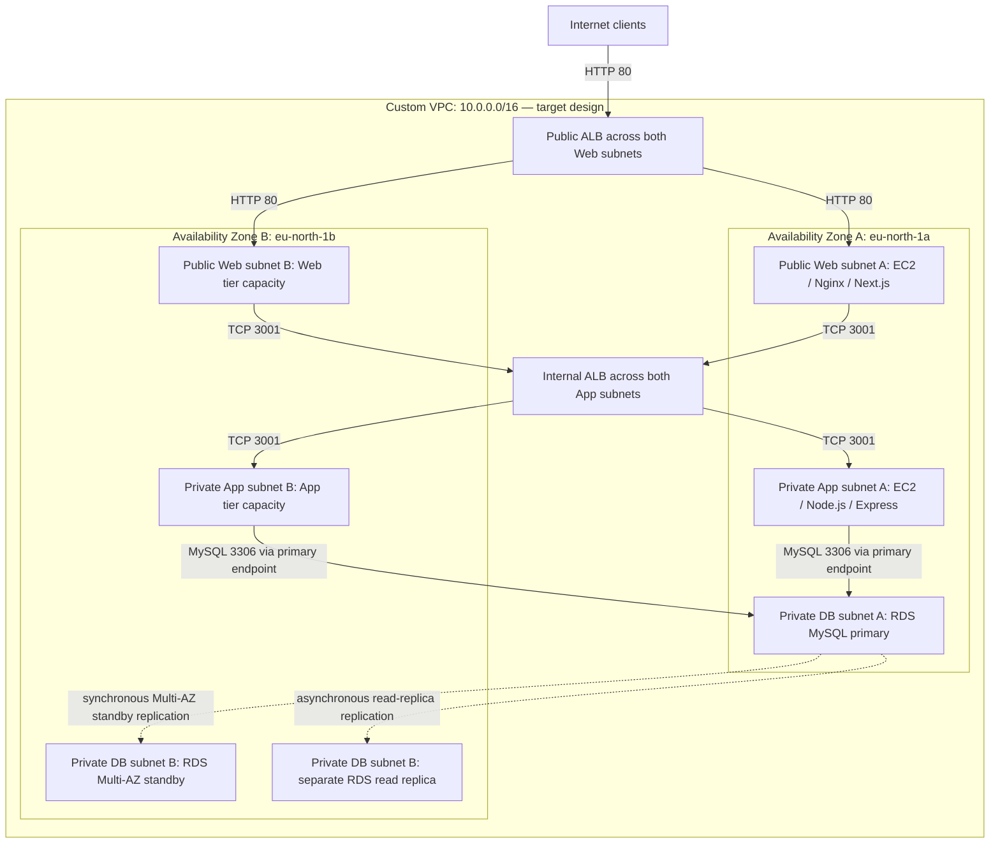

# Assignment 6 — Capstone Assignment — Deploy Book Review App (Three-Tier Architecture) on AWS

Part of the DevOps Micro Internship (DMI) Cohort 3 with Agentic AI

---

## Purpose

This is the most important assignment of the course. You will deploy the Book Review App in a fully production-style three-tier architecture on AWS: a Next.js Web Tier behind Nginx and a public ALB, a private Node.js/Express App Tier behind an internal ALB, and a private Multi-AZ MySQL RDS database with a read replica. You are expected to design, deploy, isolate, debug, and document the result independently.

## Evidence audit — 13 September 2026

**Status: partial deployment with an unresolved application target-health failure in the submitted captures.** This audit describes historical evidence, not the current AWS environment. The web and app instances are running, and the Book Review RDS instance explicitly shows **Publicly accessible: No**. However, the app target on port `3001` is **Unhealthy — Request timed out**. No submitted capture establishes a working public ALB endpoint, the Book Review UI, Multi-AZ RDS configuration, or an available read replica.

The earlier screenshot mapping mislabeled an internal ALB as the public entry point, a security-group inventory as the app UI, and an unrelated RDS inventory as a LinkedIn post. The sections below correct those mappings and identify the remaining proof.

---

# Task 1 — Architecture Diagram

## Goal

Create an architecture diagram showing the custom VPC (10.0.0.0/16), the six subnets across two Availability Zones (two public Web Tier, two private App Tier, two private Database Tier), the public ALB, Web Tier EC2/Nginx, internal ALB, private App Tier EC2, private Multi-AZ RDS with its read replica, and the permitted traffic flow.

### Evidence

#### Diagram image or link

**Intended architecture.** This diagram documents the required design; it is not proof that every component was deployed or healthy. Only one web instance and one app instance appear in the submitted evidence, and the internal ALB scheme and database replication settings still need verification.

The standby and read replica are **separate database resources with different roles**: Multi-AZ provides failover, while a read replica supports read scaling and is not the Multi-AZ standby. Their placement is illustrative and can change. The replica needs its own endpoint and must be configured separately if the application is to use it for reads.

Intended security-group flow: internet to public ALB on port 80; public ALB group to Web group on port 80; Web group to internal ALB group on port 3001; internal ALB group to App group on port 3001; App group to DB group on port 3306. Restrict administrative access separately. Web subnets need Internet Gateway routing; App and DB subnets must not have direct Internet Gateway routes or public addresses. NAT may supply outbound access for private app bootstrap without exposing inbound access. These routing and attachment settings remain evidence requirements.

---

# Task 2 — AWS Region & Services Used

## Goal

Record the AWS Region used and list every AWS service used across networking, compute, load balancing, security, and the database.

### Notes

**Region:**

**Europe (Stockholm), `eu-north-1`.** The EC2 hostnames, RDS endpoint, target AZ, and DB subnet-group ARN identify this region. The DB subnet group lists `eu-north-1a` and `eu-north-1b`.

---

**Services:**

| Service/component | Evidence status |
| --- | --- |
| Amazon VPC and subnets | `bookreview-vpc` (`vpc-0f7b4a0baa38141ca`), web/app subnet attachments, and two DB subnets appear in console captures. The six-subnet inventory, VPC CIDR, and routes are not captured together. |
| Amazon EC2 | Running `bookreview-web-1` and `bookreview-app-server-a` instances are shown. |
| VPC security groups | Web inbound rules, an internal-ALB group's inbound rule, and a group inventory are shown. Full App/DB rules and final ALB attachments are not shown. |
| Elastic Load Balancing | `bookreview-internal-alb` listener forwards to `bookreview-app-tg`; the app target times out. Public ALB details and the internal ALB's **Scheme** field are missing. |
| Amazon RDS for MySQL | `bookreview-db`, its non-public setting, and a DB subnet group across two AZs are shown. A read-replica creation form is present, but completed replica creation and Multi-AZ configuration are unproven. |
| Internet Gateway, NAT Gateway, route tables | Described in the intended design and submitted post; deployment configuration is not established by these captures. |
| Nginx, Next.js, Node.js/Express | Required application software, not separate AWS services. Installation, service health, and end-to-end operation need runtime evidence. |

---

# Task 3 — Public Entry Point

## Goal

Confirm the Book Review App loads through the public ALB DNS name.

### Evidence

#### Public ALB DNS

**Not established from the submitted evidence.** Supply the Book Review public ALB's DNS name and a browser capture showing the application at that URL. Also capture its **Internet-facing** scheme, **Active** status, listener forwarding, and healthy web targets. An EC2 public IP or the ALB from the separate two-tier assignment is not this capstone's public ALB endpoint.

---

# Task 4 — Evidence Screenshots

## Goal

Capture visual proof of every tier and load balancer.

### Evidence

#### Web EC2

The capture shows `bookreview-web-1` running with public IPv4 `51.21.245.114` and private IPv4 `10.0.1.133`. HTTP ingress references the public-ALB security group, while SSH is scoped to one IPv4 address. This does not prove that Nginx/Next.js is serving the application.

---

#### App EC2

The capture shows `bookreview-app-server-a` running at private IPv4 `10.0.3.203`, with no public IPv4 or IPv6 address displayed. EC2 system, instance, and EBS checks pass. Those checks do not establish that the Node.js process responds on port 3001.

---

#### Public ALB / app entry point

**Missing.** The previously linked image is the internal ALB listener, now correctly placed below. Capture the public ALB and its healthy web targets, and record the verified DNS name in Task 3.

---

#### Internal ALB

The listener forwards to `bookreview-app-tg`. Its existence does not prove that the target is healthy or that the ALB has the required internal scheme.

One target is registered in `eu-north-1a` on port `3001`, with **Unhealthy — Request timed out**. No after-fix healthy capture is available.

This shows an intended rule permitting the web security group to reach port `3001`; the capture does not verify the group's attachment to the internal ALB or the App group's inbound rules.

---

#### RDS + replica

The capture shows `bookreview-db`, MySQL port `3306`, `bookreview-db-subnet-group`, `SG-DB`, and **Publicly accessible: No**. This is positive evidence for the database's public-access setting. It does not show **Multi-AZ = Yes** or application persistence.

The subnet group spans `eu-north-1a` (`10.0.5.0/24`) and `eu-north-1b` (`10.0.6.0/24`). Two subnet-group AZs do not prove that the database itself has Multi-AZ enabled; subnet route tables are also not shown.

This form does not prove that a replica was created. Supply the available replica's identifier, source relationship, endpoint, and private-access setting, plus the primary's Multi-AZ configuration. The separate `07_RDS_Databases_List.png` shows EpicBook/HA databases rather than a completed Book Review replica, so it is not used as capstone replica evidence.

---

#### App UI proof

**Missing.** Supply a Book Review browser page at the public ALB URL and evidence of an application write followed by a read of the stored record.

#### Supporting security-group inventory

This is a group inventory, not an application UI capture. Names and rule counts do not establish least-privilege rules or correct resource attachments.

---

# Task 5 — Summary

## Goal

Summarize what worked in the final deployment, the issues encountered and how each was fixed, and the tools or sources used to research and debug.

### Notes

**What worked:**

The historical captures establish running Web and App EC2 instances, passing EC2 checks on the app instance, an ALB listener forwarding to an app target group, and a MySQL RDS instance configured without public accessibility. A DB subnet group spans two AZs. They do **not** establish a successful end-to-end three-tier deployment: the app target is unhealthy, and public-entry/UI/database-operation evidence is missing.

---

**Issues + fixes:**

| Observed issue | Verified fix/status | Next verification |
| --- | --- | --- |
| `bookreview-app-tg` target on port 3001 reports **Request timed out** | Unresolved in the available captures; the cause is not established. | Check the app process/listening address, local health endpoint, target health-check path/port, ALB-to-App security-group rules, and relevant subnet ACLs. Record the cause and the exact fix, then capture healthy target status. |
| Public ALB and app UI evidence were mapped to unrelated panels | Screenshot labels corrected in this documentation audit. | Capture the actual public ALB and UI, then verify application read/write. |
| RDS/replica claims exceeded the screenshots | Public-access evidence is now distinguished from unverified Multi-AZ and replica claims. | Capture primary Multi-AZ configuration and an available replica linked to that primary. |

The diagnostic steps above are recommendations, not commands already executed or proven remediations. Passing EC2 checks alone does not resolve an application target timeout.

---

**Tools/sources used:**

The review used the submitted AWS Management Console screenshots: EC2 summaries/status checks, ALB listener and target-health panels, security-group rules, RDS connectivity, and the DB subnet group. Local OCR and small visual previews were used to check the mappings. The submitted LinkedIn screenshot describes the project and mentions the internal-ALB timeout. No application/Nginx logs, successful remediation output, or cited research/debugging references were supplied, so their use and results are not asserted here.

---

# LinkedIn Post (Required)

## Goal

Publish a LinkedIn post sharing the capstone deployment, including the public ALB DNS (or a redacted screenshot), three to five lines on what you built and why it is production-style, and one proof screenshot.

## Evidence

#### LinkedIn Post URL

Submitted link: [LinkedIn capstone short link](https://lnkd.in/p/eCyHf-sv).

A matching-topic post screenshot is available below. The short link resolves to [this LinkedIn destination](https://www.linkedin.com/posts/eze-favour-52732752_aws-devops-cloudcomputing-share-7499769495050276864-lRs_/), but retrieval returned generic LinkedIn sign-up content rather than the post, so its live content could not be verified. The captured portion of the post does not establish the required public ALB URL or attached deployment proof. Keep the publication requirement open until those details are verified.

---

#### Screenshot of LinkedIn post

---

# Submission Instructions

- Add all required screenshots and links in your submission
- Do not expose passwords, RDS credentials, connection strings, private keys, or account IDs

Existing source captures contain account IDs in console fields/ARNs. They were not altered in this documentation audit. Prepare redacted copies before checking the no-sensitive-data item.

---

# Completion Checklist

- [x] Task 1: Intended architecture diagram completed; deployment proof remains separate
- [x] Task 2: AWS Region and services documented, with evidence limits stated
- [ ] Task 3: Public ALB DNS confirmed working
- [ ] Task 4: All six evidence screenshots captured (Web Tier, App Tier, both ALBs, RDS + replica, app UI)
- [x] Task 5: Evidence-based deployment summary completed; timeout remediation remains unverified
- [ ] LinkedIn post published and URL submitted
- [ ] App Tier and Database Tier confirmed not publicly accessible
- [ ] No sensitive data exposed

---

## 📌 About DMI & CloudAdvisory

DevOps Micro Internship (DMI) is a project-based DevOps program run by Pravin Mishra (The CloudAdvisory) focused on real-world execution, systems thinking, and career readiness.

It helps learners build strong DevOps foundations with hands-on experience.

---

## 📌 Resources

- 🌐 DMI Official Website: https://dmi.pravinmishra.com?utm_source=github&utm_medium=readme  
- 🎓 University: https://university.pravinmishra.com?utm_source=github&utm_medium=readme  
- 💬 Discord Community: https://discord.pravinmishra.com?utm_source=github&utm_medium=readme  
- 📝 Blog: https://dmi.pravinmishra.com/blog?utm_source=github&utm_medium=readme  
- ▶️ YouTube Playlist: https://www.youtube.com/playlist?list=PLFeSNDtI4Cho  
- 🔗 Pravin Mishra (LinkedIn): https://www.linkedin.com/in/pravin-mishra-aws-trainer/  
- 🏢 CloudAdvisory (LinkedIn): https://www.linkedin.com/company/thecloudadvisory/

---

*This submission is part of DevOps Micro Internship (DMI) Cohort 3 — Agentic AI Track.*
