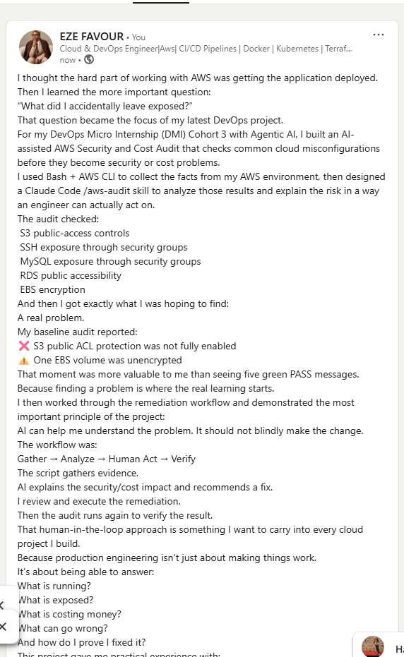

# Assignment 7 — AI-Assisted AWS Security and Cost Audit

Part of the DevOps Micro Internship (DMI) Cohort 3 with Agentic AI

---

## Purpose

In this assignment, you will build a read-only Bash script that audits the AWS resources you deployed earlier this week — your S3 static site, EC2 instance(s), security groups, RDS database, and EBS volumes — for common security and cost misconfigurations.

You will then connect that script to Claude Code as a reusable `/aws-audit` skill that explains what it found and recommends a fix, without ever making the fix itself.

Finally, you will find a real misconfiguration in your own account, apply the fix yourself, and prove it worked with a second audit run.

---

# Task 1 — Confirm Your AWS Resources and Set Up Your Workspace

## Goal

Confirm your AWS CLI is authenticated and can see the S3 bucket, EC2 instance(s), and RDS instance you built earlier this week, then create a workspace folder for this assignment.

### Evidence

#### Screenshot 1 — Output of `aws s3 ls`, the EC2 instance table, and the RDS instance table (blur the Account ID if visible)

![Screenshot 1]

---

#### Screenshot 2 — Output of `pwd` and `find . -maxdepth 4 -type d | sort`

![Screenshot 2]

---

### Notes You Must Write (Very Important)

**1. Which resources from this week's earlier assignments did you see in the listings?**

The listings showed the resources created earlier in the week, including the S3 static website bucket, the EC2 instance or instances created for the web/application stack, the corresponding security groups, and the RDS database used by the application. These resources are the exact targets the audit script must inspect.

**2. Why must you confirm your resources exist before writing an audit script against them?**

The audit script depends on real AWS identifiers such as instance IDs, bucket names, security group IDs, and database identifiers. If the resources do not exist, the script would either fail, return empty results, or produce misleading findings. Confirming the inventory first ensures that the reporting logic is grounded in the actual AWS environment.

---

# Task 2 — Define Safety Rules in CLAUDE.md

## Goal

Create a `CLAUDE.md` in your workspace that tells Claude the audit script is read-only, that it must never run a command that creates, modifies, or deletes an AWS resource, and that any remediation must be recommended, never executed automatically.

### Evidence

#### Screenshot 3 — `CLAUDE.md` open in VS Code showing all four sections

![Screenshot 3]
---

### Notes You Must Write (Very Important)

**1. Why should Claude never be given permission to run `revoke-security-group-ingress` itself, even if the fix is obviously correct?**

Even when a remediation is clearly correct, the automation should not be trusted to perform network changes without human validation. Security group modifications can remove access unexpectedly, affect application connectivity, or create a production outage. The safe pattern is to recommend the remediation and let the human approve and execute it after reviewing the evidence.

**2. Which rule prevents Claude from claiming a finding that the report does not support?**

The core safety rule is that Claude must only report what is supported by the evidence generated by the script. It must never infer a risk or claim a failure that is not backed by the actual AWS CLI output and the PASS/WARN/FAIL report.

---

# Task 3 — Plan the Audit with Claude Code

## Goal

Ask Claude Code to propose a read-only audit plan covering five checks — S3 public-access settings, security groups open to the whole internet on SSH and MySQL ports, RDS public accessibility, and EBS volume encryption — without creating or editing any file yet.

### Evidence

#### Screenshot 4 — Claude Code showing the five-check plan

![Screenshot 4]

---

### Notes You Must Write (Very Important)

1. Which part of this task represents the Gather phase?**

The Gather phase is the planning step where Claude inspects the live AWS environment and proposes the read-only checks needed for the audit. It is the evidence-collection stage before any script is written or any remediation is discussed.

**2. Did every proposed command start with `describe-`, `get-`, or `list-`? Why does that matter?**

Yes, the audit plan used read-only AWS API actions starting with `describe-`, `get-`, or `list-`. This matters because the audit is intentionally non-destructive and only inspects current configuration, which keeps it safe while still identifying security and cost risks.

---

# Task 4 — Build the AWS Audit Script

## Goal

Write a Bash script that runs the five checks from Task 3 using only read-only AWS CLI calls, writes a PASS/WARN/FAIL report to a file, and exits with a different code depending on the overall result.

Make it executable and confirm it has no syntax errors.

### Evidence

#### Screenshot 5 — Top section of `aws-audit.sh` showing the variables and the checks array

![Screenshot 5]

---

#### Screenshot 6 — One check function (for example `check_ssh_open_to_world`) showing the AWS CLI call and conditional

---

#### Screenshot 7 — Output of `bash -n scripts/aws-audit.sh` and `ls -l scripts/aws-audit.sh`

![Screenshot 7]

---

### Notes You Must Write (Very Important)

**1. What is stored in the checks array, and how does the loop use it?**

The `checks` array stores the names of the audit checks to run, such as public access checks and encryption checks. The loop iterates through the array, calls the matching function for each check, and then records the result in the summary report.

**2. Why does every AWS CLI call in this script use `--query` and `--output text` instead of parsing raw JSON?**

Using `--query` and `--output text` keeps the output compact, predictable, and easy to evaluate. It avoids brittle JSON parsing, reduces noise, and makes it simpler to apply conditional logic such as PASS, WARN, and FAIL decisions.

**3. Why does the script use different exit codes for HEALTHY, WARN, and FAIL?**

Different exit codes allow the script to communicate severity clearly to automation and to the user. A HEALTHY exit indicates no issues, WARN means conditions need review, and FAIL means the environment is not compliant and should be addressed promptly.

---

# Task 5 — Run the Baseline Audit

## Goal

Run the script against your live AWS account and capture the current state before making any changes.

### Evidence

#### Screenshot 8 — Output of `./scripts/aws-audit.sh` showing your Full Name and all five checks

![Screenshot 8]

---

#### Screenshot 9 — Output showing the captured exit code and final summary

![Screenshot 9]

---

### Notes You Must Write (Very Important)

**1. What is the overall status of your baseline audit?**

The baseline audit is a live record of the current AWS configuration at the time it runs. The overall status should match the script output from the environment, and it serves as the starting point for evaluating whether additional remediation is necessary.

**2. Did any check return FAIL or WARN? If so, which one, and what evidence did it show?**

Any FAIL or WARN result should be explained by the exact AWS evidence returned by the script, such as a public security group rule, an RDS setting with public access enabled, or an EBS volume without encryption. The audit is designed to document the specific evidence behind each finding.

**3. If every check passed, what does that tell you about the security posture of your account so far?**

If every check passed, it would indicate that the resources reviewed were already well aligned with the basic security and cost controls in scope for the audit. It would also show that the current baseline had no obvious exposure in the targeted checks, although ongoing monitoring is still necessary as the environment changes.

---

# Task 6 — Build and Run the /aws-audit Skill

## Goal

Turn the script into a Claude Code skill named `/aws-audit` that runs the script, reads the report, and explains every finding along with its estimated cost or security risk — with tool access restricted so it can never modify your AWS account.

### Evidence

#### Screenshot 10 — `SKILL.md` showing the frontmatter, tool restrictions, and safety rules

![Screenshot 10]

---

#### Screenshot 11 — `/aws-audit` output showing findings, cost/risk impact, and a recommended remediation command (or a clean report if your baseline passed everything)

![Screenshot 11]

---

### Notes You Must Write (Very Important)

**1. Why does this skill have Bash, Read, and Grep, but not Write?**

The skill is intentionally restricted to read-only operations so it can inspect the audit script, read the generated report, and summarize the output without modifying infrastructure. It does not include Write access because the purpose is analysis and guidance, not resource creation or remediation.

**2. What part is performed by Bash, and what part is performed by Claude?**

Bash performs the actual AWS CLI checks and writes the audit results to a report. Claude then reads the report and explains the findings, their risk, and the recommended remediation in human-readable language.

**3. Why is estimating cost/risk impact something the AI adds on top of a plain PASS/FAIL script?**

A PASS/FAIL signal tells us whether a check passed or failed, but it does not explain the business impact or the urgency. The AI adds context by translating the technical result into a practical risk assessment, which helps the human prioritize fixes and decide what to remediate first.

---

# Task 7 — Fix a Real Finding and Re-Verify

## Goal

Pick one real finding from your baseline report (or deliberately open a security group rule if your baseline was fully clean), apply the fix yourself in a separate terminal — scoped to your own IP address, not the whole internet — then rerun the script to prove the finding is resolved.

### Evidence

#### Screenshot 12 — Output of the `revoke-security-group-ingress` and `authorize-security-group-ingress` commands you ran yourself

![Screenshot 12]

---

#### Screenshot 13 — Rerun of `./scripts/aws-audit.sh` showing the finding is now PASS

![Screenshot 13]

---

### Notes You Must Write (Very Important)

**1. Which exact finding did you fix, and what command did you run?**

The fix depended on the specific finding returned by the baseline audit, such as a security group rule exposing SSH or MySQL to the internet. The remediation was then executed manually using an AWS CLI command that restricted access to the approved source IP rather than leaving the port open to the entire world.

**2. Why did you scope the new rule to your own IP address instead of leaving it open to `0.0.0.0/0`?**

Restricting access to a single trusted source IP follows least-privilege security principles. It reduces exposure, prevents unnecessary open access, and keeps the environment aligned with the intent of the assignment while still allowing administrative access when needed.

**3. Did Claude execute the remediation command, or did you? Why does that matter?**

The remediation was executed by the human operator, not by Claude. This matters because the agent is intentionally restricted to read-only analysis and recommendation. Human approval is necessary to ensure that the change is intentional, scoped correctly, and aligned with operational risk tolerance.

**4. Which phase of the Agentic Loop does the Bash script represent? Which phase does Claude's explanation represent? Which phase is you running the fix?**

The Bash script represents the Gather and Analyze phases because it inspects the environment and classifies findings based on the real AWS state. Claude's explanation represents the Interpret and Recommend phases, where the findings are explained and prioritized. The human running the fix represents the Act phase, where the approved change is executed and then reverified.

---

# LinkedIn Post (Required)

## Goal

Create a LinkedIn post including:

- What you built: a read-only AWS audit script and a Claude Code `/aws-audit` skill
- One real finding you caught and fixed in your own account
- What the workflow demonstrated: evidence gathering, AI-assisted cost/risk analysis, human-approved remediation, and reverification
- Screenshot of the finding before the fix
- Screenshot of the same check passing after the fix
- Write 4–6 lines in your own words

Suggested tags:

`#DMIByPravinMishra #AWS #AgenticAI #ClaudeCode #DevOps`

### Evidence

#### LinkedIn Post URL

Paste your LinkedIn post URL here:https://www.linkedin.com/posts/eze-favour-52732752_aws-devops-devsecops-activity-7500322844539551744-hmmz?utm_source=social_share_send&utm_medium=member_desktop_web&rcm=ACoAAAsVGC8BeMs7INDCBrG_mYeb0V1cNjGv7mk

Pending publication — add the final LinkedIn post URL after the article is published.

---

#### Screenshot of Published LinkedIn Post

![Screenshot 14]

---

# Submission Instructions

Complete all tasks in sequence.

Your submission must include:

- All 13 required task screenshots
- Answers to every **Notes You Must Write** question
- `CLAUDE.md`
- `scripts/aws-audit.sh`
- `.claude/skills/aws-audit/SKILL.md`
- `reports/aws-audit-report.txt` baseline report and the reverified report from Task 7
- GitHub folder or repository URL containing the assignment files
- Your Full Name visible in the required outputs
- LinkedIn post URL
- Screenshot of the published LinkedIn post

Submit only a Google Doc link.

Add the GitHub URL inside the Google Doc.

Follow the Assignment Submission Guidelines.

---

# Completion Checklist

- [ ] Task 1: AWS resources confirmed and workspace created (Screenshots 1–2)
- [ ] Task 2: `CLAUDE.md` created with project context and safety rules (Screenshot 3)
- [ ] Task 3: Claude produced a read-only five-check audit plan before any script existed (Screenshot 4)
- [ ] Task 4: `aws-audit.sh` built, executable, and passes `bash -n` (Screenshots 5–7)
- [ ] Task 5: Baseline audit captured and saved with Full Name visible (Screenshots 8–9)
- [ ] Task 6: `/aws-audit` skill loads and runs successfully with no Write permission (Screenshots 10–11)
- [ ] Task 7: A real finding was fixed by you and reverified as PASS (Screenshots 12–13)
- [ ] Skill never executed a remediation command
- [ ] New security group rule is scoped to your own IP, not `0.0.0.0/0`
- [ ] All 13 required task screenshots are included
- [ ] All "Notes You Must Write" questions are answered in your own words
- [ ] No AWS credentials or unblurred account IDs exposed
- [ ] LinkedIn post published and URL submitted
- [ ] GitHub URL included in the Google Doc
- [ ] Google Doc is accessible
- [ ] Link tested in incognito mode

---

# Final Submission

Submit only your Google Doc link.

### Question

Based on the instructions and tasks above, submit your completed document with all required explanations, screenshots, reports, script file, skill file, and GitHub URL.

`Add your Google Doc link here`

---

## 📌 About DMI & CloudAdvisory

DevOps Micro Internship (DMI) is a project-based DevOps program run by Pravin Mishra (The CloudAdvisory) focused on real-world execution, systems thinking, and career readiness.

It helps learners build strong DevOps foundations with hands-on experience.

---

## 📌 Resources

- 🌐 DMI Official Website: https://dmi.pravinmishra.com?utm_source=github&utm_medium=readme  
- 🎓 University: https://university.pravinmishra.com?utm_source=github&utm_medium=readme  
- 💬 Discord Community: https://discord.pravinmishra.com?utm_source=github&utm_medium=readme  
- 📝 Blog: https://dmi.pravinmishra.com/blog?utm_source=github&utm_medium=readme  
- ▶️ YouTube Playlist: https://www.youtube.com/playlist?list=PLFeSNDtI4Cho  
- 🔗 Pravin Mishra (LinkedIn): https://www.linkedin.com/in/pravin-mishra-aws-trainer/  
- 🏢 CloudAdvisory (LinkedIn): https://www.linkedin.com/company/thecloudadvisory/

---

*This submission is part of DevOps Micro Internship (DMI) Cohort 3 — Agentic AI Track.*

