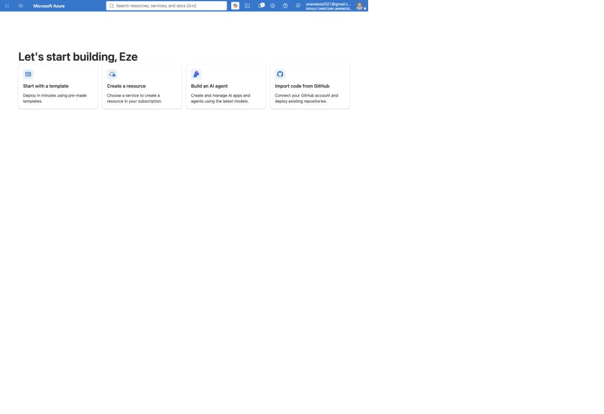
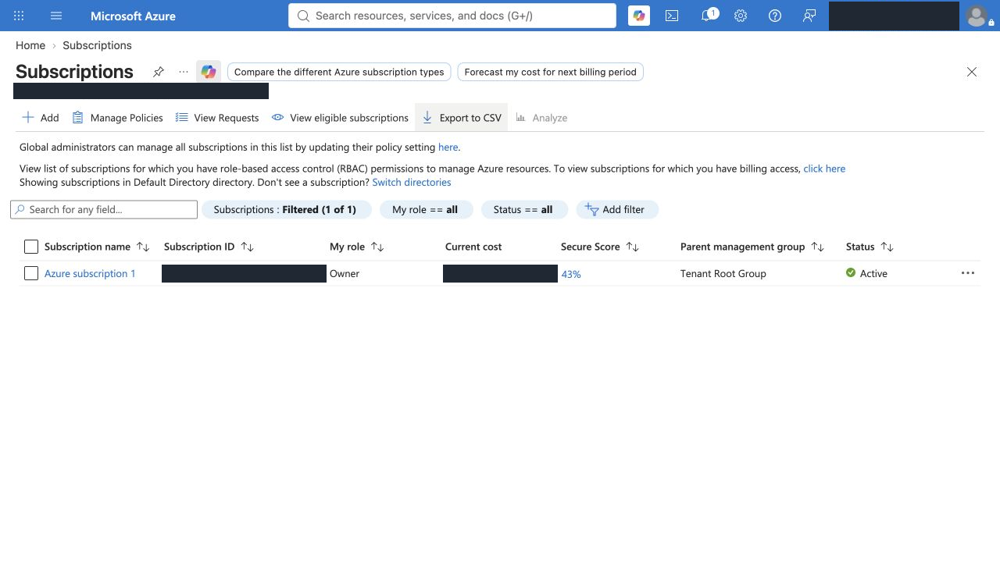

# Assignment 1 — Create and Set Up Your Azure Free Account

Part of the DevOps Micro Internship (DMI) Cohort 3 with Agentic AI

**Verified recovery — 26 September 2026:** this submission now links authentic Azure/app captures and labelled recordings of actual command and Claude results. Codex performed the recovery under Eze Favour’s delegation. [Evidence, limitations and source index](evidence/2026-09-26/README.md).

---

## Purpose

In this assignment, you will set up a fully functional Microsoft Azure Free Account so you are ready to start cloud-based assignments and hands-on labs. You will complete identity and payment verification, accept the required terms, sign in to the Azure Portal, and confirm the Free Trial subscription is available.

---

# Task 1 — 4 Create and Set Up Your Azure Free Account

## Goal

Complete the Azure Free Account registration process, including Microsoft account sign-in, personal details, identity and phone verification, payment verification, and acceptance of the required terms.

> No screenshot required for this task. Do not capture payment-card details. Completion is verified through Task 2.

---

# Task 5 — Access and Explore the Azure Portal

## Goal

Confirm successful Azure Portal access and Locate the required services and subscription.

### Evidence

#### Screenshot 1 — Azure Portal homepage after successful login

*Actual browser capture on 26 September 2026; privacy redactions only where noted in the [manifest](evidence/2026-09-26/screenshot-manifest.json). The browser capture omits address-bar chrome; the verified endpoint is linked in this submission.*

---

#### Screenshot 2 — "Subscriptions" section showing the "Free Trial" subscription

*Actual browser capture on 26 September 2026; privacy redactions only where noted in the [manifest](evidence/2026-09-26/screenshot-manifest.json). The browser capture omits address-bar chrome; the verified endpoint is linked in this submission.*

**Observed:** Azure subscription 1 — Active. This does not prove the historical Free Trial offer or signup verification steps.

---

### Notes

*Assisted reflection prepared from the assignment; it does not attest to historical personal signup steps.*

I plan to explore Azure Virtual Machines, Virtual Networks, and Azure Storage first because they are the most fundamental services for building a production-style application and understanding how compute, networking, and storage work together in a cloud environment. These services also provide the best hands-on foundation for later assignments involving load balancers, databases, and secure deployment patterns. Establishing this baseline early will make the rest of the Azure track easier to reason about and more practical to apply in real projects.

---

# Submission Instructions

- Add all required screenshots in your submission
- Do not expose payment-card details, phone numbers, or other sensitive account information

---

# Completion Checklist

- [ ] Azure Free Account created with identity, phone, and payment verification completed
- [ ] Microsoft Agreement and Offer Terms accepted
- [x] Azure Portal accessed successfully (Screenshot 1)
- [ ] Free Trial subscription confirmed (Screenshot 2)
- [x] Reflection paragraph written (Notes)
- [x] No sensitive information exposed

---

## 📌 About DMI & CloudAdvisory

DevOps Micro Internship (DMI) is a project-based DevOps program run by Pravin Mishra (The CloudAdvisory) focused on real-world execution, systems thinking, and career readiness.

It helps learners build strong DevOps foundations with hands-on experience.

---

## 📌 Resources

- 🌐 DMI Official Website: https://dmi.pravinmishra.com?utm_source=github&utm_medium=readme  
- 🎓 University: https://university.pravinmishra.com?utm_source=github&utm_medium=readme  
- 💬 Discord Community: https://discord.pravinmishra.com?utm_source=github&utm_medium=readme  
- 📝 Blog: https://dmi.pravinmishra.com/blog?utm_source=github&utm_medium=readme  
- ▶️ YouTube Playlist: https://www.youtube.com/playlist?list=PLFeSNDtI4Cho  
- 🔗 Pravin Mishra (LinkedIn): https://www.linkedin.com/in/pravin-mishra-aws-trainer/  
- 🏢 CloudAdvisory (LinkedIn): https://www.linkedin.com/company/thecloudadvisory/

---

*This submission is part of DevOps Micro Internship (DMI) Cohort 3 — Agentic AI Track.*

