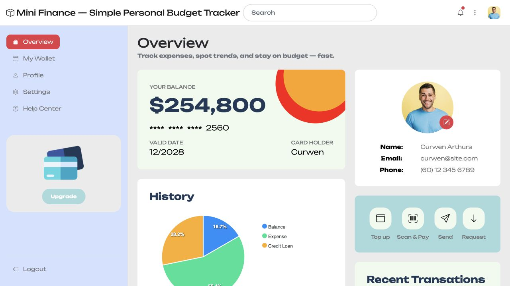

# Assignment 4 — Host a Static Website on Azure Storage

Part of the DevOps Micro Internship (DMI) Cohort 3 with Agentic AI

**Verified recovery — 26 September 2026:** this submission now links authentic Azure/app captures and labelled recordings of actual command and Claude results. Codex performed the recovery under Eze Favour’s delegation. [Evidence, limitations and source index](evidence/2026-09-26/README.md).

---

## Purpose

In this assignment, you will deploy the Mini Finance static web application directly from an Azure Storage Account by enabling Static Website Hosting. The completed website must be publicly accessible through the Azure Storage primary endpoint URL.

---

# Task 1 — Download the Mini Finance Application

## Goal

Download and extract the Mini Finance static website files (`index.html`, `style.css`, images, and other assets) from `https://github.com/pravinmishraaws/mini_finance`.

> No screenshot required for this task.

---

# Task 2 — Create a Storage Account and Enable Static Website Hosting

## Goal

Create Resource Group `mini-finance-rg` and a globally unique Storage Account named `minifinance<uniqueid>` (Standard performance, LRS redundancy), then enable Static Website Hosting with `index.html` as the index document.

> No screenshot required for this task. Completion is verified through Task 4.

---

# Task 3 — Upload Your Website Files

## Goal

Upload all Mini Finance project files to the `$web` container.

> No screenshot required for this task.

---

# Task 4 — Test Your Website

## Goal

Open the primary endpoint URL and confirm the Mini Finance application, styling, and images all load correctly.

### Evidence

#### Screenshot 1 — Mini Finance website running in the browser

*Actual browser capture on 26 September 2026; privacy redactions only where noted in the [manifest](evidence/2026-09-26/screenshot-manifest.json). The browser capture omits address-bar chrome; the verified endpoint is linked in this submission.*

---

#### Website URL

[Mini Finance on Azure Storage](https://minifinanceeze20260926.z1.web.core.windows.net/)

All 32 published assets returned HTTP 200 and matched the source SHA-256. The template’s Curwen profile and financial figures are fictional sample content. Public blob access is disabled; the static website endpoint is intentionally public.

---

# Submission Instructions

- Add the required screenshot and URL in your submission
- Do not expose subscription identifiers or other sensitive account information

---

# Completion Checklist

- [x] Mini Finance project downloaded and extracted
- [x] Storage Account created with Static Website Hosting enabled
- [x] All website files uploaded to the `$web` container
- [x] Website verified through the primary endpoint (Screenshot 1)
- [x] Website URL included
- [x] No sensitive account information exposed

---

## 📌 About DMI & CloudAdvisory

DevOps Micro Internship (DMI) is a project-based DevOps program run by Pravin Mishra (The CloudAdvisory) focused on real-world execution, systems thinking, and career readiness.

It helps learners build strong DevOps foundations with hands-on experience.

---

## 📌 Resources

- 🌐 DMI Official Website: https://dmi.pravinmishra.com?utm_source=github&utm_medium=readme  
- 🎓 University: https://university.pravinmishra.com?utm_source=github&utm_medium=readme  
- 💬 Discord Community: https://discord.pravinmishra.com?utm_source=github&utm_medium=readme  
- 📝 Blog: https://dmi.pravinmishra.com/blog?utm_source=github&utm_medium=readme  
- ▶️ YouTube Playlist: https://www.youtube.com/playlist?list=PLFeSNDtI4Cho  
- 🔗 Pravin Mishra (LinkedIn): https://www.linkedin.com/in/pravin-mishra-aws-trainer/  
- 🏢 CloudAdvisory (LinkedIn): https://www.linkedin.com/company/thecloudadvisory/

---

*This submission is part of DevOps Micro Internship (DMI) Cohort 3 — Agentic AI Track.*

