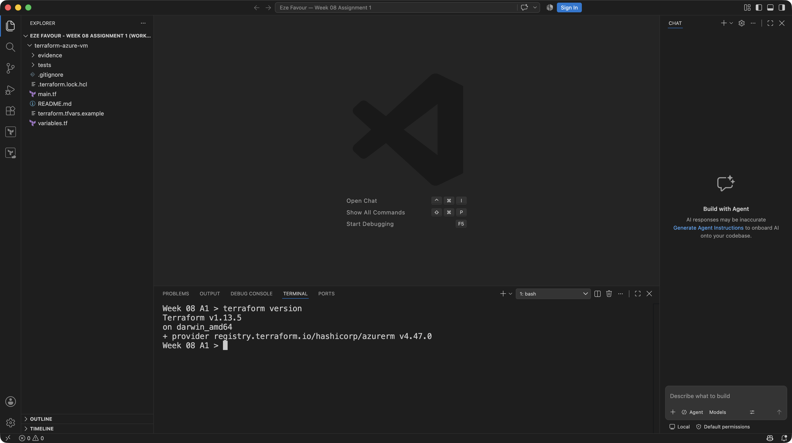
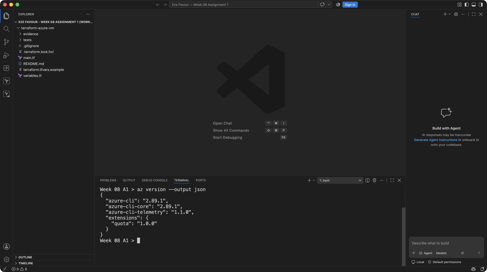
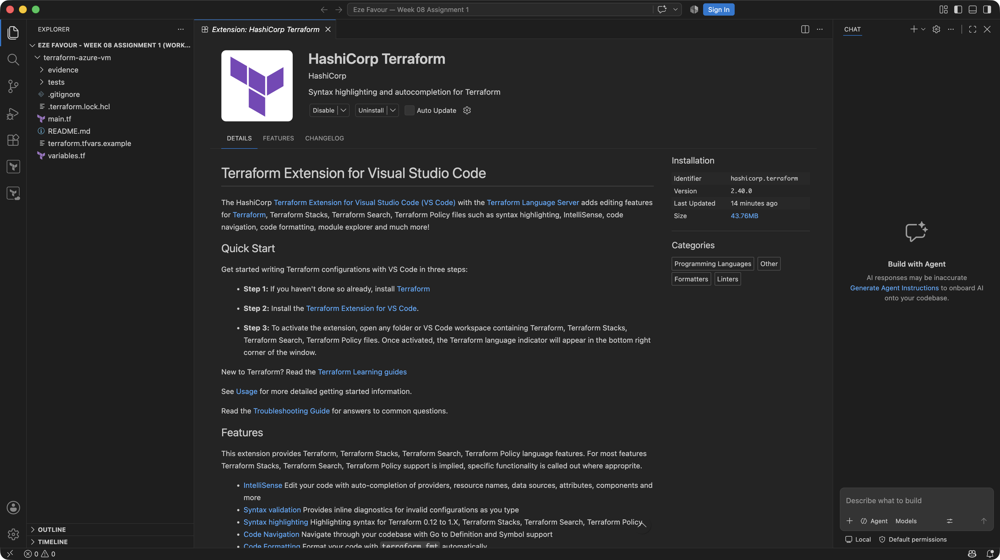
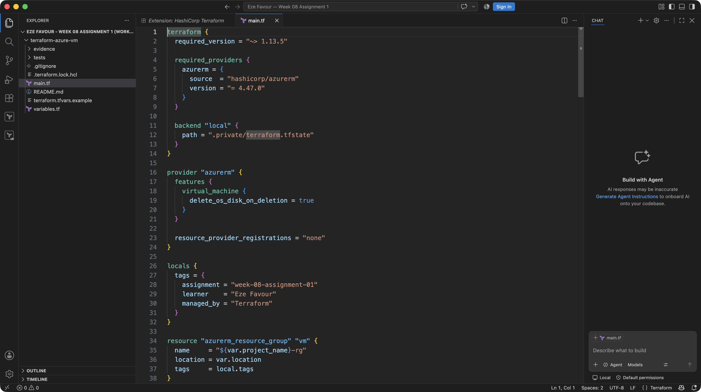
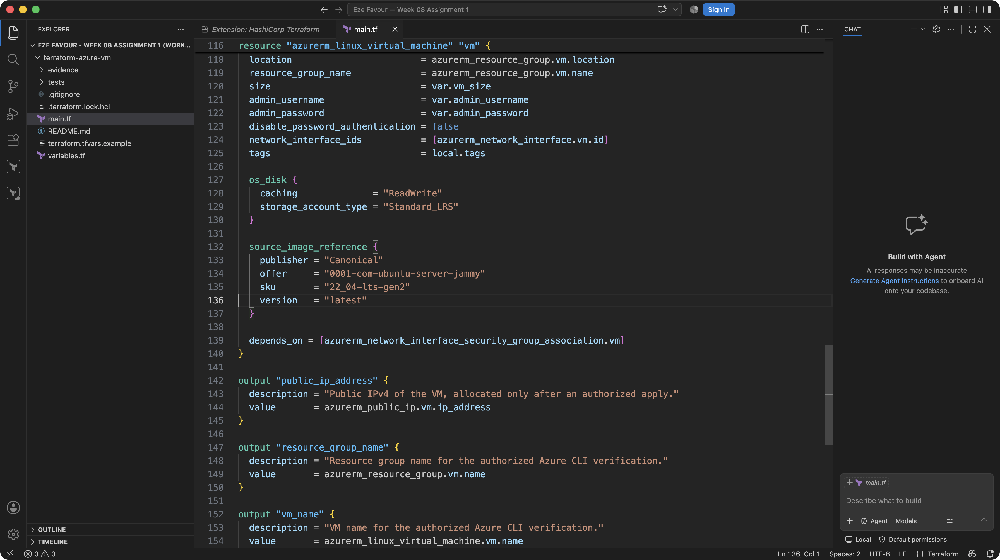

# Assignment 1 — Create an Azure Virtual Machine using Terraform

Part of the DevOps Micro Internship (DMI) Cohort 3 with Agentic AI

## Submission Details

- **Learner:** Eze Favour
- **Project:** [terraform-azure-vm on the assignment branch](https://github.com/Favourcloud/devops-micro-internship-pravinmishra/tree/favourcloud-week-08-azure-vm/week-08-terraform/terraform-azure-vm)
- **Branch:** `favourcloud-week-08-azure-vm`
- **Review:** [Draft PR #9](https://github.com/Favourcloud/devops-micro-internship-pravinmishra/pull/9)
- **Partial evidence status: 5/11 verified.** Screenshots 1–5 provide genuine local tool/source evidence; screenshots 6–11 remain pending. The assignment is incomplete.
- **Evidence operator:** GitHub Copilot under user delegation, not manual learner execution.
- **Runtime boundary:** No fresh cloud/spending authorization, Azure sign-in, live deployment, allocated VM public IP, running-state verification or teardown is claimed.

The original requirements, headings, questions and checklist item text are
retained below. Evidence responses and checklist markers identify only what is
actually supported. Capture timestamps, original-image hashes and frozen-source
provenance are recorded in the [evidence manifest](terraform-azure-vm/evidence/manifest.json).

---

## Purpose

In this assignment, you will use Terraform to provision a complete Azure Virtual Machine environment, including a resource group, virtual network, subnet, public IP, network interface, and a Linux-based virtual machine. You will set up and verify the required local tools, define the infrastructure in Terraform, initialize the project, review and apply the plan, verify the running VM through Azure CLI, capture the public IP output, and destroy the resources after testing.

---

# Task 0 — Set Up and Verify the Terraform and Azure CLI Environment

## Goal

Prepare your local environment for Terraform deployment by installing Terraform, Azure CLI, and the HashiCorp Terraform extension in VS Code, signing in to your Azure account, and confirming that all required tools are working correctly.

### Evidence

#### Screenshot 1 — Terminal showing successful `terraform version` output

**Verified local evidence:** Terraform `1.13.5` on `darwin_amd64`, captured in the
actual VS Code terminal on 2026-09-16 at 23:16:55 UTC. Original, unmodified PNG;
this is tool-version evidence, not a deployment result.

---

#### Screenshot 2 — Terminal showing successful `az version` output

**Verified local evidence:** Azure CLI `2.89.1`, captured in the actual VS Code
terminal on 2026-09-16 at 23:17:27 UTC. Original, unmodified PNG; no Azure sign-in,
subscription selection or cloud/API activity is evidenced.

---

#### Screenshot 3 — VS Code Extensions panel showing the HashiCorp Terraform extension installed and enabled

**Verified local evidence:** The actual HashiCorp Terraform extension page shows
version `2.40.0` and Disable/Uninstall controls, confirming it is installed and
enabled. Captured on 2026-09-16 at 23:17:43 UTC; original, unmodified PNG. The
capture does not claim that the learner manually installed the extension.

---

# Task 1 — Create a New Terraform Project and Define the Infrastructure

## Goal

Create a new Terraform project and define the complete Azure Virtual Machine environment in `main.tf` by using the official Terraform Registry documentation.

### Evidence

#### Screenshot 4 — VS Code showing the AzureRM provider configuration and resource group configuration in `main.tf`

**Verified source evidence:** The actual VS Code editor displays the AzureRM
provider and resource group in `main.tf`, including disabled automatic provider
registration. Captured on 2026-09-16 at 23:18:40 UTC from frozen source commit
`dbdab95b21f517cfe0751d07e667001c0fb6a775`; original, unmodified PNG. This shows
configuration, not created Azure resources.

---

#### Screenshot 5 — VS Code showing the Linux virtual machine configuration and public IP `output` block in `main.tf`. Ensure that the VM password is hidden or redacted

**Verified source evidence:** The actual VS Code editor shows the Linux VM,
`admin_password = var.admin_password` and the full `public_ip_address` output
block. No password value or allocated public IP is displayed. Captured on
2026-09-16 at 23:19:01 UTC from frozen source commit
`dbdab95b21f517cfe0751d07e667001c0fb6a775`; original, unmodified PNG.

---

# Task 2 — Initialize Terraform

## Goal

Initialize the Terraform working directory and download the required provider components.

### Evidence

#### Screenshot 6 — Terminal showing the successful `terraform init` output

**Pending:** Capture initialization for the actual authorized execution sequence.
The successful backend-disabled offline initialization check is not being
submitted as this screenshot.

---

# Task 3 — Plan and Apply the Configuration

## Goal

Review the Terraform execution plan and provision the Azure resources.

### Evidence

#### Screenshot 7 — Terraform plan summary showing the proposed resources

**Pending:** A real plan and its screenshot require fresh authorization. Mock
plans are not runtime evidence.

---

#### Screenshot 8 — Terraform apply output showing successful completion

**Pending:** No live apply has been performed or authorized for this submission.

---

#### Screenshot 9 — Terraform output showing the public IP address of the VM

**Pending:** No VM public IP has been allocated for this submission; the output
source in screenshot 5 is not an actual IP result.

### Question

VM Public IP Address: Pending — no authorized deployment has been performed and no VM public IP has been allocated for this submission.

---

# Task 4 — Verify the Deployment

## Goal

Confirm through Azure CLI that the virtual machine was created successfully and is currently running.

### Evidence

#### Screenshot 10 — Azure CLI output showing the deployed VM name and `VM running` status

**Pending:** No VM-running verification has occurred. Azure CLI version evidence
in screenshot 2 does not establish authentication or a running VM.

---

# Task 5 — Destroy the Resources

## Goal

Remove all Azure resources created by Terraform after completing the deployment and verification.

### Evidence

#### Screenshot 11 — Terminal showing successful `terraform destroy` completion

**Pending:** No live deployment or teardown has occurred for this submission.
Cleanup evidence must come from the future authorized run.

---

# Submission Instructions

- Complete all tasks in sequence and include all required screenshots specified in Tasks 0–5.
- Do not expose passwords, keys, account IDs, or other sensitive information in screenshots.

---

# Completion Checklist

Checked items below indicate verified local environment/source deliverables,
not manual learner actions. Runtime and full-submission checks remain unchecked.
The five published images passed the parent's privacy review; the final review
of all eleven images is still pending.

- [x] Installed Terraform and verified it using `terraform version`
- [x] Installed Azure CLI and verified it using `az version`
- [ ] Signed in to Azure using `az login`
- [ ] Confirmed the correct Azure subscription
- [x] Installed and enabled the HashiCorp Terraform extension in VS Code
- [x] Created the `terraform-azure-vm` project directory and `main.tf`
- [x] Added the Terraform and AzureRM provider configuration
- [x] Defined the resource group, virtual network, subnet, public IP, and network interface
- [x] Defined the Linux virtual machine with username and password-based authentication
- [x] Added the Terraform output for the VM public IP address
- [ ] Completed `terraform init` successfully
- [ ] Reviewed the Terraform execution plan using `terraform plan`
- [ ] Completed `terraform apply` successfully
- [ ] Captured and recorded the VM public IP using `terraform output`
- [ ] Verified that the VM is running using Azure CLI
- [ ] Completed `terraform destroy` successfully
- [ ] Captured all required screenshots
- [ ] Checked that no passwords, keys, account IDs, or other sensitive information are visible in the screenshots

---

## 📌 About DMI & CloudAdvisory

DevOps Micro Internship (DMI) is a project-based DevOps program run by Pravin Mishra (The CloudAdvisory) focused on real-world execution, systems thinking, and career readiness.

It helps learners build strong DevOps foundations with hands-on experience.

---

## 📌 Resources

- 🌐 DMI Official Website: https://dmi.pravinmishra.com?utm_source=github&utm_medium=readme
- 🎓 University: https://university.pravinmishra.com?utm_source=github&utm_medium=readme
- 💬 Discord Community: https://discord.pravinmishra.com?utm_source=github&utm_medium=readme
- 📝 Blog: https://dmi.pravinmishra.com/blog?utm_source=github&utm_medium=readme
- ▶️ YouTube Playlist: https://www.youtube.com/playlist?list=PLFeSNDtI4Cho
- 🔗 Pravin Mishra (LinkedIn): https://www.linkedin.com/in/pravin-mishra-aws-trainer/
- 🏢 CloudAdvisory (LinkedIn): https://www.linkedin.com/company/thecloudadvisory/

---

*This submission is part of DevOps Micro Internship (DMI) Cohort 3 — Agentic AI Track.*

## Eze Favour — Assignment 1 Offline Deliverables

All original requirements above are retained; the actual evidence responses
and checklist markers have been filled without changing the rubric. The runnable
Terraform source, safe input interface, private-state handling, offline tests
and prospective authorized execution steps are in
[terraform-azure-vm/README.md](terraform-azure-vm/README.md).

**Status: 5/11 genuine screenshots verified; runtime and screenshots 6–11 pending.**
There is no fresh cloud/spending authorization for this run. No live deployment,
VM public IP, Azure CLI running-state verification or destroy is claimed.

The [Assignment 1 evidence manifest](terraform-azure-vm/evidence/manifest.json)
records the original PNG hashes, exact capture timestamps and source provenance.
The source behind screenshots 4–5 is unchanged from `dbdab95`; `main.tf` SHA-256:
`53a5a0f92c56d81437a66210af7cc4ed9f362604cca90b6ebf22b22f756405db`.

Local validation and mock-provider tests do not satisfy remaining screenshot or
cloud execution requirements. The parent/controller owns fresh authorization
and the remaining genuine execution/capture sequence. No learner reflection,
manual learner execution, grade or runtime success is invented.