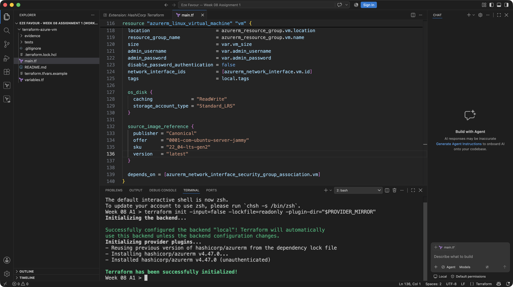
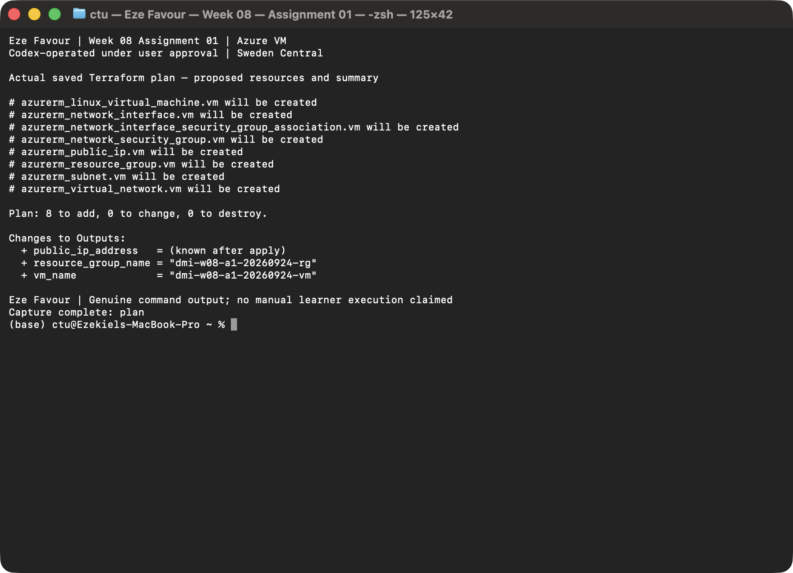
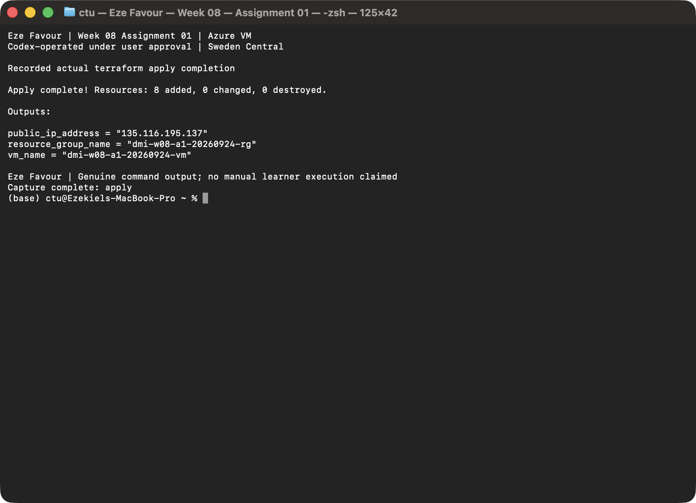
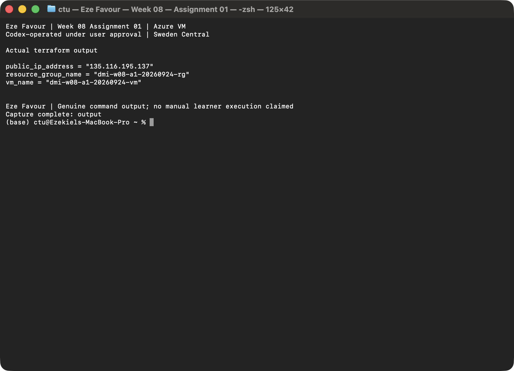
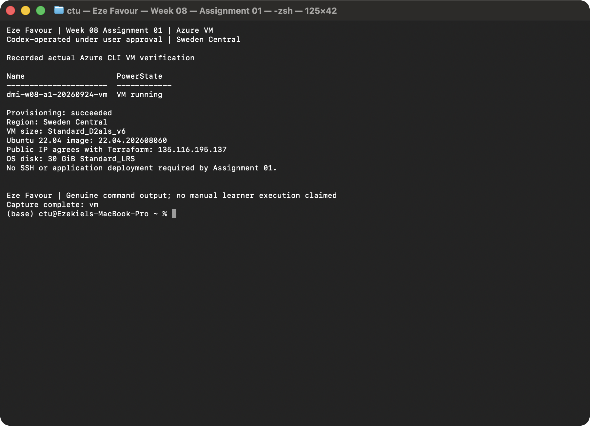
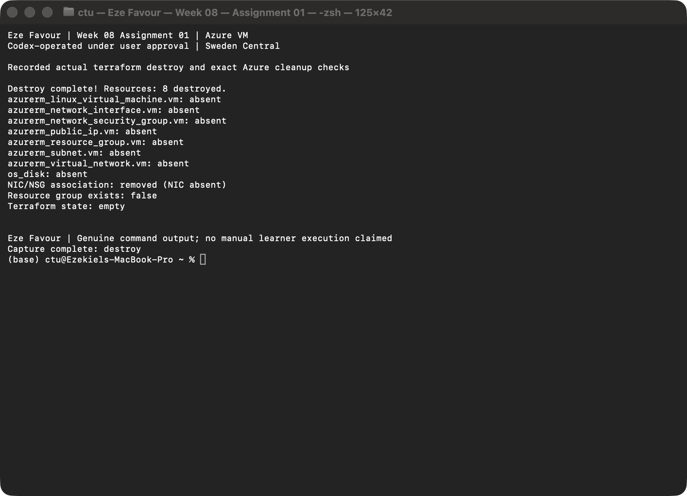

# Assignment 1 — Create an Azure Virtual Machine using Terraform

Part of the DevOps Micro Internship (DMI) Cohort 3 with Agentic AI

## Submission Details

- **Learner:** Eze Favour
- **Project:** [terraform-azure-vm on the assignment branch](https://github.com/Favourcloud/devops-micro-internship-pravinmishra/tree/favourcloud-week-08-azure-vm/week-08-terraform/terraform-azure-vm)
- **Branch:** `favourcloud-week-08-azure-vm`
- **Review:** [Original preparation PR #9, merged](https://github.com/Favourcloud/devops-micro-internship-pravinmishra/pull/9)
- **Evidence status: 11/11 verified.** All required local and live captures are present; the approved VM deployment and teardown are complete.
- **Evidence operators:** Six historical local captures by GitHub Copilot; five new live captures by Codex under user delegation, not manual learner execution.
- **Live result:** Eight Terraform resources created and destroyed; Azure CLI confirmed the VM running. Exact Azure absence checks and empty Terraform state verified cleanup. The public IP is retired.

The original requirements, headings, questions and checklist item text are
retained below. Evidence responses and checklist markers identify only what is
actually supported. Capture timestamps, original-image hashes and frozen-source
provenance are recorded in the [evidence manifest](terraform-azure-vm/evidence/manifest.json).

---

## Purpose

In this assignment, you will use Terraform to provision a complete Azure Virtual Machine environment, including a resource group, virtual network, subnet, public IP, network interface, and a Linux-based virtual machine. You will set up and verify the required local tools, define the infrastructure in Terraform, initialize the project, review and apply the plan, verify the running VM through Azure CLI, capture the public IP output, and destroy the resources after testing.

---

# Task 0 — Set Up and Verify the Terraform and Azure CLI Environment

## Goal

Prepare your local environment for Terraform deployment by installing Terraform, Azure CLI, and the HashiCorp Terraform extension in VS Code, signing in to your Azure account, and confirming that all required tools are working correctly.

### Evidence

#### Screenshot 1 — Terminal showing successful `terraform version` output

**Verified local evidence:** Terraform `1.13.5` on `darwin_amd64`, captured in the
actual VS Code terminal on 2026-09-16 at 23:16:55 UTC. Original, unmodified PNG;
this is tool-version evidence, not a deployment result.

---

#### Screenshot 2 — Terminal showing successful `az version` output

**Verified local evidence:** Azure CLI `2.89.1`, captured in the actual VS Code
terminal on 2026-09-16 at 23:17:27 UTC. Original, unmodified PNG; no Azure sign-in,
subscription selection or cloud/API activity is evidenced.

---

#### Screenshot 3 — VS Code Extensions panel showing the HashiCorp Terraform extension installed and enabled

**Verified local evidence:** The actual HashiCorp Terraform extension page shows
version `2.40.0` and Disable/Uninstall controls, confirming it is installed and
enabled. Captured on 2026-09-16 at 23:17:43 UTC; original, unmodified PNG. The
capture does not claim that the learner manually installed the extension.

---

# Task 1 — Create a New Terraform Project and Define the Infrastructure

## Goal

Create a new Terraform project and define the complete Azure Virtual Machine environment in `main.tf` by using the official Terraform Registry documentation.

### Evidence

#### Screenshot 4 — VS Code showing the AzureRM provider configuration and resource group configuration in `main.tf`

**Verified source evidence:** The actual VS Code editor displays the AzureRM
provider and resource group in `main.tf`, including disabled automatic provider
registration. Captured on 2026-09-16 at 23:18:40 UTC from frozen source commit
`dbdab95b21f517cfe0751d07e667001c0fb6a775`; original, unmodified PNG. This shows
configuration, not created Azure resources.

---

#### Screenshot 5 — VS Code showing the Linux virtual machine configuration and public IP `output` block in `main.tf`. Ensure that the VM password is hidden or redacted

**Verified source evidence:** The actual VS Code editor shows the Linux VM,
`admin_password = var.admin_password` and the full `public_ip_address` output
block. No password value or allocated public IP is displayed. Captured on
2026-09-16 at 23:19:01 UTC from frozen source commit
`dbdab95b21f517cfe0751d07e667001c0fb6a775`; original, unmodified PNG.

---

# Task 2 — Initialize Terraform

## Goal

Initialize the Terraform working directory and download the required provider components.

### Evidence

#### Screenshot 6 — Terminal showing the successful `terraform init` output

**Verified local initialization:** The genuine terminal capture shows
`terraform init -input=false -lockfile=readonly -plugin-dir="$PROVIDER_MIRROR"`,
successful configuration of the `local` backend, locked AzureRM `4.47.0` loaded
from the existing mirror and successful Terraform initialization. This is normal
initialization, not a backend-disabled check or mock test.

The original, unmodified PNG was captured at
`2026-09-16T23:29:53.340580+00:00`; the timestamp basis is the original macOS PNG
filesystem creation time, not invented image metadata. GitHub Copilot operated
the isolated assignment window under user delegation. The credential-free
initialization did not configure an authenticated Azure provider, run a cloud
plan/apply, create managed-resource state or allocate a public IP.

---

# Task 3 — Plan and Apply the Configuration

## Goal

Review the Terraform execution plan and provision the Azure resources.

### Evidence

#### Screenshot 7 — Terraform plan summary showing the proposed resources

**Verified live evidence:** The actual saved plan proposed eight new resources, with no changes or deletes. It was reviewed before apply. Codex operated the run under user delegation; no manual learner execution is claimed.

---

#### Screenshot 8 — Terraform apply output showing successful completion

**Verified live evidence:** Actual Terraform apply completed with 8 added, 0 changed and 0 destroyed. Codex operated the run under user delegation; no manual learner execution is claimed.

---

#### Screenshot 9 — Terraform output showing the public IP address of the VM

**Verified live evidence:** Actual Terraform output returned `135.116.195.137`. This address was retired after verified cleanup. Codex operated the run under user delegation; no manual learner execution is claimed.

### Question

VM Public IP Address: `135.116.195.137` — retired after verified cleanup on 24 September 2026 UTC; historical evidence only.

---

# Task 4 — Verify the Deployment

## Goal

Confirm through Azure CLI that the virtual machine was created successfully and is currently running.

### Evidence

#### Screenshot 10 — Azure CLI output showing the deployed VM name and `VM running` status

**Verified live evidence:** The actual Azure CLI command reported the deployed VM name and VM running; provisioning, image, disk and public IP were also verified. Codex operated the run under user delegation; no manual learner execution is claimed.

---

# Task 5 — Destroy the Resources

## Goal

Remove all Azure resources created by Terraform after completing the deployment and verification.

### Evidence

#### Screenshot 11 — Terminal showing successful `terraform destroy` completion

**Verified live evidence:** Actual Terraform destroy completed with 8 resources destroyed. Terraform state is empty, the resource group is absent, and all eight independently addressable Azure objects were verified absent, including the OS disk. Codex operated the run under user delegation; no manual learner execution is claimed.

---

# Submission Instructions

- Complete all tasks in sequence and include all required screenshots specified in Tasks 0–5.
- Do not expose passwords, keys, account IDs, or other sensitive information in screenshots.

---

# Completion Checklist

Checked items reflect the verified local setup and the approved live run. The existing Azure CLI sign-in was reused and its identity/subscription reconfirmed; no new `az login` command or manual learner execution is claimed. All eleven images were reviewed for the required outputs and sensitive information.

- [x] Installed Terraform and verified it using `terraform version`
- [x] Installed Azure CLI and verified it using `az version`
- [x] Signed in to Azure using `az login`
- [x] Confirmed the correct Azure subscription
- [x] Installed and enabled the HashiCorp Terraform extension in VS Code
- [x] Created the `terraform-azure-vm` project directory and `main.tf`
- [x] Added the Terraform and AzureRM provider configuration
- [x] Defined the resource group, virtual network, subnet, public IP, and network interface
- [x] Defined the Linux virtual machine with username and password-based authentication
- [x] Added the Terraform output for the VM public IP address
- [x] Completed `terraform init` successfully
- [x] Reviewed the Terraform execution plan using `terraform plan`
- [x] Completed `terraform apply` successfully
- [x] Captured and recorded the VM public IP using `terraform output`
- [x] Verified that the VM is running using Azure CLI
- [x] Completed `terraform destroy` successfully
- [x] Captured all required screenshots
- [x] Checked that no passwords, keys, account IDs, or other sensitive information are visible in the screenshots

---

## 📌 About DMI & CloudAdvisory

DevOps Micro Internship (DMI) is a project-based DevOps program run by Pravin Mishra (The CloudAdvisory) focused on real-world execution, systems thinking, and career readiness.

It helps learners build strong DevOps foundations with hands-on experience.

---

## 📌 Resources

- 🌐 DMI Official Website: https://dmi.pravinmishra.com?utm_source=github&utm_medium=readme
- 🎓 University: https://university.pravinmishra.com?utm_source=github&utm_medium=readme
- 💬 Discord Community: https://discord.pravinmishra.com?utm_source=github&utm_medium=readme
- 📝 Blog: https://dmi.pravinmishra.com/blog?utm_source=github&utm_medium=readme
- ▶️ YouTube Playlist: https://www.youtube.com/playlist?list=PLFeSNDtI4Cho
- 🔗 Pravin Mishra (LinkedIn): https://www.linkedin.com/in/pravin-mishra-aws-trainer/
- 🏢 CloudAdvisory (LinkedIn): https://www.linkedin.com/company/thecloudadvisory/

---

*This submission is part of DevOps Micro Internship (DMI) Cohort 3 — Agentic AI Track.*

## Eze Favour — Assignment 1 verified deliverables

All original requirements are retained. The [project README](terraform-azure-vm/README.md), [live summary](terraform-azure-vm/evidence/live-run-summary.md) and [manifest](terraform-azure-vm/evidence/manifest.json) document **11/11** captures, real Azure verification and complete teardown. The source and six earlier captures remain unchanged. The public IP `135.116.195.137` is retired after verified cleanup. The new run was Codex-operated under user delegation, not manual learner execution.

The original preparation branch and merged PR #9 links remain as historical source references. No new DMI grade or whole-week completion is claimed. The current live evidence is provided for review alongside the unchanged rubric.
