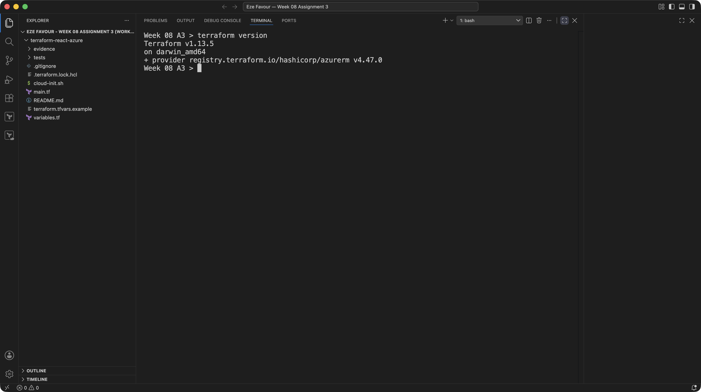
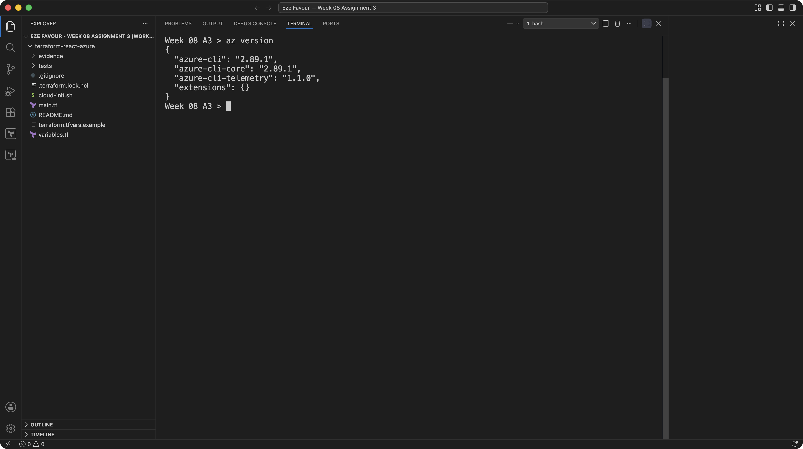
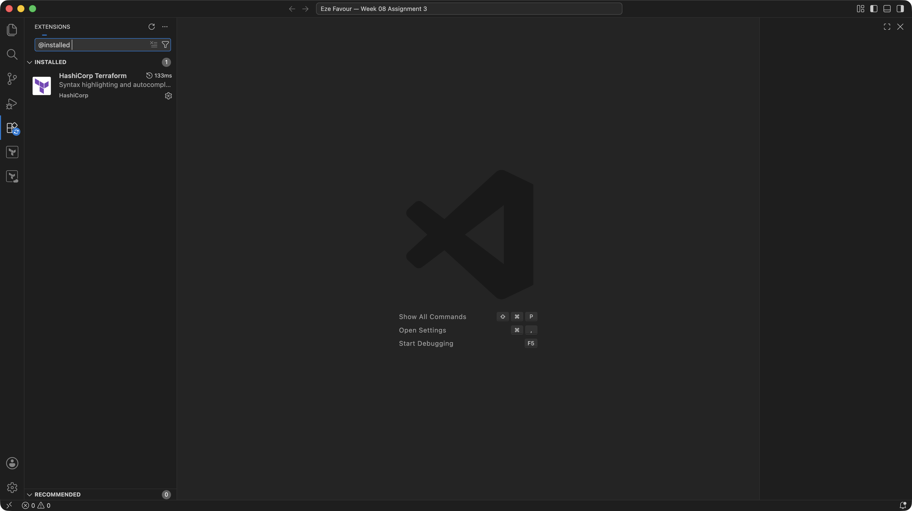
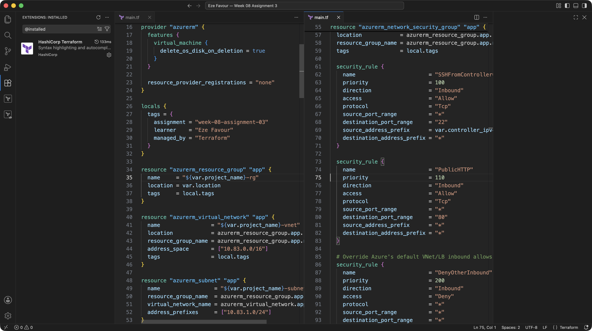
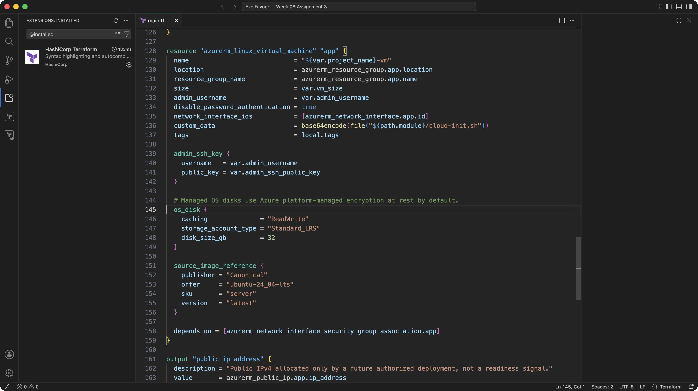
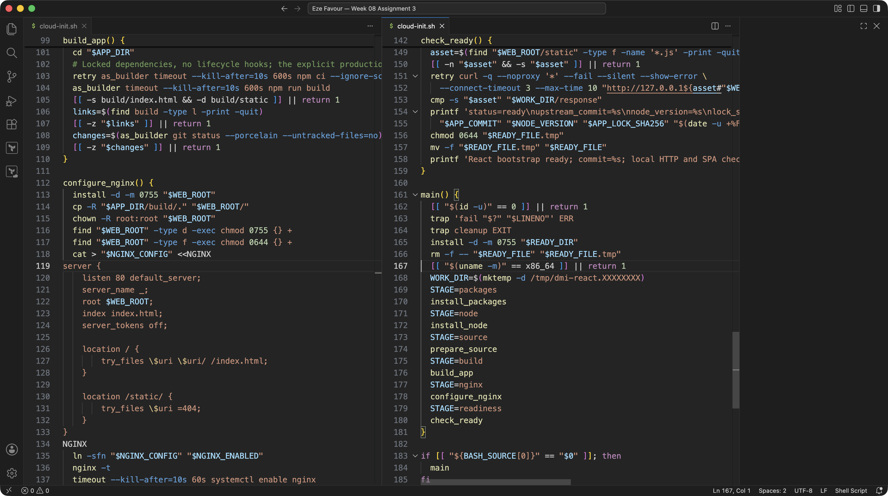
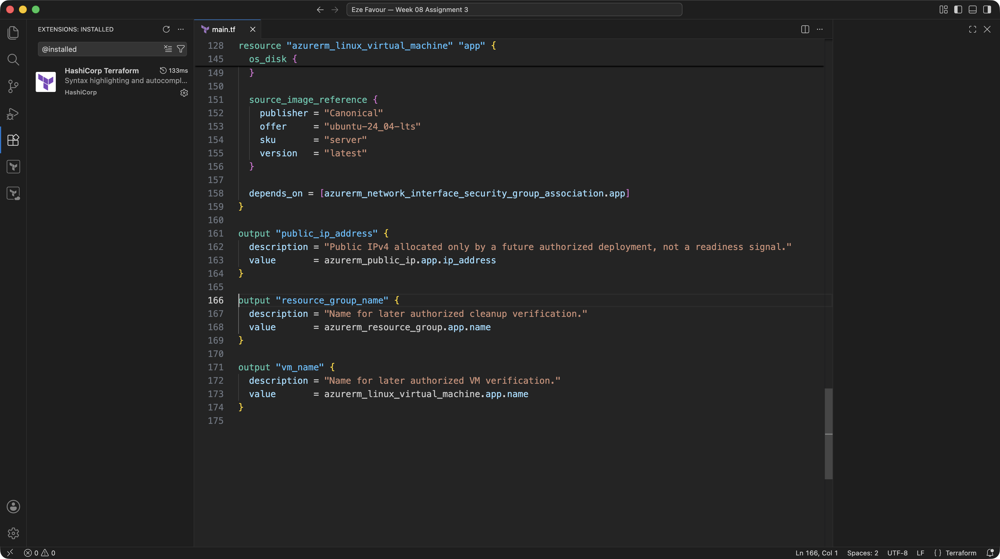
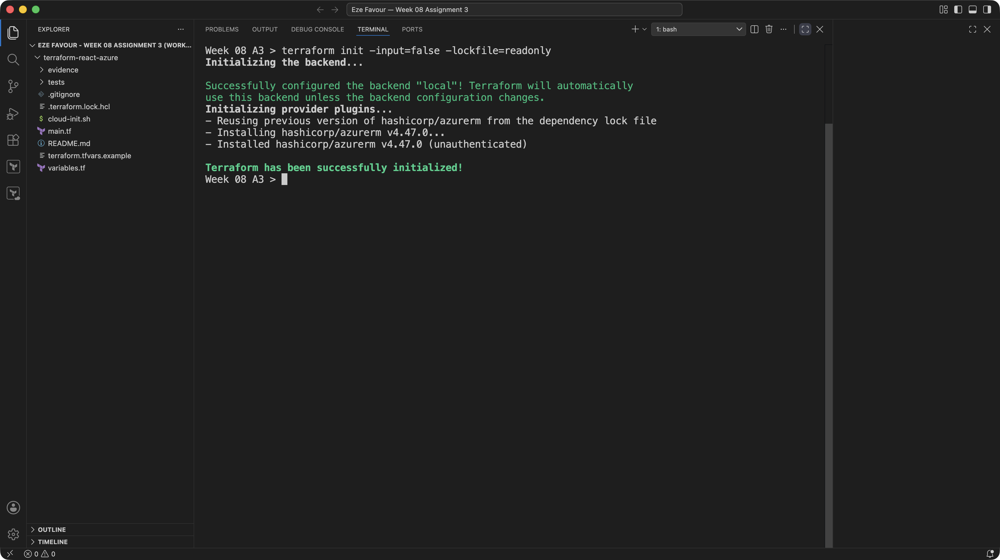

# Assignment 3 — Deploy a React Application on Azure Using Terraform

Part of the DevOps Micro Internship (DMI) Cohort 3 with Agentic AI

**Learner:** Eze Favour

**Repository:** [Favourcloud/devops-micro-internship-pravinmishra](https://github.com/Favourcloud/devops-micro-internship-pravinmishra)

**Preparation status — assignment incomplete:** The [Terraform project and prospective runbook](terraform-react-azure/README.md) provide the eight-resource Azure topology, SSH-key authentication, restricted ingress and a pinned application bootstrap. **Eight genuine local screenshots fill slots 1–8; slots 9–15 and the VM public IP remain pending**, tracked in the [evidence manifest](terraform-react-azure/evidence/manifest.json). These original, unaltered VS Code window captures are labelled Eze Favour and were **operated by GitHub Copilot under user delegation, not manually by the learner**. The [sanitized provenance](terraform-react-azure/evidence/provenance.json) records capture times, hashes and frozen source commit `3a0eea8f2dc9c62d28e511155065e6e145a3555b`.

Local evidence is separate from cloud execution: source views, Terraform mocks and shell stubs cannot establish a live deployment. Slot 8 records successful normal **local-backend** initialization with existing tools and a filesystem-only provider mirror, not cloud provisioning or a new provider download. A genuine isolated **macOS** build of the unchanged instructor application succeeded with supported Node 22; no JavaScript was authored or modified in this submission. Ubuntu/cloud-init/Nginx behavior and public access still require an authorized run. No Azure authentication, real plan/apply/destroy, SSH or public browser verification was performed. Fresh identity, permission and budget consent remain gates; previous approvals are not reused. Local/source checklist marks do not certify runtime completion.

---

## Purpose

In this assignment, you will use Terraform to provision the required Azure infrastructure and automatically deploy the `my-react-app` React application on an Azure Linux virtual machine using a `cloud-init.sh` deployment script passed to the VM through `custom_data`.

You will verify the automated deployment through SSH, confirm that Nginx is running, access the React application through the VM public IP, and destroy the Terraform-managed resources after testing.

---

# Task 0 — Set Up and Verify the Terraform and Azure CLI Environment

## Goal

Prepare your local environment for Terraform deployment by installing Terraform, Azure CLI, and the HashiCorp Terraform extension in VS Code, signing in to your Azure account, and confirming that all required tools are working correctly.

## Evidence

### Screenshot 1 — Terraform Version

**Evidence status:** Captured — actual local Terraform 1.13.5 darwin_amd64 version output; installed tooling verified, no infrastructure action.

Add a screenshot of the terminal showing successful `terraform version` output.



---

### Screenshot 2 — Azure CLI Version

**Evidence status:** Captured — actual local Azure CLI 2.89.1 version output, not Azure login, account validation or an API call.

Add a screenshot of the terminal showing successful `az version` output.



---

### Screenshot 3 — HashiCorp Terraform Extension

**Evidence status:** Captured — installed HashiCorp Terraform extension in the native local VS Code Extensions panel.

Add a screenshot of the VS Code Extensions panel showing the HashiCorp Terraform extension installed and enabled.



---

# Task 1 — Create a New Terraform Project and Define the Infrastructure

## Goal

Create a new Terraform project and define the complete Azure infrastructure required to host the React application using the official Terraform Registry documentation.

The `terraform-react-azure` project must contain:

```text
terraform-react-azure/
├── main.tf
└── cloud-init.sh
```

The Terraform configuration must include:

- Terraform and AzureRM provider configuration
- Resource group
- Virtual network and subnet
- Network Security Group
- SSH rule for TCP port `22`
- HTTP rule for TCP port `80`
- Public IP address
- Network interface
- Linux virtual machine
- `custom_data` configuration referencing `cloud-init.sh`
- Public IP output

The `cloud-init.sh` file must contain the complete automated React application deployment workflow based on the repository instructions.

## Evidence

### Screenshot 4 — Provider, Resource Group, and Network Security Group

**Evidence status:** Captured — genuine native split view of unchanged provider, resource group and NSG SSH/HTTP source; not deployed Azure resources or a composite image.

Add a screenshot of VS Code showing the AzureRM provider, resource group, and Network Security Group configuration in `main.tf`.



---

### Screenshot 5 — Linux Virtual Machine and `custom_data`

**Evidence status:** Captured — unchanged Linux VM and `custom_data` source only; no VM creation or cloud-init execution is claimed.

Add a screenshot of VS Code showing the Linux virtual machine configuration, including the `custom_data` configuration, in `main.tf`.

Ensure that passwords, private keys, account IDs, access tokens, and other sensitive information are hidden.



---

### Screenshot 6 — Completed `cloud-init.sh`

**Evidence status:** Captured — genuine native split view of build/Nginx excerpts and the complete main workflow in the completed script. The whole file is not visible; this is source, not runtime or a composite image. The complete [tracked script](terraform-react-azure/cloud-init.sh) remains the source deliverable. The visible `/tmp/dmi-react.XXXXXXXX` is a public script template, not a private capture path.

Add a screenshot of VS Code showing the completed `cloud-init.sh` deployment script.

Ensure that no passwords, Azure credentials, access tokens, SSH private keys, or other sensitive information are visible.



---

### Screenshot 7 — Public IP Output Block

**Evidence status:** Captured — public IP output block source only, not a real public IP allocation or `terraform output` result.

Add a screenshot of VS Code showing the public IP `output` block in `main.tf`.



---

# Task 2 — Initialize Terraform

## Goal

Initialize the Terraform working directory and download the required provider components.

## Evidence

### Screenshot 8 — Terraform Initialization

**Evidence status:** Captured — actual successful `terraform init -input=false -lockfile=readonly` with the normal **local backend**, Terraform 1.13.5 and an existing AzureRM 4.47.0 filesystem-only mirror. This used an empty environment/Azure configuration and a passed startup guard. The configured target is `.private/terraform.tfstate`; no managed-resource state exists. This is not the earlier backend-disabled test, a new provider download, Azure authentication or cloud provisioning.

Add a screenshot of the terminal showing successful `terraform init` output.



---

# Task 3 — Plan and Apply the Configuration

## Goal

Review the Terraform execution plan and provision the Azure infrastructure.

## Evidence

### Screenshot 9 — Terraform Plan

**Evidence status:** Pending — no real Azure plan authorized or executed.

Add a screenshot showing the Terraform plan summary and the proposed resources.

Add your screenshot here.

---

### Screenshot 10 — Terraform Apply

**Evidence status:** Pending — no Azure deployment authorized or executed.

Add a screenshot showing successful `terraform apply` completion.

Add your screenshot here.

---

### Screenshot 11 — VM Public IP Output

**Evidence status:** Pending — no live public IP output exists; mock addresses are not evidence.

Add a screenshot showing the VM public IP address returned by `terraform output`.

Add your screenshot here.

## VM Public IP Address

Record the public IP address displayed by `terraform output`.

**VM Public IP Address:** Pending — no authorized Azure deployment or real Terraform output exists.

---

# Task 4 — Verify the Automated Deployment

## Goal

Connect to the Azure Linux virtual machine and confirm that the cloud-init/user data deployment script completed successfully.

## Evidence

### Screenshot 12 — SSH Connection and Completed React Deployment

**Evidence status:** Pending — no SSH/cloud-init runtime verification performed.

Add a screenshot of the SSH terminal showing a successful connection to the Azure VM and evidence that the React application deployment completed.

Add your screenshot here.

---

### Screenshot 13 — Nginx Service Status

**Evidence status:** Pending — stubs do not verify a real Nginx service.

Add a screenshot of the terminal showing that the Nginx service is running successfully.

Add your screenshot here.

---

# Task 5 — Verify the React Application Deployment

## Goal

Confirm that the automatically deployed React application is publicly accessible and functioning correctly.

## Evidence

### Screenshot 14 — React Application in the Browser

**Evidence status:** Pending — no public browser verification or GUI capture performed.

Add a screenshot of the browser showing the deployed React application successfully loaded using the Azure VM public IP.

Ensure that the Azure VM public IP is visible in the browser address bar.

Add your screenshot here.

---

# Task 6 — Destroy the Resources

## Goal

Remove all Azure resources created by Terraform after completing the application deployment and verification.

## Evidence

### Screenshot 15 — Terraform Destroy

**Evidence status:** Pending — no cloud destroy or inventory cleanup verification performed.

Add a screenshot of the terminal showing successful `terraform destroy` completion.

Add your screenshot here.

---

# Submission Instructions

- Complete Tasks 0–6 in sequence.
- Include all 15 required screenshots exactly as specified.
- Ensure that your full name is visible in the required screenshots.
- Record the VM public IP address under Task 3.
- Ensure that the submitted evidence clearly matches the required task outputs.
- Include `main.tf` and `cloud-init.sh` in your GitHub submission.
- Do not expose passwords, SSH private keys, account IDs, access tokens, Azure credentials, or other sensitive information.
- Do not store secrets inside `cloud-init.sh`.
- Review all screenshots and project files carefully before submitting through GitHub.

---

# Completion Checklist

Checked local-tool items refer to verification of existing installations, not a new installation or manual learner execution. Initialization is local only. Eight privacy-reviewed local captures do not complete the remaining cloud or all-screenshot checklist items.

- [x] Installed Terraform and verified it using `terraform version`
- [x] Installed Azure CLI and verified it using `az version`
- [ ] Signed in to Azure and confirmed the correct subscription
- [x] Installed and enabled the HashiCorp Terraform extension in VS Code
- [x] Created the `terraform-react-azure` project
- [x] Created `main.tf`
- [x] Defined the Terraform and AzureRM provider configuration
- [x] Defined the resource group
- [x] Defined the virtual network and subnet
- [x] Defined the Network Security Group
- [x] Configured SSH and HTTP rules
- [x] Defined the public IP and network interface
- [x] Created `cloud-init.sh`
- [x] Reviewed the React application repository instructions
- [x] Created the complete deployment workflow inside `cloud-init.sh`
- [x] Defined the Linux virtual machine
- [x] Connected `cloud-init.sh` to the VM using `custom_data`
- [x] Used `file()` and `base64encode()` correctly
- [x] Added the Terraform public IP output
- [x] Completed `terraform init` successfully
- [ ] Reviewed the Terraform execution plan
- [ ] Completed `terraform apply` successfully
- [ ] Recorded the VM public IP
- [ ] Connected to the VM through SSH
- [ ] Verified that the automated deployment completed successfully
- [ ] Verified that Nginx is running
- [ ] Verified the React application through the browser
- [ ] Completed `terraform destroy` successfully
- [ ] Captured all 15 required screenshots
- [ ] Confirmed that my full name is visible in the required screenshots
- [ ] Checked that no passwords, keys, account IDs, access tokens, or other sensitive information are exposed

---

## About DMI & CloudAdvisory

DevOps Micro Internship (DMI) is a project-based DevOps program run by Pravin Mishra (The CloudAdvisory), focused on real-world execution, systems thinking, and career readiness.

It helps learners build strong DevOps foundations through hands-on experience.

---

## Resources

- React Application Repository: [https://github.com/pravinmishraaws/my-react-app](https://github.com/pravinmishraaws/my-react-app)
- DMI Official Website: [https://dmi.pravinmishra.com](https://dmi.pravinmishra.com)
- University: [https://university.pravinmishra.com](https://university.pravinmishra.com)
- Discord Community: [https://discord.pravinmishra.com](https://discord.pravinmishra.com)
- Blog: [https://dmi.pravinmishra.com/blog](https://dmi.pravinmishra.com/blog)
- YouTube Playlist: [https://www.youtube.com/playlist?list=PLFeSNDtI4Cho](https://www.youtube.com/playlist?list=PLFeSNDtI4Cho)
- Pravin Mishra on LinkedIn: [https://www.linkedin.com/in/pravin-mishra-aws-trainer/](https://www.linkedin.com/in/pravin-mishra-aws-trainer/)
- CloudAdvisory on LinkedIn: [https://www.linkedin.com/company/thecloudadvisory/](https://www.linkedin.com/company/thecloudadvisory/)

---

*This submission is part of the DevOps Micro Internship (DMI) Cohort 3 — Agentic AI Track.*
