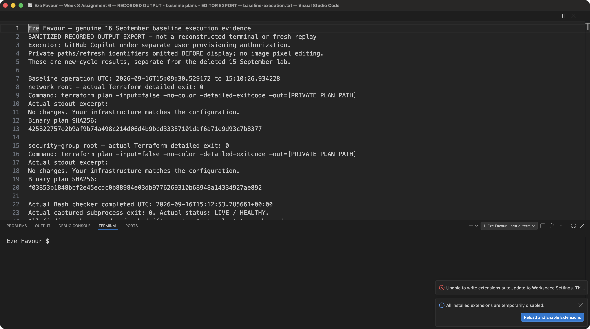
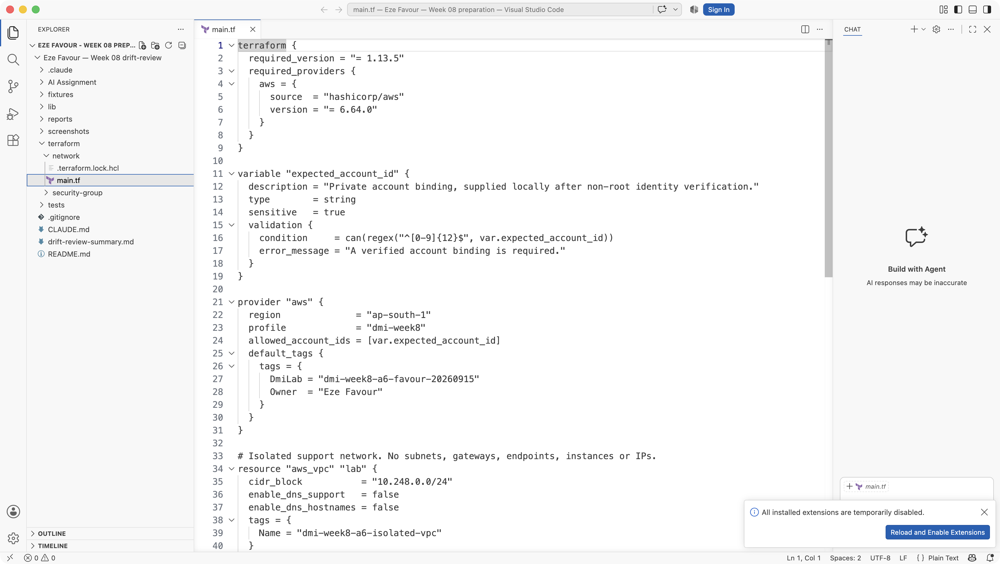
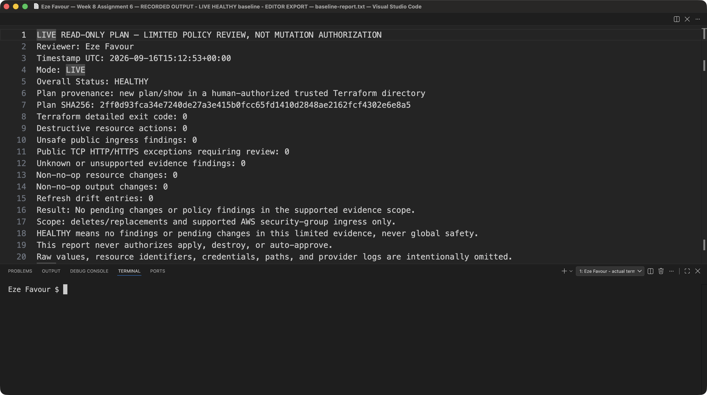
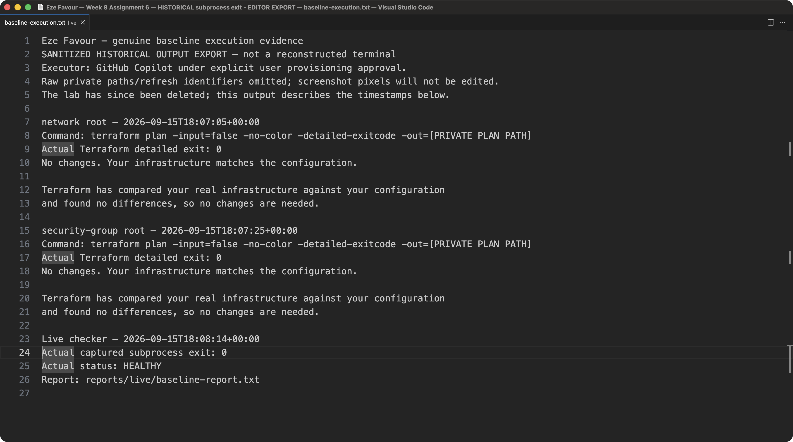
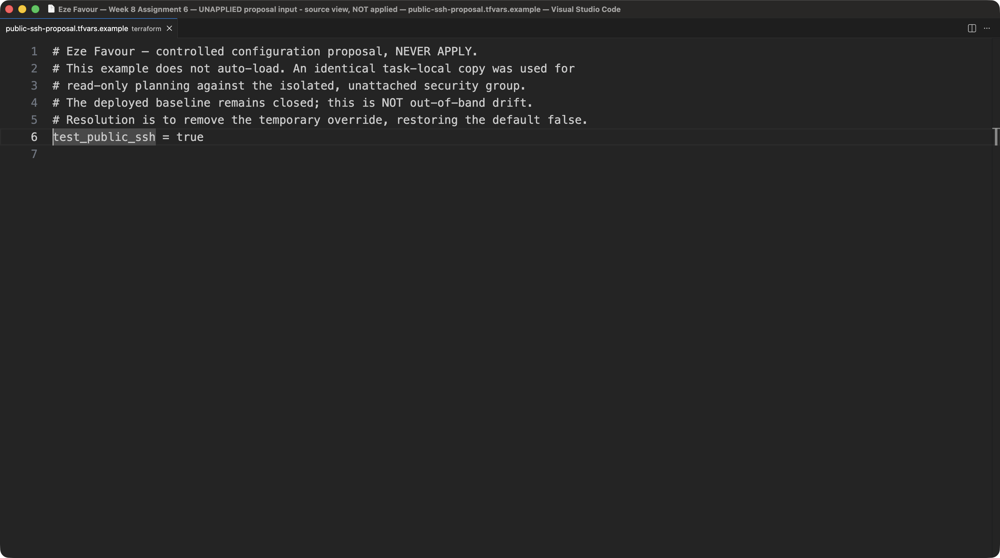
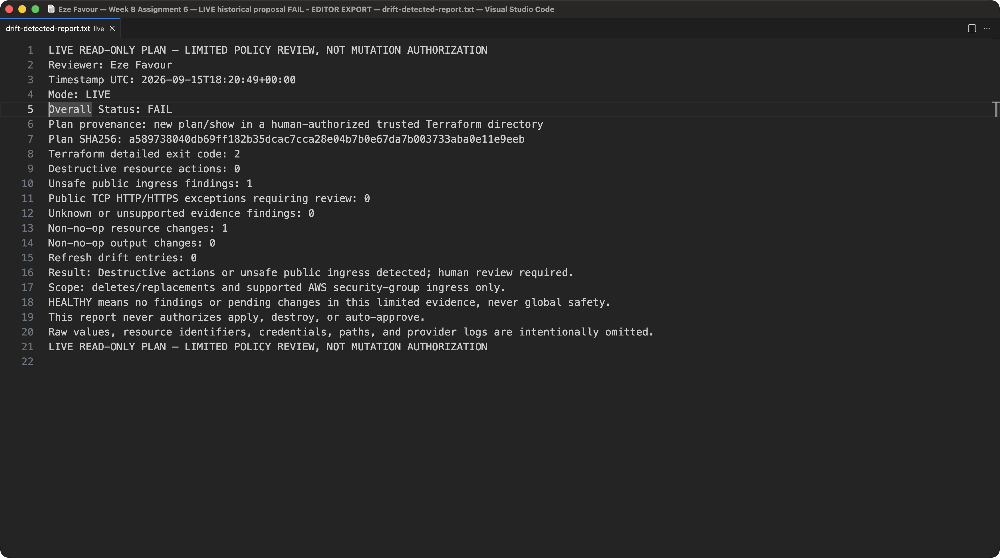
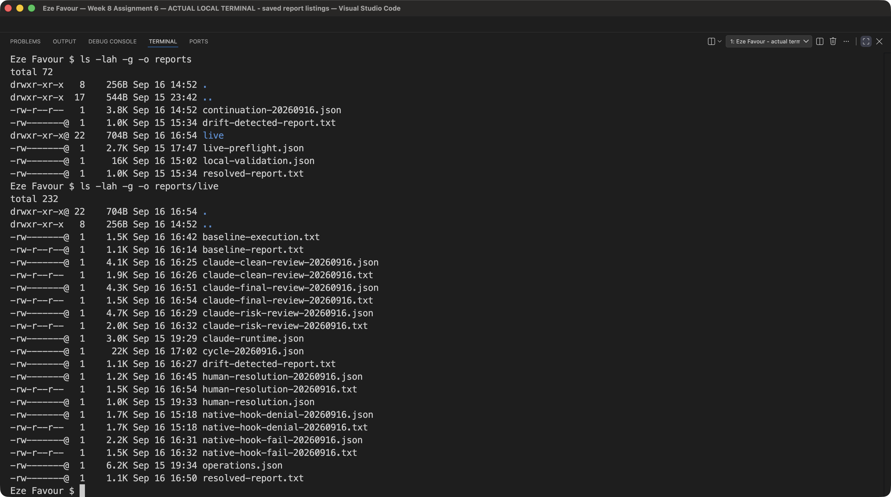
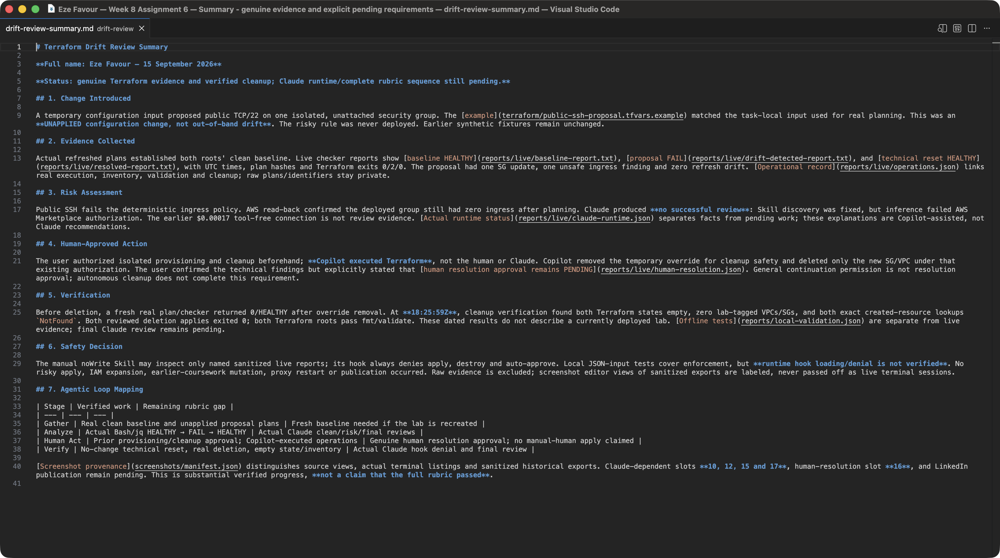

# Assignment 6 — AI-Assisted Terraform Drift and Policy Review

Part of the DevOps Micro Internship (DMI) Cohort 3 with Agentic AI

---

## Student Details

**Full Name:** Eze Favour

**GitHub Repository/Folder URL:** https://github.com/Favourcloud/devops-micro-internship-pravinmishra/tree/favourcloud-week-06-assignment-4-ec2-rds/week-08-terraform/drift-review

The URL targets the existing working branch, including later enrollment updates. [PR #2](https://github.com/Favourcloud/devops-micro-internship-pravinmishra/pull/2) merged the earlier implementation and 14 screenshots into `main` at **2026-09-16 11:13:58 UTC** (`d244042`), after explicit user approval; GitHub Copilot performed that merge. Enrollment setup commit `976212b` and subsequent continuation updates were pushed afterward and are **not part of the merged PR**. No further merge or LinkedIn/Medium publication is claimed. Merge approval does not satisfy the pending human resolution requirement. Relative source: [drift-review/](drift-review/README.md).

## Current Submission Status — Verified Operations, Partial Rubric

| Requirement | Current evidence | Status |
| --- | --- | --- |
| Project context, script, isolated Skill/hook | [README/runbook](drift-review/README.md), [CLAUDE.md](drift-review/CLAUDE.md), [checker](drift-review/AI%20Assignment/tf-drift-check.sh), [Skill](drift-review/.claude/skills/tf-drift-review/SKILL.md), [hook settings](drift-review/.claude/settings.json) | Implemented locally; no successful Claude review or runtime hook event |
| Deterministic policy/hook tests | [Tests](drift-review/tests/test_review.py), [generated local validation record](drift-review/reports/local-validation.json) | Offline regression evidence; live checker outcomes are recorded separately below |
| Historical evidence | [Synthetic detected report](drift-review/reports/drift-detected-report.txt), [synthetic resolved report](drift-review/reports/resolved-report.txt), [earlier preflight](drift-review/reports/live-preflight.json) | Preserved unchanged; **not evidence of the later live operations** |
| Live baseline | [Actual baseline execution export](drift-review/reports/live/baseline-execution.txt), [LIVE baseline report](drift-review/reports/live/baseline-report.txt), [operations](drift-review/reports/live/operations.json) | Both Terraform roots returned plan exit 0; real checker returned HEALTHY/0 |
| Controlled configuration proposal | [Public input example](drift-review/terraform/public-ssh-proposal.tfvars.example), [LIVE detected report](drift-review/reports/live/drift-detected-report.txt) | Real plan exit 2, one update, one unsafe ingress finding, checker FAIL/2, refresh drift 0; **never applied** |
| Technical reset and cleanup | [LIVE reset report](drift-review/reports/live/resolved-report.txt), [operation/cleanup record](drift-review/reports/live/operations.json) | Override removed under prior cleanup authorization; plan/checker 0; SG and VPC deletion applies 0; cleanup verified at 18:25:59Z |
| Human resolution sequence | [Authoritative user clarification](drift-review/reports/live/human-resolution.json) | **PENDING** — general continuation permission is not resolution approval; no personal human review or manual human Terraform actions claimed |
| Bedrock enrollment and review authorization | [16 September continuation evidence](drift-review/reports/continuation-20260916.json), [private-completion timeline](drift-review/enrollment-proposal/SETUP-20260916.md) | MFA authentication and user-triggered offer acceptance verified; independent availability AVAILABLE at 13:27:31Z; up to the existing $0.32 remainder approved for reviews only |
| Claude invocation and actual hook integration | [Historical runtime record](drift-review/reports/live/claude-runtime.json) | Earlier discovery repaired but inference failed with 403 enrollment errors; later enrollment verification is not a successful Claude review, Read call, hook event or blocked apply demonstration |
| Seven-section summary | [drift-review-summary.md](drift-review/drift-review-summary.md), seven answers below | Records operational progress and pending human resolution/Claude review, not a full rubric pass |
| Screenshot evidence | [Capture provenance](drift-review/screenshots/manifest.json); [all 19 slot statuses](drift-review/README.md#genuine-local-screenshots) | **14 genuine images integrated**, including new 1/7/8/11/13/18/19 and genuine changed-source 3/9 recaptures; **10/12/15/16/17 remain pending** |
| Publication | Original URL and publication screenshot placeholders below | **Pending; no new publication authorized and no URL fabricated** |

**Evidence boundary:** The public `reports/live/` files are sanitized records of actual Terraform/AWS operations, not Claude transcripts or synthetic fixtures. With explicit user authorization for one dedicated VPC and one closed, unattached security group, **GitHub Copilot**, not Claude or a manually operating human, applied the exact reviewed saved creation and deletion-only plans. No earlier coursework resources were targeted. The public SSH configuration proposal was never deployed; AWS still showed zero ingress after planning. `HEALTHY` covers only the checker's supported ingress/destructive-action scope at the recorded time. The lab is now deleted, so neither baseline nor reset report claims a currently deployed environment.

**Human resolution remains PENDING:** The resolution approval request initially returned user-unavailable. Copilot removed the temporary override for cleanup safety under the earlier cleanup authorization, obtained a no-change plan/limited-scope HEALTHY result, and completed verified cleanup. The earlier broad message, “you have my approval do it professionally to pass the rubics,” is **general continuation permission, not resolution approval**; the previous interpretation is withdrawn. The [authoritative user clarification](drift-review/reports/live/human-resolution.json) states: “Human resolution approval and successful Claude review remain pending. Autonomous cleanup must not be presented as your personal review or as completion of those assignment requirements.” No later resolution approval, personal human review, manual human execution or approved complete loop is claimed. Screenshot 16 remains a pending placeholder.

**Claude and budget boundary:** The historical tool-free Bedrock test succeeded with 120 input/10 output tokens and reported $0.00017, but proved no Skill/hook execution. The first Skill attempt returned `Unknown command: /tf-drift-review` with zero tokens/$0. A byte-identical isolated Skill registration fixed discovery; subsequent inference failed with 403 enrollment authorization errors. [AWS documentation](https://docs.aws.amazon.com/bedrock/latest/userguide/model-access.html) explains that initial invocations can temporarily work during automatic setup and later fail if prerequisites are missing; it does not prove which account prerequisite failed. On **16 September at 13:26:22 UTC**, the user-triggered private SDK helper confirmed acceptance of the specific reviewed Haiku offer. Independent availability at **13:27:31 UTC** returned `AVAILABLE / AUTHORIZED / AVAILABLE / AVAILABLE`; this establishes that enrollment milestone, not a post-enrollment model test or an account-billing audit. The runtime role was not broadened. At the user's **13:30:22.429 UTC** approval, the separately approved **$0.50 additional model allowance** retained $0 reported completed usage and **$0.18 reserved for unknown usage, not confirmed charges**. The user authorized up to the remaining **$0.32** for global Haiku reviews and the safe hook demonstration, not a new allowance or provisioning/resolution approval. The historical $0.00017 is separate. The enrollment session and fixed policy window have expired without extension. Budget accounting and native runtime evidence still require verification before completion claims; the CLI threshold is not an AWS account cap. A fresh network-only plan at **13:44:17 UTC** proposed one VPC and was not applied. New provisioning/cleanup remain separately gated. The VPC/SG resource types are expected to cost $0; account billing was not queried.

**Source parity:** Compared the complete original template with pinned upstream commit `9b394ef8efecd7db1f582995a03665f6f8afc2a4`, blob `2c00e004853ae2eb146928eb86d19459b538be1b` (14,111 bytes). The original local template only added `Cohort 3` to its opening subtitle. All required headings, questions, 19 numbered screenshot sections, publication placeholders, and checklist item text are preserved. Fourteen accepted captures are labeled by scope; changed-source 3/9 were genuinely recaptured, and five unfulfilled slots remain explicit placeholders. [Metadata and regression checks](drift-review/tests/assignment-source.json) record the original requirements.

---

## Purpose

Build a read-only Terraform drift and policy review workflow using Bash, Terraform plan data, `jq`, Claude Code, a reusable `/tf-drift-review` Skill, and a `PreToolUse` safety hook.

The workflow must follow this pattern:

```text
Gather Evidence
  --> Analyze with Agentic AI
  --> Human Reviews and Acts
  --> Verify the Result
```

The `/tf-drift-review` Skill and `tf-drift-check.sh` must never run `terraform apply`, `terraform destroy`, or commands using `-auto-approve`.

---

# Task 1 — Confirm the Clean Baseline and Create the Workspace

## Goal

Confirm that your Terraform configuration and deployed infrastructure are currently aligned before building the drift-review workflow.

## Evidence

### Screenshot 1 — Clean Terraform Plan

Add a screenshot of `terraform plan` showing no pending changes.



Genuine editor view of the clearly labeled [sanitized historical baseline execution export](drift-review/reports/live/baseline-execution.txt), **not a terminal screenshot or rerun**. Both real roots returned `No changes`/exit 0 at the recorded times; the lab has since been deleted. Raw refresh identifiers were omitted and the private saved-plan path was replaced with `[PRIVATE PLAN PATH]` before opening the export. Screenshot pixels are unmodified.

---

### Screenshot 2 — Assignment Workspace

Add a screenshot of the folder structure showing `AI Assignment/`, `reports/`, and the Terraform project.



Captured locally on 15 September 2026. This earlier workspace view establishes the local layout, not a deployed baseline. Later provisioning, baseline and verified cleanup are documented separately in [operations.json](drift-review/reports/live/operations.json); successful Claude runtime review remains blocked.

## Questions

### 1. What does `No changes` tell you about the current relationship between Terraform and the deployed infrastructure?

For the selected configuration, workspace, state and refreshed provider evidence, Terraform proposes no managed changes. It does not certify untracked resources, every security control, or future state. The [actual baseline export](drift-review/reports/live/baseline-execution.txt) records `No changes` and detailed exit 0 for the dedicated network root at 18:07:05Z and security-group root at 18:07:25Z on 15 September 2026. Those are real historical baseline results, not a claim that the subsequently deleted lab remains deployed.

### 2. Why is a clean baseline important before introducing a test change?

I need it to distinguish my intentional change from pre-existing differences and to make the before/after comparison meaningful. Here, both real roots were clean and the live checker returned HEALTHY/0 before the public-SSH configuration-input proposal. The later report showed one planned update and zero refresh-drift entries, separating changed configuration intent from out-of-band drift.

---

# Task 2 — Create Project Context and Safety Rules in `CLAUDE.md`

## Goal

Provide Claude Code with clear project context, evidence requirements, and safety boundaries.

## Evidence

### Screenshot 3 — Project Context and Safety Rules

Add a screenshot of `CLAUDE.md` open in VS Code showing the Project Overview, Review Workflow, Safety Rules, and Output Rules.


Genuinely recaptured on 15 September 2026 after the operational/context edits. The current source and image hashes match the manifest; all four required sections and pending human approval are visible. This is configuration evidence, not proof of Claude invocation.

## Questions

### 1. Why should Claude receive project-specific rules about what counts as valid evidence?

I want the reviewer to distinguish a real current plan from an old report, invented explanation, or synthetic fixture, and to state the exact policy scope. My `CLAUDE.md` requires provenance, timestamps, hashes and explicit unknowns, rather than treating an AI opinion as infrastructure evidence.

### 2. Why must the human remain responsible for running `terraform apply`?

Applying a plan can delete or replace resources, interrupt service, expose data, or incur costs. An authorized human must own the decision, scope and consequences through the normal change process; the read-only checker and Claude Skill must not apply anything. In this run the user separately approved the narrowly scoped lab creation/cleanup, and **GitHub Copilot applied the exact reviewed saved plans**, not Claude or a manually operating human. That is not the rubric's requested manual human execution or evidence of a completed Claude-review-before-human-action sequence.

### 3. Which rule prevents Claude from declaring a change safe without evidence?

The Output Rules in my local `CLAUDE.md` say never to declare safety without complete, fresh evidence within the stated limited scope. Missing, stale, malformed, unknown or fixture evidence cannot be converted into a live safety approval, and even HEALTHY cannot authorize mutation.

---

# Task 3 — Build the Terraform Drift and Policy Check Script

## Goal

Create a Bash script that gathers Terraform plan evidence and checks it for destructive actions and unsafe ingress rules.

## Evidence

### Screenshot 4 — Script Variables and Checks Array

Add a screenshot of the top section of `tf-drift-check.sh` showing the variables and `checks` array.


Captured locally on 15 September 2026; source view only.

---

### Screenshot 5 — Destructive-Action and Open-Ingress Checks

Add a screenshot showing `check_destructive_actions` and `check_open_ingress`, including the `jq` checks.


Captured locally on 15 September 2026. The left editor shows both actual Bash functions and jq invocations; the right shows the relevant ingress-policy logic, not the entire policy file.

---

### Screenshot 6 — Script Validation and Permissions

Add a screenshot showing successful `bash -n` and `ls -l` output.


Actual local commands ran on 15 September 2026: `bash -n` returned 0, `ls -l -g -o` showed `-rwxr-xr-x`, and `test -x` returned 0. The `-g -o` options omit local owner/group names; no screenshot pixels were changed. No Terraform or cloud command ran **in this capture**; later live operations are documented separately.

## Questions

### 1. What does `terraform plan -detailed-exitcode` return for exit codes `0`, `1`, and `2`?

Terraform returns 0 for a successful plan with no changes, 1 for an error, and 2 for a successful plan with changes. Offline tests exercise these branches with fake Terraform executables; [actual operations](drift-review/reports/live/operations.json) also record real baseline/reset plan exit 0 and configuration-proposal plan exit 2. My checker separately uses 0/HEALTHY, 1/WARN, 2/FAIL and 3/ERROR; those are not Terraform's exit-code meanings. The live baseline/reset checker returned 0 and the unsafe proposal returned 2.

### 2. Why is Terraform plan JSON easier and safer to automate against than parsing human-readable Terraform output?

It has structured actions, before/after values and unknown flags that jq can validate and inspect without relying on display wording or colors. JSON still needs schema validation and careful handling of unknown values. Raw plans can contain secrets, so my script uses private scratch data and outputs only sanitized counts/provenance.

### 3. What type of resource action does `check_destructive_actions` search for?

It searches the actions arrays in resource changes and refresh-drift observations for `delete`, and reports the count without exposing resource identifiers. Other changes are reported separately rather than mislabeled clean.

### 4. Why does finding a `delete` action also help detect replacements?

Replacement contains both create and delete, in either order depending on lifecycle behavior. Searching for membership of `delete` detects both `["delete", "create"]` and `["create", "delete"]`, not just deletion-only arrays.

### 5. Why must this script never run `terraform apply`?

Its job is evidence collection and policy checks, not change authorization. Automatically applying findings would merge analysis with a potentially destructive action and remove human oversight. The exercised live mode permits only plan and show; trusted-project authorization is required because providers/data sources execute code. Copilot's separately authorized creation/cleanup applies were outside this read-only checker and Claude Skill.

---

# Task 4 — Run the Script Against the Clean Baseline

## Goal

Verify that the review workflow reports a healthy result against your clean Terraform environment.

## Evidence

### Screenshot 7 — Healthy Baseline Report

Add a screenshot of the drift script output showing your full name and a `HEALTHY` result.



Genuine editor view of [the actual LIVE baseline report](drift-review/reports/live/baseline-report.txt), with Eze Favour, HEALTHY, timestamp and plan hash visible. The sanitized report describes the recorded baseline, not the now-deleted lab's current state; it is not a terminal rerun or Claude review.

---

### Screenshot 8 — Baseline Script Exit Code

Add a screenshot showing the captured script exit code `0`.



Genuine editor view of [baseline-execution.txt](drift-review/reports/live/baseline-execution.txt), clearly labeled as a sanitized historical output export. It records the actual checker subprocess exit 0; it is **not a terminal screenshot, reconstructed shell session or newly executed `echo $?`**. The export redaction is documented under screenshot 1; pixels are unmodified.

## Questions

### 1. What is the Overall Status of your baseline?

The **real live baseline was HEALTHY, checker exit 0**, at 18:08:14Z on 15 September 2026. The [baseline report](drift-review/reports/live/baseline-report.txt) records Terraform detailed exit 0, no non-no-op changes, no refresh drift and no supported policy findings. This is separate from the unchanged synthetic clean fixture and is not a successful Claude review.

### 2. Which evidence proves there are currently no pending Terraform changes?

The [baseline execution export](drift-review/reports/live/baseline-execution.txt) and [operations record](drift-review/reports/live/operations.json) establish no pending managed changes in both roots **at their recorded baseline times**, with real detailed exit 0. The fresh live checker plan also returned 0. They do not prove a current deployed baseline after cleanup: the lab was subsequently deleted, and the final evidence is empty states and absent resources, not a new no-change plan for a running lab.

### 3. Was `reports/tfplan.json` created? Explain why or why not.

No persistent public `reports/tfplan.json` was created. The actual authorized live checker produced a fresh private plan binary and Terraform show JSON, evaluated them, and removed its temporary raw plan data after analysis, as recorded in [operations.json](drift-review/reports/live/operations.json). Only sanitized counts, timestamps, exit codes and hashes were exported. Raw plans, state, credentials and provider logs are not publication evidence.

---

# Task 5 — Create and Run the `/tf-drift-review` Claude Code Skill

## Goal

Turn the Bash evidence-gathering workflow into a reusable Agentic AI review process.

## Evidence

### Screenshot 9 — `/tf-drift-review` Skill Configuration

Add a screenshot of `SKILL.md` showing the frontmatter, allowed tools, and safety rules.


Genuinely recaptured after the Skill edits, with current source/image hashes in the manifest. This shows configuration only, including the narrow sanitized-live-report inputs; it does not prove runtime success. Repaired discovery and subsequent blocked inference are documented separately in [claude-runtime.json](drift-review/reports/live/claude-runtime.json).

---

### Screenshot 10 — Clean Agentic AI Review

Add a screenshot of `/tf-drift-review` showing the clean `HEALTHY` result.

Add your screenshot here.

**Pending — successful review still required:** Skill discovery was repaired, but earlier Bedrock inference returned HTTP 403 enrollment authorization errors. Enrollment availability was independently verified on 16 September; a successful clean Claude review still does not exist. Fresh lab authorization, baseline evidence and the bounded review must precede this capture. Neither enrollment readiness, the tool-free historical connection test nor the historical LIVE HEALTHY report can substitute for it.

## Questions

### 1. Why does this Skill have `Bash`, `Read`, and `Grep`, but not `Write`?

I only want inspection and the audited evidence checker, not source/configuration edits. The noWrite instruction and hook deny Write/Edit and arbitrary commands. Bash itself can write, so the actual allowlist permits only inspection and the checker creating fresh local evidence; tool names alone do not establish read-only behavior.

### 2. Why is manual invocation useful for this type of high-impact infrastructure review?

`disable-model-invocation: true` leaves the decision to start a review with the human. It reduces unintended runs and makes scope and evidence deliberate. Actual authorized invocation attempts are recorded in [claude-runtime.json](drift-review/reports/live/claude-runtime.json): the first returned `Unknown command` because empty setting sources disabled filesystem discovery. Registering a byte-identical Skill in a fresh task-local Claude configuration and enabling only that controlled user setting source fixed discovery. Inference then failed with HTTP 403 enrollment authorization errors, so no Skill review completed.

### 3. Which part of the workflow is deterministic Bash automation?

Argument/dependency checks, evidence collection, jq schema/policy evaluation, detailed-exit handling, sanitized report generation, and exit codes are deterministic automation. Python standard-library helpers handle private files, JSON parsing and CIDRs; hook decisions use an exact allowlist.

### 4. Which part requires Claude's reasoning?

Claude would explain the validated evidence in context, distinguish true drift from configuration intent, assess trade-offs and propose questions or options for human review. That Claude reasoning step is pending; current explanations were drafted with GitHub Copilot and are not claimed as observed Claude output.

### 5. Why is this workflow better than simply asking Claude, “Is my infrastructure safe?”

It ties each conclusion to inspectable evidence, explicit policy and unknowns, preserves a human action boundary, and requires fresh verification. A generic chat answer without provenance or scope cannot prove a resource's current state or authorize a change.

---

# Task 6 — Introduce a Controlled Difference and Detect It

## Goal

Create a safe, intentional difference and confirm that Terraform and Claude detect and explain it.

## Evidence

### Screenshot 11 — Controlled Difference

Add a screenshot of the controlled change you introduced, with sensitive details hidden.



Genuine editor view of [public-ssh-proposal.tfvars.example](drift-review/terraform/public-ssh-proposal.tfvars.example), explicitly labeled **UNAPPLIED CONFIGURATION PROPOSAL**. The public example was copied byte-identically to the task-local `proposal.auto.tfvars` for real read-only planning, then the temporary override was removed. The public `.example` does not auto-load; no private binding or risky apply is shown or claimed.

---

### Screenshot 12 — Detected Difference and Risk Assessment

Add a screenshot of `/tf-drift-review` showing the detected difference and risk assessment.

Add your screenshot here.

**Pending — actual Claude blocker:** no Claude risk assessment completed because inference was denied with HTTP 403 after discovery was repaired. The actual deterministic FAIL report is not Claude output and cannot fill this slot.

---

### Screenshot 13 — Detected Drift Report

Add a screenshot of `drift-detected-report.txt` showing your full name and the `WARN` or `FAIL` result.



Genuine editor view of [reports/live/drift-detected-report.txt](drift-review/reports/live/drift-detected-report.txt), showing the actual LIVE FAIL result, timestamp, plan hash and Eze Favour. Despite the required filename, this records an unapplied configuration proposal with **zero refresh drift**, not out-of-band drift or a Claude interpretation.

## Questions

### 1. What change did you introduce?

The live exercise set `test_public_ssh = true` through a task-local `proposal.auto.tfvars`, copied byte-identically from the [public example](drift-review/terraform/public-ssh-proposal.tfvars.example). This changed the real Terraform input to propose TCP/22 ingress from `0.0.0.0/0` on the dedicated, unattached security group. **The unsafe proposal was never applied**; [AWS verification](drift-review/reports/live/operations.json) still showed zero deployed ingress rules after planning.

### 2. Was it true infrastructure drift or a Terraform configuration change?

It was a **real Terraform configuration-input change**, not true infrastructure drift. Desired input changed while the deployed security group remained closed. The [actual detected report](drift-review/reports/live/drift-detected-report.txt) records one non-no-op resource change and **zero refresh-drift entries**. The earlier synthetic fixture remains separate historical test evidence.

### 3. What Terraform plan evidence proves that a change is pending?

At the proposal's recorded time, a real Terraform plan returned detailed exit **2** and proposed **one resource update**. The [LIVE report](drift-review/reports/live/drift-detected-report.txt) contains its plan SHA256, one unsafe ingress finding and no destructive actions; [operations.json](drift-review/reports/live/operations.json) records checker exit 2/FAIL and confirms that the loaded override matched the public example. This proves a pending configuration change at that time, not a deployed rule or a change still pending after reset/cleanup.

### 4. Was the action an update, deletion, replacement, or security-rule change?

It was one **planned update containing a security-rule change**, with zero destructive actions: no deletion or replacement in the proposal. The subsequent cleanup used separate reviewed deletion-only Terraform plans for the created SG and VPC; those were not the unsafe proposal. Offline tests separately cover deletion and both replacement orders.

### 5. What did Claude recommend?

**No Claude recommendation was produced.** Actual invocation attempts failed as recorded in [claude-runtime.json](drift-review/reports/live/claude-runtime.json). The deterministic checker identified unsafe public SSH and required human review. Copilot's proposed safe resolution was not to deploy public SSH and to remove the temporary override. **Human resolution approval remains pending**: the broad continuation permission is not approval of that resolution. The technical reset and autonomous cleanup are not the user's personal review or completion of the assignment's human-action requirement.

### 6. Why should you review the recommendation before taking action?

I need to verify real intent, access requirements, unknown values, workspace and operational impact. Neither an AI suggestion nor a real plan's FAIL/HEALTHY status grants mutation authority. In this exercise the unsafe plan stayed unapplied, and only the separately authorized lab creation/cleanup was executed; the intended Claude-review-before-human-resolution sequence remains incomplete.

---

# Task 7 — Add a `PreToolUse` Hook to Block Unsafe Apply Attempts

## Goal

Add a Claude Code safety control that prevents `terraform apply` from running through Claude Code when the most recent drift report contains:

```text
Overall Status: FAIL
```

## Evidence

### Screenshot 14 — `PreToolUse` Safety Hook

Add a screenshot of `.claude/settings.json` showing the `PreToolUse` safety hook.


Captured locally on 15 September 2026. This shows the actual hook configuration, not a runtime denial. The [actual Claude runtime record](drift-review/reports/live/claude-runtime.json) records **zero Read calls and zero PreToolUse hook events**; effective runtime enforcement has not been demonstrated.

---

### Screenshot 15 — Blocked Apply Attempt

Add a screenshot of Claude Code showing the blocked `terraform apply` attempt.

Add your screenshot here.

**Pending — actual Claude blocker:** no runtime apply denial occurred. HTTP 403 inference failures prevented the Skill review/tool sequence; static settings and local hook simulations cannot substitute for a genuine blocked Claude tool attempt.

## Questions

### 1. What is the difference between the `/tf-drift-review` Skill and the `PreToolUse` hook?

The manually invoked Skill describes the evidence review and explanation procedure. The hook is a deterministic pre-execution gate for tool requests. Hook input/exit behavior was tested with local JSON simulations, but the actual Claude attempts produced no Read calls or PreToolUse events and no demonstrated blocked apply. A failed model request is not a hook denial.

### 2. Which component performs analysis?

Bash/jq performed the actual live deterministic checks, producing baseline HEALTHY, proposal FAIL and technical-reset HEALTHY reports. The Skill would guide Claude's contextual interpretation, but inference was blocked. GitHub Copilot's implementation, operational work and explanations must not be labeled as Claude analysis.

### 3. Which component enforces the safety gate?

The isolated project's `PreToolUse` hook rejects requests outside a finite review allowlist. Apply, destroy and auto-approve are always denied, including when the report is FAIL, missing, stale, malformed, synthetic or HEALTHY. Actual Claude integration remains pending.

### 4. Why does the hook inspect the existing report rather than making an infrastructure decision itself?

It uses the current report for a deterministic denial explanation without starting a plan or inventing context. The report is never a permission token: even a fresh live HEALTHY report cannot override this workflow's unconditional mutation prohibition.

### 5. Why is a deterministic guard useful for high-impact commands?

It makes the permitted command surface small, repeatable and testable rather than trusting model phrasing or a broad shell regex. My hook rejects chaining, substitution, wrappers and environment tricks without executing them. It is not an OS sandbox and cannot control a human terminal or a disabled/misconfigured hook.

---

# Task 8 — Resolve the Difference and Verify the Final State

## Goal

Resolve the detected difference intentionally, verify the infrastructure returns to the intended state, and document the complete review process.

## Evidence

### Screenshot 16 — Human-Reviewed Resolution

Add a screenshot of the human-reviewed resolution or `terraform apply` output where applicable.

Add your screenshot here.

**PENDING — human resolution approval remains outstanding.** The [authoritative user clarification](drift-review/reports/live/human-resolution.json) expressly distinguishes general continuation permission and Copilot cleanup from the user's personal review. No #16 capture is planned or attached. This placeholder must remain: the clarification record, technical-reset report and cleanup output cannot substitute for human-reviewed resolution or fulfill this requirement.

---

### Screenshot 17 — Final Healthy Review

Add a screenshot of the final `/tf-drift-review` showing `HEALTHY`.

Add your screenshot here.

**Pending — actual Claude blocker:** no final Claude review completed because inference was denied with HTTP 403. The real technical-reset checker HEALTHY result is available, but it predates cleanup and is not an approved human resolution or final Claude review. Both human resolution approval and successful Claude review remain pending; this report cannot replace a final `/tf-drift-review` screenshot.

---

### Screenshot 18 — Saved Reports

Add a screenshot of `ls -lah reports` showing both:

- `drift-detected-report.txt`
- `resolved-report.txt`



Actual Bash terminal output from `ls -lah -g -o reports` and `ls -lah -g -o reports/live`; owner/group columns were omitted for privacy. The top-level required filenames remain immutable synthetic demonstrations; `reports/live/` contains actual historical operational evidence. The manifest source-hashes the four required detected/reset reports. Other entry metadata is a capture-time snapshot (the local validation record is regenerated later); a listing proves neither report contents nor a completed Claude/human review loop.

---

### Screenshot 19 — Drift Review Summary

Add a screenshot of `drift-review-summary.md` showing all required sections and your full name.



Genuine editor capture of the current [seven-section summary](drift-review/drift-review-summary.md), with matching source/image hashes. It explicitly leaves human resolution approval, Claude review and the complete loop pending; this documents the partial outcome rather than certifying Task 8 or the full rubric.

## Terraform Drift Review Summary

### 1. Change Introduced

Explain the controlled change you introduced.

State whether it was:

- True infrastructure drift, or
- A Terraform configuration change

A real **Terraform configuration-input change** proposed public SSH on the dedicated, unattached security group: `test_public_ssh = true` in a task-local `proposal.auto.tfvars`, copied byte-identically from the [public example](drift-review/terraform/public-ssh-proposal.tfvars.example). It was not out-of-band drift: the live report has zero refresh-drift entries. The proposal was **never applied** and deployed ingress remained zero. [Full summary](drift-review/drift-review-summary.md).

### 2. Evidence Collected

Describe the Terraform plan evidence and affected resource.

After explicitly authorized creation by Copilot using exact reviewed saved plans, both roots returned `No changes`/plan exit 0; the actual baseline checker returned HEALTHY/0. The [LIVE proposal report](drift-review/reports/live/drift-detected-report.txt) records a real plan exit 2, one non-no-op resource change, one unsafe public ingress finding and no destructive actions or refresh drift. [operations.json](drift-review/reports/live/operations.json) identifies that change as one update and records the matching public-input hash and zero deployed ingress after planning. Public evidence includes timestamps, hashes and counts, not raw plans/state. Historical fixture reports and preflight are preserved unchanged and separate; none of these exports is a Claude review.

### 3. Risk Assessment

Explain the risk identified by the Bash check and Claude Code.

The actual live Bash/jq checker returned **FAIL/2** for the proposal to allow TCP/22 from `0.0.0.0/0`. It identified unsafe ingress intent, not an already deployed exposure; the group remained unattached and closed. The checks cover supported ingress/destructive-action evidence, not global infrastructure safety. **Claude supplied no analysis or recommendation**: discovery was fixed but inference failed with HTTP 403 enrollment authorization errors. The earlier tool-free Bedrock success proves connectivity at that time only; [claude-runtime.json](drift-review/reports/live/claude-runtime.json) records zero successful Skill reviews, Read calls and hook events.

### 4. Human-Approved Action

Explain the action you reviewed and executed manually.

**Human resolution approval remains PENDING**, and no Terraform action was executed manually by the human. The user separately authorized the narrowly scoped VPC/closed-SG creation and cleanup in advance; **Copilot** executed the exact reviewed saved plans. When the resolution question initially returned user-unavailable, Copilot removed the temporary override for cleanup safety under that prior cleanup authorization, obtained a clean technical recheck, and applied reviewed deletion-only plans for the SG and then VPC. Both deletion applies returned 0. The [authoritative user clarification](drift-review/reports/live/human-resolution.json) confirms that the earlier broad message was general continuation permission, **not resolution approval**. Autonomous cleanup must not be presented as the user's personal review or completion of this assignment requirement. Public SSH was never deployed; no later resolution approval is claimed.

### 5. Verification

Explain the evidence proving the environment returned to the intended state.

The [LIVE resolved report](drift-review/reports/live/resolved-report.txt) records technical-reset HEALTHY at 18:22:54Z; [operations.json](drift-review/reports/live/operations.json) records plan/checker exit 0 at 18:22:55Z after override removal. This was a real no-change plan and **limited-scope HEALTHY recheck before cleanup**, not an approved human resolution or final Claude review; both remain pending. Cleanup verification at **18:25:59Z** found both Terraform states empty, zero lab-tagged VPCs/security groups, and exact-created-resource lookups returning `InvalidVpcID.NotFound` and `InvalidGroup.NotFound`. The intended final operational state is therefore **lab deleted**, not a still-running aligned environment. Earlier coursework and the Bedrock role were not targeted. An extra `DescribeSubnets` guard was denied; no permissions were widened, and the authorized remaining checks, exact deletion-only plan and successful deletion/NotFound results established cleanup. These operational facts do not establish the user's personal review or completion of the human-resolution requirement.

### 6. Safety Decision

Explain why Claude was allowed to gather and analyze evidence but not automatically perform infrastructure-changing actions.

The configured boundary separates read-only evidence gathering from mutation authorization: noWrite rules, a finite review-command allowlist and an unconditional mutation-denying hook. The live checker used an explicitly authorized trusted project because providers/data sources execute code. Creation and cleanup were separate user-authorized Copilot operations, never Claude/checker actions; the unsafe plan was not applied. Actual Claude attempts reached no Read or hook events, so runtime enforcement is **not demonstrated**. The later private offer acceptance and independent availability check resolved the recorded enrollment blocker without broadening the runtime role; post-enrollment inference is not established by those checks. At the 16 September review approval, the existing $0.50 allowance retained $0 reported completed usage and a **$0.18 reservation for unknown usage, not a charge**. The user approved up to the remaining $0.32 for bounded reviews and the safe hook demonstration only; fresh provisioning and human resolution remain separately gated.

### 7. Agentic Loop Mapping

Explain how your workflow followed:

```text
Gather --> Analyze --> Human Act --> Verify
```

**Gather:** real clean plans, real proposal plan/JSON and sanitized LIVE reports. **Analyze:** deterministic Bash/jq identified unsafe ingress; successful Claude review remains pending. **Human Act:** human resolution approval and personal review remain **PENDING**. Initial user provisioning/cleanup authorization existed, but Copilot, not a manual human operator, performed those Terraform actions. The resolution question initially returned user-unavailable; the later broad continuation permission is not resolution approval. **Verify:** a real technical-reset plan/checker returned 0, then empty states and exact-resource absence verified autonomous cleanup, not completion of the human-resolution requirement. This is operational progress, **not an approved complete Claude-led `Gather --> Analyze --> Human Act --> Verify` loop**. Screenshots 10/12/15/16/17 and final publication remain pending.

## Questions

### 1. What action did you execute to resolve the difference?

Copilot removed the task-local `proposal.auto.tfvars` override, restoring the default closed configuration; no public-SSH rule had been applied or needed revoking in AWS. This technical reset was cleanup preparation under prior cleanup authorization after the user-unavailable response, **not an approved human resolution**. Copilot then deleted only the created SG and VPC through reviewed Terraform deletion-only plans. Human resolution approval and personal human review remain **pending**, as the [user clarification](drift-review/reports/live/human-resolution.json) confirms; general continuation permission is not resolution approval.

### 2. Did you review `terraform plan` before taking action?

Copilot reviewed real saved creation and deletion-only plans and applied those exact plans; their SHA256 values and apply exit 0 results are recorded in [operations.json](drift-review/reports/live/operations.json). The unsafe one-update plan was inspected and **never applied**. This is not my personal review or manual human Terraform operation. No Claude recommendation existed, and human resolution approval remains **pending**; autonomous cleanup does not complete the assignment's human-review requirement.

### 3. What evidence proves the environment is now aligned?

The live baseline and [technical-reset report](drift-review/reports/live/resolved-report.txt) establish no pending changes within their recorded scope/times. They are not proof of a currently deployed baseline because the lab was subsequently removed. The final [cleanup record](drift-review/reports/live/operations.json), verified at 18:25:59Z, establishes the intended **deleted** state through empty Terraform states, zero tagged inventory and NotFound responses for the exact created resources. No final Claude HEALTHY review has completed.

### 4. Why is a second drift review required after the fix?

It verifies the actual resulting state rather than assuming an action succeeded, and can detect remaining changes, new drift or unknowns. It must collect fresh evidence rather than reuse the pre-action report.

### 5. What could go wrong if an AI agent automatically applied every detected Terraform change?

It could delete data, replace critical services, create outages or costs, expose resources, apply to the wrong workspace, or act on stale/incomplete evidence and malicious instructions. Deterministic review plus independent human authorization is safer than treating every difference as a repair instruction.

### 6. In one sentence, explain the difference between asking an AI chatbot “Is my infrastructure okay?” and using this evidence-based Agentic AI workflow.

A generic chatbot answer offers an opinion, while this workflow ties scoped conclusions to inspectable evidence, explicit safety gates, human decisions and fresh verification.

---

# LinkedIn Post — Mandatory

## Goal

Publish a LinkedIn post in your own words describing:

- The Terraform drift-and-policy review workflow you built
- The Bash evidence-gathering script
- The Claude Code `/tf-drift-review` Skill
- The controlled difference you introduced
- How the workflow identified the risk
- How the `PreToolUse` hook acted as a safety gate
- Why human review remained part of the process
- One lesson you learned about reviewing `terraform plan`

Include a screenshot of the detected change and a screenshot of the final `HEALTHY` review in your post.

Suggested tags:

```text
#DMIByPravinMishra #Terraform #AgenticAI #ClaudeCode #DevOps
```

## LinkedIn Evidence

### LinkedIn Post URL

Add your LinkedIn post URL here.

**Pending — not published; no new publication authorized and no URL claimed.** The actual detected-report capture is integrated as screenshot 13; the required final Claude HEALTHY review and its screenshot remain blocked.

### Draft Only — Verified Operational Progress, Not an Assignment-Completion Post

> I built a read-only Terraform drift/policy checker for my DMI assignment with GitHub Copilot assistance. After I explicitly authorized a dedicated VPC and closed, unattached security group, Copilot applied the reviewed saved creation plans. Both real baselines had no pending changes, and the checker returned HEALTHY/0.
>
> A temporary configuration input proposed public SSH. The real plan showed one update; Bash/jq returned FAIL/2 with one unsafe ingress finding and zero refresh drift. This was a configuration proposal, not out-of-band drift. It was never applied, and AWS still showed zero ingress.
>
> The Claude Skill's discovery problem was repaired, but inference then failed on model enrollment authorization. Successful Claude review and human resolution approval remain pending; no actual hook denial occurred. The resolution approval request initially returned user-unavailable. Copilot removed the temporary override for safety under the earlier cleanup authorization, obtained a no-change plan and limited-scope HEALTHY result, and deleted the lab through reviewed Terraform plans. Empty states and exact-resource NotFound checks verified cleanup. My general continuation permission is not resolution approval, and autonomous cleanup is not my personal review or completion of those assignment requirements.
>
> My lesson: genuine plans, scope, timestamps and authorization order matter as much as a green status. The deterministic workflow made operational progress, but the full Claude/human loop, remaining screenshot evidence and publication are still unfinished.
>
> #DMIByPravinMishra #Terraform #AgenticAI #ClaudeCode #DevOps

This is draft text only. It does not fulfill the publication or screenshot requirement and has not been posted.

### Published LinkedIn Post Screenshot — Mandatory

Add a screenshot of the published LinkedIn post here.

---

# Required Assignment Files

Confirm that the following files are included in your GitHub repository:

All paths below exist under [the isolated drift-review project](drift-review/README.md), not at the repository root. Their earlier implementation was included in merged PR #2; later enrollment and continuation updates remain on the working branch. The listed top-level `reports/*.txt` files remain unchanged synthetic demonstrations. Actual operational evidence is separately saved as [reports/live/baseline-report.txt](drift-review/reports/live/baseline-report.txt), [reports/live/drift-detected-report.txt](drift-review/reports/live/drift-detected-report.txt) and [reports/live/resolved-report.txt](drift-review/reports/live/resolved-report.txt), with [operations](drift-review/reports/live/operations.json), [Claude failure](drift-review/reports/live/claude-runtime.json) and [pending human resolution/user clarification](drift-review/reports/live/human-resolution.json) records. The resolved filename denotes a technical reset before cleanup, not completed human-approved/Claude verification; human resolution approval and successful Claude review remain pending. File existence alone does not complete Task 8.

- `CLAUDE.md`
- `AI Assignment/tf-drift-check.sh`
- `.claude/skills/tf-drift-review/SKILL.md`
- `.claude/settings.json` containing the safety hook
- `reports/drift-detected-report.txt`
- `reports/resolved-report.txt`
- `drift-review-summary.md`

---

# Submission Instructions

- Complete Tasks 1–8 in sequence.
- Include Screenshots 1–19 exactly as specified.
- Answer every question under Tasks 1–8 in your own words.
- Complete all seven sections of the Terraform Drift Review Summary.
- Include the GitHub repository/folder URL containing the assignment files.
- Include your full name in the required reports and screenshots.
- Include the LinkedIn post URL and a screenshot of the published LinkedIn post.
- Do not expose access keys, passwords, tokens, account IDs, private keys, Terraform secrets, or other sensitive information.
- Review all screenshots carefully and hide or redact sensitive details where necessary.

---

# Completion Checklist

Checked implementation items reflect local source/test evidence; checked baseline, plan/JSON, controlled-difference and report items now also have **actual public LIVE evidence** linked above. They do not certify successful Claude execution or a full rubric pass. The real reset returned a no-change plan/limited-scope HEALTHY result before Copilot cleanup. **Human resolution approval, personal human review and successful Claude review remain PENDING**; general continuation permission and autonomous cleanup do not complete those requirements. Human-action, final-review and complete-loop items therefore remain unchecked. The seven-section partial-outcome summary and 14 accepted images are integrated; the completed-loop summary requirement, five remaining numbered captures and publication remain unfulfilled.

- [x] Confirmed a clean Terraform baseline
- [x] Created the required assignment workspace
- [x] Created or updated `CLAUDE.md`
- [x] Added project context and safety rules
- [x] Created `tf-drift-check.sh`
- [x] Added my full name to the report
- [x] Validated the Bash script
- [x] Made the script executable
- [x] Used `terraform plan -detailed-exitcode`
- [x] Used Terraform plan JSON
- [x] Used `jq` to inspect destructive actions
- [x] Used `jq` to inspect unsafe ingress
- [x] Confirmed the baseline returns `HEALTHY`
- [x] Created `/tf-drift-review`
- [x] Restricted the Skill to appropriate tools
- [ ] Confirmed the Skill remains read-only
- [ ] Confirmed the Skill never runs `terraform apply`
- [ ] Confirmed the Skill never runs `terraform destroy`
- [x] Introduced a controlled detectable difference
- [x] Correctly identified whether it was true drift or a configuration change
- [x] Saved `drift-detected-report.txt`
- [x] Added the `PreToolUse` safety hook
- [ ] Verified the hook blocks `terraform apply` when the report is `FAIL`
- [ ] Reviewed the Terraform evidence before resolving the change
- [ ] Performed any infrastructure-changing action manually
- [ ] Ran the drift review again after resolution
- [ ] Confirmed the final status is `HEALTHY`
- [x] Saved `resolved-report.txt`
- [ ] Completed `drift-review-summary.md`
- [ ] Mapped the workflow to `Gather --> Analyze --> Human Act --> Verify`
- [ ] Included all 19 numbered screenshots
- [x] Answered all required questions
- [ ] Published the required LinkedIn post
- [ ] Added the LinkedIn post URL and screenshot
- [x] Included the GitHub repository/folder URL
- [ ] Confirmed that no sensitive information is exposed

The checked Skill restrictions are configuration/static evidence, not successful runtime enforcement. Local simulations are separate from the actual record of zero Read/hook events. The inlined account, separate seven-section summary and screenshot 19 map the **partial** loop honestly, not the completed Task 8 sequence. Fourteen real VS Code images are embedded; changed-source 3/9 were recaptured and 2/4/5/6/14 were retained with matching hashes. **Screenshots 10/12/15/16/17 remain pending**, as do the all-19 requirement and publication. Current accepted images underwent local OCR/privacy review and contain no edited pixels; the final all-deliverable privacy checklist remains open until the missing evidence exists and is reviewed. Screenshot 16 must remain a placeholder because human resolution approval and personal review are outstanding; no capture of continuation permission or autonomous cleanup can fulfill it. There is no approved complete agentic loop.

---

*This submission is part of the DevOps Micro Internship (DMI) Cohort 3 — Agentic AI Track.*
