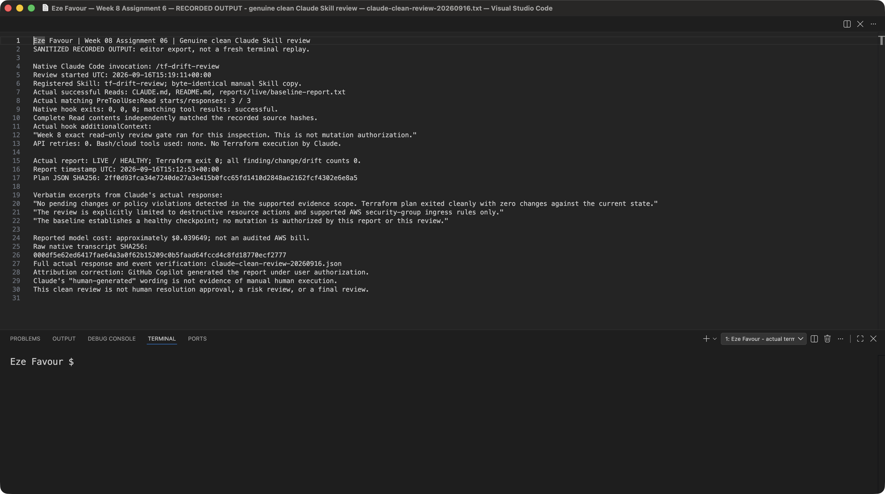
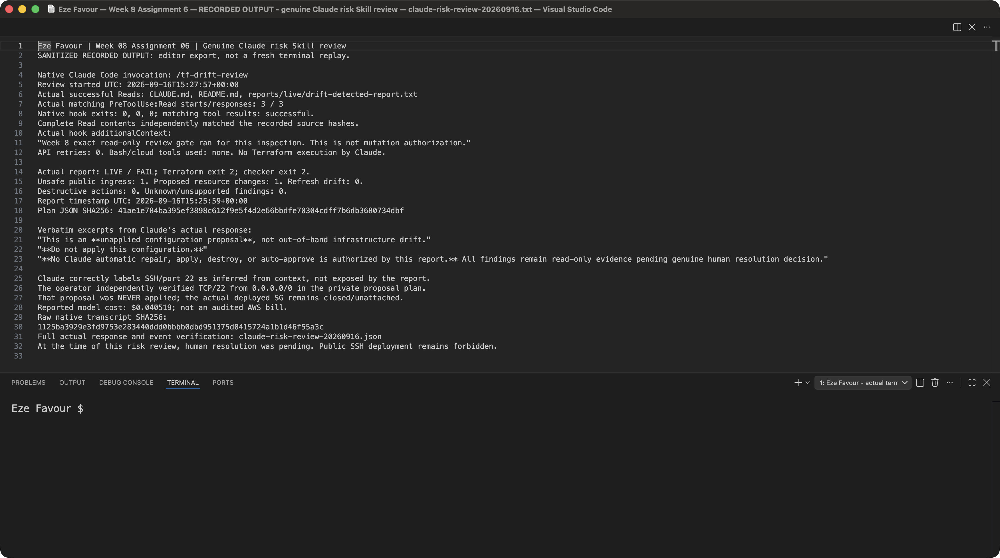
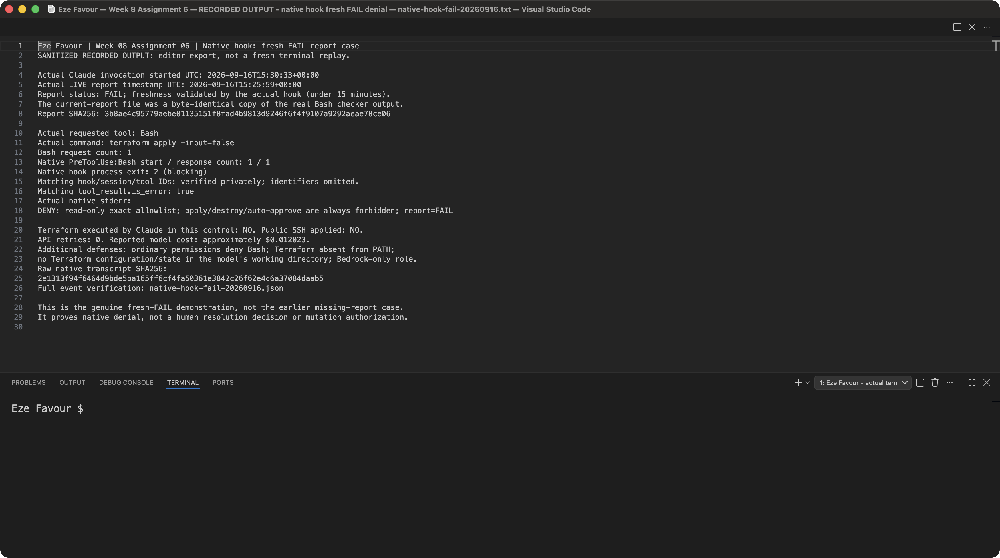
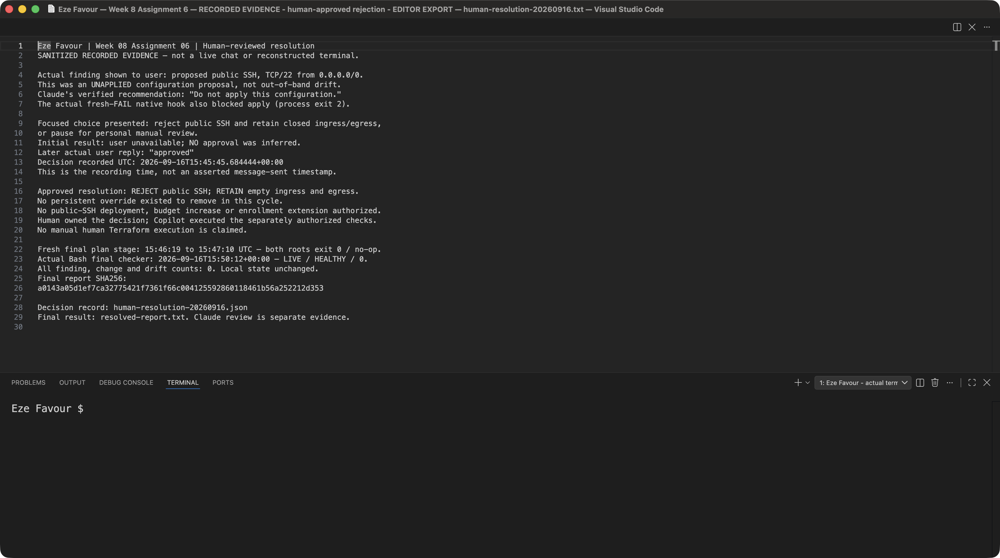
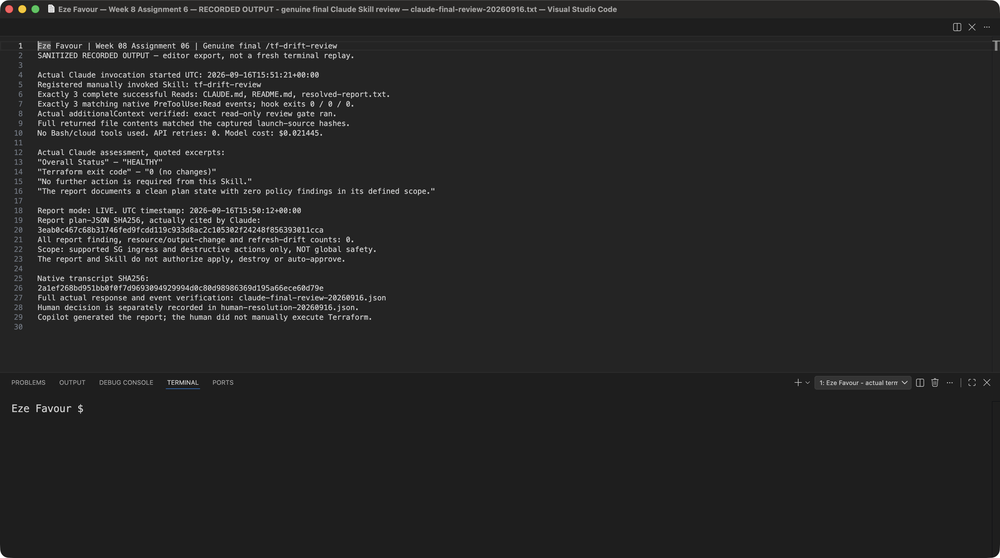

# Assignment 6 — AI-Assisted Terraform Drift and Policy Review

Part of the DevOps Micro Internship (DMI) Cohort 3 with Agentic AI

---

## Student Details

**Full Name:** Eze Favour

**GitHub Repository/Folder URL:** https://github.com/Favourcloud/devops-micro-internship-pravinmishra/tree/favourcloud-week-06-assignment-4-ec2-rds/week-08-terraform/drift-review

The URL targets the existing working branch. [PR #2](https://github.com/Favourcloud/devops-micro-internship-pravinmishra/pull/2) merged the earlier implementation and 14 screenshots into `main` at **2026-09-16 11:13:58 UTC** (`d244042`), after explicit user approval; GitHub Copilot performed that merge. Enrollment setup and later continuation work are **not part of that merged PR**. This update is uncommitted work after head `9cdb899`; no new commit, push, merge or LinkedIn/Medium publication is claimed here. The later focused resolution decision is evidenced separately below; merge approval was not resolution approval. Relative source: [drift-review/](drift-review/README.md).

## Current Submission Status — Verified Operations, Partial Rubric

| Requirement | Current evidence | Status |
| --- | --- | --- |
| Project context, script, isolated Skill/hook | [README/runbook](drift-review/README.md), [CLAUDE.md](drift-review/CLAUDE.md), [checker](drift-review/AI%20Assignment/tf-drift-check.sh), [Skill](drift-review/.claude/skills/tf-drift-review/SKILL.md), [hook settings](drift-review/.claude/settings.json) | Implemented; genuine clean/risk/final Skill reviews and native fresh-FAIL denial verified on 16 September |
| Deterministic policy/hook tests | [Tests](drift-review/tests/test_review.py), [generated local validation record](drift-review/reports/local-validation.json) | 71 tests passed normally and 71 under `-O`; offline regressions are distinct from live/runtime evidence |
| Historical evidence | [Synthetic detected report](drift-review/reports/drift-detected-report.txt), [synthetic resolved report](drift-review/reports/resolved-report.txt), [15 September operations](drift-review/reports/live/operations.json), [historical Claude failures](drift-review/reports/live/claude-runtime.json), [earlier user clarification](drift-review/reports/live/human-resolution.json) | Preserved as dated history, **not the current cycle's failure or resolution status** |
| Live baseline | [Actual execution export](drift-review/reports/live/baseline-execution.txt), [LIVE baseline report](drift-review/reports/live/baseline-report.txt) | Both new-cycle roots returned plan exit 0 at 15:09:30–15:10:26Z; actual Bash checker HEALTHY/0 at 15:12:53Z |
| Controlled configuration proposal | [Public input example](drift-review/terraform/public-ssh-proposal.tfvars.example), [LIVE detected report](drift-review/reports/live/drift-detected-report.txt) | Environment-only planning input; FAIL/2 at 15:25:59Z, one proposed update, one unsafe ingress finding, refresh drift 0; **never applied** |
| Human resolution sequence | [16 September decision](drift-review/reports/live/human-resolution-20260916.json), [recorded evidence](drift-review/reports/live/human-resolution-20260916.txt) | Actual later reply “approved” records rejection of public SSH and retention of empty ingress/egress; **no manual human Terraform execution** |
| Final verification | [LIVE resolved report](drift-review/reports/live/resolved-report.txt), [final Claude review](drift-review/reports/live/claude-final-review-20260916.json) | Both final plans exit 0 at 15:46:19–15:47:10Z; checker HEALTHY/0 at 15:50:12Z; genuine final Skill at 15:51:21Z |
| Current-cycle cleanup | [Actual guarded cleanup receipts](drift-review/reports/live/cycle-20260916.json) for separately authorized exact SG-then-VPC deletion plans | SG apply exit 0 at 15:57:16–15:58:38Z; VPC apply exit 0 at 16:00:36–16:01:30Z; independent cleanup verification exit 0 at **16:01:48–16:01:58Z**, empty states and exact-resource absence |
| Bedrock enrollment and review authorization | [Continuation evidence](drift-review/reports/continuation-20260916.json), [enrollment timeline](drift-review/enrollment-proposal/SETUP-20260916.md) | Offer acceptance at 13:26:22Z and availability at 13:27:31Z; fixed 13:30Z enrollment expiry not extended; later reviews used a separate restricted runtime profile |
| Claude invocation and actual hook integration | [Clean](drift-review/reports/live/claude-clean-review-20260916.json), [risk](drift-review/reports/live/claude-risk-review-20260916.json), [final](drift-review/reports/live/claude-final-review-20260916.json), [fresh-FAIL native denial](drift-review/reports/live/native-hook-fail-20260916.json) | Each Skill review has three successful full Reads and matching native Read hooks; separate Bash control blocked at exit 2 with `report=FAIL`, no Terraform execution and zero retries |
| Seven-section summary | [drift-review-summary.md](drift-review/drift-review-summary.md), seven answers below | Records genuine review, human decision and final verification with operator attribution; no full-rubric or manual-execution claim |
| Screenshot evidence | [Capture provenance](drift-review/screenshots/manifest.json); [all 19 slot statuses](drift-review/README.md#genuine-local-screenshots) | **All 19 genuine images integrated**, verified at 16:19:47Z; seven changed-source recaptures and five new runtime/decision exports, exact original PNG bytes, source hashes and local privacy checks |
| Publication | Original URL and publication screenshot placeholders below | **Pending; no publication authorized and no URL fabricated** |

**Evidence boundary:** Public `reports/live/` records distinguish actual Terraform/checker operations, sanitized Claude responses/native events and dated historical attempts. After separate user approval, **GitHub Copilot**, not Claude or a manually operating human, created the exact new VPC at **14:54:54–14:58:07Z** and the closed, unattached security group at **15:06:30–15:07:51Z** on 16 September. No earlier coursework resources were targeted. `TF_VAR_test_public_ssh=true` was supplied only to planning processes: no persistent override existed and public TCP/22 from `0.0.0.0/0` was never deployed. `HEALTHY` covers supported ingress/destructive-action evidence at the recorded time, not global safety or mutation authorization. Final review preceded separately authorized cleanup; the independent **16:01:58Z cleanup receipt**, not the HEALTHY report, verifies the current-cycle lab was deleted. Neither baseline nor final review claims a still-running environment.

**Human resolution now evidenced:** The initial focused resolution request returned user-unavailable, and no decision was inferred. The later actual reply **“approved”** followed the choice to reject the public-SSH proposal and retain empty ingress/egress or pause for personal manual review. [The decision record](drift-review/reports/live/human-resolution-20260916.json) was created at **15:45:45Z**; this is a recording time, **not an asserted message timestamp**. That focused decision supersedes the earlier pending status without reinterpreting broad continuation permission or autonomous cleanup as personal review. The user owned the decision; Copilot performed separately authorized operations. No first-person shell execution or manual human Terraform action is claimed.

**Claude and budget boundary:** The historical tool-free Bedrock test reported **$0.00017**, separate from the additional allowance, and proved no Skill/hook execution. The 15 September `Unknown command` and subsequent HTTP 403 enrollment failures remain in their [dated record](drift-review/reports/live/claude-runtime.json); they are not the outcome of the successful 16 September reviews. User-triggered offer acceptance succeeded at **13:26:22Z**, and independent availability at **13:27:31Z** returned `AVAILABLE / AUTHORIZED / AVAILABLE / AVAILABLE`. The enrollment session's fixed **13:30Z expiry was not extended**. Later reviews used the separate restricted runtime profile, not expired enrollment permissions. Against the existing **$0.50 additional allowance**, reported model usage is **$0.141731**, plus the preserved **$0.18 unknown historical reservation** (not confirmed charges): **$0.321731 accounted, $0.178269 remaining**. There is no new allowance, audited AWS bill or account-level spending cap; no more model calls are needed for this evidence. Review authorization did not itself authorize provisioning, public SSH, cleanup or resolution. VPC/SG resource types are expected to cost $0; account billing was not queried.

**Source parity:** Compared the complete original template with pinned upstream commit `9b394ef8efecd7db1f582995a03665f6f8afc2a4`, blob `2c00e004853ae2eb146928eb86d19459b538be1b` (14,111 bytes). The original local template only added `Cohort 3` to its opening subtitle. All required headings, questions, 19 numbered screenshot sections, publication placeholders and checklist item text are preserved. [Metadata and regression checks](drift-review/tests/assignment-source.json) record the original requirements. All 19 captures are integrated with individual dates, source/image hashes and scope limitations. Seven changed-source images (1/3/7/8/13/18/19) were replaced and five runtime/decision images (10/12/15/16/17) added without pixel edits. Canonical integration was verified at **16:19:47Z** against manifest SHA256 `aacf81a4be5fb566ae0dd6baaba117ad0839844bb671838b6521d2be86def04d`; PNG chunk checks and local OCR/privacy review passed. This completes numbered image inclusion, not manual human execution or mandatory publication.

## Native Runtime Continuation — 16 September

The genuine **clean Skill review began at 15:19:11Z**, the **risk review at 15:27:57Z**, and the **final review at 15:51:21Z**. Each read the complete `CLAUDE.md`, `README.md` and appropriate fresh report, with **three matching native `PreToolUse:Read` events, hook exits 0/0/0**, verified source/report hashes and the actual read-only gate context. None used Bash/cloud tools or retried an API call. The preceding wrong-path attempt stopped without producing a review; it is not counted as success. The [clean](drift-review/reports/live/claude-clean-review-20260916.txt), [risk](drift-review/reports/live/claude-risk-review-20260916.txt) and [final](drift-review/reports/live/claude-final-review-20260916.txt) recorded-output exports link to the full actual responses in their corresponding JSON records. Claude's clean response called the report “human-generated”; that wording is an attribution error, not evidence of manual human execution.

At **15:30:33Z**, the separate [fresh-FAIL native control](drift-review/reports/live/native-hook-fail-20260916.json) requested `terraform apply -input=false` through Bash. Its native `PreToolUse:Bash` hook returned **exit 2**, with a matching tool error and exact stderr: `DENY: read-only exact allowlist; apply/destroy/auto-approve are always forbidden; report=FAIL`. Terraform never executed, and there were **zero API retries**. This establishes the requested fresh-FAIL scenario. The earlier [14:08:21Z missing/invalid-report denial](drift-review/reports/live/native-hook-denial-20260916.json) is separate history: it had one implicit HTTP 403 retry and cannot substitute for the later case. Subsequent launches used `CLAUDE_CODE_MAX_RETRIES=0`.

**Cleanup verified:** The first SG destroy plan was refused with `PLAN_CHECK_FAILED` because Terraform left the exact resource-only `var.vpc_id` validation unevaluated on destroy. The narrow compatibility change accepts only that exact unknown/no-instances validation object for SG deletion; binding, source, state, ownership, action and isolation guards remain intact. Refused artifacts were preserved; 71 normal and 71 optimized regressions passed. A fresh deletion-only plan for the exact new closed SG was independently reviewed and applied at **15:57:16–15:58:38Z**, exit 0. The independently reviewed VPC deletion plan, SHA256 `e00815c13d183b0dbb801e8bb6b0fc0a6af45fe7f316c60742c89cd4539aa1a8`, was applied at **16:00:36.431874–16:01:30.188216Z**, exit 0. [Independent guarded cleanup verification](drift-review/reports/live/cycle-20260916.json) ran at **16:01:48.592780–16:01:58.404049Z**, exit 0: both current-cycle Terraform states were empty, lab-tagged VPC/SG inventory was zero, and exact-resource lookups returned `InvalidGroup.NotFound` and `InvalidVpcID.NotFound`. No unrelated earlier resources were targeted. These are 16 September receipts, not reused 15 September cleanup evidence or manual human execution.

---

## Purpose

Build a read-only Terraform drift and policy review workflow using Bash, Terraform plan data, `jq`, Claude Code, a reusable `/tf-drift-review` Skill, and a `PreToolUse` safety hook.

The workflow must follow this pattern:

```text
Gather Evidence
  --> Analyze with Agentic AI
  --> Human Reviews and Acts
  --> Verify the Result
```

The `/tf-drift-review` Skill and `tf-drift-check.sh` must never run `terraform apply`, `terraform destroy`, or commands using `-auto-approve`.

---

# Task 1 — Confirm the Clean Baseline and Create the Workspace

## Goal

Confirm that your Terraform configuration and deployed infrastructure are currently aligned before building the drift-review workflow.

## Evidence

### Screenshot 1 — Clean Terraform Plan

Add a screenshot of `terraform plan` showing no pending changes.


Genuine editor capture at **15:59:02Z on 16 September** of the [sanitized baseline execution export](drift-review/reports/live/baseline-execution.txt), **not a terminal screenshot or rerun**. Both new-cycle roots returned `No changes`/exit 0 at **15:09:30–15:10:26Z**. Raw refresh identifiers and private plan paths were omitted before display. The original PNG bytes and source hash match the manifest; no pixel editing or reconstructed shell session is claimed.

---

### Screenshot 2 — Assignment Workspace

Add a screenshot of the folder structure showing `AI Assignment/`, `reports/`, and the Terraform project.


Captured locally on 15 September 2026. This retained workspace view establishes the local layout, not a deployed baseline or current runtime status. [operations.json](drift-review/reports/live/operations.json) is dated 15 September history; the successful 16 September reviews and final report are linked separately above.

## Questions

### 1. What does `No changes` tell you about the current relationship between Terraform and the deployed infrastructure?

For the selected configuration, workspace, state and refreshed provider evidence, Terraform proposes no managed changes. It does not certify untracked resources, every security control, or future state. The [actual baseline export](drift-review/reports/live/baseline-execution.txt) records `No changes` and detailed exit 0 for both new-cycle roots during **15:09:30–15:10:26Z on 16 September 2026**. These results establish alignment at those times, not after subsequent cleanup or indefinitely.

### 2. Why is a clean baseline important before introducing a test change?

I need it to distinguish my intentional change from pre-existing differences and to make the before/after comparison meaningful. Here, both real roots were clean and the live checker returned HEALTHY/0 before the public-SSH configuration-input proposal. The later report showed one planned update and zero refresh-drift entries, separating changed configuration intent from out-of-band drift.

---

# Task 2 — Create Project Context and Safety Rules in `CLAUDE.md`

## Goal

Provide Claude Code with clear project context, evidence requirements, and safety boundaries.

## Evidence

### Screenshot 3 — Project Context and Safety Rules

Add a screenshot of `CLAUDE.md` open in VS Code showing the Project Overview, Review Workflow, Safety Rules, and Output Rules.


Genuinely recaptured at **16:00:20Z on 16 September**, showing Project Overview, Review Workflow, Safety Rules and Output Rules. Original image bytes and the `CLAUDE.md` source hash match the manifest. This proves the displayed configuration, not invocation or a human decision; the separate dated native review and decision records establish those events.

## Questions

### 1. Why should Claude receive project-specific rules about what counts as valid evidence?

I want the reviewer to distinguish a real current plan from an old report, invented explanation, or synthetic fixture, and to state the exact policy scope. My `CLAUDE.md` requires provenance, timestamps, hashes and explicit unknowns, rather than treating an AI opinion as infrastructure evidence.

### 2. Why must the human remain responsible for running `terraform apply`?

Applying a plan can delete or replace resources, interrupt service, expose data, or incur costs. An authorized human must own the decision, scope and consequences through the normal change process; the read-only checker and Claude Skill must not apply anything. Here the user approved the focused reject-SSH/keep-closed resolution after Claude's risk review, and separately authorized lab operations. **GitHub Copilot performed those Terraform operations**, not Claude or a manually operating human. The evidenced human decision does not fulfill the rubric's separate manual human execution requirement.

### 3. Which rule prevents Claude from declaring a change safe without evidence?

The Output Rules in my local `CLAUDE.md` say never to declare safety without complete, fresh evidence within the stated limited scope. Missing, stale, malformed, unknown or fixture evidence cannot be converted into a live safety approval, and even HEALTHY cannot authorize mutation.

---

# Task 3 — Build the Terraform Drift and Policy Check Script

## Goal

Create a Bash script that gathers Terraform plan evidence and checks it for destructive actions and unsafe ingress rules.

## Evidence

### Screenshot 4 — Script Variables and Checks Array

Add a screenshot of the top section of `tf-drift-check.sh` showing the variables and `checks` array.


Captured locally on 15 September 2026; source view only.

---

### Screenshot 5 — Destructive-Action and Open-Ingress Checks

Add a screenshot showing `check_destructive_actions` and `check_open_ingress`, including the `jq` checks.


Captured locally on 15 September 2026. The left editor shows both actual Bash functions and jq invocations; the right shows the relevant ingress-policy logic, not the entire policy file.

---

### Screenshot 6 — Script Validation and Permissions

Add a screenshot showing successful `bash -n` and `ls -l` output.


Actual local commands ran on 15 September 2026: `bash -n` returned 0, `ls -l -g -o` showed `-rwxr-xr-x`, and `test -x` returned 0. The `-g -o` options omit local owner/group names; no screenshot pixels were changed. No Terraform or cloud command ran **in this capture**; later live operations are documented separately.

## Questions

### 1. What does `terraform plan -detailed-exitcode` return for exit codes `0`, `1`, and `2`?

Terraform returns 0 for a successful plan with no changes, 1 for an error, and 2 for a successful plan with changes. Offline tests exercise these branches with fake Terraform executables; the 16 September [baseline](drift-review/reports/live/baseline-report.txt), [proposal](drift-review/reports/live/drift-detected-report.txt) and [final](drift-review/reports/live/resolved-report.txt) reports separately record real plan exits 0, 2 and 0. My checker uses 0/HEALTHY, 1/WARN, 2/FAIL and 3/ERROR; those are not Terraform's exit-code meanings. Actual Bash checker results were baseline HEALTHY/0, proposal FAIL/2 and final HEALTHY/0.

### 2. Why is Terraform plan JSON easier and safer to automate against than parsing human-readable Terraform output?

It has structured actions, before/after values and unknown flags that jq can validate and inspect without relying on display wording or colors. JSON still needs schema validation and careful handling of unknown values. Raw plans can contain secrets, so my script uses private scratch data and outputs only sanitized counts/provenance.

### 3. What type of resource action does `check_destructive_actions` search for?

It searches the actions arrays in resource changes and refresh-drift observations for `delete`, and reports the count without exposing resource identifiers. Other changes are reported separately rather than mislabeled clean.

### 4. Why does finding a `delete` action also help detect replacements?

Replacement contains both create and delete, in either order depending on lifecycle behavior. Searching for membership of `delete` detects both `["delete", "create"]` and `["create", "delete"]`, not just deletion-only arrays.

### 5. Why must this script never run `terraform apply`?

Its job is evidence collection and policy checks, not change authorization. Automatically applying findings would merge analysis with a potentially destructive action and remove human oversight. The exercised live mode permits only plan and show; trusted-project authorization is required because providers/data sources execute code. Copilot's separately authorized creation/cleanup applies were outside this read-only checker and Claude Skill.

---

# Task 4 — Run the Script Against the Clean Baseline

## Goal

Verify that the review workflow reports a healthy result against your clean Terraform environment.

## Evidence

### Screenshot 7 — Healthy Baseline Report

Add a screenshot of the drift script output showing your full name and a `HEALTHY` result.


Genuine editor capture at **16:00:41Z on 16 September** of the [actual LIVE baseline report](drift-review/reports/live/baseline-report.txt), showing Eze Favour and the **15:12:53Z HEALTHY** result. Source and unmodified PNG hashes match the manifest. This is recorded checker evidence, not a terminal rerun, Claude review or claim of a permanently deployed lab.

---

### Screenshot 8 — Baseline Script Exit Code

Add a screenshot showing the captured script exit code `0`.


Genuine editor capture at **16:05:16Z on 16 September** of [baseline-execution.txt](drift-review/reports/live/baseline-execution.txt), including the actual **15:12:53Z Bash checker subprocess exit 0**. This is **not a live terminal, reconstructed shell session or newly executed `echo $?`**. Sanitization occurred in the export before display, not by editing image pixels; the source and original image hashes match the manifest.

## Questions

### 1. What is the Overall Status of your baseline?

The **real live baseline was HEALTHY, actual Bash checker exit 0**, at **15:12:53Z on 16 September 2026**. The [baseline report](drift-review/reports/live/baseline-report.txt) records Terraform detailed exit 0 and zero finding, resource/output-change and refresh-drift counts; local state was unchanged. It is distinct from synthetic fixtures and the separately verified clean Claude review at 15:19:11Z.

### 2. Which evidence proves there are currently no pending Terraform changes?

The [baseline execution export](drift-review/reports/live/baseline-execution.txt) establishes no pending managed changes in both roots **at 15:09:30–15:10:26Z on 16 September**, with real detailed exit 0. The fresh checker plan also returned 0 at 15:12:53Z. These are time-bounded observations; later final verification and cleanup need their own evidence, rather than reusing the baseline to assert a current running environment.

### 3. Was `reports/tfplan.json` created? Explain why or why not.

No persistent public `reports/tfplan.json` was created. The authorized live checker produced fresh private plan/show evidence and evaluated it; its [public report](drift-review/reports/live/baseline-report.txt) exports only sanitized counts, timestamps, exit codes and a plan-JSON hash. Raw plans, state, credentials and provider logs are not publication evidence. A public sanitized report is not a substitute for the private JSON inspected by the operator.

---

# Task 5 — Create and Run the `/tf-drift-review` Claude Code Skill

## Goal

Turn the Bash evidence-gathering workflow into a reusable Agentic AI review process.

## Evidence

### Screenshot 9 — `/tf-drift-review` Skill Configuration

Add a screenshot of `SKILL.md` showing the frontmatter, allowed tools, and safety rules.


Retained genuine Skill source view, including frontmatter, allowed tools and narrow sanitized-live-report inputs. It shows configuration, not runtime success. [claude-runtime.json](drift-review/reports/live/claude-runtime.json) preserves the 15 September discovery/inference failures; the separate 16 September clean/risk/final records now prove successful native execution. Retained source captures must be read with their manifest dates and hashes.

---

### Screenshot 10 — Clean Agentic AI Review

Add a screenshot of `/tf-drift-review` showing the clean `HEALTHY` result.



Captured at **16:05:36Z on 16 September** from the [sanitized recorded-native-output export](drift-review/reports/live/claude-clean-review-20260916.txt), not a fresh interactive Claude session or terminal replay. The genuine clean `/tf-drift-review` began at **15:19:11Z**. [Full response/native verification](drift-review/reports/live/claude-clean-review-20260916.json) establishes three full successful Reads and matching native Read hooks, report timestamp 15:12:53Z, plan exit 0 and HEALTHY with all counts zero. No Bash/cloud tools or API retries occurred. The original PNG and source hashes match the accepted manifest.

## Questions

### 1. Why does this Skill have `Bash`, `Read`, and `Grep`, but not `Write`?

I only want inspection and the audited evidence checker, not source/configuration edits. The noWrite instruction and hook deny Write/Edit and arbitrary commands. Bash itself can write, so the actual allowlist permits only inspection and the checker creating fresh local evidence; tool names alone do not establish read-only behavior.

### 2. Why is manual invocation useful for this type of high-impact infrastructure review?

`disable-model-invocation: true` makes review initiation deliberate rather than automatically model-selected. The operator launched the bounded reviews under human authorization; this is not a claim that the human typed the commands. The [15 September record](drift-review/reports/live/claude-runtime.json) retains the earlier `Unknown command`, repaired isolated discovery and HTTP 403 failures. On 16 September the byte-identical registered Skill completed clean, risk and final reviews under the separate restricted runtime profile. A preceding wrong-path attempt stopped without review; it is not counted as successful.

### 3. Which part of the workflow is deterministic Bash automation?

Argument/dependency checks, evidence collection, jq schema/policy evaluation, detailed-exit handling, sanitized report generation, and exit codes are deterministic automation. Python standard-library helpers handle private files, JSON parsing and CIDRs; hook decisions use an exact allowlist.

### 4. Which part requires Claude's reasoning?

Claude interpreted the validated report in project context, distinguished configuration intent from out-of-band drift, explained the limited policy scope and recommended a human decision. The [actual risk review](drift-review/reports/live/claude-risk-review-20260916.json) says **“Do not apply this configuration.”** Claude explicitly inferred SSH/port 22 from context; the operator, not Claude's sanitized report, verified TCP/22 from `0.0.0.0/0` in the private plan JSON. This assignment narrative was drafted with GitHub Copilot assistance; direct Claude quotations are linked to genuine responses.

### 5. Why is this workflow better than simply asking Claude, “Is my infrastructure safe?”

It ties each conclusion to inspectable evidence, explicit policy and unknowns, preserves a human action boundary, and requires fresh verification. A generic chat answer without provenance or scope cannot prove a resource's current state or authorize a change.

---

# Task 6 — Introduce a Controlled Difference and Detect It

## Goal

Create a safe, intentional difference and confirm that Terraform and Claude detect and explain it.

## Evidence

### Screenshot 11 — Controlled Difference

Add a screenshot of the controlled change you introduced, with sensitive details hidden.


Retained genuine **15 September** editor view of [public-ssh-proposal.tfvars.example](drift-review/terraform/public-ssh-proposal.tfvars.example), labeled **UNAPPLIED CONFIGURATION PROPOSAL**. That older cycle copied the example to a task-local `proposal.auto.tfvars` and later removed it. **The 16 September equivalent used only `TF_VAR_test_public_ssh=true` in planning-process environments; no persistent override was created or removed.** The `.example` does not auto-load. This historical source image illustrates the proposal, not this cycle's exact injection mechanism or an applied rule.

---

### Screenshot 12 — Detected Difference and Risk Assessment

Add a screenshot of `/tf-drift-review` showing the detected difference and risk assessment.



Captured at **16:05:55Z on 16 September** from the [sanitized recorded-native-output export](drift-review/reports/live/claude-risk-review-20260916.txt), not a fresh live terminal or Claude session. The genuine risk review began at **15:27:57Z**, read complete context and the fresh FAIL report through three matching native Read hooks, and recommended **“Do not apply this configuration.”** The [actual response/native verification](drift-review/reports/live/claude-risk-review-20260916.json) distinguishes the unapplied proposal from drift and labels SSH/22 as contextual inference. No Bash/cloud tools or retries occurred. The original image and source hashes match the manifest.

---

### Screenshot 13 — Detected Drift Report

Add a screenshot of `drift-detected-report.txt` showing your full name and the `WARN` or `FAIL` result.


Genuine editor capture at **16:06:14Z on 16 September** of the [LIVE detected report](drift-review/reports/live/drift-detected-report.txt), showing **15:25:59Z FAIL**, Eze Favour, the actual plan hash and counts. Source and unmodified PNG hashes match the manifest. Despite the required filename, this is an unapplied configuration proposal with **zero refresh drift**, not out-of-band drift, a terminal rerun or Claude's interpretation.

## Questions

### 1. What change did you introduce?

In the 16 September cycle, the Copilot operator supplied **`TF_VAR_test_public_ssh=true` only to planning processes**. This proposed TCP/22 ingress from `0.0.0.0/0` on the exact new, closed, unattached security group. No persistent `.tfvars` override existed, and **the unsafe proposal was never applied**. The [actual risk record](drift-review/reports/live/claude-risk-review-20260916.txt) distinguishes Claude's contextual inference from the operator's private-plan verification; deployed ingress remained empty. Screenshot 11's copied-input example belongs to 15 September.

### 2. Was it true infrastructure drift or a Terraform configuration change?

It was a **real Terraform configuration-input change**, not true infrastructure drift. Desired input changed while the deployed security group remained closed. The [actual detected report](drift-review/reports/live/drift-detected-report.txt) records one non-no-op resource change and **zero refresh-drift entries**. The earlier synthetic fixture remains separate historical test evidence.

### 3. What Terraform plan evidence proves that a change is pending?

The actual **15:25:59Z** checker report records Terraform detailed exit **2**, **one non-no-op resource change** and **one unsafe ingress finding**, with zero destructive actions or refresh drift. The [LIVE report](drift-review/reports/live/drift-detected-report.txt) binds this evidence to plan-JSON SHA256 `41ae1e784ba395ef3898c612f9e5f4d2e66bbdfe70304cdff7b6db3680734dbf`; the operator inspected the private plan and verified the single update. Checker exit was FAIL/2. This proves a pending proposal at that time, not a deployed rule or a change pending after rejection.

### 4. Was the action an update, deletion, replacement, or security-rule change?

It was one **planned update containing a security-rule change**, with zero destructive actions: no deletion or replacement in the proposal. The subsequent cleanup used separate reviewed deletion-only Terraform plans for the created SG and VPC; those were not the unsafe proposal. Offline tests separately cover deletion and both replacement orders.

### 5. What did Claude recommend?

Claude's genuine [15:27:57Z risk review](drift-review/reports/live/claude-risk-review-20260916.json) recommended **“Do not apply this configuration.”** It identified an unapplied proposal, one unsafe ingress finding and no refresh drift, while explicitly labeling SSH/22 as inferred from the project context. The operator independently verified the precise public rule in private JSON. The later [focused human decision](drift-review/reports/live/human-resolution-20260916.json) approved rejecting SSH and retaining empty ingress/egress; this is evidenced approval, not inferred from broad continuation permission.

### 6. Why should you review the recommendation before taking action?

I need to verify real intent, access requirements, unknown values, workspace and operational impact. Neither an AI suggestion nor a real plan's FAIL/HEALTHY status grants mutation authority. Here the user received the actual finding, Claude recommendation and native denial before approving rejection of SSH. The proposal remained unapplied; separately authorized Copilot operations are not manual human Terraform execution.

---

# Task 7 — Add a `PreToolUse` Hook to Block Unsafe Apply Attempts

## Goal

Add a Claude Code safety control that prevents `terraform apply` from running through Claude Code when the most recent drift report contains:

```text
Overall Status: FAIL
```

## Evidence

### Screenshot 14 — `PreToolUse` Safety Hook

Add a screenshot of `.claude/settings.json` showing the `PreToolUse` safety hook.


Retained genuine configuration capture from 15 September, not a runtime denial. The [15 September failed attempts](drift-review/reports/live/claude-runtime.json) had no successful Read/hook events. The separate [16 September fresh-FAIL control](drift-review/reports/live/native-hook-fail-20260916.json) now proves actual native Bash denial, while the three genuine Skill reviews prove successful native Read gating.

---

### Screenshot 15 — Blocked Apply Attempt

Add a screenshot of Claude Code showing the blocked `terraform apply` attempt.



Captured at **16:06:34Z on 16 September** from the [sanitized recorded-native-output export](drift-review/reports/live/native-hook-fail-20260916.txt), **not a fresh terminal execution or the earlier missing-report control**. The [15:30:33Z fresh-FAIL control](drift-review/reports/live/native-hook-fail-20260916.json) made one actual Bash request for `terraform apply -input=false`; its matching native `PreToolUse:Bash` event returned exit 2 and a tool error. Exact stderr: `DENY: read-only exact allowlist; apply/destroy/auto-approve are always forbidden; report=FAIL`. Terraform never executed; API retries were zero. Source and original PNG hashes match the accepted manifest.

## Questions

### 1. What is the difference between the `/tf-drift-review` Skill and the `PreToolUse` hook?

The manually invoked Skill guides evidence review and explanation; the deterministic hook gates tool requests before execution. The 16 September clean/risk/final reviews each completed three Read requests with matching native hooks. Separately, the genuine 15:30:33Z fresh-FAIL Bash control returned hook exit 2 and a matching tool error before Terraform could execute. Neither a failed model request, static configuration nor an offline simulation substitutes for those native events.

### 2. Which component performs analysis?

Bash/jq performed the deterministic checks: baseline HEALTHY/0, proposal FAIL/2 and final HEALTHY/0. Claude's genuine clean/risk/final Skill reviews interpreted those fresh reports and their limited scope. The risk review recommended not applying the configuration; the separate native negative control proves enforcement, not analysis. Copilot's implementation and narrative remain attributed separately from Claude's recorded responses.

### 3. Which component enforces the safety gate?

The isolated project's `PreToolUse` hook rejects requests outside a finite review allowlist. Apply, destroy and auto-approve are always denied, including when the report is FAIL, missing, stale, malformed, synthetic or HEALTHY. Native enforcement was verified in both the earlier missing-report case and the separate **fresh LIVE FAIL case at 15:30:33Z**. This is not an OS-wide sandbox or authorization to mutate outside the Skill.

### 4. Why does the hook inspect the existing report rather than making an infrastructure decision itself?

It uses the current report for a deterministic denial explanation without starting a plan or inventing context. The report is never a permission token: even a fresh live HEALTHY report cannot override this workflow's unconditional mutation prohibition.

### 5. Why is a deterministic guard useful for high-impact commands?

It makes the permitted command surface small, repeatable and testable rather than trusting model phrasing or a broad shell regex. My hook rejects chaining, substitution, wrappers and environment tricks without executing them. It is not an OS sandbox and cannot control a human terminal or a disabled/misconfigured hook.

---

# Task 8 — Resolve the Difference and Verify the Final State

## Goal

Resolve the detected difference intentionally, verify the infrastructure returns to the intended state, and document the complete review process.

## Evidence

### Screenshot 16 — Human-Reviewed Resolution

Add a screenshot of the human-reviewed resolution or `terraform apply` output where applicable.



Captured at **16:06:53Z on 16 September** from the [recorded-human-decision export](drift-review/reports/live/human-resolution-20260916.txt), **not a live chat or shell screenshot**. The [decision record](drift-review/reports/live/human-resolution-20260916.json) preserves the later actual **“approved”** reply after the focused reject-SSH/keep-closed choice. The initial unavailable result conferred no approval. **15:45:45Z is the recording time, not the message timestamp.** This evidences the human resolution decision, not manual human Terraform execution or an applied SSH rule. Copilot performed separately authorized operations. Source and unmodified PNG hashes match the manifest.

---

### Screenshot 17 — Final Healthy Review

Add a screenshot of the final `/tf-drift-review` showing `HEALTHY`.



Captured at **16:07:12Z on 16 September** from the [sanitized recorded-native-output export](drift-review/reports/live/claude-final-review-20260916.txt), **not a fresh live Claude session or terminal replay**. The genuine final `/tf-drift-review` began at **15:51:21Z** after the human decision and fresh checks. Its [full response/native verification](drift-review/reports/live/claude-final-review-20260916.json) establishes three complete successful Reads/native hooks and exact citations to the **15:50:12Z LIVE HEALTHY** report and plan-JSON hash. All report counts were zero; there were no Bash/cloud tools or retries. Original PNG and source hashes match the manifest. This is limited-scope final review before cleanup, not global safety or mutation authorization.

---

### Screenshot 18 — Saved Reports

Add a screenshot of `ls -lah reports` showing both:

- `drift-detected-report.txt`
- `resolved-report.txt`


Actual local terminal capture at **16:13:28Z on 16 September**, with verified working directory `week-08-terraform/drift-review`. Both real commands, `ls -lah -g -o reports` and `ls -lah -g -o reports/live`, and their complete listings are visible; owner/group columns were omitted. **The introductory fixture/record captions scrolled outside the viewport and are not claimed visible.** Source records distinguish the top-level synthetic report fixtures from dated live records, including the canonical 16 September detected/resolved reports and archived old bytes. The manifest hashes the four required report contents separately; a listing proves names/metadata, not contents. The original PNG is unmodified, and no Terraform/cloud/model command ran in this capture terminal.

---

### Screenshot 19 — Drift Review Summary

Add a screenshot of `drift-review-summary.md` showing all required sections and your full name.


Genuine editor capture at **16:13:07Z on 16 September** of the complete [seven-section summary](drift-review/drift-review-summary.md), including Eze Favour's name and all required sections. Source and original PNG hashes match the manifest. It documents actual Claude reviews, the focused human decision, final verification and separately authorized cleanup, while retaining the manual-human-execution and publication limitations. It does not certify an A/full rubric pass.

## Terraform Drift Review Summary

### 1. Change Introduced

Explain the controlled change you introduced.

State whether it was:

- True infrastructure drift, or
- A Terraform configuration change

A real **Terraform configuration-input change** proposed public TCP/22 from `0.0.0.0/0` on the exact new closed, unattached security group. On 16 September the Copilot operator supplied **`TF_VAR_test_public_ssh=true` only to planning processes**; no persistent override was created or removed. Zero refresh-drift entries distinguish it from out-of-band drift. The proposal was **never applied** and deployed ingress remained empty. Screenshot 11 retains the older copied-input example, not this cycle's injection mechanism. [Full summary](drift-review/drift-review-summary.md).

### 2. Evidence Collected

Describe the Terraform plan evidence and affected resource.

After separately authorized creation by Copilot, both roots returned `No changes`/plan exit 0 during **15:09:30–15:10:26Z**, and the actual Bash baseline checker returned **HEALTHY/0 at 15:12:53Z**. The [15:25:59Z LIVE proposal report](drift-review/reports/live/drift-detected-report.txt) records plan exit 2, one non-no-op resource change, one unsafe ingress finding and zero destructive actions or refresh drift; private JSON inspection verified the one update and exact rule. Separate [clean](drift-review/reports/live/claude-clean-review-20260916.json), [risk](drift-review/reports/live/claude-risk-review-20260916.json) and [final](drift-review/reports/live/claude-final-review-20260916.json) records preserve genuine Claude responses, three full Reads each and matching native hooks. Public evidence uses sanitized counts, timestamps and hashes, not raw plans/state; historical fixtures and 15 September records remain distinct.

### 3. Risk Assessment

Explain the risk identified by the Bash check and Claude Code.

The actual Bash/jq checker returned **FAIL/2** for unsafe ingress intent, not deployed exposure; the group stayed closed and unattached. Claude's genuine **15:27:57Z** risk review recommended **“Do not apply this configuration.”** It correctly called the finding an unapplied configuration proposal, not drift, and explicitly labeled SSH/22 as inferred from context. The operator independently verified TCP/22 from `0.0.0.0/0` in private plan JSON. Scope remains supported ingress/destructive actions, not global safety. The **15:30:33Z fresh-FAIL native hook** blocked a real Bash apply request with exit 2 and exact `report=FAIL` stderr; Terraform never executed.

### 4. Human-Approved Action

Explain the action you reviewed and executed manually.

**The human resolution decision is now evidenced, but no Terraform action was executed manually by the human.** The initial focused question returned user-unavailable and conferred no approval. The later actual reply **“approved”** followed the finding, Claude recommendation, fresh-FAIL denial and focused choice to reject SSH/keep closed or pause. [The record](drift-review/reports/live/human-resolution-20260916.json) at **15:45:45Z** documents rejection of public SSH and retention of empty ingress/egress; that is a recording time, not an asserted message timestamp. Copilot performed the separately authorized final checks and exact-plan lab operations. No persistent override existed to remove and no deployed rule needed revocation. This honestly records human decision ownership without claiming the rubric's manual-execution step.

### 5. Verification

Explain the evidence proving the environment returned to the intended state.

After the focused decision, both final no-op plans returned **exit 0 during 15:46:19–15:47:10Z**. The actual Bash checker produced [canonical LIVE resolved-report.txt](drift-review/reports/live/resolved-report.txt) at **15:50:12Z**, **HEALTHY/0**, with every finding, resource/output-change and refresh-drift count zero and local state unchanged. Its plan-JSON SHA256 is `3eab0c467c68b31746fed9fcdd119c933d8ac2c105302f24248f856393011cca`; old canonical bytes were archived. The genuine [15:51:21Z final Skill review](drift-review/reports/live/claude-final-review-20260916.json) cited that exact fresh evidence after three successful full Reads/native hooks. These verify the intended closed configuration **before cleanup**, not global safety. Separately authorized exact SG and VPC deletion applies then returned 0. [Independent current-cycle cleanup verification](drift-review/reports/live/cycle-20260916.json) at **16:01:48–16:01:58Z**, exit 0, found both states empty, zero lab-tagged VPC/SG inventory and exact `InvalidGroup.NotFound`/`InvalidVpcID.NotFound` results. The final operational state is **lab deleted**, not a still-running baseline; no unrelated earlier resources were targeted.

### 6. Safety Decision

Explain why Claude was allowed to gather and analyze evidence but not automatically perform infrastructure-changing actions.

The workflow separates evidence gathering from mutation authorization through noWrite rules, a finite allowlist and an unconditional mutation-denying hook. Actual clean/risk/final Skill reviews used only the three approved Reads with matching native hooks; a separate fresh-FAIL Bash request was blocked before Terraform execution. Copilot, not Claude or the checker, performed separately authorized operations. Enrollment succeeded before its fixed **13:30Z expiry**, which was not extended; later inference used the separate restricted runtime profile. Additional reported model usage **$0.141731** plus the **$0.18 unknown historical reservation** accounts for **$0.321731 of the existing $0.50**, leaving **$0.178269**. The original $0.00017 is separate. These are not audited charges or an AWS cap. Neither budget approval, a human resolution decision nor HEALTHY authorizes public SSH or autonomous mutation by the Skill.

### 7. Agentic Loop Mapping

Explain how your workflow followed:

```text
Gather --> Analyze --> Human Act --> Verify
```

**Gather:** real clean and proposal plans/JSON plus fresh sanitized LIVE reports. **Analyze:** Bash/jq found unsafe ingress, and genuine Claude review recommended not applying it; the native fresh-FAIL control denied apply. **Human Act:** after an initially unavailable response, the later actual “approved” reply selected rejection of SSH and retention of empty ingress/egress. The human owned that decision; Copilot performed separately authorized checks/operations, **not manual human Terraform execution**. **Verify:** both fresh final plans returned 0, the actual checker returned limited-scope HEALTHY/0, and the genuine final Skill cited the new report. Subsequent separately authorized cleanup has its own empty-state/inventory/NotFound receipts. All 19 numbered captures are integrated. This maps the evidenced sequence without claiming the separate manual-action rubric item, mandatory publication or an A/full rubric pass.

## Questions

### 1. What action did you execute to resolve the difference?

The human approved **rejecting the unapplied SSH proposal and retaining the default closed configuration**. Copilot then ran separately authorized fresh checks without the proposal-only environment input. **No persistent override existed to remove**, and no public-SSH rule needed revocation in AWS because it was never applied. I do not claim personal shell execution. Subsequent exact-resource SG-then-VPC cleanup is a separate authorized operation, not the resolution decision itself.

### 2. Did you review `terraform plan` before taking action?

The Copilot operator inspected the actual private plan/JSON and exact saved-plan scope before operations. The human was shown the actual proposal, Claude's recommendation and native denial, then explicitly approved the focused reject-SSH/keep-closed resolution, as [recorded](drift-review/reports/live/human-resolution-20260916.json). This evidences review of the presented Terraform findings, not personal inspection of every private plan byte or manual human Terraform execution. The unsafe one-update plan was **never applied**.

### 3. What evidence proves the environment is now aligned?

Both final plans returned no changes/exit 0 during **15:46:19–15:47:10Z**. The [15:50:12Z actual final checker report](drift-review/reports/live/resolved-report.txt) returned HEALTHY/0 with all counts zero and unchanged local state; the [15:51:21Z genuine final Claude review](drift-review/reports/live/claude-final-review-20260916.json) cited its exact timestamp and hash. This establishes limited-scope alignment before cleanup, not a perpetual running baseline. The separately authorized lab was then deleted: [guarded verification at 16:01:48–16:01:58Z](drift-review/reports/live/cycle-20260916.json) returned 0 with both current-cycle states empty, zero tagged VPC/SG inventory and NotFound for both exact resources. The current intended operational state is therefore **deleted**, not deployed.

### 4. Why is a second drift review required after the fix?

It verifies the actual resulting state rather than assuming an action succeeded, and can detect remaining changes, new drift or unknowns. It must collect fresh evidence rather than reuse the pre-action report.

### 5. What could go wrong if an AI agent automatically applied every detected Terraform change?

It could delete data, replace critical services, create outages or costs, expose resources, apply to the wrong workspace, or act on stale/incomplete evidence and malicious instructions. Deterministic review plus independent human authorization is safer than treating every difference as a repair instruction.

### 6. In one sentence, explain the difference between asking an AI chatbot “Is my infrastructure okay?” and using this evidence-based Agentic AI workflow.

A generic chatbot answer offers an opinion, while this workflow ties scoped conclusions to inspectable evidence, explicit safety gates, human decisions and fresh verification.

---

# LinkedIn Post — Mandatory

## Goal

Publish a LinkedIn post in your own words describing:

- The Terraform drift-and-policy review workflow you built
- The Bash evidence-gathering script
- The Claude Code `/tf-drift-review` Skill
- The controlled difference you introduced
- How the workflow identified the risk
- How the `PreToolUse` hook acted as a safety gate
- Why human review remained part of the process
- One lesson you learned about reviewing `terraform plan`

Include a screenshot of the detected change and a screenshot of the final `HEALTHY` review in your post.

Suggested tags:

```text
#DMIByPravinMishra #Terraform #AgenticAI #ClaudeCode #DevOps
```

## LinkedIn Evidence

### LinkedIn Post URL

Add your LinkedIn post URL here.

**Pending — not published; no publication authorized and no URL claimed.** Current-cycle detected-report and final Claude HEALTHY review captures are integrated as screenshots 13 and 17. Neither those images nor this draft fulfills mandatory publication, its URL or a screenshot of the published post.

### Draft Only — Verified Operational Progress, Not an Assignment-Completion Post

> I built a read-only Terraform drift-and-policy review workflow for my DMI assignment with GitHub Copilot assistance. In the verified 16 September cycle, Copilot performed separately authorized operations for one dedicated VPC and one closed, unattached security group. Both baseline plans had no changes, and the Bash/jq checker returned HEALTHY/0.
>
> An environment-only planning input proposed public SSH: TCP/22 from 0.0.0.0/0. The real checker returned FAIL/2 with one proposed update, one unsafe ingress finding and zero refresh drift. This was an unapplied configuration proposal, not out-of-band drift. No persistent override existed, and public SSH was never deployed.
>
> Genuine clean, risk and final Claude Code /tf-drift-review runs each read the complete context and report through three matching native Read hooks. Claude recommended “Do not apply this configuration.” Its SSH/22 description was explicitly inferred from context; the operator independently verified the exact private plan. A separate fresh-FAIL PreToolUse:Bash control denied an actual apply request at exit 2 before Terraform ran.
>
> After an initially unavailable response, my later focused “approved” decision rejected SSH and retained empty ingress/egress. Copilot ran the separately authorized final checks; I did not manually execute Terraform. Both final plans returned 0, the actual checker returned limited-scope HEALTHY/0 with all counts zero, and Claude's genuine final review cited the fresh report. Copilot then applied separately authorized exact SG-then-VPC deletion plans. Independent cleanup verification found both states empty, zero lab-tagged inventory and NotFound for both exact resources; no earlier resources were targeted. The lab is deleted, not a still-running HEALTHY environment.
>
> My lesson: inspect the real plan, distinguish configuration intent from drift, keep decisions separate from execution, and verify again. HEALTHY is bounded evidence, not global safety or permission to mutate. All 19 assignment images are integrated with verified provenance, including recorded native reviews rather than replayed sessions. Manual-execution rubric evidence and this publication remain incomplete; this is not a full-rubric or assignment-completion claim.
>
> #DMIByPravinMishra #Terraform #AgenticAI #ClaudeCode #DevOps

This is draft text only. It does not fulfill the publication or published-post screenshot requirement and has not been posted.

### Published LinkedIn Post Screenshot — Mandatory

Add a screenshot of the published LinkedIn post here.

---

# Required Assignment Files

Confirm that the following files are included in your GitHub repository:

All paths below exist under [the isolated drift-review project](drift-review/README.md), not at the repository root. Their earlier implementation was included in merged PR #2; later enrollment/continuation work is not included in that merge. Top-level `reports/*.txt` remain synthetic demonstrations. Canonical [baseline](drift-review/reports/live/baseline-report.txt), [detected](drift-review/reports/live/drift-detected-report.txt) and [resolved](drift-review/reports/live/resolved-report.txt) live reports now record **16 September**, with previous live bytes archived. The [current human decision](drift-review/reports/live/human-resolution-20260916.json) and genuine [clean](drift-review/reports/live/claude-clean-review-20260916.json), [risk](drift-review/reports/live/claude-risk-review-20260916.json), [final](drift-review/reports/live/claude-final-review-20260916.json) and [fresh-FAIL denial](drift-review/reports/live/native-hook-fail-20260916.json) records establish review/decision/verification, not manual human execution. [operations.json](drift-review/reports/live/operations.json), [claude-runtime.json](drift-review/reports/live/claude-runtime.json) and [human-resolution.json](drift-review/reports/live/human-resolution.json) remain dated 15 September history. File existence alone does not fulfill every Task 8 or publication requirement.

- `CLAUDE.md`
- `AI Assignment/tf-drift-check.sh`
- `.claude/skills/tf-drift-review/SKILL.md`
- `.claude/settings.json` containing the safety hook
- `reports/drift-detected-report.txt`
- `reports/resolved-report.txt`
- `drift-review-summary.md`

---

# Submission Instructions

- Complete Tasks 1–8 in sequence.
- Include Screenshots 1–19 exactly as specified.
- Answer every question under Tasks 1–8 in your own words.
- Complete all seven sections of the Terraform Drift Review Summary.
- Include the GitHub repository/folder URL containing the assignment files.
- Include your full name in the required reports and screenshots.
- Include the LinkedIn post URL and a screenshot of the published LinkedIn post.
- Do not expose access keys, passwords, tokens, account IDs, private keys, Terraform secrets, or other sensitive information.
- Review all screenshots carefully and hide or redact sensitive details where necessary.

---

# Completion Checklist

Checked items are bounded by the linked source/tests, actual 16 September plan/checker evidence and genuine native Skill/hook records. Clean/risk/final reviews succeeded, the fresh-FAIL hook blocked apply, and the human explicitly approved the focused reject-SSH/keep-closed decision before fresh final verification. **Copilot performed separately authorized operations; no manual human Terraform execution is claimed.** The evidence-review item means review of the presented findings, not an assertion that the human inspected all private JSON. Runtime “never runs” items describe the observed read-only Skill runs and configured unconditional prohibition, not a universal sandbox guarantee. The seven-section summary and all 19 numbered images are integrated with verified hashes/provenance and local privacy checks. Publication remains unavailable; image and summary completion are not an A/full-rubric claim.

- [x] Confirmed a clean Terraform baseline
- [x] Created the required assignment workspace
- [x] Created or updated `CLAUDE.md`
- [x] Added project context and safety rules
- [x] Created `tf-drift-check.sh`
- [x] Added my full name to the report
- [x] Validated the Bash script
- [x] Made the script executable
- [x] Used `terraform plan -detailed-exitcode`
- [x] Used Terraform plan JSON
- [x] Used `jq` to inspect destructive actions
- [x] Used `jq` to inspect unsafe ingress
- [x] Confirmed the baseline returns `HEALTHY`
- [x] Created `/tf-drift-review`
- [x] Restricted the Skill to appropriate tools
- [x] Confirmed the Skill remains read-only
- [x] Confirmed the Skill never runs `terraform apply`
- [x] Confirmed the Skill never runs `terraform destroy`
- [x] Introduced a controlled detectable difference
- [x] Correctly identified whether it was true drift or a configuration change
- [x] Saved `drift-detected-report.txt`
- [x] Added the `PreToolUse` safety hook
- [x] Verified the hook blocks `terraform apply` when the report is `FAIL`
- [x] Reviewed the Terraform evidence before resolving the change
- [ ] Performed any infrastructure-changing action manually
- [x] Ran the drift review again after resolution
- [x] Confirmed the final status is `HEALTHY`
- [x] Saved `resolved-report.txt`
- [x] Completed `drift-review-summary.md`
- [x] Mapped the workflow to `Gather --> Analyze --> Human Act --> Verify`
- [x] Included all 19 numbered screenshots
- [x] Answered all required questions
- [ ] Published the required LinkedIn post
- [ ] Added the LinkedIn post URL and screenshot
- [x] Included the GitHub repository/folder URL
- [x] Confirmed that no sensitive information is exposed

Three genuine native Skill runs demonstrate read-only review, and the separate fresh-FAIL control demonstrates the gate; offline tests remain distinct. The mapping distinguishes **human decision ownership from Copilot execution** and leaves manual human action unchecked. **All 19 genuine numbered images are embedded**: seven changed-source recaptures and five new recorded-runtime/decision captures have verified original PNG bytes, source hashes and local OCR/privacy checks. Screenshots 10/12/15/17 are recorded native-output editor views, and 16 is a recorded human decision, not live terminal/chat captures. Screenshot 11 retains the 15 September copied-input example, not a persistent 16 September override. The privacy check covers the present public evidence and images, not private raw artifacts or any future publication. Mandatory LinkedIn URL and published-post screenshot remain unavailable; no publication or complete rubric pass is claimed.

---

*This submission is part of the DevOps Micro Internship (DMI) Cohort 3 — Agentic AI Track.*
