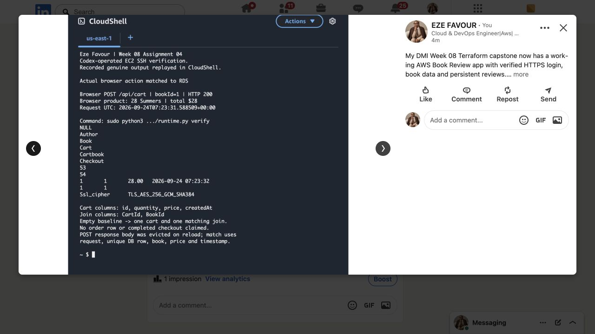
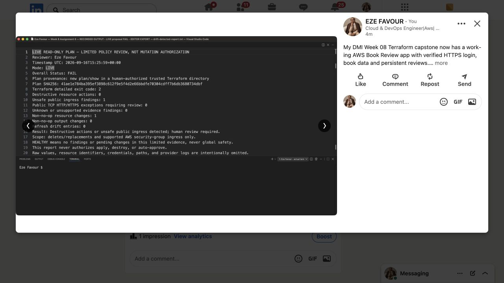
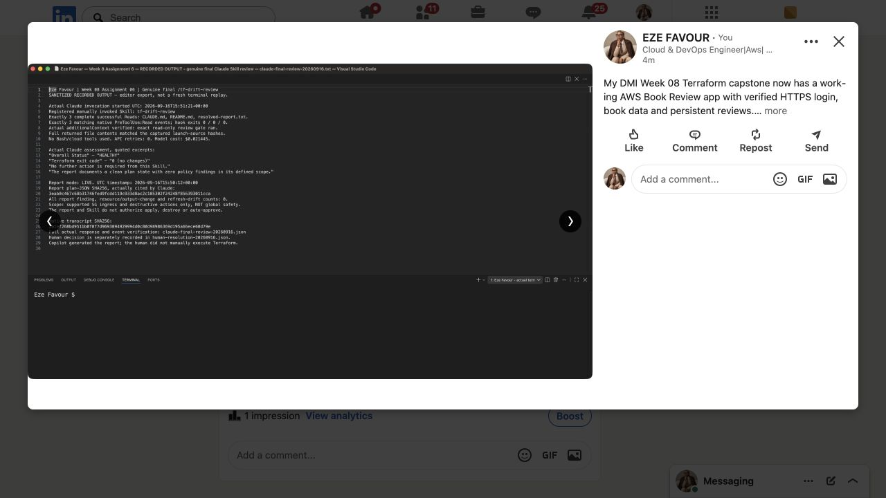

# Week 08 publications — 25 September 2026

- [Published Medium article](https://medium.com/@rosenaefavour/from-terraform-plans-to-a-working-aws-book-review-app-27a81b45dedb) — 911-word draft rendered as a public story; exact clickable DMI profile backlink verified in the published DOM.
- [Published LinkedIn post](https://www.linkedin.com/posts/eze-favour-52732752_dmibypravinmishra-devops-terraform-ugcPost-7509164778045595649-LVlQ/) — Anyone audience; five original proof images uploaded and publication success verified.

Codex published the user-authorized assisted write-up. It discloses operators, source/runtime distinctions and remaining rubric limits. It does not claim full Week 08 completion. The LinkedIn images include the A5 HTTPS catalogue, A4 cart and matching database record, and A6 detected-change and final-review evidence. The A4 endpoint depicted is historical and retired.

[Publication record](publication.json) and [capture hashes](capture-provenance.json) accompany original screenshots of the actual published post gallery. These are neither composites nor mock social-media pages. The normal screenshot preserves the displayed LinkedIn image view; the underlying original project images remain in their own evidence directories.

