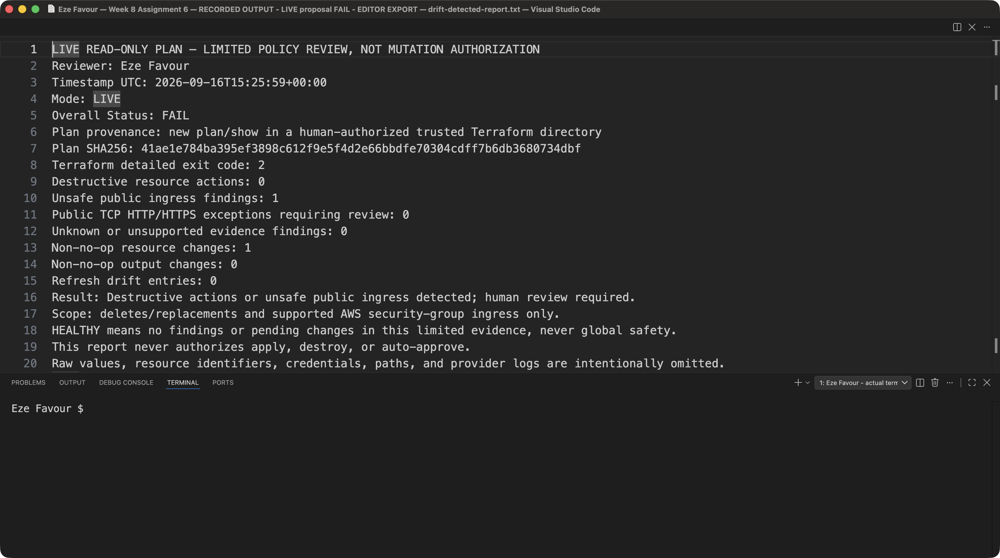

# Week 08 screenshot index

The original evidence remains in each project's directory. Use the assignment documents to match each image to its numbered requirement and read the manifests for capture scope.

| Assignment | Captures | Original evidence |
|---|---:|---|
| 01 — Azure VM | 6 / 11 | [Images](../terraform-azure-vm/evidence/screenshots/) · [Manifest](../terraform-azure-vm/evidence/manifest.json) |
| 02 — AWS VM | 10 / 10 | [Images and manifest](../terraform-aws-vm/evidence/) |
| 03 — Azure React | 8 / 15 | [Images](../terraform-react-azure/evidence/screenshots/) · [Manifest](../terraform-react-azure/evidence/manifest.json) |
| 04 — AWS EpicBook | 19 / 35 | [Images](../terraform-aws-epicbook/evidence/screenshots/) · [Manifest](../terraform-aws-epicbook/evidence/screenshot-manifest.json) |
| 05 — Book Review | 4 / 28 | [Gallery](../terraform-book-review/evidence/README.md) · [Manifest](../terraform-book-review/evidence/manifest.json) |
| 06 — Drift and policy review | 19 / 19 | [Images and manifest](../drift-review/screenshots/) |

There are **66 occupied numbered slots out of 118**, with **52 missing**. Assignment 02 now includes its approved September 23 live deployment, verification and teardown. The remaining images for assignments 01, 03–05 largely show local tools, source or initialization; their outstanding live work is still disclosed. See the [completion audit](../completion-audit.md) for the remaining work.

## Existing Assignment 06 evidence

This is an unchanged copy of [Assignment 06 screenshot 13](../drift-review/screenshots/screenshot-13-live-detected-report.png), already recorded in its original manifest. It shows the saved report for a proposed unsafe ingress change. It does not show a new review, a deployed public SSH rule, or completion of another assignment. The copy is counted once in the 66-slot inventory.

See [index-manifest.json](index-manifest.json) for the original path and SHA-256.
