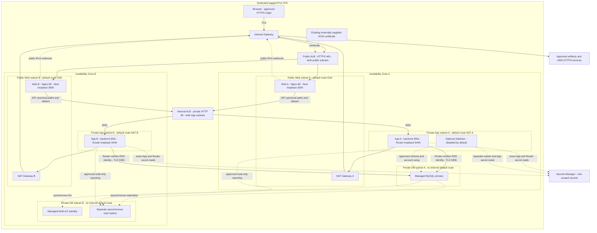

# Book Review capstone — offline preparation

**Learner:** Eze Favour  
**Repository:** https://github.com/Favourcloud/devops-micro-internship-pravinmishra  
**Status:** source preparation only; not deployed, cloud-verified, or assignment-complete.

AWS is a coordinator-approved **offline architecture assumption**, not a claim of learner cloud preference or authorization to spend. [Four genuine original local-source screenshots](evidence/README.md) are attached for slots **1, 2, 3 and 6**, anchored to reviewed source `23748110108196f26c1394830a48af5317f7ca22`, not this later evidence-documentation revision. No public application URL, Claude/MCP execution, manual learner operation, learner reflection, or LinkedIn publication is claimed.

## Architecture (created before infrastructure source)



RDS selects actual primary/standby placement within its two-AZ subnet group; these locations are logical, not observations. The replica is not the standby. The unchanged application uses only the primary; replica read-only reporting must be verified separately.

### Boundaries and tradeoffs

- Exactly six subnets: two public Web, two private App, two private DB. Each App subnet uses its same-AZ NAT; DB route tables have no internet default route.
- Only the public ALB accepts internet HTTPS. Web ingress is only public-ALB SG → port 80; internal ALB ingress only Web SG → 80; App ingress only internal-ALB SG → 3001; DB ingress only App SG → 3306. No SSH/key pairs.
- Public-subnet Web instances need public IPv4 for outbound HTTPS through the IGW, but their SG admits no direct internet application traffic. App/DB instances have no public IP.
- Two per-AZ ASGs per tier maintain one Web and one App instance in each AZ. IMDSv2, encrypted disks, non-root services and private SSM operations are required.
- Browser TLS requires an existing valid matching ACM certificate and an authorized HTTPS hostname. This project does not create certificates, accounts, domains or DNS records. VPC ALB-to-compute HTTP is an explicit internal trust-boundary tradeoff, not end-to-end TLS.
- MySQL requires TLS. Upstream disables certificate verification; the planned loopback MySQL Router verifies the RDS CA **and hostname**. Its local TLS listener needs a human-supplied certificate/key secret. No unverified direct fallback is acceptable.
- The optional initializer has its own IAM role and is disabled by default. App/Web roles never read the master secret. Enabling, using and removing it require separate human-approved changes.

## Upstream provenance and compatibility

Deploy the instructor application unchanged at [84280063bea7ccd5144dafa2b969ec4e2e69ffbb](https://github.com/pravinmishraaws/book-review-app/tree/84280063bea7ccd5144dafa2b969ec4e2e69ffbb). Application JavaScript is neither authored nor vendored here. Verified hashes are recorded in `source-lock.json`.

- Frontend: Next 15.2.3/React 19, production `.next` output and a live Node server behind Nginx, **not** a static export. `NEXT_PUBLIC_API_URL` is a build-time approved HTTPS origin without a trailing slash.
- Backend: unchanged `node src/server.js`, explicitly `PORT=3001` (source default is 5000), Sequelize/mysql2, MySQL, and shared `JWT_SECRET`.
- Homepage requests `/api/books`; service helpers request `/books`, `/users/*`, `/reviews/*`. Nginx must preserve canonical `/api/*` and prefix aliases exactly once. It must deny upstream's unauthenticated book-creation POST route while allowing the required registration/login/review operations.
- Source has no SQL dump. Sequelize alters tables and adds sample users/books/reviews on startup. Those sample records are **not** human browser evidence or working learner login credentials. Schema-scoped DDL privileges and serialized initialization are required by unchanged source; do not describe its DB account as CRUD-only.
- `/` is a static backend success response. Readiness must verify DB-backed API operations and completed startup, not that response alone.
- Existing upstream `.env` and tracked node_modules are excluded from extraction. No upstream credential values are reused.

### Dependency release blockers

Public GitHub advisory affected-version checks returned critical and high matches for locked `next@15.2.3`, plus matches for Sequelize 6.37.6 and mysql2 3.13.0. The [representative advisory record](evidence/dependency-advisories.json) distinguishes version matches from applicability, including a Windows-only condition that does **not** match the proposed Linux host and an explicitly withdrawn Express advisory that is not an active finding. Empty direct-package results for React/jsonwebtoken are not a transitive-dependency safety certification. React-flight RCE and image-optimization advisories require a reviewed fixed upstream pin and compatibility/security review before public release. Per-advisory first-patched versions are not a recommendation for a current safe target.

`runtime_release_authorized` stays **false**. Nginx restrictions on unused image/server-action routes are defense-in-depth, not proof this vulnerable pin is safe. No upstream JavaScript, packages or locks are patched here. A successful local build would establish build compatibility only, not release safety. Full locked/transitive dependency and configuration applicability review remains pending.

## Source layout and resource inventory

| Source | Responsibility |
| --- | --- |
| `terraform/versions.tf`, lockfile | Exact Terraform 1.13.5 / AWS provider 6.64.0 |
| `terraform/main.tf`, variables, outputs | Module composition, ephemeral inputs, non-secret compressed cloud-init and honest status outputs |
| `modules/network` | VPC, six subnets, six route tables, two NAT/EIPs, IGW, closed default SG |
| `modules/security` | Five SGs and explicit port/SG-reference chain; no SSH/default egress |
| `modules/load_balancing` | Two ALBs, two target groups, HTTPS/public and HTTP/internal listeners |
| `modules/database` | MySQL8.4 parameter/subnet groups, Multi-AZ primary, independent private replica |
| `modules/secrets` | Two secret containers and write-only immutable secret versions |
| `modules/identity` | Tier-specific EC2 roles/profiles, exact secrets/log-stream permissions and enumerated SSM channel actions |
| `modules/compute` | Two launch templates, four per-AZ ASGs, bounded rolling replacement |
| `modules/observability` | Seven-day log groups, unhealthy-target and replica-lag alarms; no notification subscription |
| `modules/initializer` | Optional private one-time DB/account initializer; separate identity, disabled by default |
| `runtime/`, `scripts/verify_upstream.py`, `source-lock.json` | Unchanged upstream extraction and configuration-only runtime preparation |
| `hooks/`, `.claude/`, `.mcp.json.example` | Inactive Copilot-authored guard/starter templates, human review pending |
| `terraform/tests/`, `tests/`, `evidence/` | Mock/contract checks and explicitly pending acceptance evidence |

Module paths in the table are relative to `terraform/`. The authored baseline describes **76 Terraform-managed AWS resource objects**, plus the four EC2 instances launched by ASGs (and RDS-managed standby capacity). Enabling the initializer adds five managed objects including its instance. These are source counts, not observations of an account. Per-AZ ASG maxima allow up to eight Web/App instances during rollouts; capacity and resulting cost must be reviewed. A failed bootstrap remains unhealthy rather than serving a fake success, so never apply before its prerequisites are ready: repeated ASG replacement can incur cost.

### Runtime packaging and operator runbook

The [runtime runbook](runtime/OPERATIONS.md) defines the exact non-secret configuration, Ubuntu/Node/MySQL Router/Python prerequisites, source and artifact verification, startup serialization proof, SQL account setup, Nginx route semantics, TLS boundary, health probes and future rotation steps. Web/App bootstrap installs a separately reviewed Linux artifact; it does **not** install npm dependencies or build on production nodes. The initializer downloads no application artifact. Only App/initializer receive the pinned preinstalled CA path/hash; Web receives neither CA fields nor secret identities. Neither an AMI nor a runtime artifact has been created or published by this preparation.

Terraform selects the common plus tier-specific import/template closure from `runtime/deploy-manifest.json`, instead of embedding documentation and offline packaging helpers. Every complete compressed user-data payload must fit EC2's 16 KiB limit. Source and build-artifact hashes have different purposes: the former pin unchanged instructor files, the latter pin a reviewed Linux build containing dependencies and `.next`. Neither proves real cloud operation. Artifact verification can need several GiB RAM. The `t3.large` default provides 8 GiB, matching the conservative runtime recommendation; four baseline instances are **not free-tier**. A smaller allowed class requires measured artifact/runtime memory review, not an assumption that the cheapest instance is sufficient. All sizing and costs need independent human approval.

## Agentic starter-kit status

The official **`book-review-agentic-ai.zip` was received and reviewed from Udemy Assignment 37 on 24 September 2026**. See the [six-file comparison](evidence/starter-kit-review-20260924.md) and [archive/file hashes](evidence/starter-kit-review-20260924.json). The original course files, review candidate and subsequent active integration are retained privately; they are not redistributed here. The pinned application tree still contains no kit, but kit discovery is no longer a blocker.

Project-local protected templates remain the earlier Copilot-authored drafts, with original source and screenshot anchors preserved. The [25 September setup report](evidence/bedrock-setup-20260925.md) records a genuine Sonnet 4.6 response through Amazon Bedrock, a seven-tool Terraform MCP connection, a successful model-selected provider lookup and a model-invoked six-stage offline validation pass in the separate private integration. It also documents the guard compatibility fix and bounded usage. Agent reviews, post-edit validation and screenshots remain pending. Obtaining or activating the kit alone does not complete those requirements.

## Secrets and human-controlled operation

Never commit actual tfvars, credentials, keys, state, saved plans, secret values or private logs. Master/App/JWT inputs must be sensitive and ephemeral through all Terraform module boundaries and use AWS provider write-only fields; ordinary `sensitive=true` is not sufficient. Use exact secret ARNs in IAM and non-secret user data. Values are retrieved only at future runtime with instance identities; no master credential in App processes.

RDS-managed master passwords are deliberately not selected: [RDS documentation](https://docs.aws.amazon.com/AmazonRDS/latest/UserGuide/rds-secrets-manager.html) disallows creating a MySQL read replica when its source uses Secrets Manager-managed master credentials. Explicit write-only master and secret-version inputs need coordinated version/rotation handling. JWT rotation is not seamless: unchanged source accepts one signing key and may require maintenance/re-login.

This repository preparation alone authorizes no real Terraform plan/apply/destroy, state/import/unlock/taint, cloud auth/API, SSH, IAM/quota/billing change, live MCP, paid-model call or external publication. The later local-source browser captures were performed under the user's separate continuation authorization. Human approval of this source plan is not cloud-change authorization.

## Cost and cleanup warning

**Not free-tier.** Cost drivers include two NAT gateways and processing, two ALBs/LCUs, four or more EC2 instances/encrypted EBS, optional initializer, Multi-AZ primary+standby plus read replica/storage/backups, public IPv4, secrets/API calls, logs/alarms and transfer. No retired budget applies and no numeric estimate is asserted.

Future cleanup must be a human-reviewed Terraform operation, including deletion-protection changes and explicit snapshot/retention choices. The primary requires a uniquely named final snapshot; an unpromoted read replica must skip its final snapshot because [RDS explicitly forbids one](https://docs.aws.amazon.com/AmazonRDS/latest/APIReference/API_DeleteDBInstance.html). Automated backups are retained, and secrets have a seven-day recovery window, so destroying compute is not proof of zero residual cost. Verify NAT/EIPs, ASG instances, ALBs, volumes, DB/replica/snapshots, secrets recovery windows and logs afterward. No automatic SDK termination or account-wide deletion is permitted.

### Inputs, secrets and rotation

`terraform/terraform.tfvars.example` is intentionally non-deployable and contains no secret inputs. Required human-reviewed inputs include the region/two AZs, dedicated CIDR, cleanup record, supported amd64 AMI and MySQL/class choices, authorized public hostname, existing matching same-region ACM certificate, existing Router TLS secret ARN, trusted official RDS CA bundle preinstalled at `/etc/book-review/rds-ca.pem` with a verified SHA-256 (no runtime CA download), reviewed immutable Linux build-artifact URL/SHA-256 and unique primary snapshot suffix. Certificate validity/domain authorization, AMI contents, available instance/DB versions and account permissions cannot be established by offline validation.

At a future human-controlled execution, supply strong master password, App password and JWT through a protected ephemeral-input workflow—not shell history, command-line `-var` arguments, tfvars, logs or committed environment files. Ephemeral values are required again when Terraform needs them; never persist them in an ordinary output or resource argument. Root and child-module boundaries use `ephemeral=true`, and only `password_wo` / `secret_string_wo` receive the values. Version counters are non-secret update triggers, **not** an automated rotation service.

The initializer receives the exact master/App secret version IDs. App instances receive only the exact App bundle version plus the external Router secret ARN; Web receives no secret permissions. Bundles are `{username,password}` and `{username,password,jwt_secret}`; the Router secret is `{certificate,private_key}`. Default AWS-managed encryption avoids extra custom-KMS cost/deletion dependencies; a customer-key policy would need separately reviewed narrowly scoped decrypt permissions.

Before rotating App credentials, plan MySQL dual-password overlap, secret-version publication, named-lock-safe rolling replacement, end-to-end verification and removal of the old password. Never update only the secret or only the database. Master rotation must coordinate the RDS write-only version and initializer secret version. JWT rotation may invalidate existing sessions and requires a maintenance/re-login plan because unchanged source has one signing key. The initializer must not silently rewrite an established user's password or create synthetic learner evidence. Revoking/removing its separately permissioned instance after success is another human-controlled Terraform change.

## Offline validation performed

- Terraform 1.13.5 `darwin_amd64`: formatting, filesystem-only provider initialization with backend disabled/read-only lock, validation and AWS 6.64.0 provider-schema inspection passed under an empty HOME and credential-free environment. The approved provider was reused read-only, not copied/downloaded.
- **43 sealed mock-provider plan tests passed**. Every run explicitly uses `command = plan`. They cover topology, SG chain, HA/replica distinctions, routing, HTTPS, IAM, metadata/disks, input rejection, cleanup safeguards, all three complete compressed user-data size bounds and synthetic-marker absence from ordinary configuration/outputs.
- The actual provider schema confirms `password_wo` and `secret_string_wo` are both sensitive and write-only. Explicit `manage_master_user_password=false` conflicts with `password_wo` in this provider and is therefore omitted. No real state was read or produced; schema/ephemeral checks are not evidence from a deployed state's contents.
- The initial `1aa3e347` snapshot passed **136 standard-library/fake-interaction tests** normally and with `-O`; its 65-test source/guard/integration subset also passed system Python 3.9.6. Those tests missed PyMySQL's context replacement and optional-TLS handshake behavior, and bootstrap's two unqualified sbin lookups. They were not real-driver TLS proof.
- The reviewed captured source `237481101` passed **149 tests normally and with `-O` on Python 3.11.7** under process-scoped deny-all-network and empty environment/HOME: 22 infrastructure/brief/policy checks, 40 fake-only guard/runner, four configuration-boundary, 73 runtime/upstream, and **10 actual PyMySQL1.1.1 driver regressions**. The targeted driver/bootstrap set has 12 passing tests. Actual driver constructors, greeting parsing and authentication execute against memory-only transports; socket/TLS transport, DB and OS-command effects are faked. No real TLS handshake, SQL connection or user creation occurs. The old frozen context and both bootstrap failures were reproduced with those regressions; an unadapted pinned-driver control also demonstrates the missing-SSL authentication behavior.
- The four-image evidence integration adds six preservation/provenance regressions: **21 focused evidence/integration tests, 155 normal and 155 optimized tests passed with zero failures or skips** on Python3.11.7. The coordinator's existing external PyMySQL1.1.1 environment was reused read-only, with writes to it and all networking denied; no dependency was installed, changed or removed. All six protected Terraform stages and **43 explicit mock plans**, including complete compressed-payload limits, were rerun successfully with IP denied/Unix sockets allowed. These CLI results are not terminal screenshots or real TLS/runtime proof. The separate integration record preserves the earlier149/149 and136/136 history.
- The protected runner's short relative provider socket path worked on this macOS host. Other platforms, cloud bootstrap, a real MySQL Router/RDS connection and the Linux runtime artifact remain unverified.

### Actual-driver test dependency and reproduction

PyMySQL1.1.1 was missing from the validation interpreter. Following the narrow validation permission, its **44,972-byte wheel** was installed from public PyPI into a disposable project-private Python environment, with empty HOME/environment, disabled pip configuration/cache, no dependency resolution and the exact SHA-256 in `tests/requirements.txt`. No upstream/npm package, system installation, runtime version upgrade or installed-driver modification occurred. The new tests require the real pinned package and **fail rather than silently skip** if it is missing or wrong.

From this project root, after creating a private empty HOME and selecting a trusted Python3.11 interpreter with pip, the equivalent dependency/test commands are:

```sh
PYTHON=/absolute/path/to/trusted/python3.11
TEST_ROOT="$PWD/.private/mysql-validation"
env -i PATH=/usr/bin:/bin HOME="$TEST_ROOT/home" "$PYTHON" -I -B -m venv --without-pip "$TEST_ROOT/venv"
env -i PATH=/usr/bin:/bin HOME="$TEST_ROOT/home" PIP_CONFIG_FILE=/dev/null "$PYTHON" -I -B -m pip --python "$TEST_ROOT/venv/bin/python" --isolated install --disable-pip-version-check --no-input --no-cache-dir --no-deps --only-binary=:all: --require-hashes --index-url https://pypi.org/simple -r tests/requirements.txt
/usr/bin/sandbox-exec -p '(version 1)(allow default)(deny network*)' env -i PATH=/usr/bin:/bin HOME="$TEST_ROOT/home" "$TEST_ROOT/venv/bin/python" -B -m unittest discover -s tests -p 'test_*.py'
/usr/bin/sandbox-exec -p '(version 1)(allow default)(deny network*)' env -i PATH=/usr/bin:/bin HOME="$TEST_ROOT/home" "$TEST_ROOT/venv/bin/python" -B -O -m unittest discover -s tests -p 'test_*.py'
```

The process-scoped network-denial wrapper above is macOS-specific; other hosts need an independently reviewed equivalent, not silently unconfined tests. Creation of the fresh invocation-owned test directory/HOME uses mode0700; never reuse an unknown existing environment. **Remove only the invocation-owned temporary validation environment before the protected Terraform runner**: standard venv interpreter symlinks correctly trigger its whole-project source refusal, even under `.private`. Never weaken that guard or delete unrelated files to make validation pass. Terraform then runs with IP networking denied and private Unix sockets allowed; its approved immutable binary/provider are reused read-only. The test-only environment is not a deployment artifact or part of the AMI.

The [machine-readable validation record](evidence/offline-validation.json) records these local outcomes without private paths or raw logs. See [the project policy](CLAUDE.md) for the protected entrypoint, trusted tool/hash inputs, sealed source/test rules and its limitations. Checked-in hashes are source-preparation seals, not human approval. No ordinary Terraform plan, apply, destroy, cloud API, live DB write or application-browser action was performed.

## Acceptance evidence remains pending

The [evidence gallery](evidence/README.md) and [28-slot manifest](evidence/manifest.json) contain **9/28 source-only captures** (1, 2, 3, 6, 7, 8, 14, 15, 16); **19 remain missing**. Five new original browser views show unchanged source in an attributed local file viewer. The earlier native-capture failure no longer blocks those views. Screenshot17 still lacks literal Terraform output: a separate uncounted capture records the protected runner's successful stage results. The other eighteen slots retain their workflow/runtime gates.

All pictures retain their original pixels, SHA-256, timestamp and immutable captured-source anchor `23748110108196f26c1394830a48af5317f7ca22`. The first four were captured by Copilot and the later five by Codex under user delegation, not manually by the learner. Slot6 shows **nine module directories**, not twelve; an original frame initially made while framing network source was accepted once for this structural criterion and is not reused for slot7. Current evidence-documentation bytes were not captured. Runtime, Terraform, agents, policies, hooks, runner, locks and seals remain byte-identical to that reviewed source.

All 15 own-words reflections remain unanswered and all 55 checklist entries remain unchecked. The mandatory LinkedIn post and URL remain pending. Source/mock results and inactive definitions are separate from Linux/cloud/browser/Claude/provided-kit evidence; no upstream build or Linux runtime artifact has been produced. See `evidence/reviewed-source.json` for the 63 reviewed source hashes and four explicitly permitted documentation/evidence-test exceptions.

Before any deployment: fresh identity/permissions/quota/cost approval; valid ACM/DNS/hostname; supported approved AMI/DB versions and dependency review; a separately approved unchanged-source Linux build and reviewed immutable artifact at an existing authorized HTTPS location; human-supplied secret/certificate inputs; verified CA+hostname handling; real reviewed plan and human-run apply; real initialization/failover/health/replica/auth/books/review/DB tests; genuine Claude/MCP/hook workflow; all screenshots and learner reflections; publication; final review and approved cleanup. No working public URL or completion claim is made.
