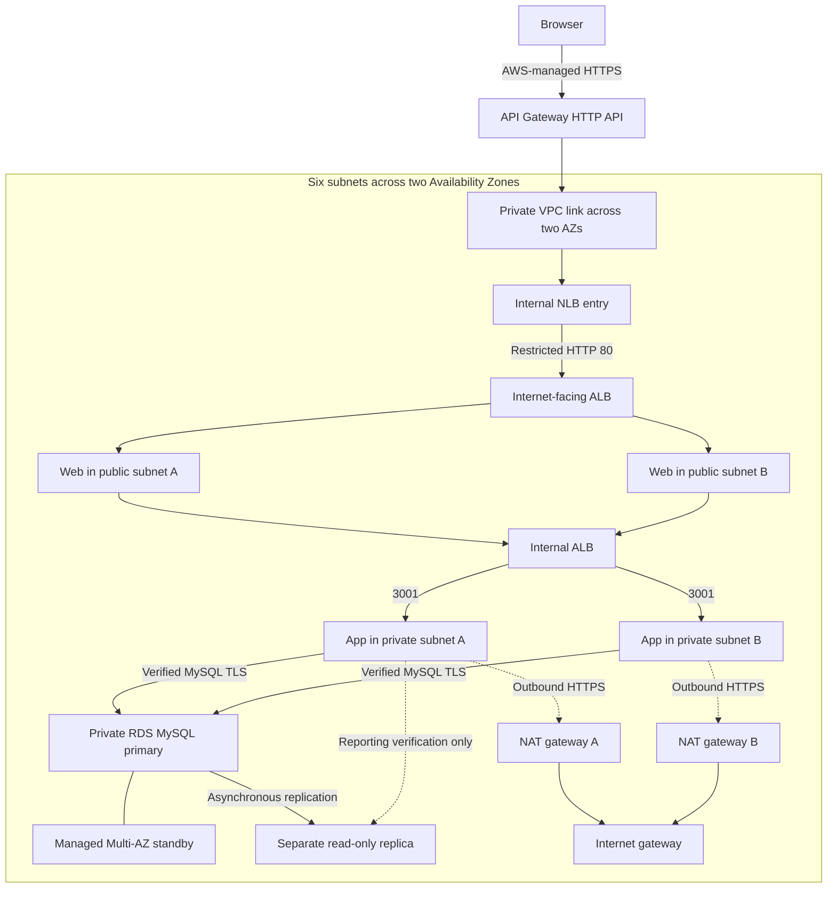

# Book Review A5 — deployed AWS release, 25 September 2026

Eze Favour's capstone is deployed at https://xdr0flp20e.execute-api.us-east-1.amazonaws.com. This separate release preserves the original captured source in the parent project. Codex operated the deployment and tests under Eze Favour's authorization. Claude Code used Amazon Bedrock for recorded Terraform improvements, troubleshooting and named-role reviews; these were main sessions, not delegated subagents.

The [deployment evidence](../../evidence/deployment-20260925/README.md) separates source validation, actual AWS results, API tests and original browser captures. The course kit, usable live inputs, state, account IDs, credentials and private keys are excluded.

## Architecture

The baseline diagram predates infrastructure construction. This diagram records the deployed HTTPS adaptation.

Security groups admit each tier only from the preceding tier. App and DB instances have no public addresses. Web uses public subnets and public addresses for outbound access but accepts application traffic only from its ALB. The public ALB admits HTTP only from the internal entry NLB. Browser HTTPS terminates at API Gateway; subsequent HTTP remains within the VPC. This is not TLS on every HTTP hop. MySQL connections verify CA and hostname through the local Router or pinned Python adapter.

The application uses the primary. The read replica is independently verified and is distinct from the managed standby. One scaling group per tier per AZ preserves baseline placement; no request-based autoscaling is claimed.

## Runtime identity and tests

Original upstream commit: `84280063bea7ccd5144dafa2b969ec4e2e69ffbb`.
Release identity: `6eb47664d2aa719597d564b75aea9b9798c0e1de0c2856d61e7ec7889aa97b69`.
Linux artifact SHA-256: `faf698558f157c6cd2b673807d87aeef171fcff044674b305589832961b77397`.

Only four selected package manifests/locks changed; 31 other selected upstream files remain byte-identical. Reviewed dependency patches are in the parent evidence candidate directory. The verified Ubuntu build uses Node 22.23.3, npm 10.9.9, Nginx 1.24.0, Router 8.4.10, AWS CLI 2.37.2, Python 3.12.3 and PyMySQL 1.1.1. Instances use encrypted 30 GiB roots.

The exported release passed 100 Python tests. The protected Terraform run passed 45 mock tests with IP networking denied. Terraform 1.13.5 and AWS provider 6.64.0 are pinned. Actual API tests passed registration, authentication, review creation and independent persistence checks, and rejected anonymous review creation, invalid login and book writes. Original browser captures show the running catalogue, login, book details and a review surviving reload. Primary and replica TLS 1.3, read-only replica behavior and negative CA/hostname checks passed.

See [OPERATIONS.md](runtime/OPERATIONS.md) for bootstrap, service, database, release and teardown procedures. Deployment needs a separate private working directory and newly reviewed real plan. Source alone is not runtime evidence.

## Cost and availability

The user requested that the demo remain online until they ask for cleanup. No automatic teardown is scheduled. Core resource cost is approximately $0.5873/hour, before storage, IPv4, traffic, API/LCU usage and taxes. Builder and initializer resources have been removed. Any later teardown must mark the published endpoint as retired and verify task-specific residual resources.
