# Assignment 01 — Set Up a Team-Ready Ansible Development Workstation

Part of the DevOps Micro Internship (DMI) with Agentic AI

---

## Purpose

In this assignment, you will prepare an isolated and reusable Ansible development workstation.

You will install Ansible and supporting tools inside a Python virtual environment, configure VS Code, prepare SSH access, configure Git and pre-commit hooks, and document the complete setup.

This workstation will be used as the Ansible controller in upcoming assignments.

---

## Current status

**Learner:** Eze Favour

**Status:** Workstation and local evidence complete — all twelve numbered screenshots and two supporting interpreter images are included. The existing controller, environment, SSH identity and historical evidence were preserved. **Grading remains pending:** these new changes must reach the fork’s graded `main` through a separately authorized merge, followed by an instructor review.

Aligned on 15 September 2026 with the [official brief at revision `9b394ef`](https://github.com/pravinmishraaws/devops-micro-internship-pravinmishra/blob/9b394ef8efecd7db1f582995a03665f6f8afc2a4/week-09-ansible/assignment-01-set-up-a-team-ready-ansible-development-workstation.md). The current brief has eight tasks, twelve screenshots, four questions, and explicit required files; it supersedes the older six-task, ten-screenshot version. The previous implementation, validation results and reflection notes were retained rather than treated as a new completed lab.

The [onboarding README](ansible-onboarding/README.md) contains machine details, a 12-step new-machine checklist, safe setup commands and the exact validation procedure. The [local validation record](ansible-onboarding/evidence/local-validation.json) records actual results and source hashes; it is not a substitute for screenshots or remote access evidence.

| Current task | Verified local work and genuine evidence |
|---|---|
| 1 — Workspace and Git | The existing controller owns its Git metadata and remains on local `main`; screenshot 1 shows its actual path, listing and preserved staged/unstaged work. [Ignore rules](ansible-onboarding/.gitignore), `inventories/` and `roles/` are retained. This local branch is separate from GitHub’s graded `main`. |
| 2 — Python/Ansible tools | The existing project-local Python 3.13 environment and all 38 [pinned packages](ansible-onboarding/requirements.txt) are retained. Screenshot 2 shows the active environment, executable path and four tool versions. |
| 3 — VS Code | Genuine Visual Studio Code shows the installed Ansible 26.8.2, YAML 1.24.0 and Python 2026.4.0 extensions. Screenshots 3–4 show extensions and [settings](ansible-onboarding/.vscode/settings.json)/[EditorConfig](ansible-onboarding/.editorconfig). Supporting images prove actual `.venv (3.13.3)` selection. Python Environments’ automatically added project metadata was retained. |
| 4 — Ansible defaults | [Configuration](ansible-onboarding/ansible.cfg), localhost inventory and the harmless [smoke playbook](ansible-onboarding/playbooks/smoke.yml) are validated. Screenshots 5–6 show complete and effective configuration. Chosen defaults are documented, not presented as instructor-supplied values. |
| 5 — SSH readiness | The learner’s existing Ed25519 identity was preserved. All eight [readiness checks](ansible-onboarding/evidence/gui-verification-20260916.json) passed again in the actual VS Code terminal; screenshot 7 shows the loaded key and effective settings. No private-key contents, remote login or remote fingerprint verification are claimed. |
| 6 — Git identity and hooks | Screenshot 8 shows fresh repository-local identity/default-branch/hook checks plus the literal original successful installation receipt. The email local part is hidden and its exact match is verified. The existing executable hook, shared hooks and global Git settings were not replaced. |
| 7 — Complete workstation test | Local linters, check/normal localhost smoke runs and the 25-check suite pass. Screenshot 9 shows both real controller pre-commit hooks passing; screenshot 10 combines project configuration and the loaded Ed25519 key. |
| 8 — README and checklist | Machine details and the 12-step checklist are documented. Screenshots 11–12 show the actual final project structure and rendered README. |

**Verified locally on 15 September 2026:** all **25 command checks** met their expected result, including three intentional rejection tests (unknown lint option, malformed YAML and an unqualified Ansible module). Both the installed isolated hook and direct hook runner passed. Check mode and normal mode each reported `ok=4 changed=0 unreachable=0 failed=0`. Ansible loaded the project configuration, and both linters passed with compatible settings.

**Fresh validation on 16 September 2026:** the persistent controller passed all **25 command checks**, including the three intentional rejections, and both real installed controller hooks passed. Check and normal modes each reported `ok=4 changed=0 unreachable=0 failed=0`. [Fresh validation and source hashes](ansible-onboarding/evidence/controller-validation-20260916.json), [actual hook run](ansible-onboarding/evidence/controller-hooks-20260916.json), and [workstation status](ansible-onboarding/evidence/workstation-20260916.json) are recorded separately from the unchanged historical record. The wrappers now keep caches and the localhost module temporary directory inside ignored project folders.

**Capture-session verification on 16 September 2026:** the [new validation record](ansible-onboarding/evidence/capture-validation-20260916.json) passes all 25 checks, including three intentional rejections, and binds the final 19 project sources. Both localhost runs report `ok=4 changed=0 unreachable=0 failed=0`. [GUI/SSH verification](ansible-onboarding/evidence/gui-verification-20260916.json) is recorded separately; neither historical validation report was overwritten.

Validated versions: Python **3.13.3**, Ansible **14.4.0** / core **2.21.4**, ansible-lint **26.8.0**, yamllint **1.38.0**, pre-commit **4.6.2**. Installed dependencies match the 38-package lock. To reproduce the checks, activate the existing project environment and run `python scripts/verify.py --report evidence/validation-new-run.json`, choosing a new report filename each time. Existing reports are refused before checks run.

No cloud resources or charges were introduced. The learner created the new SSH key privately; existing private keys, private host inventory, global Git settings and shared Git hooks were preserved. Required editor extensions were installed only in an isolated Visual Studio Code profile. No incomplete task below is claimed as submission-complete.

The [screenshot manifest](screenshots/assignment-01-manifest.json) records all twelve original numbered captures, two supporting interpreter images, capture times, source/image hashes, actual command receipts and per-image privacy checks. Capture used only the genuine Week 09 VS Code window. Private path prefixes, listing ownership, email local part and SSH agent identifiers were removed **before display**, as disclosed for each image. No image was cropped, composited, reconstructed or redacted afterward. Failed/test captures remain private and are excluded.

A Python activation problem was repaired using short links to the same existing isolated profile; terminal rendering and README line spacing were adjusted in the private task workspace for readable captures. No environment, key or controller was recreated. Screenshot 8 deliberately shows the original installation receipt rather than rerunning setup.

**Submission dependency:** [repository instructions](../INSTRUCTIONS.md) require these changes on the fork’s graded default branch, `main`, and a subsequent instructor review. A feature-branch push alone is not grading completion. No new grade, merge or external publication is claimed.

---

# Task 1 — Create and Initialize the Ansible Workspace

## Goal

Create the assignment workspace, initialize a Git repository, prepare the required directories, and add Git ignore rules for local and sensitive files.

### Evidence

#### Screenshot 1 — Terminal showing the `ansible-onboarding` path, `ls -la` output, and `git status` confirming the Git repository is on the `main` branch

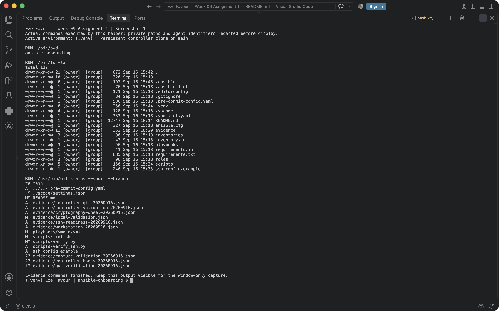

Actual persistent controller on local `main`; its existing staged and unstaged work is preserved. Path prefixes and file ownership are hidden before display.

---

# Task 2 — Create the Virtual Environment and Install Ansible Tools

## Goal

Create an isolated Python virtual environment and install Ansible and the required validation tools without modifying the system Python environment.

### Evidence

#### Screenshot 2 — Terminal showing the active `(.venv)` environment, `which ansible`, `ansible --version`, `ansible-lint --version`, `yamllint --version`, and `pre-commit --version`

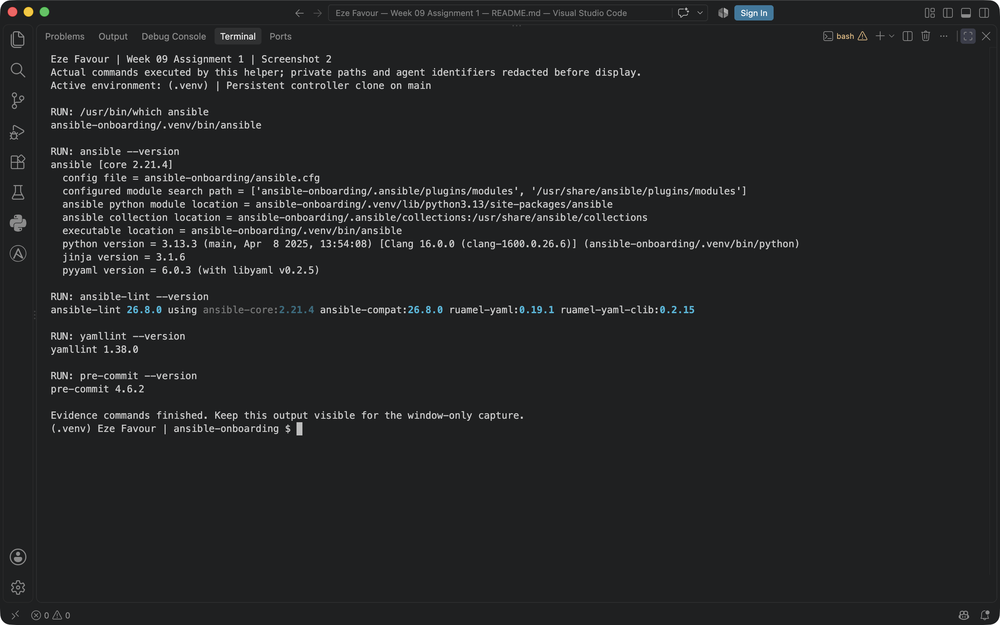

Existing active `.venv`, executable location and all four requested tool versions; no reinstallation.

---

# Task 3 — Configure VS Code for Ansible Development

## Goal

Configure Visual Studio Code to use the project’s Python virtual environment and provide validation support for Python, YAML, and Ansible files.

### Evidence

#### Screenshot 3 — VS Code Extensions panel showing the Ansible, YAML, and Python extensions installed

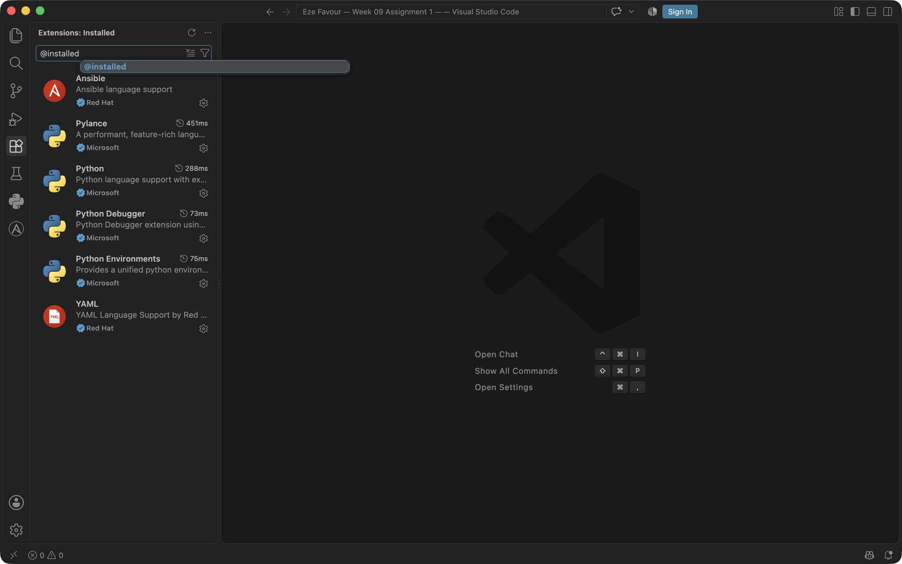

Installed Ansible, YAML and Python extensions in genuine Visual Studio Code.

---

#### Screenshot 4 — VS Code showing `.vscode/settings.json` and `.editorconfig` open side by side, with the required settings clearly visible

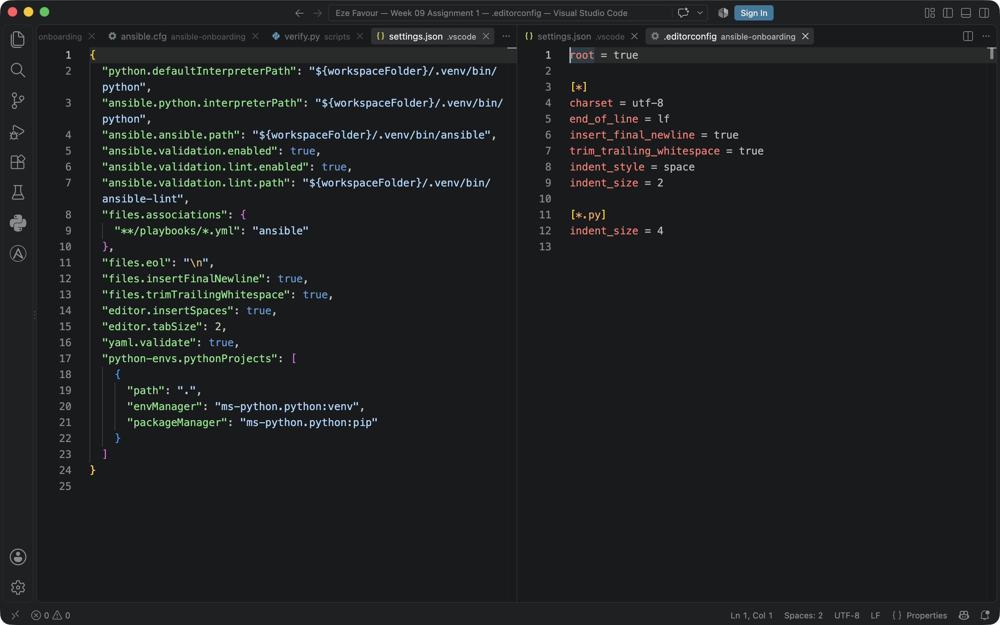

Complete project settings and EditorConfig side by side; word wrapping keeps interpreter/tool paths readable.

**Supporting interpreter verification — actual GUI selection:**

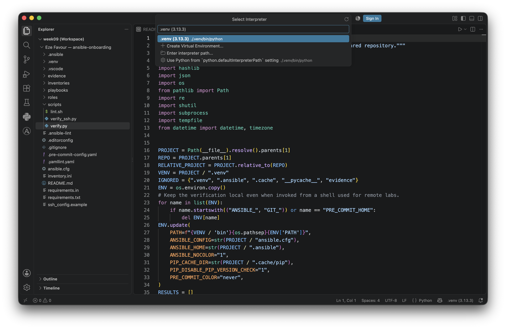

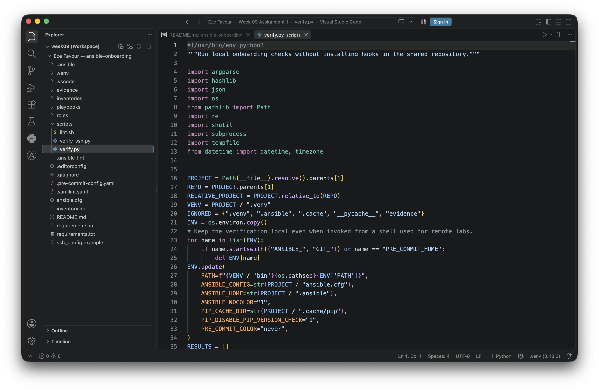

The selector was filtered to the exact project environment and confirmed with Enter. The manifest binds both originals to source hashes checked before and after capture.

---

# Task 4 — Create the Baseline Ansible Configuration

## Goal

Create a reusable `ansible.cfg` file containing the default settings that will be used in this workspace and upcoming Ansible assignments.

### Evidence

#### Screenshot 5 — `ansible.cfg` open in VS Code or another editor, showing the complete configuration

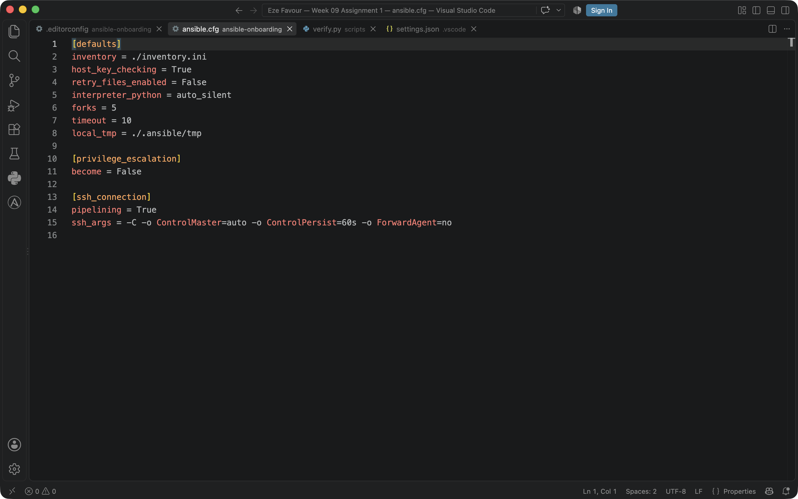

Complete project `ansible.cfg`, including host-key checking, no default escalation and no agent forwarding.

---

#### Screenshot 6 — Terminal showing `ansible --version` with the `ansible.cfg` path and the output of `ansible-config dump --only-changed`

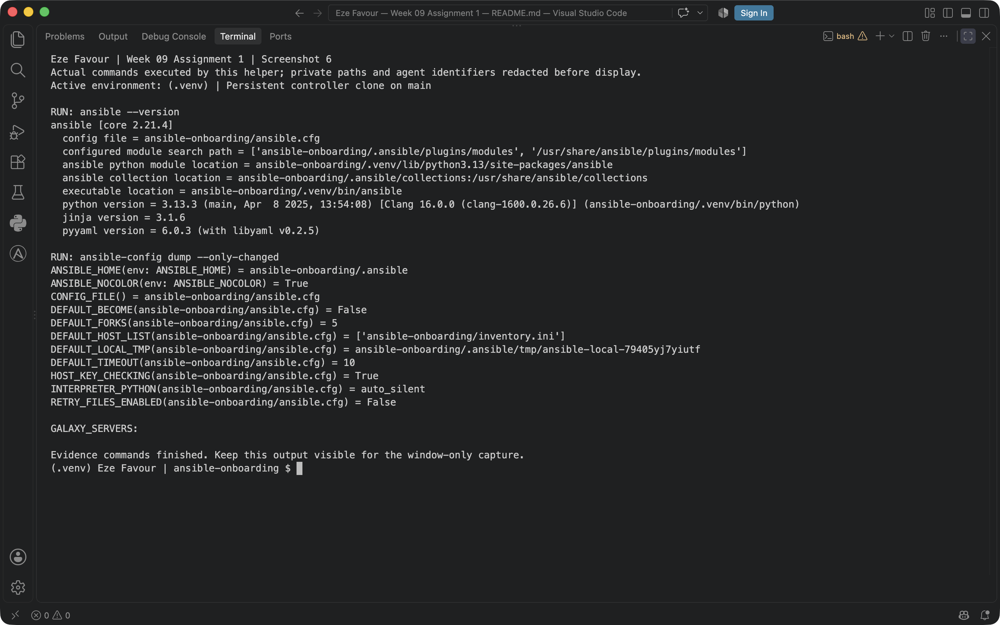

Actual Ansible version and effective configuration; private path prefixes are replaced before display.

---

# Task 5 — Configure SSH Readiness

## Goal

Prepare SSH key authentication, load the key into the SSH agent, configure reusable SSH client settings, and understand how trusted host fingerprints are stored.

### Evidence

#### Screenshot 7 — Terminal showing `ssh-add -l` with the ED25519 key loaded and the SSH configuration verification output

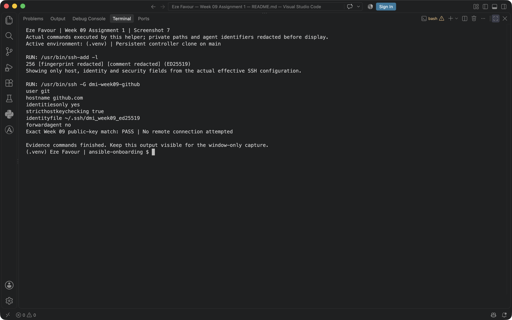

The existing Ed25519 key is loaded and matches the Week 09 public key. Fingerprint/comment are hidden; `ssh -G` makes no remote connection.

---

# Task 6 — Configure Git Identity and Pre-commit Hooks

## Goal

Configure your Git identity and install pre-commit hooks that validate YAML and Ansible files before commits are created.

### Evidence

#### Screenshot 8 — Terminal showing your Git full name, Git email, default branch, successful `pre-commit install` output, and `.git/hooks/pre-commit`

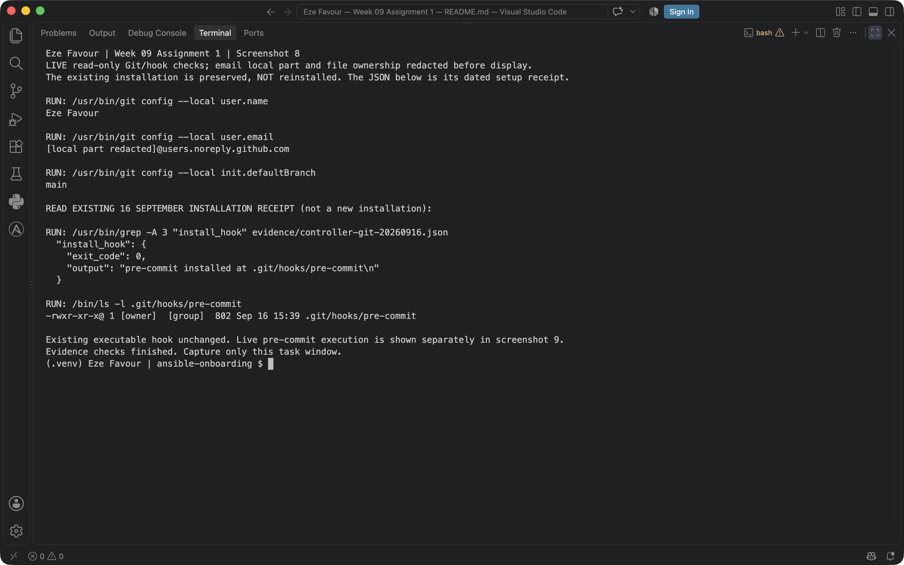

Fresh Git identity/default-branch/hook checks plus the literal original successful `pre-commit install` receipt. Email local part and file ownership are hidden. The hook was not reinstalled.

---

# Task 7 — Test the Complete Workstation Setup

## Goal

Verify that Ansible, the linting tools, Git hooks, SSH agent, and Git ignore rules are working correctly.

### Evidence

#### Screenshot 9 — Terminal showing `pre-commit run --all-files` completing successfully

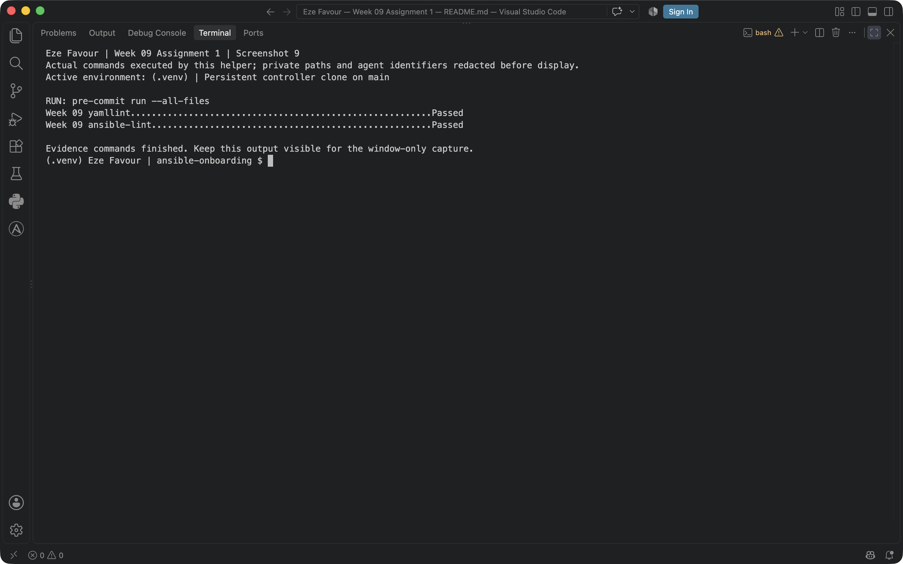

Actual `pre-commit run --all-files` in the persistent controller; both project hooks pass.

---

#### Screenshot 10 — Terminal showing `ansible --version` with the project configuration path and `ssh-add -l` with the ED25519 key loaded

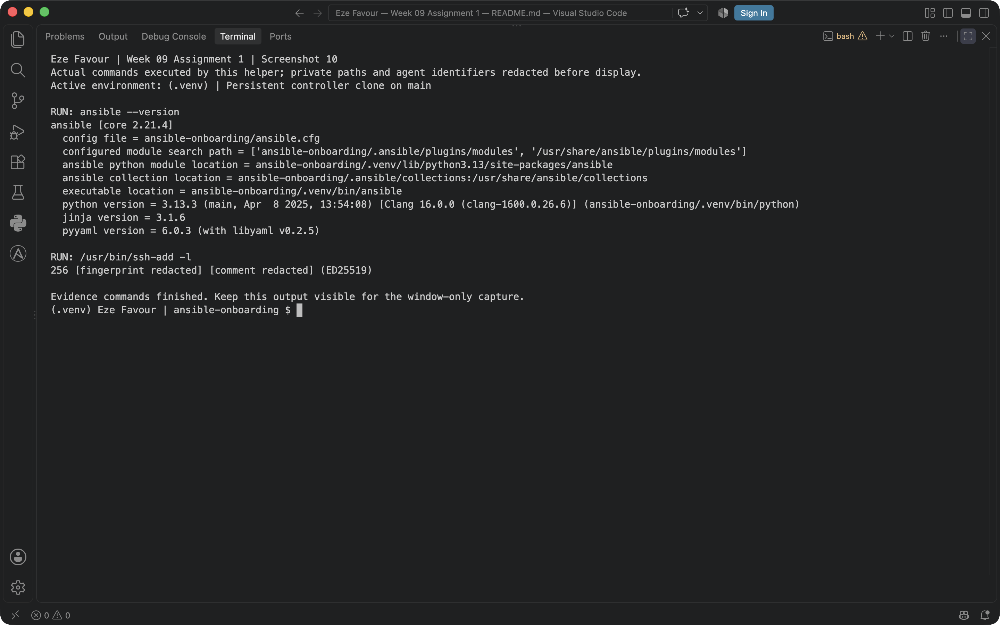

Project Ansible configuration and the loaded Ed25519 identity in the same genuine terminal view.

---

# Task 8 — Create the README and Onboarding Checklist

## Goal

Document the completed Ansible workstation setup and create a reusable checklist for preparing another workstation in the future.

### Evidence

#### Screenshot 11 — Terminal showing the final `ansible-onboarding` project structure

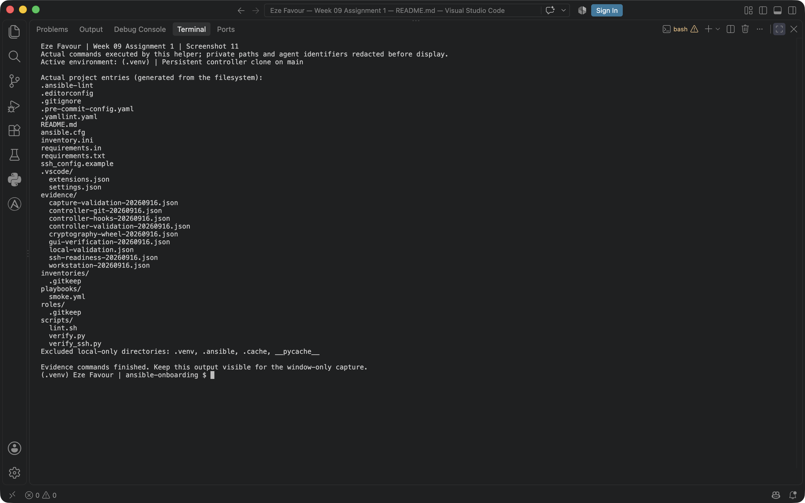

Actual final project entries generated from the filesystem. Local-only environment/cache directory contents are excluded and explicitly identified.

---

#### Screenshot 12 — VS Code Markdown preview showing your full name, project summary, and part of the “New Machine? Do This” checklist

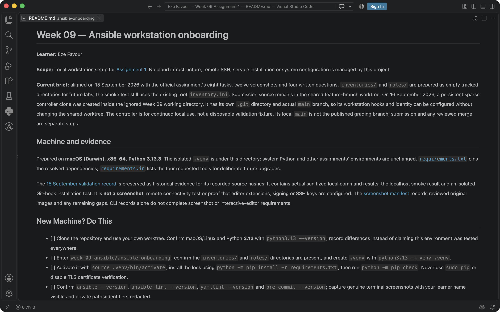

Actual VS Code Markdown preview with Eze Favour, project scope and the beginning of the reusable 12-item checklist.

---

# Assignment Questions

Answer the following in your own words:

**1. What is one feature that makes your workstation setup team-friendly?**

The tools and their dependencies are pinned in a project-local environment, with consistent editor settings and lint hooks. Another learner can reproduce the same checks without relying on a global Ansible installation.

---

**2. What is one pitfall you avoided while completing the setup?**

A Git worktree can share hooks with its parent repository. The actual controller therefore uses a persistent clone with its own Git metadata. Its real hook installation is separate from the disposable fixture used for intentional failure tests. The smoke playbook is restricted to localhost and does not use privilege escalation or contact a cloud host.

---

**3. Why should Ansible be installed inside a Python virtual environment?**

A project-local virtual environment keeps Ansible and its Python dependencies separate from system Python and other projects. The pinned requirements make the tool versions reproducible for teammates, while updates can be tested in isolation. This setup uses its own `.venv` instead of changing global packages.

---

**4. Why must SSH private keys and `.venv/` remain outside version control?**

An SSH private key can authenticate as its owner, so committing it would expose access and leave recoverable copies in Git history. The `.venv/` directory contains local, platform-dependent packages and executable paths, not portable source. Recreate it from the pinned requirements instead of committing it.

---

## Implementation notes

**Proxy/CA:** no custom corporate proxy or CA configuration was added. If a managed network requires one, use the administrator-approved trust configuration; do not disable certificate or SSH host-key verification.

**AI assistance:** Codex prepared the persistent controller; the learner created and loaded the SSH key privately. Copilot continued that setup, executed the recorded checks, operated the authorized genuine VS Code window and captured the original images. Local OCR, source checks and PNG integrity/privacy checks support the evidence; no human review, invented manual action, remote SSH connection or new grade is claimed.

---

# Required Files

Confirm that the following files are included in your assignment workspace:

- [x] `README.md`
- [x] `requirements.txt`
- [x] `.gitignore`
- [x] `.editorconfig`
- [x] `.vscode/settings.json`
- [x] `ansible.cfg`
- [x] `.pre-commit-config.yaml`
- [x] `inventories/`
- [x] `roles/`

---

# Submission Instructions

- Add all required screenshots in your submission.
- Full Name must be visible in required screenshots.
- All screenshots must be readable.
- Answer all assignment questions clearly in your own words.
- Do not expose SSH private-key contents, passwords, access tokens, API keys, credentials, private certificates, or other sensitive information.

---

# Completion Checklist

- [x] Task 1: `ansible-onboarding` workspace created
- [x] Task 1: Actual persistent controller Git repository uses the `main` branch
- [x] Task 1: `.gitignore` created
- [x] Task 2: Python virtual environment created
- [x] Task 2: Virtual environment activated
- [x] Task 2: Ansible installed inside `.venv`
- [x] Task 2: `ansible-lint`, `yamllint`, and `pre-commit` installed
- [x] Task 2: `requirements.txt` created
- [x] Task 3: Required VS Code extensions installed in the isolated genuine VS Code profile
- [x] Task 3: VS Code uses the Python interpreter from `.venv`
- [x] Task 3: `.vscode/settings.json` created
- [x] Task 3: `.editorconfig` created
- [x] Task 4: `ansible.cfg` created
- [x] Task 4: Ansible loads `ansible.cfg` from the project directory
- [x] Task 5: Separate ED25519 SSH key exists
- [x] Task 5: SSH private-key contents have not been read or exposed
- [x] Task 5: SSH key loaded in the learner’s Terminal; public-key match verified by the helper
- [x] Task 5: `~/.ssh/config` contains the reviewed safe Week 09 alias; effective settings verified
- [x] Task 5: `~/.ssh/known_hosts` exists (existence only; no remote fingerprint verification claimed)
- [x] Task 6: Git identity configured in the persistent controller
- [x] Task 6: Pre-commit hooks installed in the persistent controller’s own Git directory
- [x] Task 7: `pre-commit run --all-files` completes successfully
- [x] Task 8: `README.md` contains your full name and workstation details
- [x] Task 8: “New Machine? Do This” checklist contains 10–12 items
- [x] All 12 required screenshots are included
- [x] Assignment questions are answered
- [x] No sensitive information is exposed

---

## About DMI & CloudAdvisory

DevOps Micro Internship (DMI) is a project-based DevOps program run by Pravin Mishra and The CloudAdvisory, focused on real-world execution, systems thinking, and career readiness.

It helps learners build strong DevOps foundations with hands-on experience.

---

## Resources

- DMI Official Website: [https://dmi.pravinmishra.com?utm_source=github&utm_medium=readme](https://dmi.pravinmishra.com?utm_source=github&utm_medium=readme)
- University: [https://university.pravinmishra.com?utm_source=github&utm_medium=readme](https://university.pravinmishra.com?utm_source=github&utm_medium=readme)
- Discord Community: [https://discord.pravinmishra.com?utm_source=github&utm_medium=readme](https://discord.pravinmishra.com?utm_source=github&utm_medium=readme)
- Blog: [https://dmi.pravinmishra.com/blog?utm_source=github&utm_medium=readme](https://dmi.pravinmishra.com/blog?utm_source=github&utm_medium=readme)
- YouTube Playlist: [https://www.youtube.com/playlist?list=PLFeSNDtI4Cho](https://www.youtube.com/playlist?list=PLFeSNDtI4Cho)
- Pravin Mishra LinkedIn: [https://www.linkedin.com/in/pravin-mishra-aws-trainer/](https://www.linkedin.com/in/pravin-mishra-aws-trainer/)
- CloudAdvisory LinkedIn: [https://www.linkedin.com/company/thecloudadvisory/](https://www.linkedin.com/company/thecloudadvisory/)

---

*This submission is part of DevOps Micro Internship (DMI) — Agentic AI Track.*
