# Assignment 02 — Provision Linux VMs with Terraform and Run Ansible Ad-Hoc Commands

Part of the DevOps Micro Internship (DMI) with Agentic AI

**Learner:** Eze Favour. **Choice:** Azure only, four Ubuntu 22.04 VMs (`web1`, `web2`, `app1`, `db1`).

**Submission status: PARTIAL RUNTIME EVIDENCE — CLEANUP VERIFIED; COURSEWORK INCOMPLETE.** The coordinator genuinely applied the separately reviewed 23-create D2lds_v6 plan, retrieved role/IP outputs, authenticated host keys using Azure boot diagnostics, checked SSH hostnames/cloud-init and rendered the inventories. Ansible ping then failed locally during callback loading, before managed tasks; later ad-hoc operations and A3 deployment were not run. Reviewed teardown deleted all 23 Terraform resources and passed 16 verification checks at **2026-09-16 21:53:43 UTC**, before the original **22:22:02 UTC** deadline. No zero-charge claim is made. The temporary A2+A3 allocation was at most US$2/two hours; it does not authorize a retry. Azure replaced unavailable non-root AWS permissions without escalation; expired AWS enrollment was not renewed. No extra A3 hosts were created.

Copilot assisted implementation, diagnosis, validation and evidence preparation. Actual live operations and native captures were coordinator-operated, not invented learner actions or personal reflection. See the [runbook](ansible-adhoc-lab/README.md), [sanitized actual receipts](ansible-adhoc-lab/runtime-validation.json) and [17-slot screenshot manifest](screenshots/assignment-02-manifest.json). Genuine captures fulfill slots **1, 3, 4, 5, 6, 7, 9, 10, 11**; **2, 8, 12–17** and LinkedIn remain pending. The failed-ping image is supplemental only. Original requirements are retained. Resources are deleted, historical IPs may be reassigned, and all runtime approvals are retired.

---

## Purpose

In this assignment, you will use Terraform to provision three or four Ubuntu Linux Virtual Machines on either Microsoft Azure or Amazon Web Services.

You will configure SSH key-based authentication, organize the servers using a custom Ansible inventory, and run Ansible ad-hoc commands across individual hosts and inventory groups.

---

# Task 1 — Create the Multi-Host Lab Structure

## Goal

Create a separate project directory for the multi-host lab and prepare the Terraform, Ansible, and documentation files.

This project will use the Git repository and Ansible controller prepared in Assignment 01.

### Evidence

#### Screenshot 1 — Terminal showing the complete `ansible-adhoc-lab` project structure

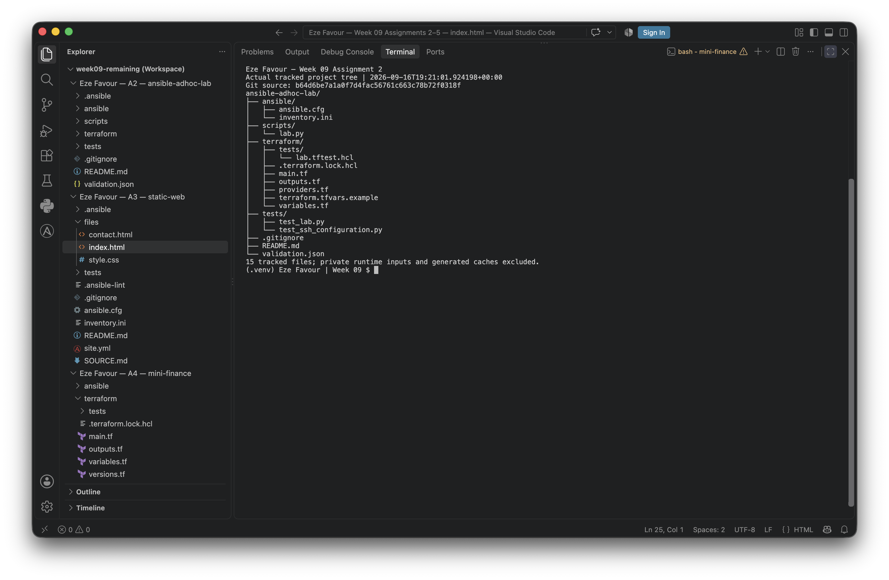

**Captured 16 September 2026, 19:21:03 UTC — source structure only.** The coordinator-approved native VS Code terminal capture shows the actual 15 tracked filenames at `b64d6be` and Eze Favour. Private files are excluded. It binds filenames, not subsequent README/validation content. Original bytes and the private run receipt were verified; see [manifest slot 1](screenshots/assignment-02-manifest.json).

---

#### Screenshot 2 — Terminal showing `git status --short` with the new project files and updated `.gitignore`

**PENDING — Screenshot 2 (historical evidence not captured).** The initial new files are already committed. Do not reset, untrack or manufacture a dirty status to recreate this moment. An honestly labelled `git show --stat` can provide supplemental history, but does **not** fulfill the requested initial `git status --short` screenshot. Capture guidance: [manifest slot 2](screenshots/assignment-02-manifest.json).

---

### Notes

Created the required Terraform, Ansible, helper, test and README files. Ignore rules are project-local to preserve the repository root and Assignment 1. The genuine tracked-tree capture is included; the initial uncommitted-state capture remains missing historical evidence.

---

# Task 2 — Create the Terraform Configuration

## Goal

Create the Terraform configuration required to provision three or four Ubuntu Linux VMs on your selected cloud platform.

Complete only one option:

- Option A — Microsoft Azure
- Option B — Amazon Web Services

Do not configure both providers for this assignment.

### Evidence

#### Screenshot 3 — Terraform configuration showing the three or four server roles and the `for_each` or `count` implementation

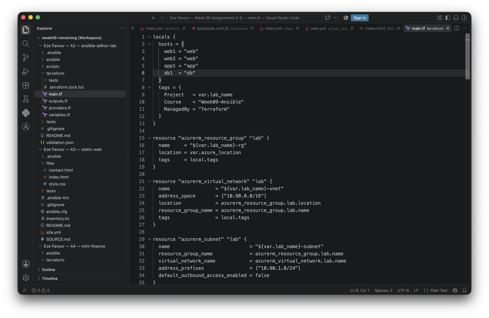

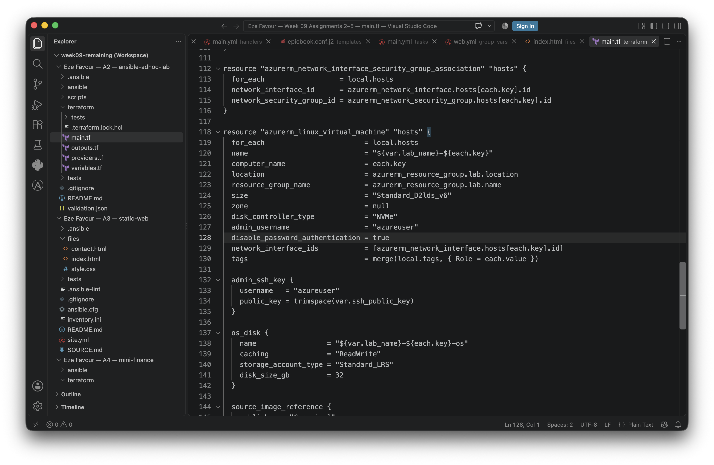

**Captured 16 September 2026, 19:21:45 and 19:21:56 UTC — source only.** These untouched native VS Code images show `main.tf` lines 1–13 and 118–142 from `b64d6be`, including all four roles and VM `for_each`. The coordinator approved the captures; image, receipt and source hashes were verified. See [manifest slot 3](screenshots/assignment-02-manifest.json). This does not prove VMs exist.

---

#### Screenshot 4 — Terraform configuration showing SSH restricted to the controller IP and HTTP allowed only for web hosts

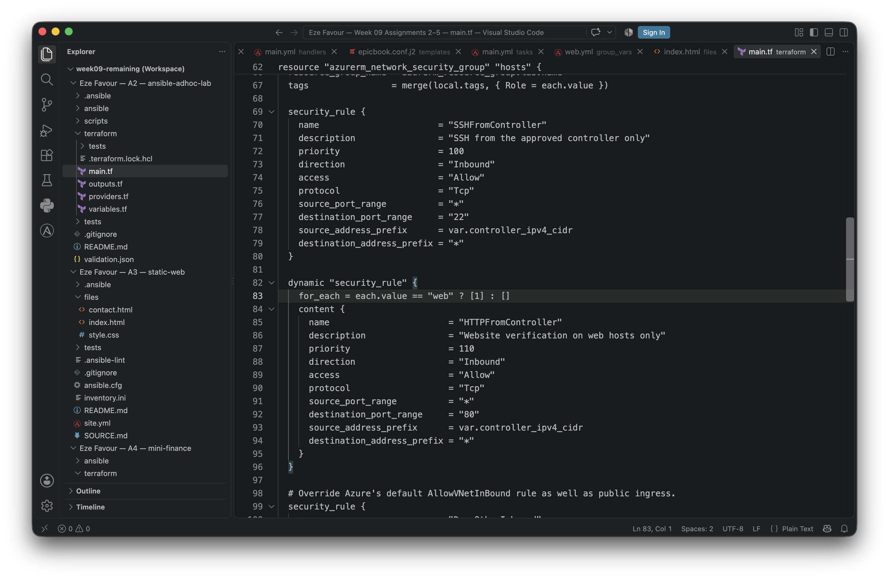

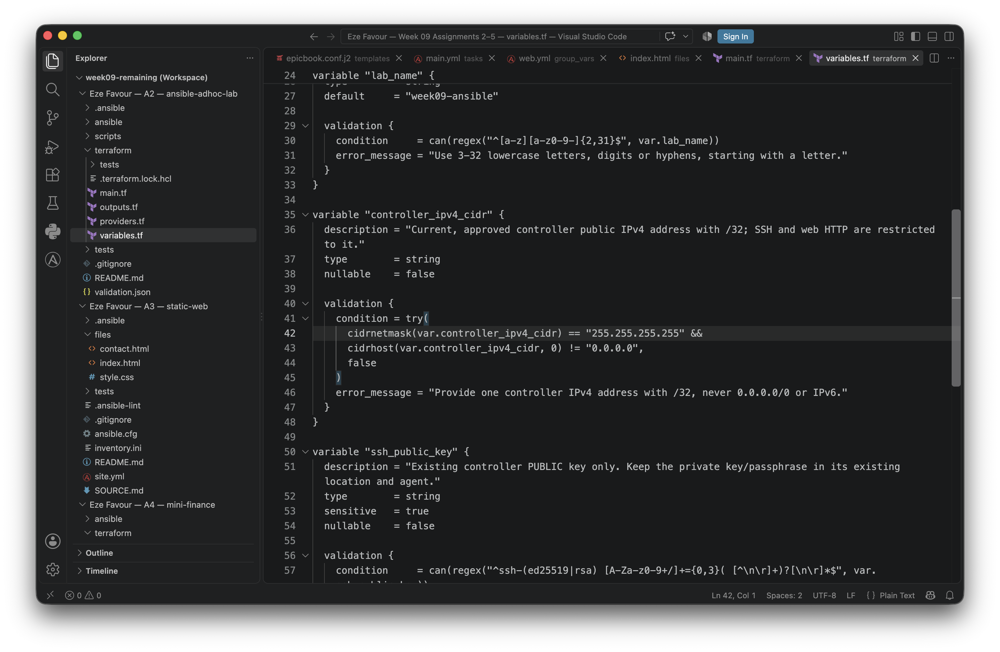

**Captured 16 September 2026, 19:22:07 and 19:22:18 UTC — source only.** The approved original images show `main.tf` lines 69–96 and `variables.tf` lines 35–48 at `b64d6be`: controller-source SSH, conditional web-only HTTP and IPv4 `/32` validation. The additional deny rule remains in source outside these intended ranges. Byte/source/receipt hashes are in [manifest slot 4](screenshots/assignment-02-manifest.json); no deployed-network result is claimed.

---

#### Screenshot 5 — Terraform output configuration showing how public IP addresses are associated with the server roles

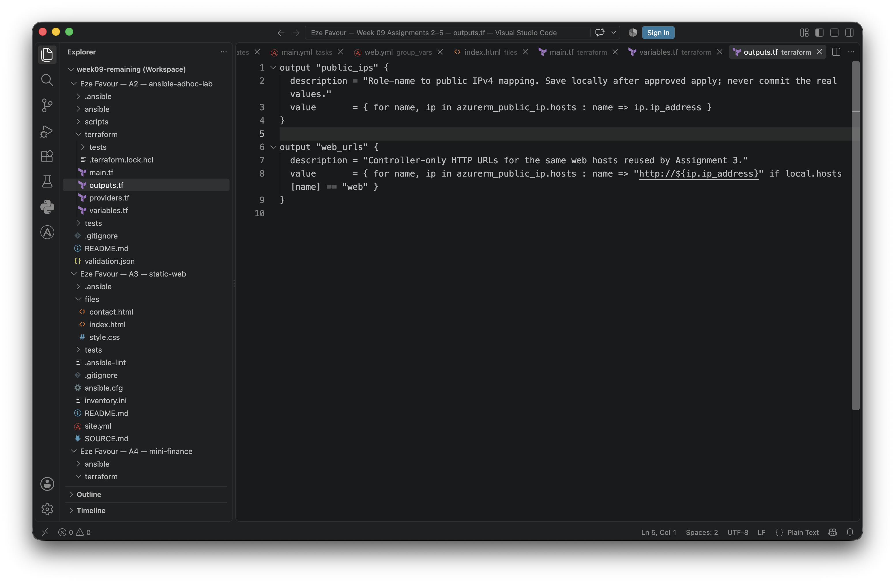

**Captured 16 September 2026, 19:22:30 UTC — output configuration only.** This untouched, coordinator-approved VS Code image shows `outputs.tf` lines 1–9 at `b64d6be`. Source/image/receipt hashes are verified in [manifest slot 5](screenshots/assignment-02-manifest.json). These are definitions, **not assigned public IP values or live Terraform output**.

---

### Notes

Selected Azure only at the coordinator's direction. The approved replacement is four **nonzonal Standard_D2lds_v6** Ubuntu 22.04 hosts (eight vCPUs total), explicit NVMe controllers and the pinned Canonical Gen2 image `22.04.202608060`. Managed OS disks remain 32 GiB Standard_LRS; ephemeral local disks are not used for application data. The hosts retain for_each, dedicated networking, controller-only SSH, web-only HTTP, existing public-key authentication and role-keyed outputs. AzureRM stays pinned to 4.47.0. No second cloud provider or extra A3 hosts are configured. A5's pilot and coordinator review of A2's sealed plan preceded the historical apply. All old approvals are now retired.

---

# Task 3 — Provision the Infrastructure with Terraform

## Goal

Initialize and validate the Terraform configuration, review the execution plan, provision the selected three or four VMs, and retrieve their public IP addresses.

### Evidence

#### Screenshot 6 — Final `terraform apply` output showing `Apply complete`

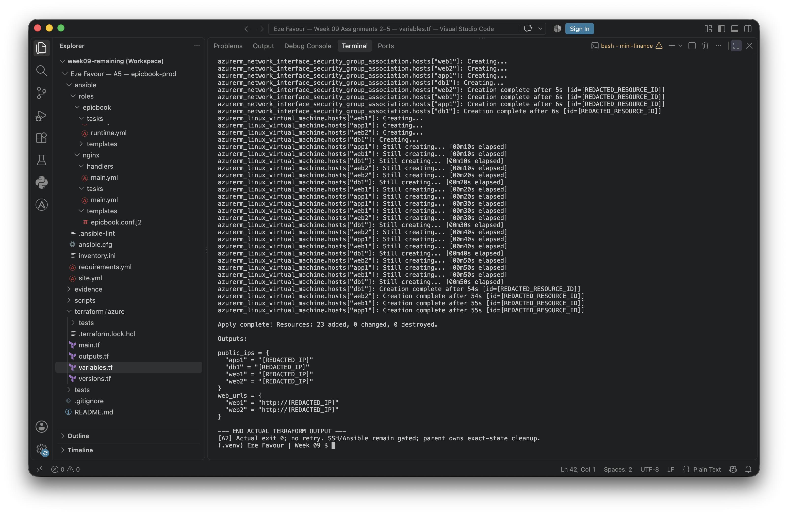

**Captured 16 September 2026, 20:26:38 UTC.** The coordinator's genuine native terminal capture shows `Apply complete` for the reviewed **23-create** plan, SHA `82d9d251902771e986f7b2ed7428e986848cd97ab5388a03217ff614442477cc`, at source `4fa07f3`. No pixel edits were made. Sensitive values were redacted from the actual live display; this image alone does not prove the IP mapping. See [manifest slot 6](screenshots/assignment-02-manifest.json).

---

#### Screenshot 7 — `terraform output public_ips` showing the role-to-IP mapping for all three or four VMs

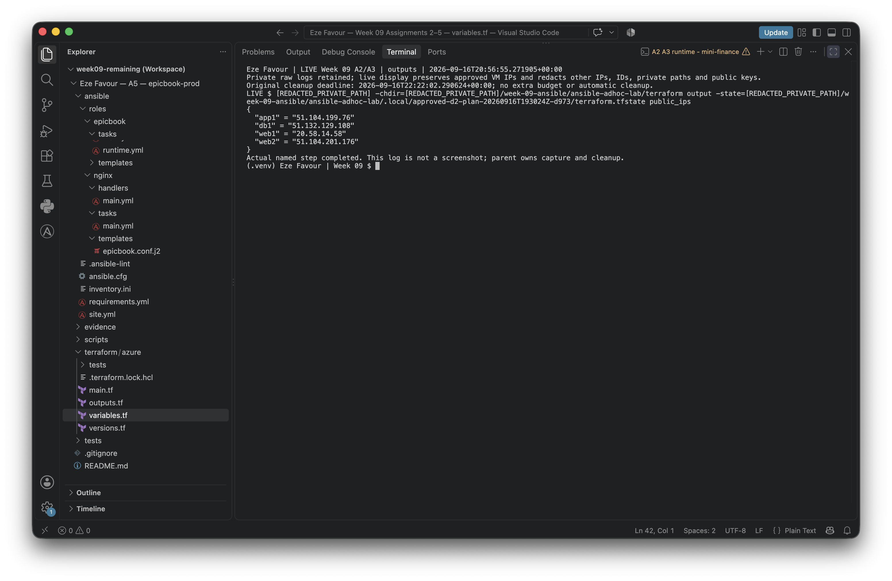

**Captured 16 September 2026, 20:57:18 UTC.** Actual output against the approved state shows all four roles and their public IPs. Only state-validated VM addresses were exempted from live-stream privacy redaction; no image pixels were changed. These are **historical addresses, not live endpoints** after cleanup. Timestamp comes from the native capture filename (UTC+01:00 workstation, second precision); the terminal's earlier time is the command start. See [manifest slot 7](screenshots/assignment-02-manifest.json).

---

#### Screenshot 8 — Azure Portal or AWS Management Console showing all three or four VMs in the `Running` state, with their role-based names visible

**PENDING — Screenshot 8.** No authenticated Azure Portal image was captured. Apply/SSH evidence cannot substitute for the required Portal view, and the VMs have since been deleted. See [manifest slot 8](screenshots/assignment-02-manifest.json). Do not recreate infrastructure merely to manufacture missing historical evidence.

---

### Notes

The D2lds_v6/NVMe/pinned-image source passed real backend-disabled init/validate and seven mocked plan tests. A later identity-before-plan seal, successful A5 pilot and exact-plan review preceded the coordinator's genuine A2 apply. Historical B1s plans remain preserved and were never applied. A2's eight cores and A5's two used the reviewed ten-core allocation without headroom. The two-hour estimate was **US$1.60812 including US$0.50 contingency**, below US$2, not a guaranteed invoice cap. The coordinator subsequently applied a reviewed **23-delete** teardown and verified empty state serial **48**, resource-group absence and explicit VM/disk/IP absence at **21:53:43 UTC**. [Sanitized actual receipts](ansible-adhoc-lab/runtime-validation.json) distinguish successful provisioning/cleanup from missing Portal and managed-task evidence.

---

# Task 4 — Verify SSH Key-Based Access

## Goal

Verify that each managed VM can be accessed from the Ansible controller using SSH key-based authentication.

### Evidence

#### Screenshot 9 — Terminal showing successful SSH hostname output from all VMs

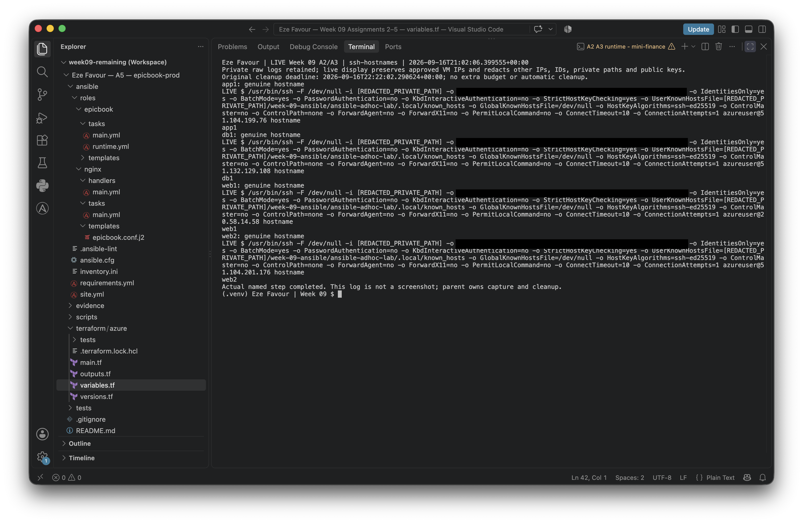

**Captured 16 September 2026, 21:05:19 UTC.** Actual existing-key SSH returned all four role hostnames after authenticated Azure boot-diagnostic fingerprint matching and strict task-local known-host trust. Only **four private IdentityAgent socket spans** were blackboxed in this approved publish copy; public IPs, hostnames and original soft wraps are unchanged. The private original remains intact. [Manifest slot 9](screenshots/assignment-02-manifest.json) records raw/derivative hashes, exact pixel rectangles, processing-source hash, native OCR and pixel proof: **121,900 changed pixels inside masks; zero outside**. Capture time is from the native filename, at second precision. No human review is claimed.

---

### Notes

The coordinator used the existing loaded identity as `azureuser`, authenticated fingerprints against Azure boot diagnostics, and kept only matching keys in private task-local known_hosts. No global trust changes or key generation were used. Hostname and later cloud-init readiness checks succeeded for all four hosts. This historical SSH result is not Ansible ping success and does not authorize contacting the deleted VMs' former addresses.

---

# Task 5 — Create the Custom Ansible Inventory

## Goal

Create an Ansible inventory file that groups the managed VMs by role.

The inventory allows Ansible to run commands against all servers, or only specific groups such as `web`, `app`, or `db`.

### Evidence

#### Screenshot 10 — `inventory.ini` showing the `web`, `app`, and `db` groups

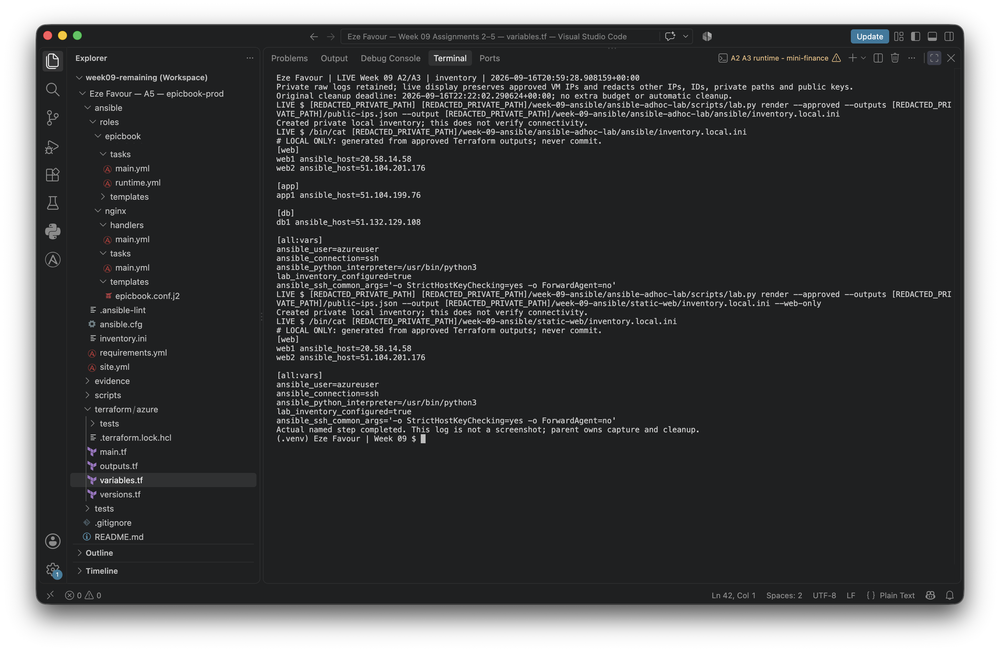

**Captured 16 September 2026, 20:59:55 UTC.** This is the actual mode-0600, ignored `inventory.local.ini`, explicitly rendered from approved Terraform outputs. It shows `web`, `app`, `db` and all four historical role/IP mappings; the tracked `inventory.ini` remains a safe unconfigured template. No pixel edits were made. See [manifest slot 10](screenshots/assignment-02-manifest.json).

---

#### Screenshot 11 — Output of `ansible-inventory -i inventory.ini --graph`

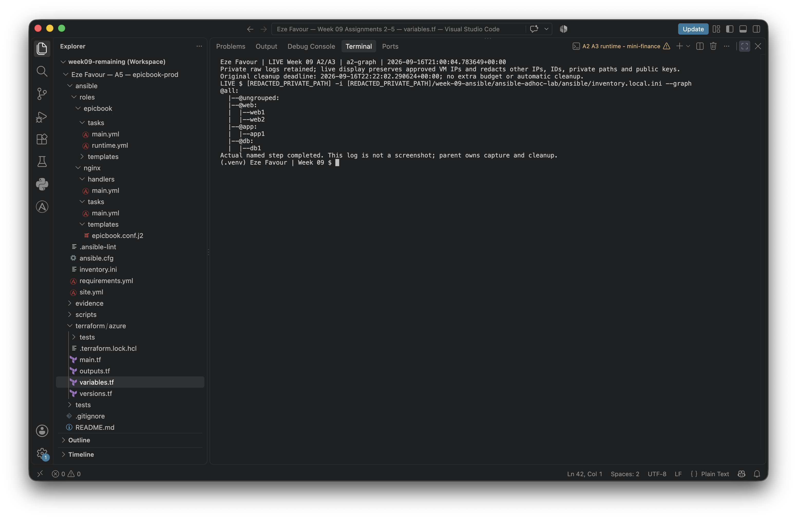

**Captured 16 September 2026, 21:00:48 UTC.** The actual local graph uses the generated `inventory.local.ini` counterpart and shows the web/app/db memberships. A graph parses inventory; it does not connect to managed hosts. Original PNG bytes are unchanged. Both capture times above come from native filenames (UTC+01:00 workstation, second precision). See [manifest slot 11](screenshots/assignment-02-manifest.json).

---

### Notes

Both required `inventory.ini` templates remain deliberately unconfigured. The coordinator genuinely rendered validated, ignored mode-0600 inventories from the successful apply outputs; A3 selected the same web1/web2, with no extra hosts. Current retained private inventories are historical evidence only. After verified cleanup they must not be used for SSH or HTTP requests.

---

# Task 6 — Run Ansible Ad-Hoc Commands

## Goal

Run Ansible ad-hoc commands from the controller to verify connectivity, check server information, and manage packages and services across inventory groups.

This task proves that the inventory is working and that Ansible can control multiple managed VMs without writing a playbook.

### Evidence

#### Screenshot 12 — Output of `ansible all -i inventory.ini -m ping`

**PENDING — Screenshot 12 success evidence.** The genuine attempt failed locally in callback loading with `ValueError: A non-empty plugin name is required` (exit 250), **before managed ping tasks**. No four-host SUCCESS/pong result exists. See [manifest slot 12](screenshots/assignment-02-manifest.json).

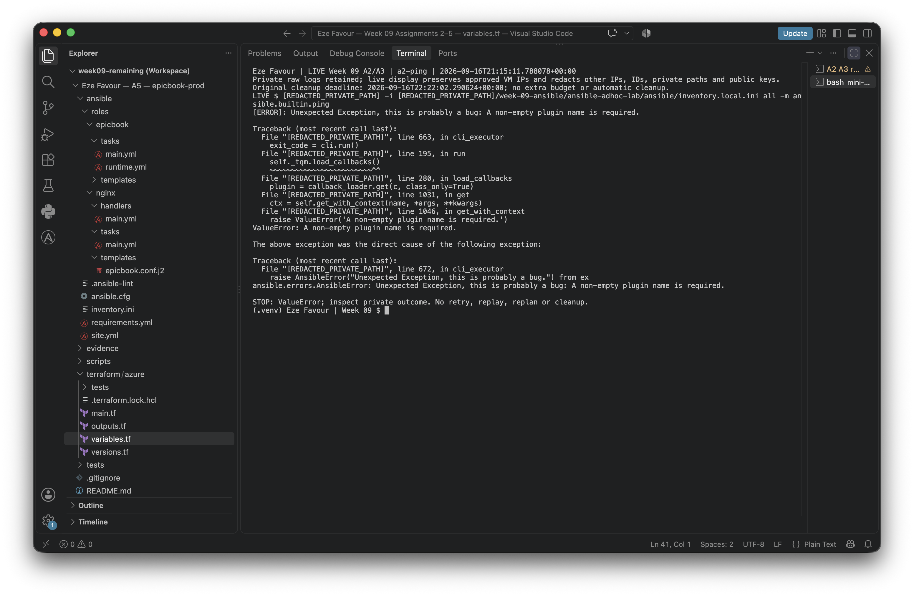

**Supplemental failure capture: 16 September 2026, 21:16:06 UTC** (native filename, second precision). The original image is unmodified. The private wrapper set `ANSIBLE_CALLBACKS_ENABLED=''`, which core 2.21.4 interprets as `['']`. Execution stopped; this image does **not** complete slot 12. After cleanup, a new private helper omitted the variable and five local regressions passed, including a localhost-only pong. No live retry was performed.

---

#### Screenshot 13 — Output of `ansible all -i inventory.ini -m command -a "uptime"`

**PENDING — Screenshot 13.** Not run after the controller callback failure; execution stopped and all resources were deleted. No current retry is authorized. Show uptime from all four real managed hosts. Capture guidance: [manifest slot 13](screenshots/assignment-02-manifest.json).

---

#### Screenshot 14 — Output of `ansible web -i inventory.ini -m apt -a "name=nginx state=present update_cache=yes" --become`

**PENDING — Screenshot 14.** Not run after the controller callback failure; execution stopped and all resources were deleted. No current retry is authorized. Show actual apt result for web1/web2 with become. Capture guidance: [manifest slot 14](screenshots/assignment-02-manifest.json).

---

#### Screenshot 15 — Output of `ansible web -i inventory.ini -m service -a "name=nginx state=started enabled=yes" --become`

**PENDING — Screenshot 15.** Not run after the controller callback failure; execution stopped and all resources were deleted. No current retry is authorized. Show Nginx started and enabled on both web hosts. Capture guidance: [manifest slot 15](screenshots/assignment-02-manifest.json).

---

#### Screenshot 16 — Output of `ansible all -i inventory.ini -m apt -a "name=htop state=present update_cache=yes" --become`

**PENDING — Screenshot 16.** Not run after the controller callback failure; execution stopped and all resources were deleted. No current retry is authorized. Show actual htop package result for every host with become. Capture guidance: [manifest slot 16](screenshots/assignment-02-manifest.json).

---

#### Screenshot 17 — Output of `ansible web -i inventory.ini -m command -a "systemctl is-active nginx"`

**PENDING — Screenshot 17.** Not run after the controller callback failure; execution stopped and all resources were deleted. No current retry is authorized. Show active from both web hosts. Capture guidance: [manifest slot 17](screenshots/assignment-02-manifest.json).

---

### Notes

The runbook and fixed wrapper include all six required ad-hoc operations with fully qualified builtin modules. Privilege escalation is used only for package/service changes. Tests cover command construction and rejection before execution; no SUCCESS/pong, remote apt/service result or Nginx active result is claimed.

---

# LinkedIn Post Required

## Evidence

#### LinkedIn Post URL

Paste your LinkedIn post URL here:

**PENDING — not published; separate authorization required.**

---

#### Screenshot — Published LinkedIn post

**PENDING — LinkedIn screenshot.** Publication is not authorized and no post exists. Only a genuine separately approved published post may satisfy this slot.

---

# Assignment Questions

Answer the following in your own words:

**1. What is the purpose of an Ansible inventory file?**

An inventory names the managed hosts, associates connection settings with them, and groups them so a command can target all hosts or a role. The tracked inventory here is deliberately unconfigured; only the explicitly generated local inventory contains approved real addresses.

---

**2. What is the difference between the `web`, `app`, and `db` groups in your inventory?**

`web` contains web1 and web2 and receives Nginx/HTTP tasks. `app` contains app1 and `db` contains db1; these are organizational roles only, not evidence that application or database software is installed. The planned connectivity, uptime and htop commands target all four; they did not complete in this run.

---

**3. What does the Ansible `ping` module verify?**

Ansible ping verifies that the controller can authenticate over the configured SSH transport, run the Python-based module on the host, and receive pong. It is not ICMP ping and does not prove Nginx or HTTP content is healthy.

---

**4. Why do package installation commands require `--become`?**

Installing packages and changing system services need root privileges on Ubuntu. `--become` asks Ansible to escalate the existing SSH user for those tasks instead of connecting as root. Read-only uptime/status tasks do not request escalation.

---

**5. When would you use an ad-hoc command instead of a playbook?**

Use an ad-hoc command for a small, one-off operation such as checking uptime or service status across a group. Use a playbook for a repeatable ordered workflow with multiple tasks, assertions and handlers, as in Assignment 3.

---

**6. What is one challenge you faced while setting up SSH or inventory, and how did you fix it?**

**Firsthand reflection: PENDING learner input.** Actual coordinator-operated SSH hostname checks succeeded. The later Ansible attempt failed in private controller callback configuration, not SSH trust: a blank callback list variable was parsed as an empty plugin name. The original failure was preserved; a new private omission fix passed local-only regressions after cleanup, without a managed-host retry. Inventory safeguards used .invalid templates, validated outputs and exclusive mode-0600 rendering. These are AI-assisted engineering notes, not invented learner experiences.

---

# Required Files

Confirm that the following files are included in your assignment workspace:

- [x] `ansible-adhoc-lab/README.md`
- [x] `ansible-adhoc-lab/terraform/providers.tf`
- [x] `ansible-adhoc-lab/terraform/main.tf`
- [x] `ansible-adhoc-lab/terraform/variables.tf`
- [x] `ansible-adhoc-lab/terraform/outputs.tf`
- [x] `ansible-adhoc-lab/ansible/inventory.ini`
- [x] Updated `.gitignore`

---

# Submission Instructions

- Add all required screenshots from the tasks.
- Full Name must be visible in required screenshots.
- Mention whether you used Azure or AWS.
- Mention whether you used the three-VM option or four-VM option.
- Add the public IP addresses of the VMs, redacted if preferred.
- Add your `inventory.ini` proof.
- Add a short explanation of what you learned.
- Answer all assignment questions clearly in your own words.
- Add your LinkedIn post URL.
- Do not expose SSH private keys, Terraform state files, cloud credentials, passwords, access keys, secret keys, account IDs, or subscription IDs.

---

# Completion Checklist

Checked source/local items and historical apply/SSH results are distinguished below. Successful apply and strict four-host SSH are genuinely evidenced; **all VMs have since been deleted**. The Running-state Portal image is missing. Managed Ansible tasks, remaining screenshots, learner-owned reflection and publication are incomplete; a local graph or localhost pong does not replace them.

- [x] Task 1: `ansible-adhoc-lab` project structure created
- [x] Task 1: `.gitignore` updated for Terraform files
- [x] Task 2: Terraform configuration created
- [x] Task 2: Server roles defined for either three or four VMs
- [x] Task 2: `count` or `for_each` used
- [x] Task 2: SSH restricted to the controller public IP
- [x] Task 2: HTTP allowed only for web hosts
- [x] Task 2: Terraform output maps roles to public IPs
- [x] Task 3: Terraform initialized successfully
- [x] Task 3: Terraform configuration validated
- [x] Task 3: Terraform apply completed successfully
- [ ] Task 3: All selected VMs are running
- [x] Task 4: SSH key-based access works for every VM
- [x] Task 5: `inventory.ini` contains `web`, `app`, and `db` groups
- [x] Task 5: `ansible-inventory -i inventory.ini --graph` shows the correct groups
- [ ] Task 6: `ansible all -i inventory.ini -m ping` returns `SUCCESS`
- [ ] Task 6: Ad-hoc commands run successfully
- [ ] Task 6: `--become` was used for package and service tasks
- [ ] Task 6: Nginx is active on the `web` group
- [ ] Screenshots 1–17 are included
- [ ] Assignment questions are answered
- [ ] LinkedIn post published
- [ ] LinkedIn post URL added
- [ ] No sensitive information is exposed

---

## About DMI & CloudAdvisory

DevOps Micro Internship (DMI) is a project-based DevOps program run by Pravin Mishra and The CloudAdvisory, focused on real-world execution, systems thinking, and career readiness.

It helps learners build strong DevOps foundations with hands-on experience.

---

## Resources

- DMI Official Website: [https://dmi.pravinmishra.com?utm_source=github&utm_medium=readme](https://dmi.pravinmishra.com?utm_source=github&utm_medium=readme)
- University: [https://university.pravinmishra.com?utm_source=github&utm_medium=readme](https://university.pravinmishra.com?utm_source=github&utm_medium=readme)
- Discord Community: [https://discord.pravinmishra.com?utm_source=github&utm_medium=readme](https://discord.pravinmishra.com?utm_source=github&utm_medium=readme)
- Blog: [https://dmi.pravinmishra.com/blog?utm_source=github&utm_medium=readme](https://dmi.pravinmishra.com/blog?utm_source=github&utm_medium=readme)
- YouTube Playlist: [https://www.youtube.com/playlist?list=PLFeSNDtI4Cho](https://www.youtube.com/playlist?list=PLFeSNDtI4Cho)
- Pravin Mishra LinkedIn: [https://www.linkedin.com/in/pravin-mishra-aws-trainer/](https://www.linkedin.com/in/pravin-mishra-aws-trainer/)
- CloudAdvisory LinkedIn: [https://www.linkedin.com/company/thecloudadvisory/](https://www.linkedin.com/company/thecloudadvisory/)

---

*This submission is part of DevOps Micro Internship (DMI) — Agentic AI Track.*
