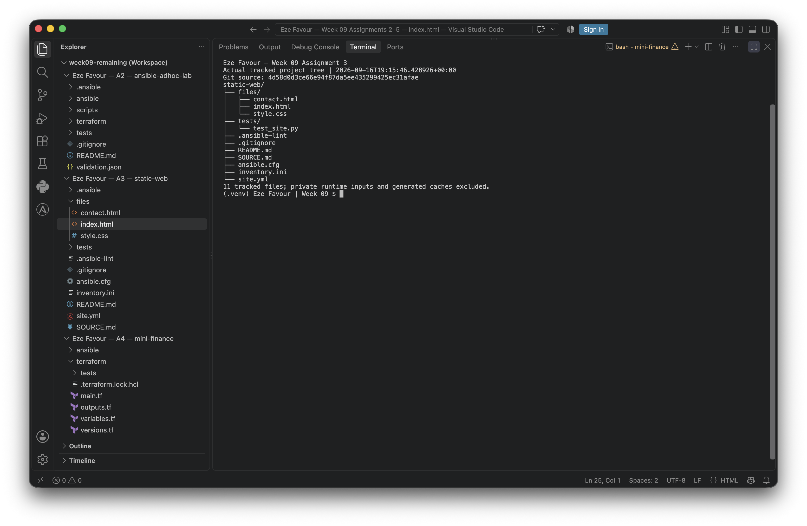
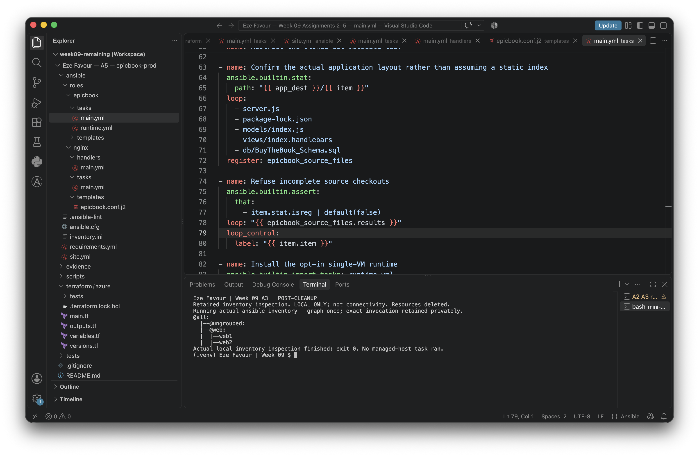
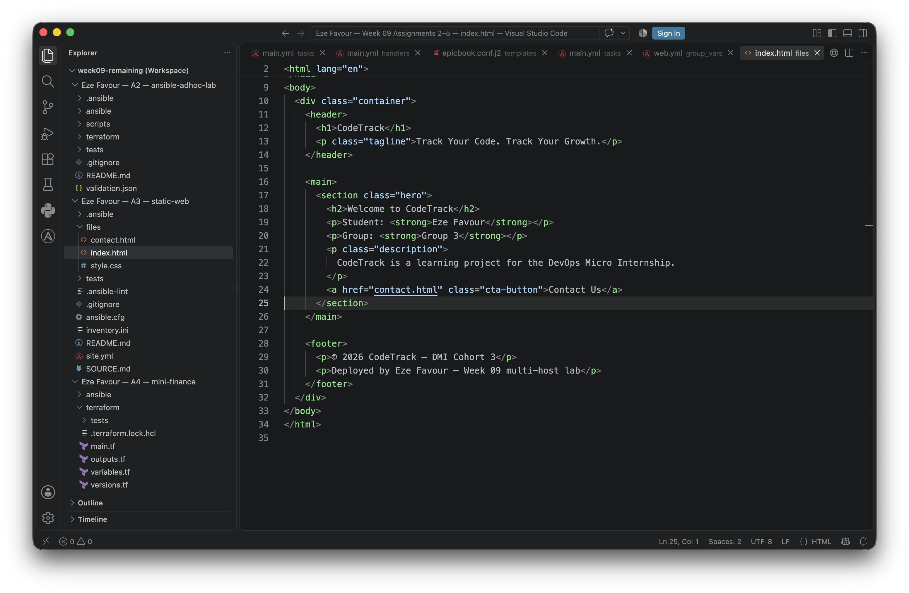
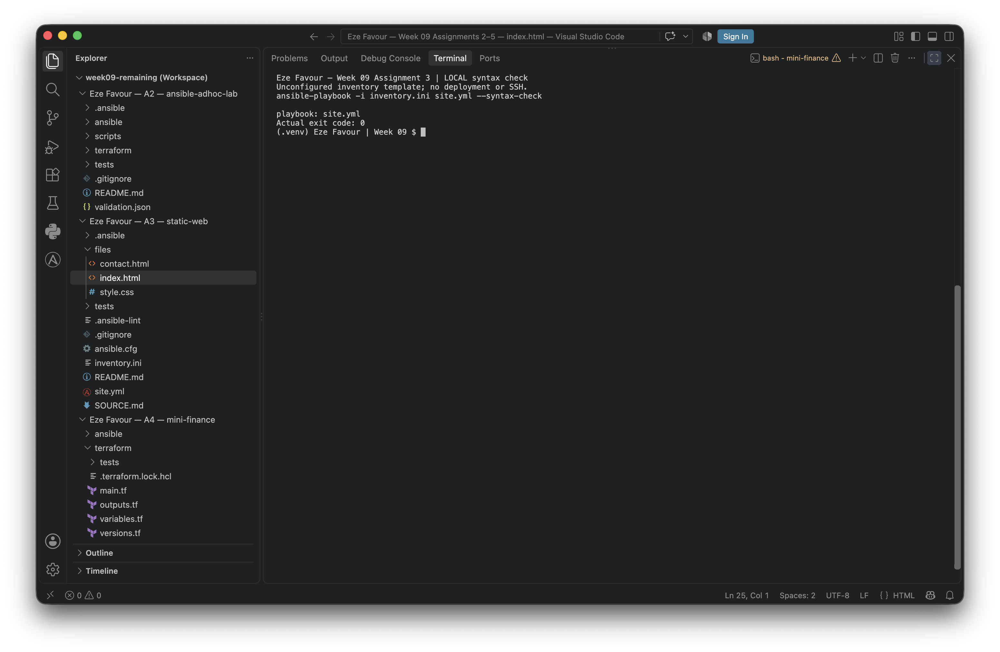

# Assignment 03 — Deploy a Static Website to Multiple Servers Using a Multi-Play Ansible Playbook

Part of the DevOps Micro Internship (DMI) with Agentic AI

---

## Student Details

**Full Name:** Eze Favour

**Cloud Platform Used:** Azure, reusing Assignment 2's web1/web2 (no extra VMs).

**Server 1 URL:** PENDING — website never deployed; former VM IP retired after cleanup.

**Server 2 URL:** PENDING — website never deployed; former VM IP retired after cleanup.

**Submission status: CODE PREPARATION — NOT DEPLOYMENT-COMPLETE.** Three plays, source provenance, syntax/lint and loopback-only tests are prepared. A2's four D2lds_v6 hosts were genuinely provisioned and SSH-checked under separate approval, but a private controller callback error stopped Ansible before managed ping tasks. **A3 deployment, HTTP checks, remote idempotency and browser evidence never ran.** All infrastructure was deleted; cleanup passed 16 checks at **2026-09-16 21:53:43 UTC**, before the original deadline. No extra A3 VMs were created, zero charges are not claimed, and no former IP may be contacted. The US$2/two-hour temporary A2+A3 approval is retired; no AWS fallback or retry is authorized.

Copilot assisted implementation, the genuine download, diagnosis, local checks and evidence preparation. Coordinator-operated results are not learner firsthand reflection. The [11-slot screenshot manifest](screenshots/assignment-03-manifest.json) retains every slot plus LinkedIn. **Slots 1, 2, 4 and 5 have genuine local captures**; slot 2 is explicitly **post-cleanup retained-inventory inspection, not connectivity**. Slots **3, 6–11** and LinkedIn remain pending. See [actual A2/cleanup receipts](ansible-adhoc-lab/runtime-validation.json). The learner must review the technical answers and provide their own genuine reflection.

---

## Purpose

In this assignment, you will create a multi-play Ansible playbook to install Nginx, deploy a static website to two Ubuntu servers, and verify that the website is accessible from both servers.

You may use either AWS EC2 instances or Azure Virtual Machines as your managed servers.

---

# Task 1 — Create the Project Structure

## Goal

Create the required folders and files for the Ansible project.

## Evidence

### Screenshot 1 — Terminal or VS Code showing the complete `static-web` project structure



**Captured 16 September 2026, 19:15:48 UTC — local structure only.** The coordinator-approved native VS Code terminal capture shows an actual foreground listing of all 11 tracked `static-web` files and Eze Favour. Private/generated files are excluded. This binds the filename list from `4d58d0d`, not later README content. Original image bytes, source filenames and run-receipt hash were verified; see [manifest slot 1](screenshots/assignment-03-manifest.json).

---

# Task 2 — Configure the Ansible Inventory

## Goal

Add both Ubuntu servers to the Ansible inventory.

## Evidence

### Screenshot 2 — Output of `ansible-inventory -i inventory.ini --graph` showing `web1` and `web2`



**Captured 16 September 2026, 22:02:16 UTC — POST-CLEANUP, LOCAL ONLY.** The coordinator genuinely ran `ansible-inventory --graph` once against the retained, output-derived `inventory.local.ini`, with SSH/SFTP/SCP disabled. The actual graph shows `web1` and `web2`; command exit was 0 and stderr empty. It is **not connectivity or current-infrastructure evidence**: resources were already deleted. The tracked `inventory.ini` below remains unconfigured. Original PNG bytes are unchanged; timestamp is from the native filename (UTC+01:00 workstation, second precision). [Manifest slot 2](screenshots/assignment-03-manifest.json) binds config, retained inventory, executable, command receipt and image. An earlier frame omitted the hostnames and was not accepted.

---

## Configuration File

Copy and paste the complete contents of your `inventory.ini` file below:

```ini
# UNCONFIGURED TEMPLATE: .invalid names cannot be managed hosts.
# Render from A2 outputs after approval; never replace this tracked file.
[web]
web1 ansible_host=web1.invalid
web2 ansible_host=web2.invalid

[all:vars]
ansible_user=azureuser
ansible_connection=ssh
ansible_python_interpreter=/usr/bin/python3
lab_inventory_configured=false
ansible_ssh_common_args='-o StrictHostKeyChecking=yes -o ForwardAgent=no'
```

---

# Task 3 — Verify Ansible Connectivity

## Goal

Confirm that the Ansible controller can connect to both servers.

## Evidence

### Screenshot 3 — Ansible ping output showing `SUCCESS` and `pong` for both servers

**PENDING — Screenshot 3.** A3 managed-host operations were not run after A2's controller callback failure. All resources were deleted; no current retry is authorized. After approval and fingerprint review, show SUCCESS/pong for both real servers. Capture guidance: [manifest slot 3](screenshots/assignment-03-manifest.json).

---

# Task 4 — Download and Personalize the Static Website

## Goal

Download `index.html` to the Ansible controller and personalize the website with your full name.

## Evidence

### Screenshot 4 — Edited `files/index.html` showing the footer line with your full name



**Captured 16 September 2026, 19:08:57 UTC — source only.** The coordinator supplied and approved this native VS Code window capture of the actual `static-web/files/index.html` from commit `4d58d0d3ce66e94f87da5ee435299425ec31afae`. Image bytes are unchanged: no cropping, redaction, resizing or reconstruction. The title and footer show Eze Favour. Image/source SHA256 and capture-receipt hash are recorded in [manifest slot 4](screenshots/assignment-03-manifest.json); downloadable source provenance remains in [SOURCE.md](static-web/SOURCE.md). The literal “Deployed by” footer is source content, **not a claim that this site has been deployed**.

---

# Task 5 — Create the Multi-Play Ansible Playbook

## Goal

Create a single Ansible playbook containing separate plays for installation, deployment, and verification.

## Configuration File

Copy and paste the complete contents of your `site.yml` file below:

```yaml
---
- name: Install and start Nginx on the two web hosts
  hosts: web
  gather_facts: false
  become: true
  any_errors_fatal: true
  vars:
    live_execution_approved: false
  pre_tasks:
    - name: Require current approval and a configured two-host inventory before SSH
      ansible.builtin.assert:
        that:
          - live_execution_approved | bool
          - lab_inventory_configured | default(false) | bool
          - groups['web'] | sort == ['web1', 'web2']
          - hostvars[inventory_hostname].ansible_connection == 'ssh'
          - not (hostvars[inventory_hostname].ansible_host | default('') is search('invalid'))
        fail_msg: >-
          Blocked. Obtain current cloud/budget/SSH approval, render the local
          inventory from A2 outputs, and explicitly set live_execution_approved=true.
  tasks:
    - name: Install Nginx with a cached package index
      ansible.builtin.apt:
        name: nginx
        state: present
        update_cache: true
        cache_valid_time: 3600
    - name: Start and enable Nginx
      ansible.builtin.service:
        name: nginx
        state: started
        enabled: true

- name: Deploy the personalized static website
  hosts: web
  gather_facts: false
  become: true
  any_errors_fatal: true
  vars:
    live_execution_approved: false
  pre_tasks:
    - name: Require approval again before deployment
      ansible.builtin.assert:
        that:
          - live_execution_approved | bool
          - lab_inventory_configured | default(false) | bool
          - groups['web'] | sort == ['web1', 'web2']
  tasks:
    - name: Copy the website and its local assets
      ansible.builtin.copy:
        src: "files/{{ item }}"
        dest: "/var/www/html/{{ item }}"
        owner: root
        group: root
        mode: "0644"
      loop:
        - index.html
        - contact.html
        - style.css
      notify: Reload Nginx
  handlers:
    - name: Reload Nginx
      ansible.builtin.service:
        name: nginx
        state: reloaded

- name: Verify both websites from the controller
  hosts: localhost
  connection: local
  gather_facts: false
  become: false
  vars:
    live_execution_approved: false
    ansible_python_interpreter: "{{ ansible_playbook_python }}"
    ansible_remote_tmp: "{{ playbook_dir }}/.ansible/tmp"
  tasks:
    - name: Require approval and complete inventory before controller HTTP requests
      ansible.builtin.assert:
        that:
          - live_execution_approved | bool
          - groups['web'] | default([]) | sort == ['web1', 'web2']
          - hostvars['web1'].lab_inventory_configured | default(false) | bool
          - hostvars['web2'].lab_inventory_configured | default(false) | bool
    - name: Request each deployed home page without proxying or following redirects
      ansible.builtin.uri:
        url: "http://{{ hostvars[item].ansible_host }}/"
        status_code: 200
        return_content: true
        use_proxy: false
        follow_redirects: none
        timeout: 10
      loop: "{{ groups['web'] | sort }}"
      register: website_response
      until: website_response.status | default(0) == 200
      retries: 6
      delay: 5
      when: not ansible_check_mode
    - name: Assert HTTP success and personalized content on each server
      ansible.builtin.assert:
        that:
          - item.status == 200
          - "'Eze Favour' in item.content"
          - "'Week 09 multi-host lab' in item.content"
        success_msg: "{{ item.item }} returned HTTP 200 with Eze Favour and the lab marker."
      loop: "{{ website_response.results | default([]) }}"
      loop_control:
        label: "{{ item.item }}"
      when: not ansible_check_mode
```

---

# Task 6 — Validate the Playbook Syntax

## Goal

Check the playbook for YAML or Ansible syntax errors before running it.

## Evidence

### Screenshot 5 — Successful syntax-check output showing `playbook: site.yml`



**Captured 16 September 2026, 19:14:38 UTC — local syntax only.** The actual foreground command `ansible-playbook -i inventory.ini site.yml --syntax-check` returned `playbook: site.yml` and exit code 0. Eze Favour and the **UNCONFIGURED template / no SSH or deployment** label are visible. The coordinator approved the native capture; original bytes and the exact config/inventory/playbook hashes were verified against its run receipt. See [manifest slot 5](screenshots/assignment-03-manifest.json). This does not fulfill ping, live inventory or deployment evidence.

---

# Task 7 — Run the Multi-Play Playbook

## Goal

Install Nginx, deploy the website, and verify both servers in one playbook run.

## Evidence

### Screenshot 6 — Play 3 verification showing HTTP `200` for both servers

**PENDING — Screenshot 6.** A3 managed-host operations were not run after A2's controller callback failure. All resources were deleted; no current retry is authorized. Capture Play 3 successful HTTP 200 and personalized-content assertions for both real web hosts, not loopback tests. Capture guidance: [manifest slot 6](screenshots/assignment-03-manifest.json).

---

### Screenshot 7 — Final play recap showing `unreachable=0` and `failed=0` for `web1`, `web2`, and `localhost`

**PENDING — Screenshot 7.** A3 managed-host operations were not run after A2's controller callback failure. All resources were deleted; no current retry is authorized. Show genuine recap with unreachable=0 and failed=0 for web1, web2 and localhost. Capture guidance: [manifest slot 7](screenshots/assignment-03-manifest.json).

---

# Task 8 — Verify Idempotency

## Goal

Run the playbook again and confirm that it does not make unnecessary changes.

## Evidence

### Screenshot 8 — Second playbook run showing the play recap with `changed=0`, `unreachable=0`, and `failed=0` for both web servers

**PENDING — Screenshot 8.** A3 managed-host operations were not run after A2's controller callback failure. All resources were deleted; no current retry is authorized. Show genuine changed=0, unreachable=0, failed=0 for both web hosts; do not alter output. Capture guidance: [manifest slot 8](screenshots/assignment-03-manifest.json).

---

# Task 9 — Test Both Websites Manually

## Goal

Confirm that the static website is accessible from both public IP addresses.

## Evidence

### Screenshot 9 — `curl -I` output showing HTTP `200 OK` from both servers

**PENDING — Screenshot 9.** A3 managed-host operations were not run after A2's controller callback failure. All resources were deleted; no current retry is authorized. Show HTTP 200 OK from both real endpoints, not fixture addresses. Capture guidance: [manifest slot 9](screenshots/assignment-03-manifest.json).

---

### Screenshot 10 — Browser showing the website from Server 1 with the public IP and your full name visible

**PENDING — Screenshot 10.** A3 managed-host operations were not run after A2's controller callback failure. All resources were deleted; no current retry is authorized. Show public IP and Eze Favour footer; check CSS and contact/back links. No desktop operation is authorized in code preparation. Capture guidance: [manifest slot 10](screenshots/assignment-03-manifest.json).

---

### Screenshot 11 — Browser showing the website from Server 2 with the public IP and your full name visible

**PENDING — Screenshot 11.** A3 managed-host operations were not run after A2's controller callback failure. All resources were deleted; no current retry is authorized. Show the second public IP and Eze Favour footer, without broadening controller-only HTTP access. Capture guidance: [manifest slot 11](screenshots/assignment-03-manifest.json).

---

## Website URLs

Add both deployed website URLs below:

```text
Server 1: PENDING — no verified deployment URL.
Server 2: PENDING — no verified deployment URL.
```

---

# Task 10 — Complete the Project README

## Goal

Document how the project works and record what you learned.

## README Content

Copy and paste the complete contents of your `README.md` file below:

````markdown
# Week 09 Assignment 3 — Multi-play static website

**Learner:** Eze Favour. **Platform:** Azure, targeting Assignment 2's same `web1` and `web2` Ubuntu 22.04 hosts. **Status:** code preparation with genuine local captures for slots **1/2/4/5**; **no A3 deployment, HTTP result, remote idempotency, browser evidence or published post**. A2 was genuinely provisioned, trusted, inventoried and SSH-checked, then stopped after a controller callback error before Ansible managed tasks. All infrastructure was deleted and cleanup verified at **2026-09-16 21:53:43 UTC**. Former IPs are historical, not live website URLs; do not contact them.

Copilot assisted the code, source download, technical explanations and local checks. These notes are not a record of learner-operated cloud work. The learner must review them and supply firsthand reflection after genuine execution.

## Files and website source

```text
static-web/
├── .gitignore, .ansible-lint, ansible.cfg
├── inventory.ini                 # safe UNCONFIGURED template
├── site.yml                      # exactly three plays
├── README.md, SOURCE.md
├── files/{index.html,contact.html,style.css}
└── tests/test_site.py
```

The existing course `CodeTrack` website was genuinely downloaded from the learner's GitHub repository at a pinned commit. [SOURCE.md](SOURCE.md) records the exact immutable URLs, original SHA-256 values, verification and reproduction command. `index.html` and the linked contact page use `Eze Favour` and add `Deployed by Eze Favour — Week 09 multi-host lab` to the preserved DMI footer. The stylesheet is unchanged and bundled. No JavaScript, build step or external asset dependency is introduced. The footer is desired artifact content, not a claim of deployment.

## Prerequisites and approval

Use the existing Assignment 1 Ansible controller (validated with Python 3.13.3, Ansible 14.4.0/core 2.21.4 and ansible-lint 26.8.0). Do not recreate its environment, keys or agent. Reuse the four-host [A2 Terraform lab](../ansible-adhoc-lab/README.md); A3 creates **no extra infrastructure**. Standard Ubuntu Nginx's default site serves `/var/www/html`. This playbook is for the dedicated fresh lab, not arbitrary production servers with custom Nginx configuration.

The completed temporary run had a coordinator-approved A2+A3 allocation of at most US$2 and two hours after apply. Azure replaced the initial AWS choice because the non-root AWS identity lacked EC2 permissions. The historical B1s plans were never applied; the later D2lds_v6 plan was separately identity-sealed, reviewed and applied after A5's pilot. Cleanup finished before the original deadline; this is not a claim of zero charges or a finalized invoice. All old approvals are retired. A future attempt requires new identity, budget, plan, capacity and runtime review; **do not reuse historical IPs, state inputs or approval files**. Expired AWS enrollment is not reused. No provisioning, SSH, package/service tasks or managed HTTP requests are currently authorized. Verify both hosts' fingerprints against authenticated Azure boot diagnostics and store matching keys only in A2's `.local/known_hosts`; the configuration preserves strict checking with no global known-hosts fallback. Current `.invalid` inventory names are intentionally not real endpoints.

A2's renderer creates ignored, mode-0600 `inventory.local.ini` explicitly from real Terraform output after approval. Its `--web-only` option selects the same `web1` and `web2`; never invent IPs or replace tracked `inventory.ini`. No private-key path or credentials are committed. The existing SSH key/agent must already be selected. Approval assertions run before remote modules because fact gathering is off. Each play defaults `live_execution_approved` to false; only an authorized operator may explicitly override it. These are workflow safeguards, not a substitute for authorization.

## The three plays

1. **Install:** target `web`, require approval/configured inventory, install Nginx with `apt state=present` and a 3600-second cache validity, then start and enable the service with privilege escalation.
2. **Deploy:** target only `web`, recheck approval and copy the three static files to `/var/www/html` with root ownership and mode `0644`. A change notifies `Reload Nginx`, which runs once per host at the end of that play. Copying unchanged content does not notify it. Reload is included as the assignment's handler example; changing static content normally does not itself require an Nginx reload.
3. **Verify:** run on `localhost` without escalation using the controller Python. For each web host, `uri` requests its HTTP root directly (no proxy/redirect), requires HTTP 200 and returns content. Assertions require both `Eze Favour` and the unique lab marker, so Nginx's default welcome page cannot pass. Retry handles a short startup delay, not a replacement for troubleshooting. Check mode deliberately skips HTTP validation and is not deployment evidence.

Splitting these concerns makes a failure easier to locate. `copy` stages the reviewed, personalized controller artifact without requiring Git or outbound repository access on managed hosts. Terraform is responsible for infrastructure; Ansible handles packages/content/service state.

## Safe local validation

From `static-web/`, with the existing controller environment on `PATH`:

```bash
export PYTHONDONTWRITEBYTECODE=1
export ANSIBLE_HOME="$PWD/.ansible" ANSIBLE_LOCAL_TEMP="$PWD/.ansible/tmp"
export XDG_CACHE_HOME="$PWD/.cache"
ansible-inventory -i inventory.ini --graph
ansible-playbook -i inventory.ini site.yml --list-hosts
ansible-playbook -i inventory.ini site.yml --syntax-check
ansible-lint --offline --nocolor site.yml
python -m unittest discover -s tests -v
```

SSH multiplexing is disabled with `ControlMaster=no` and `ControlPath=none`, avoiding Unix control-socket path limits in deep worktrees while retaining strict task-local host-key verification. A2's `tests/test_ssh_configuration.py` covers both configurations with real, no-network OpenSSH configuration/socket checks.

The graph shows two unconfigured names; syntax/lint do not SSH. The tests verify source hashes and all relative links, module/handler structure and approval refusal before an SSH sentinel could run. A positive preflight test confirms that an approved, configured SSH inventory reaches a deliberately failing SSH stub, while a local-connection inventory is refused before package tasks; the stub never contacts a host. They execute **only a temporary copy of Play 3** against a loopback HTTP fixture, checking success plus wrong content, missing marker, HTTP 503 and redirect rejection. Temporary inventory values and reduced retry delays are test-only. This proves controller-side logic, **not** reachability or deployment of two cloud servers. No install/deploy module is executed by these tests. Keep the pinned source Git commit available (a shallow clone may need that commit fetched explicitly).

## Future authorized live execution — not a transcript

A future run requires a new approved A2 Terraform apply, fingerprint review, SSH checks and explicit rendering of `static-web/inventory.local.ini`; never reuse the retired historical inventory. Keep A2's full local role/IP mapping in `ansible-adhoc-lab/.local/public-ips.json`. From `static-web/`:

```bash
# LIVE WORK ONLY AFTER the coordinator's access/plan/time-window approval.
ansible-inventory -i inventory.local.ini --graph
ansible web -i inventory.local.ini -m ansible.builtin.ping
ansible-playbook -i inventory.local.ini site.yml --syntax-check
mkdir -p .local
set -o pipefail
ansible-playbook -i inventory.local.ini site.yml \
  -e '{"live_execution_approved": true}' | tee .local/first-run.log
# Inspect real Play 3 results and recap before continuing.
ansible-playbook -i inventory.local.ini site.yml \
  -e '{"live_execution_approved": true}' | tee .local/second-run.log
```

Run the second pass immediately with no edits and within the apt cache window. Expected first recap: `unreachable=0` and `failed=0` for web1, web2 and localhost; both controller HTTP/content assertions pass. Expected second recap: also `changed=0` for both web hosts, with no handler executed. These are **expected acceptance criteria**, not recorded outputs. Later package-index refreshes or deliberate content edits may legitimately change state. A2 may already have installed Nginx, so A3's first installation play can legitimately report no changes. Do not edit output to manufacture idempotency.

After the playbook succeeds, validate manually from the approved controller:

```bash
# Read the actual URLs from A2's private local outputs; do not paste them into Git.
python -c 'import json; d=json.load(open("../ansible-adhoc-lab/.local/public-ips.json")); print("Server 1: http://"+d["web1"]); print("Server 2: http://"+d["web2"])'
# Set these shell variables to the real reviewed output values, not placeholders.
# WEB1_IP and WEB2_IP must already be set in this authorized shell.
curl --fail --silent --show-error --noproxy '*' --head "http://${WEB1_IP:?set actual web1 IP}/"
curl --fail --silent --show-error --noproxy '*' --head "http://${WEB2_IP:?set actual web2 IP}/"
```

Open each actual URL in the controller's browser; verify the footer, CSS and contact/back links. HTTP access is restricted to the controller /32, so another viewer will not reach the site. Capture the public IP/full name in genuine browser windows only after privacy review. Do not broaden the Terraform-managed NSGs for a screenshot. If the controller IP changes, update it through Terraform after a fresh authorized plan.

The [A3 manifest](../screenshots/assignment-03-manifest.json) preserves all 11 numbered slots plus LinkedIn. Approved genuine native captures cover **1** (tracked filenames), **2** (post-cleanup local retained-inventory graph), **4** (personalized source) and **5** (local syntax). Slot 2 was genuinely executed once locally after cleanup, with SSH/SFTP/SCP disabled, and visibly shows `web1` and `web2`; it is **not connectivity evidence**. An earlier incomplete graph frame was not accepted. Original PNG and source/run hashes are recorded. Slots **3, 6–11** and LinkedIn remain pending. Neither template checks, the retained graph nor localhost tests fulfill ping/deployment evidence. Website URLs and published-post links remain pending. Never publish account IDs, credentials, keys, state or private paths; no LinkedIn publication is authorized.

## Troubleshooting, learning and cleanup

A2's actual SSH hostname and cloud-init checks succeeded, but the private runtime environment set `ANSIBLE_CALLBACKS_ENABLED=''`. Ansible core 2.21.4 parsed that as `['']` and raised `ValueError: A non-empty plugin name is required` before its ping tasks (exit 250). The coordinator stopped execution; A3 deployment was never attempted. After verified cleanup, a new private copy omitted that variable, without changing frozen execution history or copying approvals. Five local regressions passed, including reproducing the original callback failure and a genuine **localhost-only** pong. This is not a successful managed-host retry. [The sanitized runtime receipt](../ansible-adhoc-lab/runtime-validation.json) records hashes and limits. During preparation, tests intentionally confirmed that a default Nginx page with HTTP 200 is insufficient: the personalized content assertion rejects it. A shared-disk shortage was resolved by removing only this task's redundant tool/provider copies and reusing verified existing executables; no learner action is invented. These are local engineering notes, not firsthand deployment reflections.

For future authorized runs: SSH denial means review the existing identity, verified fingerprint, controller /32 and instance readiness; do not disable verification. Apt locks can mean Ubuntu initialization is unfinished; wait rather than killing package managers. HTTP failure requires inspecting the Nginx service/default-site configuration, copied files and Terraform-managed web-only rule. If a second run changes files, compare source bytes and destination ownership/mode before claiming idempotency.

Cleanup takes priority over completing screenshots. For the historical run, the coordinator stopped both runtimes and disabled approvals, separately reviewed/applied the exact **23-delete** teardown, and passed **16 absence/empty-state checks** at **21:53:43 UTC**, before the original **22:22:02 UTC** deadline. Persistent empty state advanced to serial **48** with the same lineage. A3 had no separate infrastructure. All historical plans, state backups and inventories remain private evidence, not runnable inputs. No zero-charge claim or cloud retry is authorized. For any future approved run, follow A2's exact-state reviewed cleanup workflow even when evidence is incomplete.
````

---

# LinkedIn Post Required

## Evidence

### LinkedIn Post URL

Paste your LinkedIn post URL here:

**PENDING — not published; separate authorization required.**

---

### Screenshot — Published LinkedIn post

**PENDING — LinkedIn screenshot.** Publication is not authorized and no post exists. Only a genuine separately approved published post may satisfy this slot.

---

# Assignment Questions

Answer the following in your own words:

**1. What issue did you face while completing this assignment, and how did you fix it?**

**Firsthand deployment reflection: PENDING learner input.** No managed deployment has occurred. A real local test issue was distinguishing a successful HTTP status from correct content: loopback tests showed that HTTP 200 with the wrong/default page must fail, so verification requires both Eze Favour and the unique lab marker. Shared disk pressure was handled by removing only task-owned duplicate tool artifacts and reusing verified existing executables. These are AI-assisted preparation notes.

---

**2. What did you learn from this assignment?**

Technical takeaway prepared for learner review: Terraform creates the hosts/network, inventory selects the same two web hosts, and Ansible converges package, service and file state before checking HTTP from the controller. Local tests are useful but cannot demonstrate cloud reachability or genuine second-run idempotency. Personal learning reflection remains pending actual learner execution.

---

**3. Why is it useful to split installation, deployment, and verification into separate plays?**

Separate install, deploy and verify plays make target hosts, escalation and failures explicit. Installation prepares Nginx; deployment copies reviewed files and notifies its handler only on changes; verification runs on localhost without remote privilege escalation and checks what the controller can actually access.

---

**4. What is one benefit of using the Ansible `copy` module instead of cloning the website directly from Git on every managed server?**

`copy` distributes the reviewed, personalized controller files identically to both hosts, compares content for changes and sets ownership/mode. Managed hosts need neither Git nor direct repository access, and a moving upstream branch cannot silently change their content during deployment.

---

**5. What does idempotency mean in this assignment?**

Idempotency means rerunning the same playbook against already-correct hosts makes no unnecessary changes. An immediate unchanged second run should show changed=0, unreachable=0 and failed=0 for web1/web2, with no reload handler. apt cache refreshes after the cache window or real source changes can legitimately report changes. Actual remote confirmation is pending, not inferred from syntax/mock tests.

---

**6. What does the Ansible `uri` module verify in Play 3?**

The uri task makes controller-originated HTTP requests to both host addresses, requires status 200, returns the response body and refuses redirects/proxies. Follow-up assertions require Eze Favour and Week 09 multi-host lab, so a default Nginx page is rejected even if its status is 200. These checks are skipped in check mode; only an approved real run proves the deployed endpoints.

---

# Required Files

Confirm that the following files are included in your assignment folder:

- [x] `inventory.ini`
- [x] `site.yml`
- [x] `files/index.html`
- [x] `README.md`

---

# Submission Instructions

- Add all required screenshots in the correct order.
- Full Name must be visible in required screenshots.
- Include both deployed website URLs.
- Paste `inventory.ini`, `site.yml`, and `README.md` as editable text.
- Answer all assignment questions clearly in your own words.
- Add your LinkedIn post URL.
- Do not expose SSH private keys, passwords, cloud account IDs, or other sensitive information.

---

# Completion Checklist

Checked items below describe **source implementation/local validation only**, not deployed state. Template inventory checks are not SSH proof. Remote execution, screenshots, learner-owned answers and publication remain incomplete.

- [x] Task 1: `static-web` folder structure is complete
- [x] Task 2: Both servers are listed under the `[web]` group in `inventory.ini`
- [x] Task 2: Inventory graph shows `web1` and `web2`
- [ ] Task 3: Ansible ping returns `SUCCESS` and `pong` for both servers
- [x] Task 4: `files/index.html` contains your full name
- [x] Task 5: `site.yml` contains three separate plays
- [x] Task 5: Play 1 installs, starts, and enables Nginx
- [x] Task 5: Play 2 deploys `index.html` using the `copy` module
- [x] Task 5: Nginx reload handler is included
- [x] Task 5: Play 3 verifies both web servers from the controller
- [x] Task 6: Playbook syntax check passes
- [ ] Task 7: First playbook run completes with `unreachable=0` and `failed=0`
- [ ] Task 7: URI verification returns HTTP `200` for both servers
- [ ] Task 8: Second playbook run demonstrates idempotency
- [ ] Task 8: Second run shows `changed=0` for both web servers
- [ ] Task 9: Both `curl -I` commands return HTTP `200 OK`
- [ ] Task 9: Website loads from Server 1
- [ ] Task 9: Website loads from Server 2
- [ ] Task 9: Full name is visible on both deployed websites
- [x] Task 10: `README.md` contains all required explanations
- [ ] Screenshots 1–11 are included
- [x] `inventory.ini`, `site.yml`, and `README.md` are pasted as editable text
- [ ] Both website URLs are included
- [ ] Assignment questions are answered
- [ ] LinkedIn post published
- [ ] LinkedIn post URL added
- [ ] No sensitive information is exposed

---

## About DMI & CloudAdvisory

DevOps Micro Internship (DMI) is a project-based DevOps program run by Pravin Mishra and The CloudAdvisory, focused on real-world execution, systems thinking, and career readiness.

It helps learners build strong DevOps foundations with hands-on experience.

---

## Resources

- DMI Official Website: [https://dmi.pravinmishra.com?utm_source=github&utm_medium=readme](https://dmi.pravinmishra.com?utm_source=github&utm_medium=readme)
- University: [https://university.pravinmishra.com?utm_source=github&utm_medium=readme](https://university.pravinmishra.com?utm_source=github&utm_medium=readme)
- Discord Community: [https://discord.pravinmishra.com?utm_source=github&utm_medium=readme](https://discord.pravinmishra.com?utm_source=github&utm_medium=readme)
- Blog: [https://dmi.pravinmishra.com/blog?utm_source=github&utm_medium=readme](https://dmi.pravinmishra.com/blog?utm_source=github&utm_medium=readme)
- YouTube Playlist: [https://www.youtube.com/playlist?list=PLFeSNDtI4Cho](https://www.youtube.com/playlist?list=PLFeSNDtI4Cho)
- Pravin Mishra LinkedIn: [https://www.linkedin.com/in/pravin-mishra-aws-trainer/](https://www.linkedin.com/in/pravin-mishra-aws-trainer/)
- CloudAdvisory LinkedIn: [https://www.linkedin.com/company/thecloudadvisory/](https://www.linkedin.com/company/thecloudadvisory/)

---

*This submission is part of DevOps Micro Internship (DMI) — Agentic AI Track.*
