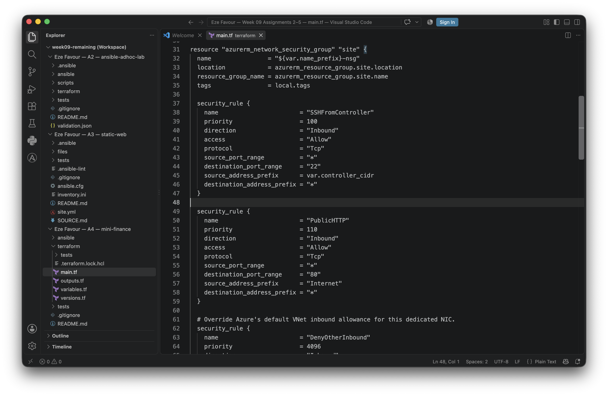

# Assignment 4 — Deploy Mini Finance Project Using Terraform and Ansible

Part of the DevOps Micro Internship (DMI) Cohort 3 with Agentic AI

---

## Purpose

In this assignment, you will provision an Azure VM with Terraform and use Ansible to automate the install, deploy, and verify workflow for the Mini Finance static website — a clean separation between infrastructure and configuration management.

## Submission status — partial evidence; VM capacity blocked, cleanup verified (2026-09-16)

The [Mini Finance project and gated runbook](mini-finance/README.md) contain Azure Terraform, an intentionally unconfigured `inventory.ini`, and three Ansible plays. Local Terraform formatting/init/validation and 10 mocked-plan tests passed; 21 Python contract/preflight/local-OpenSSH tests, Ansible syntax check and offline lint passed. Provider initialization accessed HashiCorp downloads, not Azure resources.

**No successful VM/site deployment:** after exact-plan approval, the coordinator launched the real first apply at **18:45:03 UTC** against the privately sealed current subscription. The fresh plan (`65fe9cfe53dd2021cbe5f0688920443a7147e9600a5a93b8a734e5c3217d8cae`) proposed 8 creates. Seven supporting Terraform instances were created, then Azure rejected **Standard_B1s in uksouth** with **HTTP 409 `SkuNotAvailable`**; Terraform exited 1 and no VM was created. The user-approved US$5 combined lab budget allocated A4 at most US$1/two hours.

**Cleanup verified:** with explicit authorization, the agent reviewed and executed a Terraform plan containing **0 creates, 0 updates, 7 deletes** for only this task. Cleanup exited 0 at **18:55:43 UTC**; read-only checks at **18:57:17 UTC** verified the RG, VM, managed disks, public IP and all group resources absent, with empty Terraform state/outputs. Original state snapshots, plans, attempt marker and raw logs remain private and preserved. Final billing is not verified. Required Standard_B1s remains unchanged; no deployment retry, remote SSH, real Ansible rollout, HTTP/browser verification or remote idempotence run occurred.

Only genuine **Screenshots 1 and 4** are embedded below, copied as exact original PNG bytes from coordinator captures. Their receipt hashes and source bindings, plus sanitized failure/cleanup records, are in the [assignment-specific manifest](screenshots/assignment-04-manifest.json). Screenshots 2, 3, 5–8 and the LinkedIn screenshot remain pending. The private failure capture is not successful-apply evidence. Existing coursework screenshots are not reused; private identifiers, receipt paths and operational inputs are not published.

GitHub Copilot prepared code/tests, performed the explicitly authorized Terraform cleanup and verification, and integrated unchanged coordinator-captured images under user direction. The coordinator visibly launched the first apply and captured the genuine evidence. Upstream assets remain attributed to their authors and are not vendored here. Learner-authored firsthand reflection remains pending. The original task goals/questions below are retained.

---

# Task 1 — Set Up Folder Layout

## Goal

Create the `mini-finance` project with separate `terraform/` and `ansible/` subdirectories.

### Evidence

#### Screenshot 1 — Terminal or editor showing the complete `mini-finance` project tree

**Captured — genuine coordinator evidence.** The native VS Code window shows the 16 tracked project filenames/directories at source `b59867faedae39642653bb16ad1ded001403aaf8`, excluding private/generated inputs. The coordinator's capture receipt timestamp is 2026-09-16 **18:41:45 UTC**. The PNG is unchanged; hashes/source binding are in the manifest.

---

# Task 2 — Terraform — Azure VM + NSG (Ports 22/80)

## Goal

Provision an Ubuntu 22.04 Standard_B1s VM with a public IP, SSH key authentication, and an NSG allowing SSH (22) and HTTP (80), and output the public IP.

### Evidence

#### Screenshot 2 — Terminal showing the end of a successful `terraform apply`

**Pending.** The actual first apply failed at Standard_B1s allocation (`SkuNotAvailable`, HTTP 409). Neither its private failure capture nor the later successful destroy output is a successful VM-provisioning screenshot.

---

#### Screenshot 3 — Terminal showing `terraform output public_ip`

**Pending.** No successful VM endpoint exists. The first attempt's temporary public IP was deleted during verified cleanup; no example or obsolete address is presented as an active VM.

---

#### Screenshot 4 — Terraform code or Azure Portal showing NSG inbound rules for ports 22 and 80

**Captured — Terraform-code alternative.** The native VS Code window shows `main.tf` lines 31–64: controller-restricted SSH 22, Internet HTTP 80 and the deny-other-inbound rule's priority. Source `b59867f` and the unchanged file hash are recorded in the manifest; the coordinator's capture receipt timestamp is **18:51:41 UTC**. This is code evidence, not successful VM deployment or a claim that the now-deleted NSG still exists.

---

# Task 3 — Configure Passwordless SSH

## Goal

Connect to the VM with SSH using the injected key and run `hostname` remotely without a password prompt.

### Evidence

#### Screenshot 5 — Terminal showing the successful passwordless SSH hostname check

**Pending.** Requires the actual VM, the existing user's key and independently verified host key. No remote SSH connection was attempted.

---

# Task 4 — Ansible — Multi-Play: Install → Deploy → Verify

## Goal

Create `ansible/inventory.ini` and a three-play `site.yml` that installs Nginx and Git, clones and deploys the Mini Finance repository to `/var/www/html/` with a reload handler, and verifies HTTP 200 from `localhost`.

### Evidence

#### Screenshot 6 — Editor showing `inventory.ini` and the three plays in `site.yml`

**Pending.** Both files are prepared, but the committed inventory is deliberately empty/fail-closed until real outputs are supplied privately. No screenshot was captured.

---

#### Screenshot 7 — Terminal showing `ansible-playbook -i inventory.ini site.yml` with HTTP 200, assertion OK, and no failures

**Pending.** Local syntax/lint and no-SSH negative tests are not a real deployment, HTTP 200, successful remote recap or idempotence result.

---

# Task 5 — Test End-to-End Functionality

## Goal

Confirm the Mini Finance site is publicly accessible and correctly served by Nginx.

### Evidence

#### Screenshot 8 — Browser showing the Mini Finance site loaded from `http://<public_ip>` with the URL visible

**Pending.** No deployed public URL or browser verification exists for this preparation.

---

### Notes

Describe an issue you faced and how you fixed it, and what you learned.

**Learner reflection pending.** No personal experience or learning statement is invented on the learner's behalf.

**Factual AI-assisted challenge record:** a reviewed plan and reported quota/SKU eligibility did not ensure real Azure allocation capacity. The coordinator's actual first apply created seven supporting instances, then received `SkuNotAvailable` for the required B1s VM in uksouth. The authorized response was to preserve the failure/state history, review an exact seven-delete Terraform plan, execute it and independently verify resource absence—not weaken the required VM size, broaden access or retry automatically. This observed failure/cleanup record is not a substitute for the learner's own reflection.

**Locally evidenced AI-assisted preparation note:** read-only public upstream inspection found tracked `js/.DS_Store`, documentation and `git_tracking_summary.txt`. The prepared deployment exports only explicit web assets from pinned revision `296334fc27de87bdfcafdad041e41573d8815700`, keeps the Git checkout outside `/var/www/html`, rejects hidden/symlinked assets and denies dot paths in Nginx. Offline tests check these safeguards; live behavior remains unverified. This engineering note does not replace the learner's own reflection after authorized work.

---

# LinkedIn Post (Required)

## Goal

Publish a LinkedIn post about the Terraform + Ansible deployment, mentioning the Azure VM, secure networking, passwordless SSH, Nginx deployment, and HTTP verification, with one challenge you faced and how you fixed it, and one real-world example of this workflow.

## Evidence

#### LinkedIn Post URL

Paste your LinkedIn post URL here:

**Pending — not published.** No LinkedIn URL has been fabricated or submitted.

---

#### Screenshot — Published LinkedIn post showing the text and at least one image or proof

**Pending.** Publication and an authentic screenshot remain manual learner actions after real deployment evidence is available.

---

# Submission Instructions

- Add all required screenshots in your submission
- The `mini-finance` project tree and `inventory.ini` may have the final IP octet masked
- Do not expose private keys or other secrets

---

# Completion Checklist

- [x] Task 1: `mini-finance` project structure created (Screenshot 1)
- [ ] Task 2: Azure VM and NSG provisioned with Terraform (Screenshots 2–4)
- [ ] Task 3: Passwordless SSH verified (Screenshot 5)
- [ ] Task 4: Ansible install/deploy/verify plays run successfully (Screenshots 6–7)
- [ ] Task 5: Site verified in the browser (Screenshot 8)
- [ ] Reflection notes written (Notes)
- [ ] LinkedIn post published and URL submitted
- [ ] No sensitive data exposed

---

## 📌 About DMI & CloudAdvisory

DevOps Micro Internship (DMI) is a project-based DevOps program run by Pravin Mishra (The CloudAdvisory) focused on real-world execution, systems thinking, and career readiness.

It helps learners build strong DevOps foundations with hands-on experience.

---

## 📌 Resources

- 🌐 DMI Official Website: https://dmi.pravinmishra.com?utm_source=github&utm_medium=readme  
- 🎓 University: https://university.pravinmishra.com?utm_source=github&utm_medium=readme  
- 💬 Discord Community: https://discord.pravinmishra.com?utm_source=github&utm_medium=readme  
- 📝 Blog: https://dmi.pravinmishra.com/blog?utm_source=github&utm_medium=readme  
- ▶️ YouTube Playlist: https://www.youtube.com/playlist?list=PLFeSNDtI4Cho  
- 🔗 Pravin Mishra (LinkedIn): https://www.linkedin.com/in/pravin-mishra-aws-trainer/  
- 🏢 CloudAdvisory (LinkedIn): https://www.linkedin.com/company/thecloudadvisory/

---

*This submission is part of DevOps Micro Internship (DMI) Cohort 3 — Agentic AI Track.*
