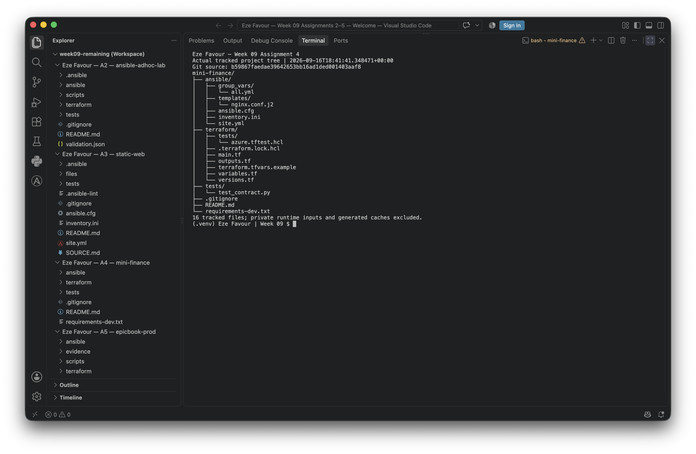
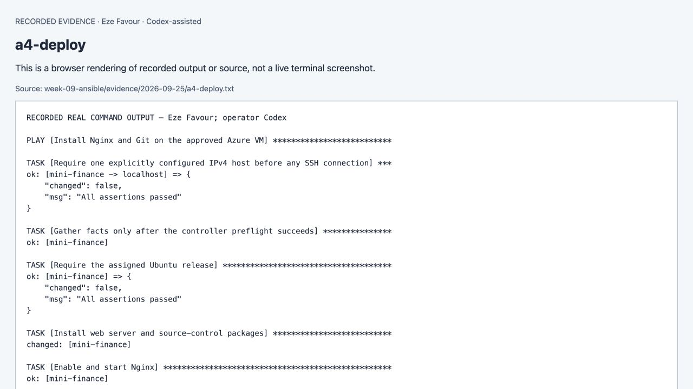
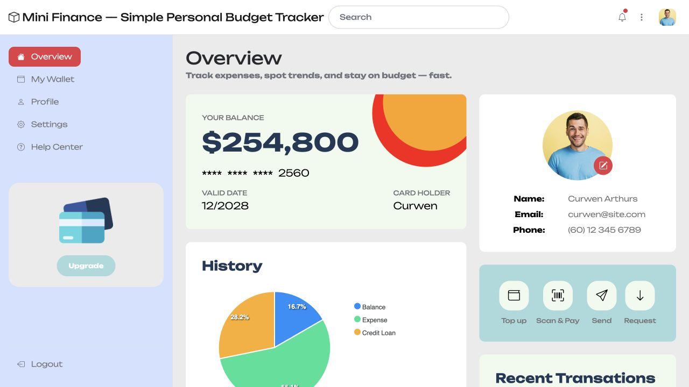

# Assignment 04 — Deploy Mini Finance on Azure Using Terraform and Ansible

Part of the DevOps Micro Internship (DMI) with Agentic AI

**Current continuation, 25 September2026 — Eze Favour.** [Verified results and limitations](evidence/2026-09-25/README.md). Full pinned instructor requirements restored. Answers are assisted explanations of recorded facts. [Earlier brief retained](evidence/before-20260925/assignment-04-deploy-mini-finance-project-using-terraform-and-ansible.md).

---

## Purpose

In this assignment, you will provision Azure infrastructure using Terraform and deploy the Mini Finance website using an Ansible multi-play playbook.

Terraform will create the Azure Virtual Machine and networking resources. Ansible will install Nginx, clone the Mini Finance repository, deploy the website, and verify the deployment.

---

# Task 1 — Create the Project Structure

## Goal

Create separate directories and files for the Terraform infrastructure and Ansible configuration.

### Evidence

#### Screenshot 1 — Terminal or VS Code showing the complete `mini-finance` project structure




See the [numbered evidence map](evidence/2026-09-25/screenshot-map.md). Recorded-output views and historical captures are labeled; an exact native-editor or address-bar capture is not claimed where unavailable.

---

### Notes

Codex performed this task under delegated authorization. The current evidence index links the actual source, commands, results and limitations for this assignment; screenshots retain their actual capture context.

---

# Task 2 — Create the Azure Infrastructure Using Terraform

## Goal

Use Terraform to provision an Ubuntu Virtual Machine with the required Azure networking and security resources.

### Evidence

#### Screenshot 2 — Terraform code showing the `Allow-SSH` rule for port `22` and the `Allow-HTTP` rule for port `80`

[Evidence/source and exact-capture limitation](evidence/2026-09-25/screenshot-map.md).


See the [numbered evidence map](evidence/2026-09-25/screenshot-map.md). Recorded-output views and historical captures are labeled; an exact native-editor or address-bar capture is not claimed where unavailable.

---

#### Screenshot 3 — Terraform code showing the association between `nsg-mini-finance` and `nic-mini-finance`

[Evidence/source and exact-capture limitation](evidence/2026-09-25/screenshot-map.md).


See the [numbered evidence map](evidence/2026-09-25/screenshot-map.md). Recorded-output views and historical captures are labeled; an exact native-editor or address-bar capture is not claimed where unavailable.

---

### Notes

Codex performed this task under delegated authorization. The current evidence index links the actual source, commands, results and limitations for this assignment; screenshots retain their actual capture context.

---

# Task 3 — Initialize and Apply the Terraform Configuration

## Goal

Format and validate the Terraform configuration, review the execution plan, and provision the Azure infrastructure.

### Evidence

#### Screenshot 4 — End of the `terraform apply` output showing `Apply complete!` with no errors

[Evidence/source and exact-capture limitation](evidence/2026-09-25/screenshot-map.md).


See the [numbered evidence map](evidence/2026-09-25/screenshot-map.md). Recorded-output views and historical captures are labeled; an exact native-editor or address-bar capture is not claimed where unavailable.

---

#### Screenshot 5 — Output of `terraform output public_ip` showing the VM’s public IP address

[Evidence/source and exact-capture limitation](evidence/2026-09-25/screenshot-map.md).


See the [numbered evidence map](evidence/2026-09-25/screenshot-map.md). Recorded-output views and historical captures are labeled; an exact native-editor or address-bar capture is not claimed where unavailable.

---

### Notes

Codex performed this task under delegated authorization. The current evidence index links the actual source, commands, results and limitations for this assignment; screenshots retain their actual capture context.

---

# Task 4 — Verify Passwordless SSH Access

## Goal

Confirm that the Ansible controller can connect to the Terraform-provisioned Azure VM using SSH key authentication.

### Evidence

#### Screenshot 6 — Passwordless SSH command and the returned `mini-finance` hostname

[Evidence/source and exact-capture limitation](evidence/2026-09-25/screenshot-map.md).


See the [numbered evidence map](evidence/2026-09-25/screenshot-map.md). Recorded-output views and historical captures are labeled; an exact native-editor or address-bar capture is not claimed where unavailable.

---

### Notes

Codex performed this task under delegated authorization. The current evidence index links the actual source, commands, results and limitations for this assignment; screenshots retain their actual capture context.

---

# Task 5 — Create the Ansible Inventory and Verify Connectivity

## Goal

Add the Terraform-provisioned Azure VM to the Ansible inventory and confirm that Ansible can connect to it.

### Evidence

#### Screenshot 7 — Ansible ping output showing `SUCCESS` and `pong` from the Azure VM

[Evidence/source and exact-capture limitation](evidence/2026-09-25/screenshot-map.md).


See the [numbered evidence map](evidence/2026-09-25/screenshot-map.md). Recorded-output views and historical captures are labeled; an exact native-editor or address-bar capture is not claimed where unavailable.

---

### Configuration File

Copy and paste the complete contents of your `ansible/inventory.ini` file below:

```ini
```ini
[web]
mini_finance ansible_host=135.116.197.163 ansible_user=ubuntu
```
The public excerpt omits local private-key/known-host file paths; the actual operator inventory uses explicitly pinned SSH transport.
```

---

# Task 6 — Create the Multi-Play Ansible Playbook

## Goal

Create one Ansible playbook containing separate plays to install Nginx, deploy the Mini Finance website, and verify the deployment.

### Evidence

#### Screenshot 8 — `site.yml` showing Play 1 and the beginning of Play 2

[Evidence/source and exact-capture limitation](evidence/2026-09-25/screenshot-map.md).


Screenshot must show:

- Play 1 targeting the `web` group
- Installation of `nginx`, `git`, and `rsync`
- Nginx service configured as started and enabled
- Beginning of Play 2 with the Git repository URL and synchronization task

See the [numbered evidence map](evidence/2026-09-25/screenshot-map.md). Recorded-output views and historical captures are labeled; an exact native-editor or address-bar capture is not claimed where unavailable.

---

#### Screenshot 9 — `site.yml` showing the deployment destination, handler, and Play 3 verification

[Evidence/source and exact-capture limitation](evidence/2026-09-25/screenshot-map.md).


Screenshot must show:

- Website destination `/var/www/html/`
- Ownership set to `www-data:www-data`
- Nginx reload handler
- Play 3 targeting `localhost`
- The `uri` verification and `assert` condition

See the [numbered evidence map](evidence/2026-09-25/screenshot-map.md). Recorded-output views and historical captures are labeled; an exact native-editor or address-bar capture is not claimed where unavailable.

---

### Configuration File

Copy and paste the complete contents of your `ansible/site.yml` file below:

```yaml
```yaml
---
- name: Install Nginx and Git on the approved Azure VM
  hosts: web
  become: true
  gather_facts: false
  any_errors_fatal: true
  pre_tasks:
    - name: Require one explicitly configured IPv4 host before any SSH connection
      vars:
        # Delegation supplies localhost connection variables; validate the original VM instead.
        mini_finance_target: "{{ hostvars[inventory_hostname] }}"
      ansible.builtin.assert:
        that:
          - groups['web'] | length == 1
          - mini_finance_target.ansible_host is defined
          - mini_finance_target.ansible_host is match('^(?:[0-9]{1,3}\\.){3}[0-9]{1,3}$')
          - mini_finance_target.ansible_host.split('.') | map('int') | max <= 255
          - mini_finance_target.ansible_host.split('.') | map('int') | min >= 0
          - mini_finance_target.ansible_host.split('.')[0] | int not in [0, 127]
          - mini_finance_target.ansible_user is defined
          - mini_finance_target.ansible_user is match('^[a-z][a-z0-9_]{2,31}$')
          - mini_finance_target.ansible_user != 'root'
          - mini_finance_target.ansible_connection | default('ssh') == 'ssh'
          - not ansible_check_mode
        fail_msg: >-
          Configure one real Azure host and administrator in a private inventory after approval.
          Check mode is not a substitute for a validated deployment; use offline syntax/tests instead.
      delegate_to: localhost
      become: false

    - name: Gather facts only after the controller preflight succeeds
      ansible.builtin.setup:

    - name: Require the assigned Ubuntu release
      ansible.builtin.assert:
        that:
          - ansible_facts['distribution'] == 'Ubuntu'
          - ansible_facts['distribution_version'] == '22.04'
  tasks:
    - name: Install web server and source-control packages
      ansible.builtin.apt:
        name:
          - nginx
          - git
        state: present
        update_cache: true
        cache_valid_time: 3600

    - name: Enable and start Nginx
      ansible.builtin.service:
        name: nginx
        enabled: true
        state: started

- name: Clone and deploy the pinned Mini Finance public site
  hosts: web
  become: true
  gather_facts: false
  any_errors_fatal: true
  tasks:
    - name: Create the root-owned source and release parents
      ansible.builtin.file:
        path: "{{ item }}"
        state: directory
        owner: root
        group: root
        mode: '0755'
      loop:
        - /opt/mini-finance
        - /var/www/mini-finance
        - /var/www/mini-finance/releases
        - "{{ mini_finance_release }}"

    - name: Clone the public repository outside the web root at the reviewed revision
      ansible.builtin.git:
        repo: "{{ mini_finance_repo }}"
        dest: "{{ mini_finance_checkout }}"
        version: "{{ mini_finance_revision }}"
        force: false
      register: mini_finance_clone

    - name: Confirm checkout matches the reviewed immutable revision
      ansible.builtin.assert:
        that:
          - mini_finance_clone.after == mini_finance_revision

    - name: Export only allowlisted public assets from the pinned Git tree
      ansible.builtin.command:
        argv: "{{ ['git', '-C', mini_finance_checkout, 'archive', '--format=tar', '--output=' + mini_finance_archive,
                   mini_finance_revision, '--'] + mini_finance_public_paths }}"
        creates: "{{ mini_finance_archive }}"

    - name: Unpack the public export into the release directory
      ansible.builtin.unarchive:
        src: "{{ mini_finance_archive }}"
        dest: "{{ mini_finance_release }}"
        remote_src: true
        owner: root
        group: root
        mode: 'u=rwX,go=rX'
        creates: "/opt/mini-finance/{{ mini_finance_revision }}.unpacked"
      notify: Reload Mini Finance

    - name: Record the completed upstream extraction
      ansible.builtin.copy:
        dest: "/opt/mini-finance/{{ mini_finance_revision }}.unpacked"
        content: "{{ mini_finance_revision }}\n"
        owner: root
        group: root
        mode: '0644'

    - name: Add learner attribution while preserving the template author credit
      ansible.builtin.lineinfile:
        path: "{{ mini_finance_release }}/index.html"
        insertbefore: '</body>'
        line: '<footer style="padding:16px;text-align:center">Eze Favour · DMI Week 09 · Assisted deployment · 25 September 2026 · Static demonstration</footer>'
        state: present
      notify: Reload Mini Finance

    - name: Inspect required public release paths without following symlinks
      ansible.builtin.stat:
        path: "{{ mini_finance_release }}/{{ item }}"
        follow: false
      loop: "{{ mini_finance_public_paths }}"
      register: mini_finance_public_stats

    - name: Require every allowlisted path to be a regular file or directory
      ansible.builtin.assert:
        that:
          - item.stat.exists
          - not item.stat.islnk
          - item.stat.isreg or item.stat.isdir
      loop: "{{ mini_finance_public_stats.results }}"
      loop_control:
        label: "{{ item.item }}"

    - name: Inspect release for hidden metadata and symlinks
      ansible.builtin.find:
        paths: "{{ mini_finance_release }}"
        recurse: true
        hidden: true
        file_type: any
      register: mini_finance_release_entries

    - name: Reject hidden files or symlinks before publishing
      ansible.builtin.assert:
        that:
          - item.path | basename is not match('^\\.')
          - not item.islnk
      loop: "{{ mini_finance_release_entries.files }}"
      loop_control:
        label: "{{ item.path }}"

    - name: Read staged index for site-specific content validation
      ansible.builtin.slurp:
        src: "{{ mini_finance_release }}/index.html"
      register: mini_finance_index

    - name: Require Mini Finance content before switching the document root
      ansible.builtin.assert:
        that:
          - item in (mini_finance_index.content | b64decode)
      loop: "{{ mini_finance_content_markers }}"

    - name: Inspect existing document root without following symlinks
      ansible.builtin.stat:
        path: "{{ mini_finance_docroot }}"
        follow: false
      register: mini_finance_existing_root

    - name: Reject unknown file or symlink at the document root
      ansible.builtin.assert:
        that:
          - >-
            not mini_finance_existing_root.stat.exists or
            (mini_finance_existing_root.stat.isdir | default(false)) or
            ((mini_finance_existing_root.stat.islnk | default(false)) and
             (mini_finance_existing_root.stat.lnk_source is match('^/var/www/mini-finance/releases/[0-9a-f]{40}$')))

    - name: Inspect the initial Nginx document directory
      ansible.builtin.find:
        paths: "{{ mini_finance_docroot }}"
        hidden: true
        file_type: any
      register: mini_finance_initial_files
      when: mini_finance_existing_root.stat.isdir | default(false)

    - name: Refuse to replace any directory except the stock Nginx welcome directory
      ansible.builtin.assert:
        that:
          - item.path | basename == 'index.nginx-debian.html'
          - item.isreg
      loop: "{{ mini_finance_initial_files.files | default([]) }}"
      loop_control:
        label: "{{ item.path }}"

    - name: Install the dedicated VM Nginx configuration after syntax validation
      ansible.builtin.template:
        src: nginx.conf.j2
        dest: /etc/nginx/nginx.conf
        owner: root
        group: root
        mode: '0644'
        validate: /usr/sbin/nginx -t -c %s
      notify: Reload Mini Finance

    - name: Remove only the confirmed initial welcome directory
      ansible.builtin.file:
        path: "{{ mini_finance_docroot }}"
        state: absent
      when: mini_finance_existing_root.stat.isdir | default(false)

    - name: Publish the validated release at the required document root
      ansible.builtin.file:
        src: "{{ mini_finance_release }}"
        dest: "{{ mini_finance_docroot }}"
        state: link
        owner: root
        group: root
      notify: Reload Mini Finance

    - name: Apply pending validated reloads before controller verification
      ansible.builtin.meta: flush_handlers

  handlers:
    - name: Validate active Nginx configuration
      ansible.builtin.command: /usr/sbin/nginx -t
      changed_when: false
      listen: Reload Mini Finance

    - name: Reload Nginx after successful validation
      ansible.builtin.service:
        name: nginx
        state: reloaded
      listen: Reload Mini Finance

- name: Verify HTTP and Mini Finance content from the controller
  hosts: localhost
  connection: local
  become: false
  gather_facts: false
  any_errors_fatal: true
  vars:
    ansible_python_interpreter: "{{ ansible_playbook_python }}"
  tasks:
    - name: Fail closed when inventory has no real deployment target
      ansible.builtin.assert:
        that:
          - groups['web'] | default([]) | length == 1
        fail_msg: >-
          No configured Azure VM. Inventory is deliberately empty; deployment and HTTP evidence remain pending.

    - name: Fetch the public site from the controller
      ansible.builtin.uri:
        url: "http://{{ hostvars[groups['web'][0]].ansible_host }}/"
        status_code: 200
        return_content: true
        follow_redirects: none
        use_proxy: false
        use_netrc: false
        timeout: 15
      register: mini_finance_http
      retries: 5
      delay: 3
      until: mini_finance_http.status | default(0) == 200

    - name: Assert HTTP 200 and the expected site rather than the welcome page
      ansible.builtin.assert:
        that:
          - mini_finance_http.status == 200
          - item in mini_finance_http.content
      loop: "{{ mini_finance_content_markers }}"

    - name: Confirm private repository metadata is not served
      ansible.builtin.uri:
        url: "http://{{ hostvars[groups['web'][0]].ansible_host }}/{{ item }}"
        status_code: 404
        follow_redirects: none
        use_proxy: false
        use_netrc: false
        timeout: 15
      loop:
        - .git/config
        - js/.DS_Store
        - git_tracking_summary.txt
        - README.md
```
```

---

# Task 7 — Validate and Run the Ansible Playbook

## Goal

Validate the syntax of the multi-play Ansible playbook and run it to install Nginx, deploy the Mini Finance website, and verify the deployment.

### Evidence

#### Screenshot 10 — Successful playbook syntax check showing `playbook: site.yml`

[Evidence/source and exact-capture limitation](evidence/2026-09-25/screenshot-map.md).


See the [numbered evidence map](evidence/2026-09-25/screenshot-map.md). Recorded-output views and historical captures are labeled; an exact native-editor or address-bar capture is not claimed where unavailable.

---

#### Screenshot 11 — Play 3 output showing the successful HTTP verification and assertion




See the [numbered evidence map](evidence/2026-09-25/screenshot-map.md). Recorded-output views and historical captures are labeled; an exact native-editor or address-bar capture is not claimed where unavailable.

---

#### Screenshot 12 — Final `PLAY RECAP` showing `failed=0` and `unreachable=0`


See the [numbered evidence map](evidence/2026-09-25/screenshot-map.md). Recorded-output views and historical captures are labeled; an exact native-editor or address-bar capture is not claimed where unavailable.

---

### Notes

Codex performed this task under delegated authorization. The current evidence index links the actual source, commands, results and limitations for this assignment; screenshots retain their actual capture context.

---

# Task 8 — Test the Mini Finance Website in a Browser

## Goal

Confirm that the Mini Finance website is publicly accessible through the Azure VM’s public IP address.

### Evidence

#### Screenshot 13 — Mini Finance website successfully loading in the browser, with the Azure VM’s public IP address visible in the address bar




See the [numbered evidence map](evidence/2026-09-25/screenshot-map.md). Recorded-output views and historical captures are labeled; an exact native-editor or address-bar capture is not claimed where unavailable.

---

### Website URL

Deployed website URL: http://135.116.197.163/

```text
http://<PUBLIC_IP>
```

---

# Task 9 — Create the Project README

## Goal

Create a `README.md` file to document the Mini Finance infrastructure and deployment project.

### Evidence

#### Screenshot 14 — Completed `README.md` displayed in the VS Code Markdown preview or terminal

[Evidence/source and exact-capture limitation](evidence/2026-09-25/screenshot-map.md).


See the [numbered evidence map](evidence/2026-09-25/screenshot-map.md). Recorded-output views and historical captures are labeled; an exact native-editor or address-bar capture is not claimed where unavailable.

---

### README Content

Copy and paste the complete contents of your `README.md` file below:

```markdown
The editable [MiniFinance README](mini-finance/README.md) contains the implementation notes; [current evidence](evidence/2026-09-25/README.md) records the actual VM substitution, HTTP result and unchanged rerun.
```

---

# LinkedIn Post Required

## Evidence

#### Screenshot 15 — Published LinkedIn post showing the text and at least one deployment screenshot


See the [numbered evidence map](evidence/2026-09-25/screenshot-map.md). Recorded-output views and historical captures are labeled; an exact native-editor or address-bar capture is not claimed where unavailable.

---

#### LinkedIn Post URL

Paste your LinkedIn post URL here:

https://www.linkedin.com/posts/eze-favour-52732752_dmibypravinmishra-devops-ansible-ugcPost-7509317693183979520-yk0J/

---

### LinkedIn Submission Notes

**One challenge you faced and how you fixed it:**

Codex prepared the infrastructure and ran Ansible under delegated authorization. The full source and actual deployment/idempotence reports are linked above; this answer does not imply a learner-personal manual step.

---

**One real-world example where you can use this learning:**

Codex prepared the infrastructure and ran Ansible under delegated authorization. The full source and actual deployment/idempotence reports are linked above; this answer does not imply a learner-personal manual step.

---

# Assignment Questions

Answer the following in your own words:

**1. What did you provision using Terraform in this assignment?**

One Ubuntu VM, NIC, public IP, virtual network/subnet and associated NSG. The actual VM is Standard_F1als_v7 in Sweden Central because B1s capacity was unavailable.

---

**2. What did Ansible configure and deploy in this assignment?**

Nginx installation/service configuration, the checksum-pinned MiniFinance source, website synchronization, learner attribution and HTTP verification.

---

**3. Why is SSH access on port `22` restricted to your public IP address?**

A controller-only /32 limits who can reach SSH. Public HTTP is independent of administrative access. SSH host fingerprints are pinned.

---

**4. Why is HTTP port `80` open to the internet?**

The assignment requires a public demonstration website, so Nginx must receive public HTTP requests on port80.

---

**5. What is the purpose of the Ansible inventory file?**

It maps the web group to the actual host, login user, SSH key reference and trusted connection settings without committing private credentials.

---

**6. Why does the playbook use separate plays for install, deploy, and verify?**

The separate plays make installation, content deployment and controller-side verification independently understandable and repeatable.

---

**7. Why is `rsync` useful when deploying website files?**

It synchronizes changed website content efficiently while preserving an explicit desired document root.

---

**8. What does the Ansible `uri` module verify in this assignment?**

The controller receives a successful HTTP response from the actual public endpoint; the playbook also checks the expected content.

---

**9. What issue did you face during this assignment, and how did you fix it?**

The recorded issue was unavailable requested VM capacity. The operator selected the available F1als_v7 size and documented the substitution; deployment and the unchanged rerun then passed.

---

**10. What did you learn from using Terraform and Ansible together?**

The recorded workflow demonstrates the separation between cloud resource state and operating-system/application configuration. A zero-change rerun provides additional evidence of repeatability. This is an assisted learning note, not an invented first-person action.

---

# Required Files

Confirm that the following files are included in your assignment folder:

- [x] `.gitignore`
- [x] `README.md`
- [x] `terraform/providers.tf`
- [x] `terraform/main.tf`
- [x] `terraform/variables.tf`
- [x] `terraform/outputs.tf`
- [x] `ansible/inventory.ini`
- [x] `ansible/site.yml`

---

# Submission Instructions

- Add all required screenshots in the correct order.
- Full Name must be visible in required screenshots.
- Add the Azure VM public IP address.
- Add the final Mini Finance website URL.
- Paste `inventory.ini`, `site.yml`, and `README.md` as editable text.
- Answer all assignment questions clearly in your own words.
- LinkedIn post: https://www.linkedin.com/posts/eze-favour-52732752_dmibypravinmishra-devops-ansible-ugcPost-7509317693183979520-yk0J/
- Do not expose SSH private keys, passwords, Azure credentials, subscription IDs, Terraform state contents, or other sensitive information.

---

# Completion Checklist

- [x] Task 1: `mini-finance` project structure created
- [x] Task 1: `.gitignore` created
- [x] Task 2: Terraform Azure infrastructure code created
- [x] Task 2: `Allow-SSH` rule configured for port `22`
- [x] Task 2: `Allow-HTTP` rule configured for port `80`
- [x] Task 2: NSG associated with the Network Interface
- [x] Task 3: `terraform fmt` completed
- [x] Task 3: `terraform init` completed
- [x] Task 3: `terraform validate` completed successfully
- [x] Task 3: `terraform apply` completed successfully
- [x] Task 3: `terraform output public_ip` displayed the VM public IP
- [x] Task 4: Passwordless SSH works from the Ansible controller
- [x] Task 5: `inventory.ini` created
- [x] Task 5: Ansible ping returns `SUCCESS` and `pong`
- [x] Task 6: `site.yml` contains three separate plays
- [x] Task 6: Play 1 installs Nginx, Git, and rsync
- [x] Task 6: Play 2 clones and deploys the Mini Finance website
- [x] Task 6: Play 3 verifies HTTP status code `200`
- [x] Task 7: Playbook syntax check passes
- [x] Task 7: Ansible playbook completes successfully
- [x] Task 7: Final recap shows `failed=0` and `unreachable=0`
- [x] Task 8: Mini Finance website loads in the browser
- [ ] Task 8: Azure VM public IP is visible in the browser screenshot
- [x] Task 9: `README.md` completed
- [ ] Screenshots 1–15 are included
- [x] `inventory.ini`, `site.yml`, and `README.md` are pasted as editable text
- [x] Assignment questions are answered
- [x] LinkedIn post published with Anyone visibility
- [x] LinkedIn post URL added
- [ ] No sensitive information is exposed

---

## About DMI & CloudAdvisory

DevOps Micro Internship (DMI) is a project-based DevOps program run by Pravin Mishra and The CloudAdvisory, focused on real-world execution, systems thinking, and career readiness.

It helps learners build strong DevOps foundations with hands-on experience.

---

## Resources

- DMI Official Website: [https://dmi.pravinmishra.com?utm_source=github&utm_medium=readme](https://dmi.pravinmishra.com?utm_source=github&utm_medium=readme)
- University: [https://university.pravinmishra.com?utm_source=github&utm_medium=readme](https://university.pravinmishra.com?utm_source=github&utm_medium=readme)
- Discord Community: [https://discord.pravinmishra.com?utm_source=github&utm_medium=readme](https://discord.pravinmishra.com?utm_source=github&utm_medium=readme)
- Blog: [https://dmi.pravinmishra.com/blog?utm_source=github&utm_medium=readme](https://dmi.pravinmishra.com/blog?utm_source=github&utm_medium=readme)
- YouTube Playlist: [https://www.youtube.com/playlist?list=PLFeSNDtI4Cho](https://www.youtube.com/playlist?list=PLFeSNDtI4Cho)
- Pravin Mishra LinkedIn: [https://www.linkedin.com/in/pravin-mishra-aws-trainer/](https://www.linkedin.com/in/pravin-mishra-aws-trainer/)
- CloudAdvisory LinkedIn: [https://www.linkedin.com/company/thecloudadvisory/](https://www.linkedin.com/company/thecloudadvisory/)

---

*This submission is part of DevOps Micro Internship (DMI) — Agentic AI Track.*
### 25 September publication

[Blog article](https://favourcloud.github.io/devops-micro-internship-pravinmishra/blog/week-09.html) · [LinkedIn](https://www.linkedin.com/posts/eze-favour-52732752_dmibypravinmishra-devops-ansible-ugcPost-7509317693183979520-yk0J/). The public posts describe the verified outcomes and assisted work.
