# Assignment 5 — Production-Grade EpicBook: Terraform + Ansible Roles (Azure or AWS)

Part of the DevOps Micro Internship (DMI) Cohort 3 with Agentic AI

---

## Purpose

In this assignment, you will deploy the EpicBook web application on a cloud VM provisioned with Terraform (Azure or AWS — pick one) and configured through reusable Ansible roles (`common`, `nginx`, `epicbook`) orchestrated by one playbook, using group variables, templates, and handlers, with a verified idempotent second run.

---

## Pilot and preparation status — 16 September 2026

Azure code and the exact `common` → `nginx` → `epicbook` role order are in
[`epicbook-prod`](./epicbook-prod/README.md). The parent coordinator genuinely
provisioned the approved nonzonal D2lds_v6 Ubuntu VM, verified authenticated
outputs/host trust, passwordless SSH, inventory and Ansible ping. **The subsequent
application deployment failed at Git checkout; it did not complete EpicBook.**
The reviewed saved cleanup plan deleted all 11 resources; empty state/outputs and
authenticated RG, exact VM, OS disk and public IP absence were verified at
**21:37:27 UTC**, before the original **22:08:26 UTC** deadline. This is not a
zero-charge claim. See the [sanitized actual pilot/cleanup receipt](./epicbook-prod/evidence/pilot-outcome.json).

After cleanup, the role was narrowly corrected to create a private Git metadata
**parent**, leave its `repository.git` child uncreated until clone, and enforce
ownership/0700 afterward. Real offline Git/Ansible checkout, permissions and
unchanged-repeat regressions pass. **The corrected role was not re-deployed**;
full application/database, HTTP/browser and remote idempotence remain pending.
The instructor's pinned source requires Node/Express/Sequelize/MySQL, not a static
web root. Runtime is opt-in; default source-only mode deliberately returns 503.

Live screenshots **2 and 4** supplement source slots **1, 3, 6, 7, 8, 10 and 11**.
Slot 10 uses three new corrected working-tree captures; original **10a–c remain
historical pre-fix source**, not relabeled as current. Slot 1 is explicitly a
historical 43-file tree. A valid numbered
inventory/ping PNG remains pending despite real successful checks; the proposed
220723 image was A2 and is excluded. The failure image is supporting evidence,
not successful slot 12. LinkedIn/video and learner reflection remain pending.
See [current status](./epicbook-prod/evidence/assignment-05-manifest.json),
[original source receipts](./epicbook-prod/evidence/source-captures.json) and
[approved live capture hashes](./epicbook-prod/evidence/pilot-captures.json).

Original PNG bytes, private raw logs and plan/source seals are preserved. The
Python 3.9.6 editor selection in Screenshot 8d is not the actual Python 3.13.3
controller. Local tests are not remote proof, and these AI-assisted notes do not
invent learner actions. Historical plans/approvals must not be reused. There is
no current cloud/runtime authorization or live A5 VM.

# Task 1 — Set Up Folder Layout

## Goal

Create the `epicbook-prod` project with `terraform/azure` or `terraform/aws`, `ansible/inventory.ini`, `ansible/site.yml`, `ansible/group_vars/web.yml`, and the `common`, `nginx`, and `epicbook` role directories.

### Evidence

#### Screenshot 1 — Terminal or editor showing the complete `epicbook-prod` project tree

Three genuine foreground terminal views cover all **43 tracked project files at
capture commit `a15fc8c7c728d699fe1a0ae43177b8809f19eba7`**, before these additional
image/receipt files were committed. Each command freshly listed the tree; this is
not stored-output replay or a claim about the final future file count. Later
pages repeat the original header. See the [tree/source receipts](./epicbook-prod/evidence/infrastructure-source-captures.json).

**1a — First tree view (output lines 1–28)**

**1b — Second tree view (header and output lines 29–52)**

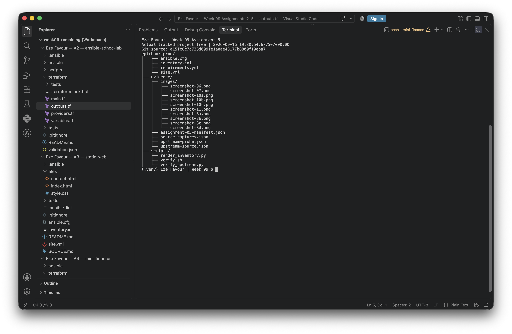

**1c — Final tree view (header and output lines 53–68)**

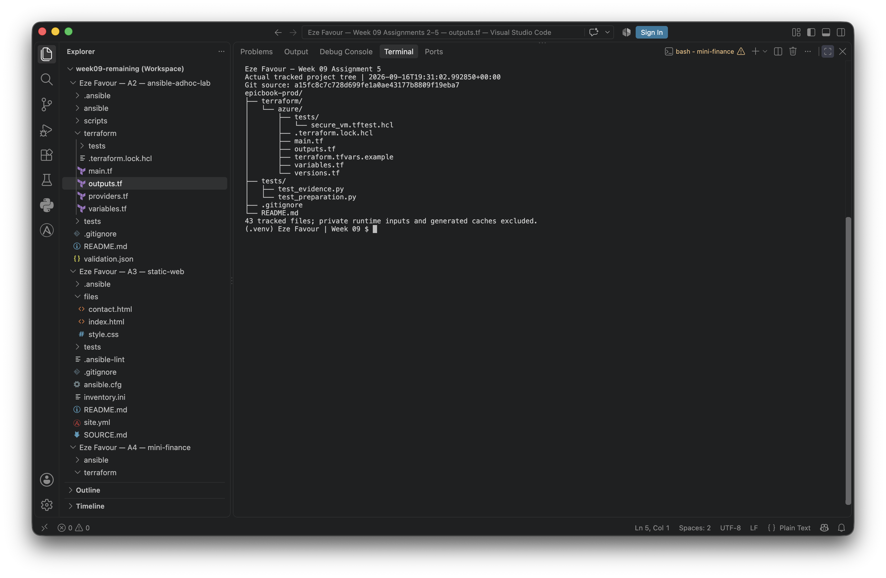

---

# Task 2 — Terraform (Pick One: Azure or AWS)

## Goal

Provision one secure Ubuntu 22.04 VM with SSH key authentication, inbound SSH (22) and HTTP (80), and `public_ip`/`admin_user` outputs, on your chosen cloud.

### Evidence

#### Screenshot 2 — Terminal showing successful `terraform apply` and `terraform output` with `public_ip` and `admin_user`

**2a — Genuine parent-executed apply: 11 added, 0 changed, 0 destroyed, with outputs.**
The frozen pilot source was `49c70a333b0671f9e75c61363aaab4a580c712ee`.

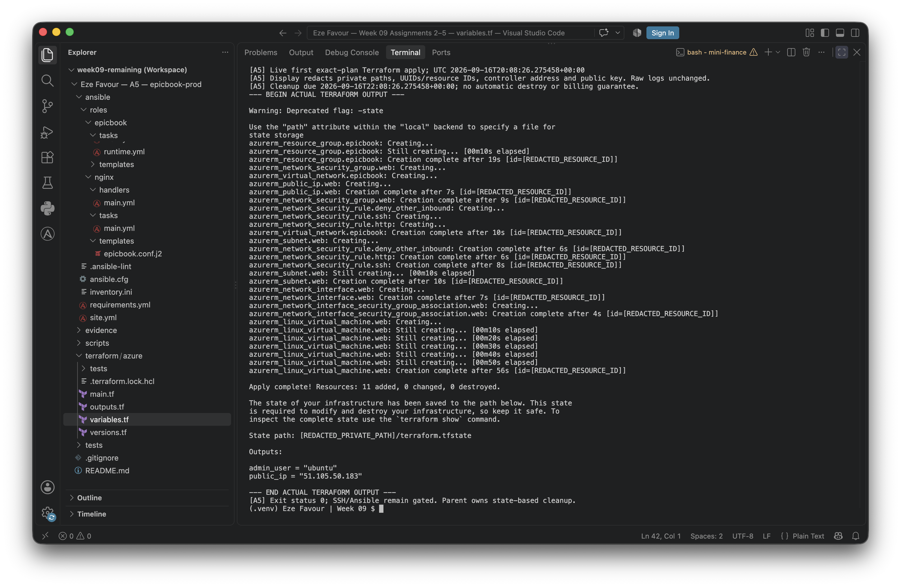

**2b — Separate actual output command and authenticated VM/disk/boot collection.**
The temporary public IP shown is historical; cleanup has been verified.

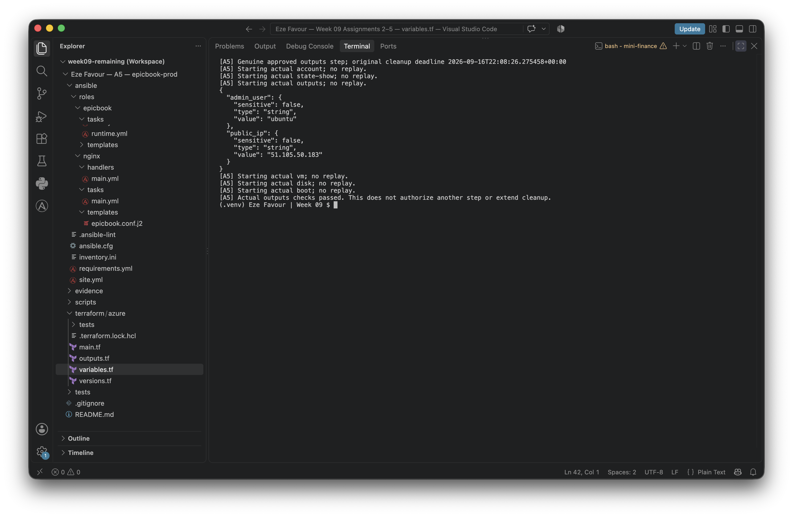

---

#### Screenshot 3 — Terraform code or cloud console showing inbound rules for ports 22 and 80

Two genuine source views show the controller-only SSH/public HTTP rules and the
validated public IPv4 `/32` input. These are code evidence, not deployed NSG proof;
Terraform bytes match commit `53766f5b5fc71f7c0a58c56fdeea976f18d48608`.

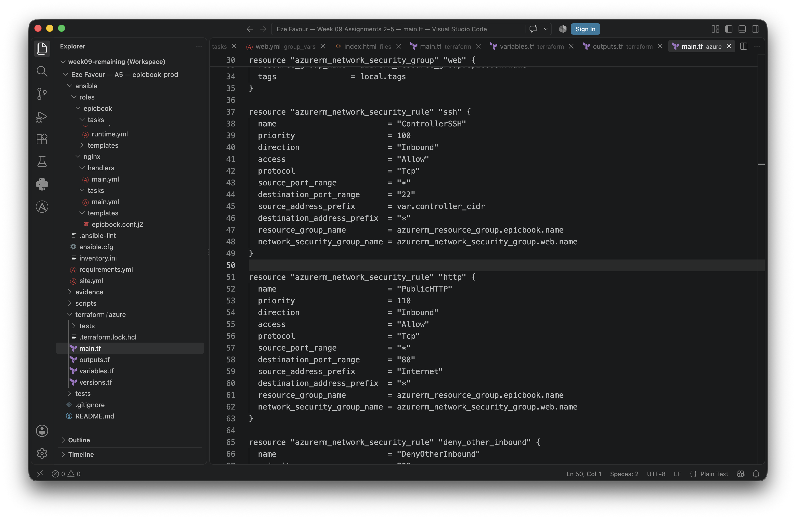

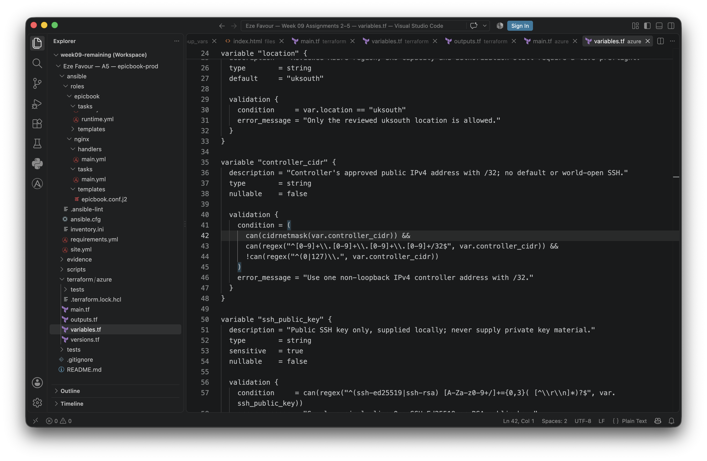

---

# Task 3 — Ansible Inventory

## Goal

Create the `[web]` inventory using the Terraform `public_ip` and `admin_user` outputs, and verify passwordless SSH and `ansible ping`.

### Evidence

#### Screenshot 4 — Terminal showing the successful passwordless SSH hostname check

Genuine passwordless SSH followed a fresh keyscan matched to correctly decoded,
authenticated boot evidence; strict host checking was not bypassed. The earlier
trust failure was a local JSON/fingerprint-parser bug, not proof the VM key changed.

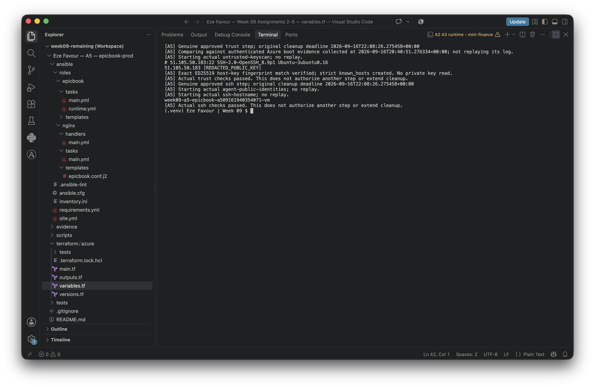

---

#### Screenshot 5 — Editor or terminal showing `inventory.ini` and a successful Ansible ping

**Numbered PNG pending.** Actual private inventory display and `pong` succeeded at
21:06 UTC and are recorded in the [pilot receipt](./epicbook-prod/evidence/pilot-outcome.json).
The proposed `220723` capture belongs to A2 cloud-init and is deliberately excluded.
Neither that image nor a reconstructed local display substitutes for this slot.

---

# Task 4 — Create site.yml (Role Orchestration)

## Goal

Create `site.yml` invoking the `common`, `nginx`, and `epicbook` roles in that exact order.

### Evidence

#### Screenshot 6 — Editor showing `ansible/site.yml` with the three roles in the required order

Captured and reviewed source only: `common` → `nginx` → `epicbook`.

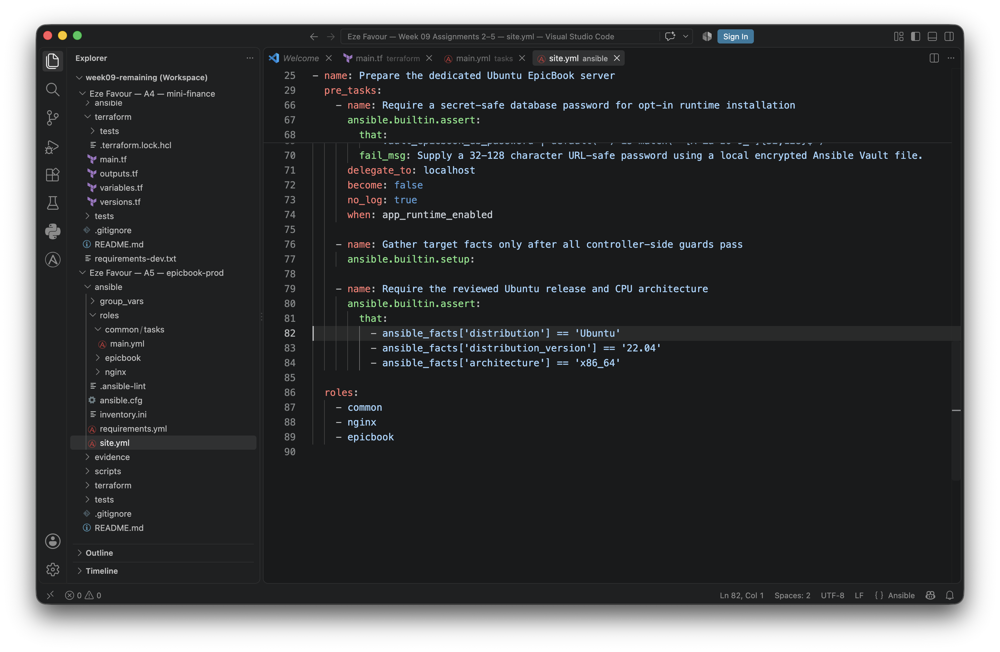

---

# Task 5 — Role: common

## Goal

Create `roles/common/tasks/main.yml` to update apt, upgrade packages, install baseline packages (`git`, `curl`, `unzip`, `software-properties-common`), with optional SSH hardening applied only after key-based access is confirmed.

### Evidence

#### Screenshot 7 — Editor showing `roles/common/tasks/main.yml`

Captured and reviewed source only; the notification-free replacement image is used.

---

# Task 6 — Role: nginx

## Goal

Create the `nginx` role to install Nginx, deploy the `epicbook.conf.j2` template to `/etc/nginx/sites-available/epicbook`, enable the site, remove the default site, and reload via handler.

### Evidence

#### Screenshot 8 — Editor showing the Nginx role tasks, handler, and `epicbook.conf.j2` template

Four separate genuine source views; none is a live Nginx test.

**8a — Installation, template and enabled-site tasks (lines 1–26)**

**8b — Default removal, validation and service tasks (lines 27–42)**

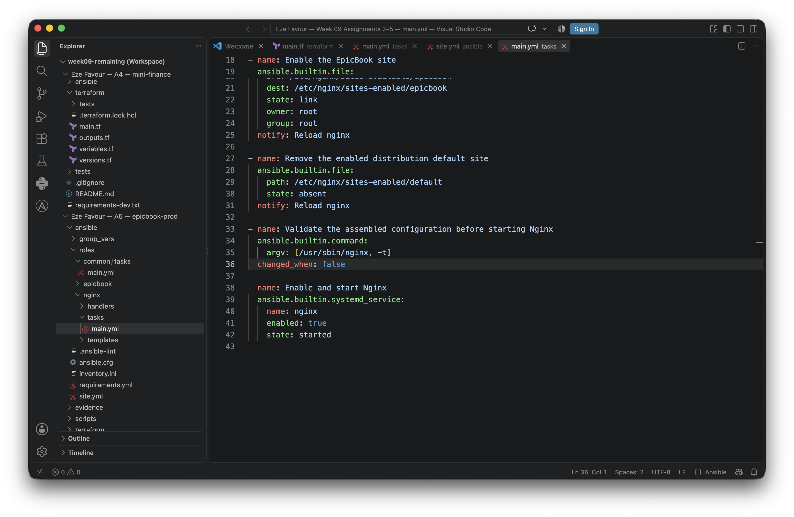

**8c — Validate-before-reload handler (lines 1–12)**

**8d — Vhost template (lines 1–29)**

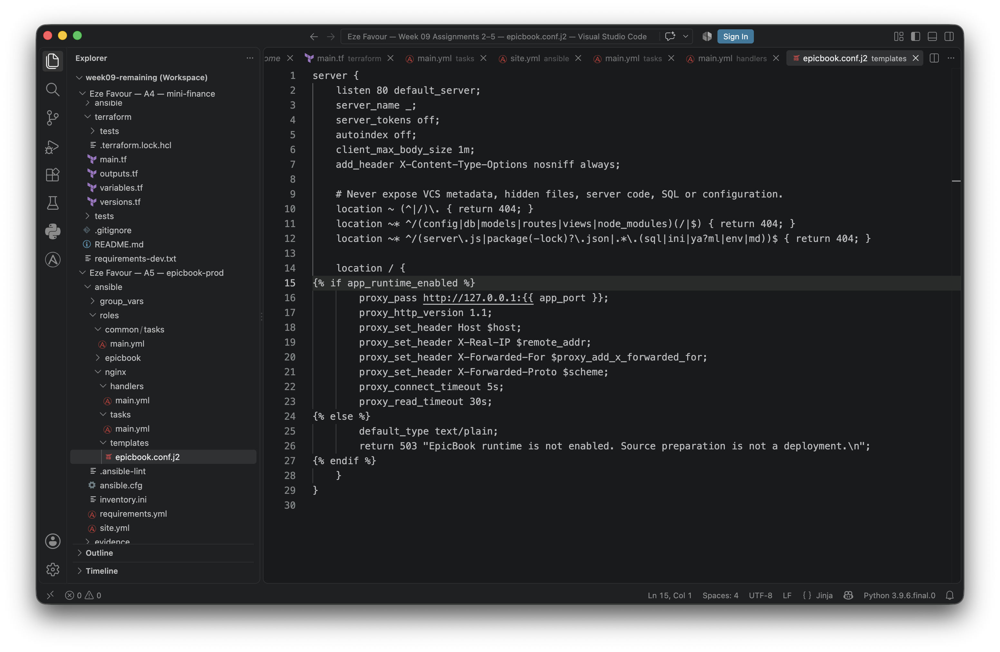

The editor's Python selection in 8d is not evidence of the controller/runtime version.

---

#### Screenshot 9 — Terminal showing `/etc/nginx/sites-available/epicbook` and a successful Nginx configuration test

**Combined live capture pending.** The real deploy log records successful Nginx
pre-start configuration validation and service start before Git checkout failed.
That does not supply this separate live site-file/config-test image or prove the
reload handler/application completed.

---

# Task 7 — Role: epicbook

## Goal

Create the `epicbook` role to clone the repository to `{{ app_dest }}`, set ownership/permissions using group variables, and notify the Nginx reload handler on change.

### Evidence

#### Screenshot 10 — Editor showing `roles/epicbook/tasks/main.yml`

**Corrected source only, captured after verified cleanup.** These three genuine
native VS Code frames show the exact working-tree source SHA256
`f35f24479485f49a0f62e72d798f3a974d3ec1d68fac2cd38fad06d4608b71e3`,
verified before and after each capture. HEAD `49c70a3` at capture did **not**
contain the fix; the later committed role must match this snapshot. See the
[corrected-source receipt](./epicbook-prod/evidence/corrected-source-captures.json).
No image edits or successful remote redeployment are claimed.

**10a — Identities and private parent directory (lines 1–28)**

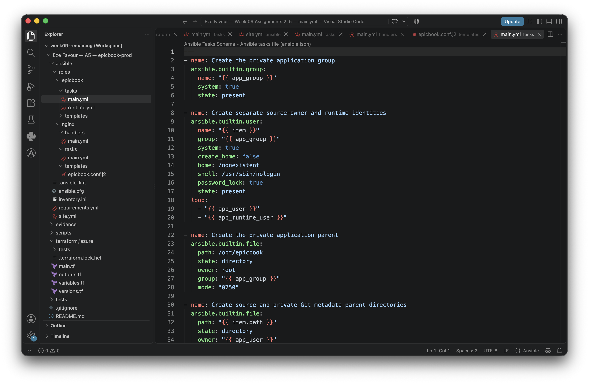

**10b — Private metadata parent, uncreated Git leaf and post-clone protection (lines 30–61)**

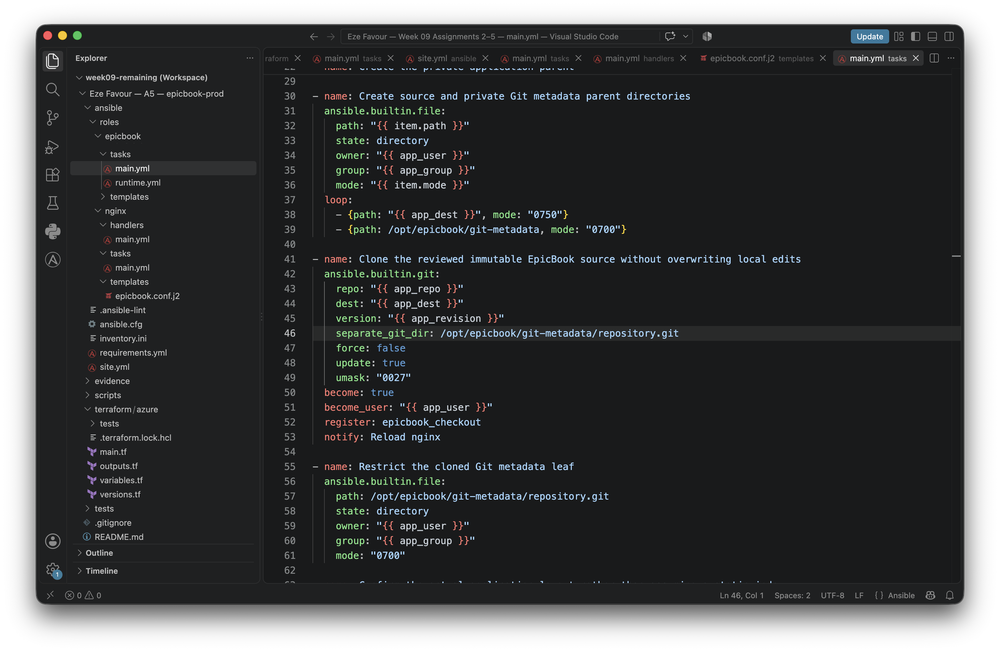

**10c — Source validation and optional runtime import (lines 63–89)**

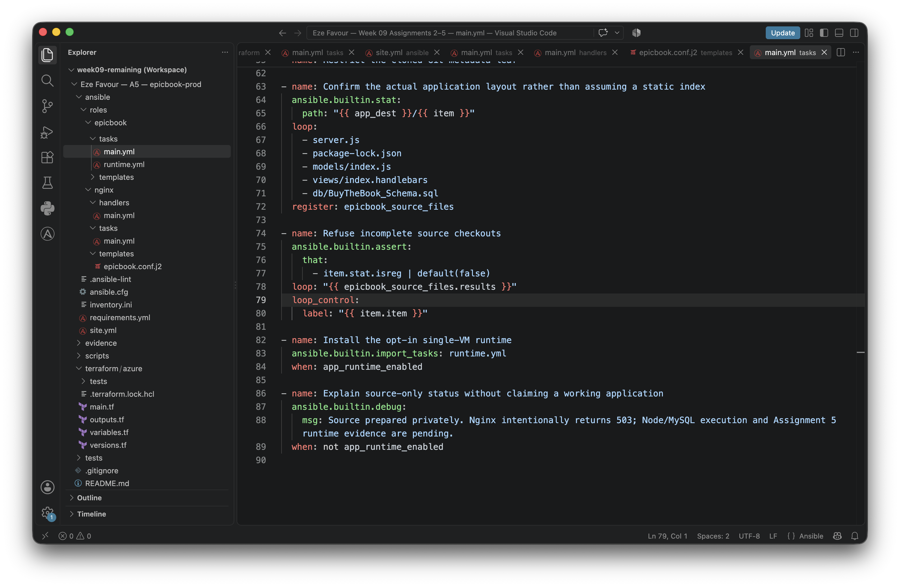

Historical pre-fix images remain unchanged: [original 10a](./epicbook-prod/evidence/images/screenshot-10a.png),
[original 10b](./epicbook-prod/evidence/images/screenshot-10b.png),
[original 10c](./epicbook-prod/evidence/images/screenshot-10c.png), and their
[original source receipt](./epicbook-prod/evidence/source-captures.json).
They document the earlier buggy source, not this correction.

---

# Task 8 — Group Variables

## Goal

Define `app_repo`, `app_dest`, `app_user`, and `app_group` in `ansible/group_vars/web.yml`.

### Evidence

#### Screenshot 11 — Editor showing `ansible/group_vars/web.yml`

Captured and reviewed source only; runtime remains disabled by default.

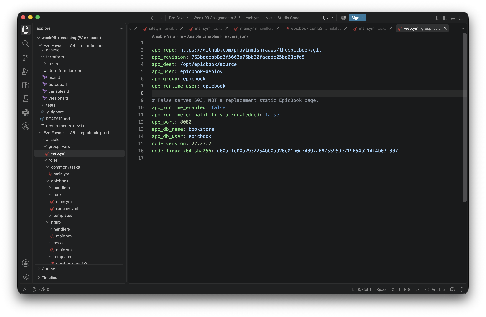

---

# Task 9 — Run the Playbook

## Goal

Run `ansible-playbook -i inventory.ini site.yml` and confirm `common` → `nginx` → `epicbook` all complete with `failed=0`.

### Evidence

#### Screenshot 12 — Terminal showing the role-based Ansible run and final recap with `failed=0`

**Successful slot 12 remains pending.** The actual opt-in run exited 2 at
`Clone the reviewed immutable EpicBook source without overwriting local edits`:
Git rejected the precreated separate metadata directory. Web recap:
`ok=20 changed=12 unreachable=0 failed=1`. No live retry occurred before cleanup.

**Supporting failure evidence only — not the required successful recap:**

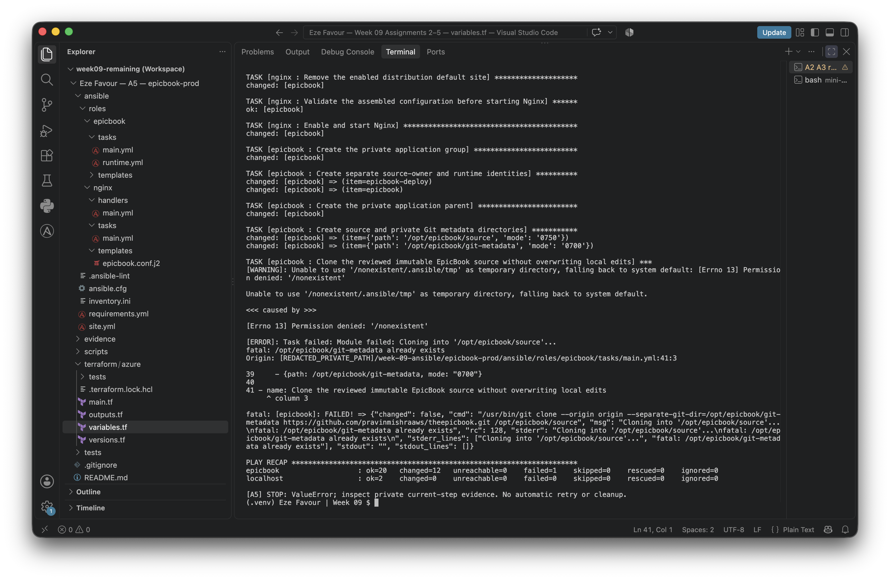

---

# Task 10 — Verify

## Goal

Confirm the EpicBook site loads with HTTP 200, inspect the Nginx configuration, and rerun the playbook to confirm the second run is mostly OK/UNCHANGED with `failed=0`.

### Evidence

#### Screenshot 13 — Browser showing the EpicBook site with the public IP visible

Add your screenshot here.

---

#### Screenshot 14 — Terminal showing HTTP 200 and the Nginx site-file snippet

Add your screenshot here.

---

#### Screenshot 15 — Terminal showing the idempotent second Ansible run with mostly OK/UNCHANGED and `failed=0`

Add your screenshot here.

---

### Notes

Describe an issue you faced and how you fixed it, what you learned, any security issues you identified, and your production remediation plan.

Evidence-backed preparation/pilot notes (AI-assisted; not an invented firsthand learner reflection):

- The real pilot exposed a Git semantics error: `--separate-git-dir` cannot clone
  into a metadata destination already created by the preceding task. After
  verified cleanup, the fix retained a private writable parent and used an
  uncreated child, then enforced ownership/mode. Actual offline Git reproduced
  exit 128; an isolated local Ansible fixture verified the fix and unchanged
  second run. This does not prove remote application idempotence.
- The initial host-trust stop was traced offline to JSON-encoded boot output:
  an overly broad parser captured ECDSA while labeling it ED25519. Separate
  reviewed controls decoded and strictly parsed the evidence, then a fresh actual
  scan and SSH succeeded. The failed evidence was preserved, not relabeled as
  successful or attributed to a changed server key.
- The parent chose cleanup rather than retry the failed deployment. A reviewed
  saved plan deleted 11 resources; actual state/output, RG and resource-specific
  absence checks passed before the deadline. No completed-cleanup PNG or zero
  billing is claimed.

- Source inspection found that the referenced EpicBook uses server-rendered
  Handlebars, Sequelize, MySQL and port 8080. Serving its checkout as a static web
  root would neither run the application nor safely protect its configuration.
  The prepared role keeps source outside Nginx's document root and uses a reverse
  proxy only when runtime installation is explicitly enabled.
- Local validation encountered shared-disk exhaustion while extracting tools.
  Only disposable task-owned downloads were removed; the existing provider cache
  was reused read-only and the successful checks were rerun. Ansible's local RPC
  server also failed with a long macOS temporary path; short, uniquely allocated
  temporary paths fixed the guard tests without changing the controller.
- Runtime verification and the learner's own challenge/fix reflection are still
  pending. The runbook records remaining risks: HTTP without TLS, aging upstream
  dependencies, database privileges needed by automatic schema synchronization,
  same-VM failure coupling, backups, and unverified live idempotency. These must
  not be described as resolved production concerns.
- GitHub Copilot assisted source research, code preparation and local tests.
  This does not substitute for genuine Claude Code evidence or a human-applied
  change in Assignment 6.

---

# LinkedIn Post (Required)

## Goal

Publish a LinkedIn post describing the Terraform + Ansible roles deployment (cloud chosen, role structure, Nginx deployment, idempotency result), and add a 4–6 line video reflection covering one challenge/fix, security issues observed, and your production remediation plan.

## Evidence

#### LinkedIn Post URL

Paste your LinkedIn post URL here:

`Add your URL here`

---

#### Screenshot — Published LinkedIn post

Add your screenshot here.

---

#### Video reflection screenshot

Add your screenshot here.

---

# Submission Instructions

- Add all required screenshots in your submission
- Do not expose private keys, credentials, tokens, or unrestricted management access

---

# Completion Checklist

- [x] Task 1: `epicbook-prod` project and role structure created (Screenshot 1)
- [x] Task 2: Cloud VM genuinely provisioned with Terraform, then verified cleaned (Screenshots 2–3)
- [ ] Task 3: Passwordless SSH and Ansible ping actually passed; Screenshot 4 captured, valid Screenshot 5 still pending
- [x] Task 4: `site.yml` orchestrates roles in common → nginx → epicbook order (Screenshot 6)
- [x] Task 5: `common` role created (Screenshot 7)
- [ ] Task 6: `nginx` role, template, and handler created (Screenshot 8 captured; live Screenshot 9 pending)
- [x] Task 7: `epicbook` role corrected and locally tested; new Screenshot 10 frames match corrected source, with originals preserved as history (no remote redeployment claim)
- [x] Task 8: Group variables defined (Screenshot 11)
- [ ] Task 9: Playbook run successfully with `failed=0` (Screenshot 12)
- [ ] Task 10: Site verified and idempotent rerun confirmed (Screenshots 13–15)
- [ ] Reflection and security remediation notes written (Notes)
- [ ] LinkedIn post and video reflection submitted
- [ ] No sensitive data exposed

---

## 📌 About DMI & CloudAdvisory

DevOps Micro Internship (DMI) is a project-based DevOps program run by Pravin Mishra (The CloudAdvisory) focused on real-world execution, systems thinking, and career readiness.

It helps learners build strong DevOps foundations with hands-on experience.

---

## 📌 Resources

- 🌐 DMI Official Website: https://dmi.pravinmishra.com?utm_source=github&utm_medium=readme  
- 🎓 University: https://university.pravinmishra.com?utm_source=github&utm_medium=readme  
- 💬 Discord Community: https://discord.pravinmishra.com?utm_source=github&utm_medium=readme  
- 📝 Blog: https://dmi.pravinmishra.com/blog?utm_source=github&utm_medium=readme  
- ▶️ YouTube Playlist: https://www.youtube.com/playlist?list=PLFeSNDtI4Cho  
- 🔗 Pravin Mishra (LinkedIn): https://www.linkedin.com/in/pravin-mishra-aws-trainer/  
- 🏢 CloudAdvisory (LinkedIn): https://www.linkedin.com/company/thecloudadvisory/

---

*This submission is part of DevOps Micro Internship (DMI) Cohort 3 — Agentic AI Track.*
