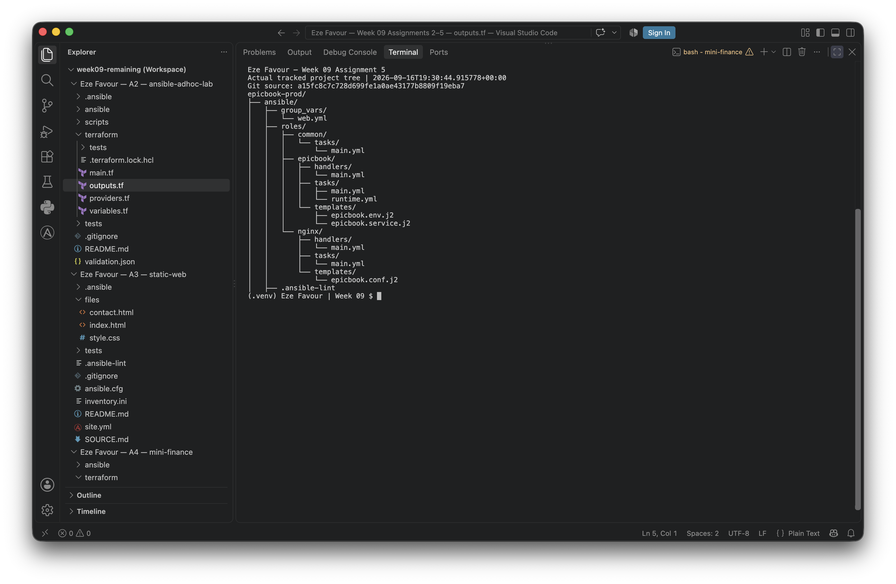
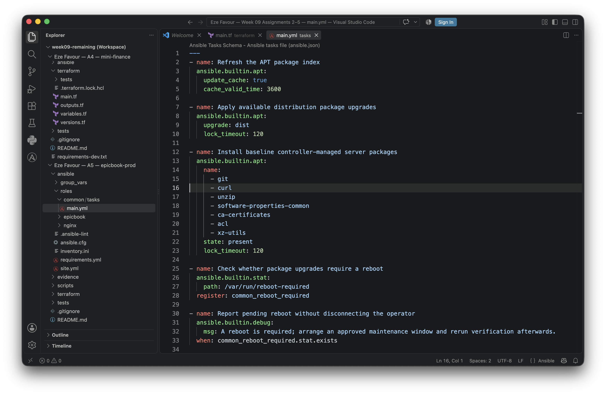
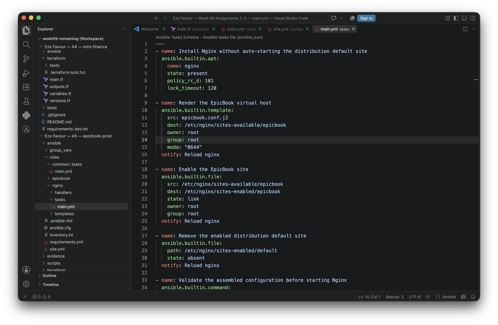
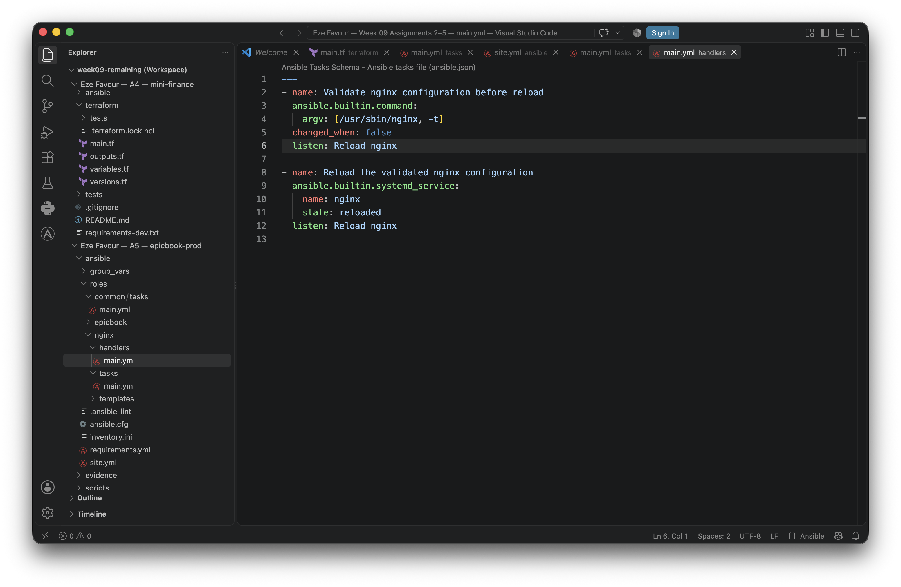
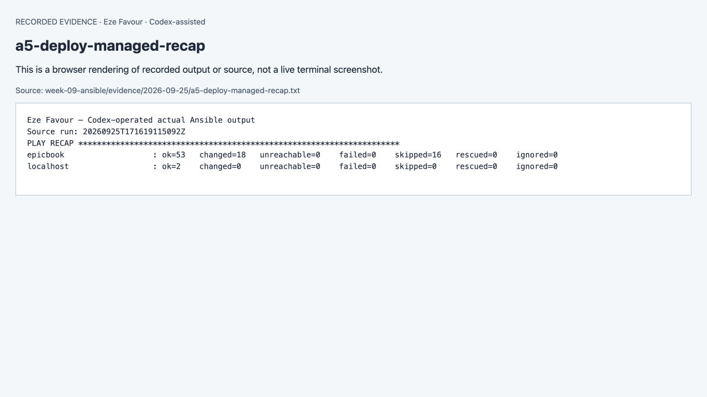
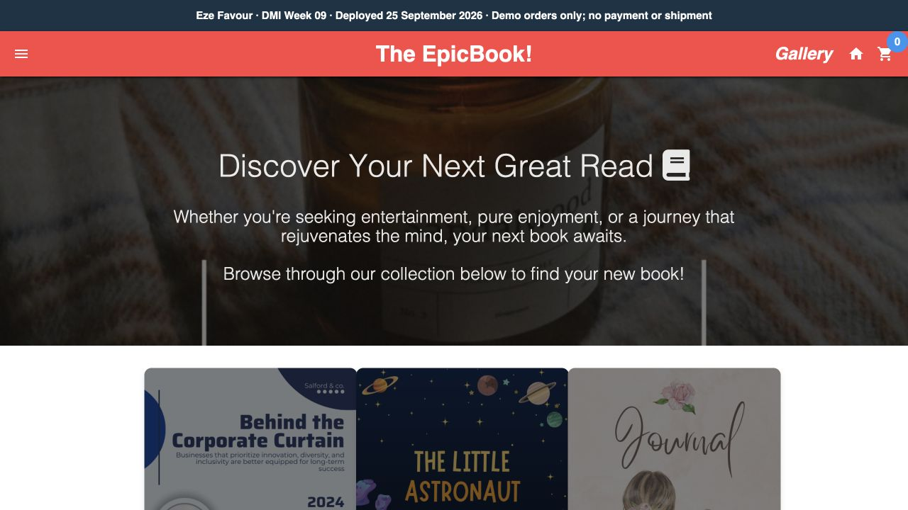

# Assignment — Deploy EpicBook with Terraform and Ansible Roles

**Current continuation, 25 September2026 — Eze Favour.** [Verified results, live URLs and limitations](evidence/2026-09-25/README.md) supersede historical pending-runtime statements below. Original requirements and earlier evidence remain preserved. Execution and notes are AI-assisted under delegation, not claims of learner-personal manual work. [Numbered evidence map](evidence/2026-09-25/screenshot-map.md).

Part of the DevOps Micro Internship (DMI) with Agentic AI

**Learner: Eze Favour. Execution: Codex under delegated authorization, 25 September2026.** Explanations below are AI-assisted and tied to verified results, not invented personal experience. The full pinned instructor requirements have been restored. [Current evidence and limitations](evidence/2026-09-25/README.md) distinguish live results from historical captures.

**Verified runtime:** Azure VM, private managed MySQL, PM2, Nginx,20 successful HTTP/SQL checks, previous orders preserved and changed=0 on the unchanged second run. [Live demo](http://20.77.180.238).

---

## Purpose

In this assignment, you will deploy the EpicBook web application using Terraform and Ansible roles.

Terraform provisions the cloud infrastructure, including one Ubuntu VM and one managed MySQL database. Ansible roles configure the VM, install required software, deploy the EpicBook application, configure Nginx, connect the app to the managed MySQL database, and verify the deployment.

---

# Task 1 — Set Up the Project Folder Layout

## Goal

Create the project folder structure for Terraform and Ansible roles.

Terraform will be used to provision the cloud infrastructure. Ansible roles will be used to configure the VM and deploy the EpicBook application.

### Evidence

#### Screenshot 1 — Terminal showing the completed `epicbook-prod` project structure

See the supporting evidence above and its scope in the numbered map.

---

### Notes

Answer the following in your own words:

**1. Which cloud provider did you choose for this assignment?**

Azure. The delegated deployment uses the existing UK South application VM and a private managed MySQL server in Sweden Central, after the subscription rejected MySQL provisioning in UK South.

---

**2. Why is it useful to keep Terraform files and Ansible files in separate folders?**

Terraform owns cloud resources and state; Ansible owns host configuration. Separate folders make inputs, validation and recovery responsibilities clear.

---

**3. What is the purpose of the `roles` directory in Ansible?**

It groups reusable tasks, templates and handlers by responsibility: common host setup, Nginx, and EpicBook.

---

# Task 2 — Provision the Infrastructure with Terraform

## Goal

Run Terraform to provision the cloud infrastructure for the EpicBook deployment.

Terraform will create the VM, managed MySQL database, networking, security rules, and required outputs.

### Evidence

#### Screenshot 2 — `terraform apply` completed successfully

[Evidence/source and exact-capture limitation](evidence/2026-09-25/screenshot-map.md).

See the supporting evidence above and its scope in the numbered map.

---

#### Screenshot 3 — Output of `terraform output`

[Evidence/source and exact-capture limitation](evidence/2026-09-25/screenshot-map.md).

See the supporting evidence above and its scope in the numbered map.

---

#### Screenshot 4 — Azure Portal or AWS Console showing the VM running

[Evidence/source and exact-capture limitation](evidence/2026-09-25/screenshot-map.md).

See the supporting evidence above and its scope in the numbered map.

---

#### Screenshot 5 — Azure Portal or AWS Console showing the managed MySQL database created

[Evidence/source and exact-capture limitation](evidence/2026-09-25/screenshot-map.md).

See the supporting evidence above and its scope in the numbered map.

---

### Notes

Answer the following in your own words:

**1. What resources did Terraform create for this assignment?**

The VM, disk, public IP, NIC, web VNet/subnet, security group/rules and resource group; then a delegated database subnet in a regional VNet, bidirectional private peering, private DNS links, managed MySQL, the bookstore database and TLS settings.

---

**2. Why should you review `terraform plan` before running `terraform apply`?**

The plan identifies exact creates, updates and deletions. The operator checked saved-plan hashes and confirmed that the regional database addition preserved the existing VM and its data.

---

**3. Why should database passwords not be shown in Terraform output?**

Logs and screenshots are often shared. Passwords were supplied privately through an ephemeral Terraform input and a write-only provider argument, with no password output.

---

# Task 3 — Verify SSH Key-Based Access

## Goal

Verify that the cloud VM can be accessed from the Ansible controller using SSH key-based authentication.

### Evidence

#### Screenshot 6 — Successful SSH hostname check from the Ansible controller

[Evidence/source and exact-capture limitation](evidence/2026-09-25/screenshot-map.md).

See the supporting evidence above and its scope in the numbered map.

---

### Notes

Answer the following in your own words:

**1. What command did you use to verify SSH access?**

Codex used key-authenticated SSH with StrictHostKeyChecking=yes and an independently authenticated known_hosts file, then verified the hostname and cloud-init. Later Ansible ping and service probes also succeeded.

---

**2. What proves that SSH key-based access worked successfully?**

The actual remote hostname/cloud-init output and later successful Ansible ping/service commands, using the pinned host key and private-key authentication.

---

**3. What would you check if SSH returned `Permission denied (publickey)`?**

Check the intended host, Ubuntu username, selected private key, authorized public key and SSH configuration. Preserve host verification; a public-key authentication error does not justify disabling it.

---

# Task 4 — Create the Ansible Inventory and Configuration

## Goal

Create the Ansible inventory file and local Ansible configuration for the EpicBook VM.

The inventory tells Ansible which VM to manage and which SSH user to use.

### Evidence

#### Screenshot 7 — `inventory.ini` showing the VM under the `web` group

[Evidence/source and exact-capture limitation](evidence/2026-09-25/screenshot-map.md).

See the supporting evidence above and its scope in the numbered map.

---

#### Screenshot 8 — Output of `ansible-inventory -i inventory.ini --graph`

[Evidence/source and exact-capture limitation](evidence/2026-09-25/screenshot-map.md).

See the supporting evidence above and its scope in the numbered map.

---

#### Screenshot 9 — Output of `ansible web -i inventory.ini -m ping`

See the supporting evidence above and its scope in the numbered map.

---

### Notes

Answer the following in your own words:

**1. What is the purpose of `inventory.ini`?**

An inventory maps logical groups to remote hosts and SSH settings. This implementation generates an equivalent Ansible JSON inventory with one host in the web group.

---

**2. What does `ansible_host` store?**

The actual address Ansible connects to for the named inventory host.

---

**3. What does `ansible_ssh_private_key_file` tell Ansible?**

It selects the local private key used for SSH authentication. The key itself is never committed or included in screenshots.

---

**4. Why is `host_key_checking = False` used only for this temporary lab?**

It was not used in this deployment. Host checking remained enabled and SSH fingerprints were matched against authenticated Azure boot diagnostics. Disabling the check would remove server-identity protection.

---

# Task 5 — Create the Main Ansible Playbook

## Goal

Create the main Ansible playbook that runs the required roles in the correct order.

The `site.yml` file will call the `common`, `nginx`, and `epicbook` roles.

### Evidence

#### Screenshot 10 — `site.yml` showing the roles in the correct order

[Evidence/source and exact-capture limitation](evidence/2026-09-25/screenshot-map.md).

See the supporting evidence above and its scope in the numbered map.

---

#### Screenshot 11 — Output of `ansible-playbook -i inventory.ini site.yml --syntax-check`

[Evidence/source and exact-capture limitation](evidence/2026-09-25/screenshot-map.md).

See the supporting evidence above and its scope in the numbered map.

---

### Notes

Answer the following in your own words:

**1. What is the purpose of `site.yml`?**

It validates the approved target and source inputs, gathers facts, and runs common, nginx and epicbook roles in order.

---

**2. Why should the roles run in the order `common`, `nginx`, and `epicbook`?**

Common dependencies come first, then the reverse proxy, then source, database connectivity, runtime dependencies and the managed application service. Final HTTP checks occur after handlers run.

---

**3. What does `become: true` allow Ansible to do?**

It permits the selected tasks to use sudo for system configuration. npm installation runs as a separate non-root source owner and the application runs as its own restricted service user.

---

# Task 6 — Create the `common` Role

## Goal

Create the `common` role to prepare the Ubuntu VM with the basic packages required for the EpicBook deployment.

This role handles the common server setup before Nginx and the application are configured.

### Evidence

#### Screenshot 12 — `roles/common/tasks/main.yml` showing the common setup tasks

See the supporting evidence above and its scope in the numbered map.

---

### Notes

Answer the following in your own words:

**1. What is the responsibility of the `common` role?**

Refresh package metadata, apply distribution updates and install shared tools such as Git, curl, certificate authorities, ACL support and archive utilities.

---

**2. Why should Nginx installation not be placed inside the `common` role?**

Nginx has its own package, site template, validation and reload lifecycle; keeping those in its role avoids coupling generic host preparation to one web server.

---

**3. Why is `mysql-client` useful in this deployment?**

It supports schema import/export and independent database checks. Managed connections require authenticated TLS.

---

# Task 7 — Create the `nginx` Role

## Goal

Create the `nginx` role to install Nginx and configure it as a reverse proxy for the EpicBook application.

Nginx will receive browser traffic on port `80` and forward it to the EpicBook Node.js application running on the VM.

### Evidence

#### Screenshot 13 — `roles/nginx/tasks/main.yml` showing Nginx installation and site configuration tasks

See the supporting evidence above and its scope in the numbered map.

---

#### Screenshot 14 — `roles/nginx/templates/epicbook.conf.j2` showing the reverse proxy configuration

See the supporting evidence above and its scope in the numbered map.

---

### Notes

Answer the following in your own words:

**1. What is the responsibility of the `nginx` role?**

Install Nginx, render and validate the virtual host, enable it, remove the distribution default and reload only after changes.

---

**2. Why is Nginx configured as a reverse proxy in this deployment?**

It accepts public HTTP on port80 and forwards approved requests to the Node application on local port8080 while blocking source/configuration paths.

---

**3. Why should the application port come from `group_vars/web.yml` instead of being hard-coded?**

One shared application-port setting keeps templates and service checks consistent.

---

# Task 8 — Create the `epicbook` Role

## Goal

Create the `epicbook` role to deploy the EpicBook application, connect it to the managed MySQL database, and run the application on port `8080` using PM2.

### Evidence

#### Screenshot 15 — `roles/epicbook/tasks/main.yml` showing application deployment tasks

[Evidence/source and exact-capture limitation](evidence/2026-09-25/screenshot-map.md).

See the supporting evidence above and its scope in the numbered map.

---

#### Screenshot 16 — Task or file showing how the database connection is configured, with secrets hidden

[Evidence/source and exact-capture limitation](evidence/2026-09-25/screenshot-map.md).

See the supporting evidence above and its scope in the numbered map.

---

#### Screenshot 17 — Task or output showing the EpicBook application managed by PM2

See the supporting evidence above and its scope in the numbered map.

---

### Notes

Answer the following in your own words:

**1. What is the responsibility of the `epicbook` role?**

Verify pinned source, install a checksum-locked patched release and Node dependencies, prepare database access, configure PM2 through systemd and verify the real application response.

---

**2. Why is PM2 used for the EpicBook Node.js application?**

PM2 supervises the Node process. Here pm2-runtime runs within a restricted systemd service, so process supervision and boot persistence are both explicit.

---

**3. Why should database passwords not be hard-coded in public files?**

A public secret can be reused by anyone who reads the repository, including its history. This deployment keeps passwords in encrypted Ansible Vault inputs and a root-readable service environment.

---

**4. What does it mean for the application to run on port `8080` while Nginx listens on port `80`?**

Browsers connect to Nginx on80; Nginx connects to the backend on8080. The Node port is not exposed as a public application endpoint.

---

# Task 9 — Create Group Variables

## Goal

Create reusable variables for the EpicBook deployment.

The `group_vars/web.yml` file stores values that can be reused across the Ansible roles.

### Evidence

#### Screenshot 18 — `group_vars/web.yml` showing the application, PM2, and database variables, with passwords hidden or masked

[Evidence/source and exact-capture limitation](evidence/2026-09-25/screenshot-map.md).

See the supporting evidence above and its scope in the numbered map.

---

### Notes

Answer the following in your own words:

**1. What is the purpose of `group_vars/web.yml`?**

It centralizes non-secret settings shared by the web inventory group. Runtime secrets and deployment-specific overrides remain in the private encrypted variable file.

---

**2. Which values did you store in `group_vars/web.yml`?**

Pinned source URL/revision, source-owner/runtime users, application paths, runtime opt-in flag, port8080, bookstore schema/user and pinned Node version/checksum. The actual managed host and passwords are private deployment overrides.

---

**3. How did you handle the database password securely?**

The Terraform admin password is a private ephemeral input; Ansible secrets are encrypted in Vault. Secret-bearing tasks use no_log and the rendered environment is root-only mode0600. TLS hostname/certificate validation stays enabled.

---

# Task 10 — Run the Ansible Playbook

## Goal

Run the Ansible playbook to configure the VM and deploy the EpicBook application.

The playbook should run the roles in this order:

1. `common`
2. `nginx`
3. `epicbook`

### Evidence

#### Screenshot 19 — Ansible playbook output showing the roles running

See the supporting evidence above and its scope in the numbered map.

---

#### Screenshot 20 — Final Ansible recap showing `failed=0`

See the supporting evidence above and its scope in the numbered map.

---

#### Screenshot 21 — Output of `ansible web -i inventory.ini -m command -a "systemctl is-active nginx" --become`

See the supporting evidence above and its scope in the numbered map.

---

#### Screenshot 22 — Output of `ansible web -i inventory.ini -m command -a "pm2 status"`

See the supporting evidence above and its scope in the numbered map.

---

#### Screenshot 23 — Output of `ansible web -i inventory.ini -m command -a "curl -I http://localhost:8080"`

See the supporting evidence above and its scope in the numbered map.

---

### Notes

Answer the following in your own words:

**1. What command did you run to execute the Ansible playbook?**

Codex ran ansible-playbook -i inventory.private.json site.yml -e @vars.vault.yml with the Vault password file supplied privately through the environment. This is delegated execution, not a claim that the learner personally typed it.

---

**2. How do you know all roles completed successfully?**

The managed deployment recap reported failed=0 and unreachable=0. A subsequent unchanged run reported changed=0 as well.

---

**3. What proves that Nginx is active?**

The actual Ansible command systemctl is-active nginx returned active; independent public HTTP and database-backed API checks also passed.

---

**4. What proves that PM2 is managing the EpicBook application?**

An actual pm2 status command against the service PM2_HOME showed EpicBook online. The systemd unit starts the pinned pm2-runtime binary.

---

**5. What proves that the EpicBook application responds on port `8080`?**

The actual remote curl -I http://localhost:8080 command returned a successful HTTP response.

---

# Task 11 — Verify the EpicBook Deployment

## Goal

Verify that the EpicBook application is running, accessible in the browser, and connected to the managed MySQL database.

### Evidence

#### Screenshot 24 — Output of `curl -I http://<public_ip>`

[Evidence/source and exact-capture limitation](evidence/2026-09-25/screenshot-map.md).

See the supporting evidence above and its scope in the numbered map.

---

#### Screenshot 25 — Output of the cart API test command

[Evidence/source and exact-capture limitation](evidence/2026-09-25/screenshot-map.md).

See the supporting evidence above and its scope in the numbered map.

---

#### Screenshot 26 — Output of the `/cart` HTTP status check

[Evidence/source and exact-capture limitation](evidence/2026-09-25/screenshot-map.md).

See the supporting evidence above and its scope in the numbered map.

---

#### Screenshot 27 — Browser showing the EpicBook application loaded from `http://<public_ip>`

See the supporting evidence above and its scope in the numbered map.

---

### Notes

Answer the following in your own words:

**1. What HTTP response did you receive from the public application URL?**

HTTP200 from http://20.77.180.238, with the actual catalogue and Eze Favour attribution.

---

**2. What did the cart API test prove?**

Separate signed browser carts stay isolated, invalid book IDs are rejected, checkout persists one managed-MySQL order, lost-response replay returns the same order without duplication, and cents32.50 are preserved.

---

**3. What did the `/cart` status check return?**

The public /cart endpoint returned HTTP200 in the final 25September verification; the independent report also verifies cart and checkout behavior.

---

**4. What issue did you face during verification, and how did you fix it?**

The original cart/checkout behavior shared state and could duplicate or lose order details. The disclosed patch uses signed cart membership, transactions, pending-order filtering, replay-safe checkout and decimal money columns; actual HTTP/SQL tests verify the result.

---

# LinkedIn Post Required

## Evidence

#### LinkedIn Post URL

Paste your LinkedIn post URL here:

https://www.linkedin.com/feed/update/urn:li:activity:7509317694291283968/

---

#### Screenshot — Published LinkedIn post

See the supporting evidence above and its scope in the numbered map.

---

# Assignment Questions

Answer the following in your own words:

**1. Why is Terraform used for infrastructure provisioning?**

It records cloud resources declaratively and provides reviewable plans and state for controlled updates and cleanup.

---

**2. Why are Ansible roles useful for production-style deployments?**

Roles isolate responsibilities and make the configuration reusable, reviewable and repeatable across hosts.

---

**3. What is the purpose of `group_vars/web.yml`?**

It centralizes non-secret settings shared by the web inventory group. Runtime secrets and deployment-specific overrides remain in the private encrypted variable file.

---

**4. Why should database passwords not be committed to GitHub?**

Removing a password from the current file does not remove it from repository history or other copies. Secrets belong in scoped secret storage, not version control.

---

**5. What is the purpose of Nginx in this deployment?**

It provides the public HTTP entry point, reverse-proxy routing and explicit denial of sensitive source/configuration paths.

---

**6. Why should the managed MySQL database not be publicly accessible?**

The database is an internal dependency. Private networking and scoped3306 rules reduce who can reach it; TLS and database authentication remain required.

---

**7. Why is PM2 used for the EpicBook Node.js application?**

PM2 supervises the Node process. Here pm2-runtime runs within a restricted systemd service, so process supervision and boot persistence are both explicit.

---

**8. What does idempotency mean in Ansible?**

Applying an unchanged desired configuration again should make no changes. The verified second managed deployment returned changed=0, failed=0 and unreachable=0.

---

**9. What issue did you face during the deployment, and how did you fix it?**

Azure rejected MySQL in UK South. The operator created the database in Sweden Central, retained private connectivity through peering and DNS, migrated existing demo orders, and verified TLS and persistence.

---

**10. What security improvement would you make before using this setup in production?**

Add managed HTTPS at the public edge, application authentication/authorization appropriate to real orders, monitored backups/restore exercises and least-privilege operational identities. This deployment remains a synthetic demo with no payment or shipment.

---

# Required Files

Confirm that the following files are included in your GitHub repository or assignment folder:

- [x] `README.md`
- [x] Terraform files under either `terraform/azure/` or `terraform/aws/`
- [x] `ansible/ansible.cfg`
- [x] `ansible/inventory.ini`
- [x] `ansible/site.yml`
- [x] `ansible/group_vars/web.yml`
- [x] `ansible/roles/common/tasks/main.yml`
- [x] `ansible/roles/nginx/tasks/main.yml`
- [x] `ansible/roles/nginx/templates/epicbook.conf.j2`
- [x] `ansible/roles/epicbook/tasks/main.yml`

---

# Submission Instructions

- Add all required screenshots in your submission.
- Full Name must be visible in required screenshots.
- Mention the cloud provider used: Azure or AWS.
- Add the VM public IP address.
- Add the final application URL.
- Add Terraform output proof.
- Add Ansible role tree proof.
- Add all required notes and assignment question answers.
- LinkedIn post: https://www.linkedin.com/feed/update/urn:li:activity:7509317694291283968/
- Do not expose SSH private keys, passwords, cloud credentials, database credentials, Terraform state files, subscription IDs, or account IDs.

---

# Completion Checklist

- [x] Task 1: Project folder layout created
- [x] Task 2: Terraform infrastructure provisioned
- [x] Task 3: SSH key-based access verified
- [x] Task 4: Ansible inventory and configuration created
- [x] Task 5: Main Ansible playbook created
- [x] Task 6: `common` role created
- [x] Task 7: `nginx` role created
- [x] Task 8: `epicbook` role created
- [x] Task 9: Group variables created
- [x] Task 10: Ansible playbook run completed
- [x] Task 11: EpicBook deployment verified
- [x] Terraform files created under only one cloud provider folder
- [x] One Ubuntu VM was created
- [x] One managed MySQL database was created
- [x] SSH port `22` is restricted to the controller public IP
- [x] HTTP port `80` is accessible
- [x] MySQL port `3306` is not publicly open
- [x] `ansible web -i inventory.ini -m ping` returns `SUCCESS`
- [x] `site.yml` calls the roles in the correct order
- [x] Database secrets are hidden or handled securely
- [x] Nginx is active
- [x] PM2 shows the EpicBook application running
- [x] EpicBook responds on port `8080`
- [x] Public URL loads in the browser
- [x] Cart API verification works
- [x] Playbook completes with `failed=0`
- [ ] Screenshots 1–27 are included
- [x] Assignment questions are answered
- [x] LinkedIn post published
- [x] LinkedIn post URL added
- [ ] No sensitive information is exposed

---

## About DMI & CloudAdvisory

DevOps Micro Internship (DMI) is a project-based DevOps program run by Pravin Mishra and The CloudAdvisory, focused on real-world execution, systems thinking, and career readiness.

It helps learners build strong DevOps foundations with hands-on experience.

---

## Resources

- DMI Official Website: [https://dmi.pravinmishra.com?utm_source=github&utm_medium=readme](https://dmi.pravinmishra.com?utm_source=github&utm_medium=readme)
- University: [https://university.pravinmishra.com?utm_source=github&utm_medium=readme](https://university.pravinmishra.com?utm_source=github&utm_medium=readme)
- Discord Community: [https://discord.pravinmishra.com?utm_source=github&utm_medium=readme](https://discord.pravinmishra.com?utm_source=github&utm_medium=readme)
- Blog: [https://dmi.pravinmishra.com/blog?utm_source=github&utm_medium=readme](https://dmi.pravinmishra.com/blog?utm_source=github&utm_medium=readme)
- YouTube Playlist: [https://www.youtube.com/playlist?list=PLFeSNDtI4Cho](https://www.youtube.com/playlist?list=PLFeSNDtI4Cho)
- Pravin Mishra LinkedIn: [https://www.linkedin.com/in/pravin-mishra-aws-trainer/](https://www.linkedin.com/in/pravin-mishra-aws-trainer/)
- CloudAdvisory LinkedIn: [https://www.linkedin.com/company/thecloudadvisory/](https://www.linkedin.com/company/thecloudadvisory/)

---

*This submission is part of DevOps Micro Internship (DMI) — Agentic AI Track.*

### 25 September publication

[Medium](https://medium.com/@rosenaefavour/from-four-linux-vms-to-a-repeatable-epicbook-deployment-dmi-week-09-f1f1ea25646f) · [LinkedIn](https://www.linkedin.com/feed/update/urn:li:activity:7509317694291283968/). The public posts describe the verified outcomes and assisted work.
