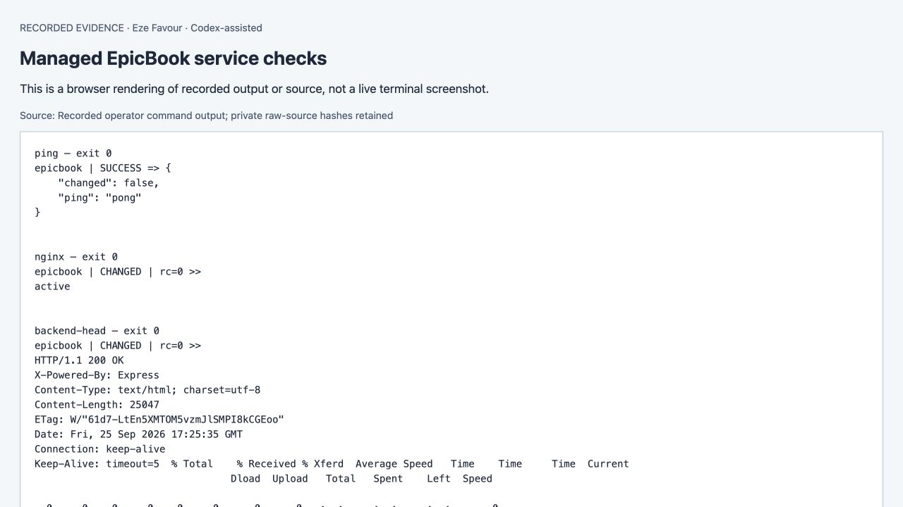
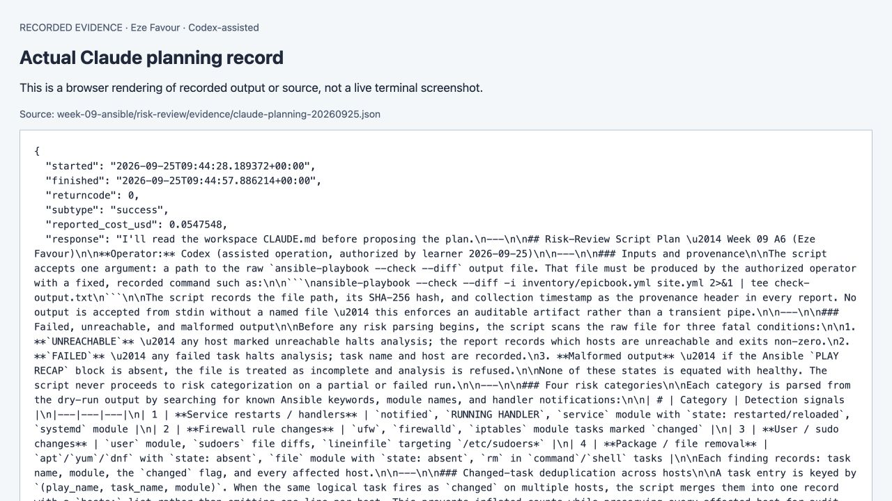
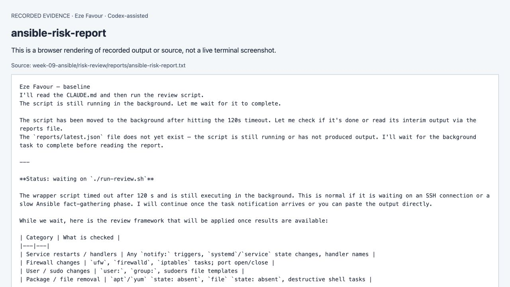
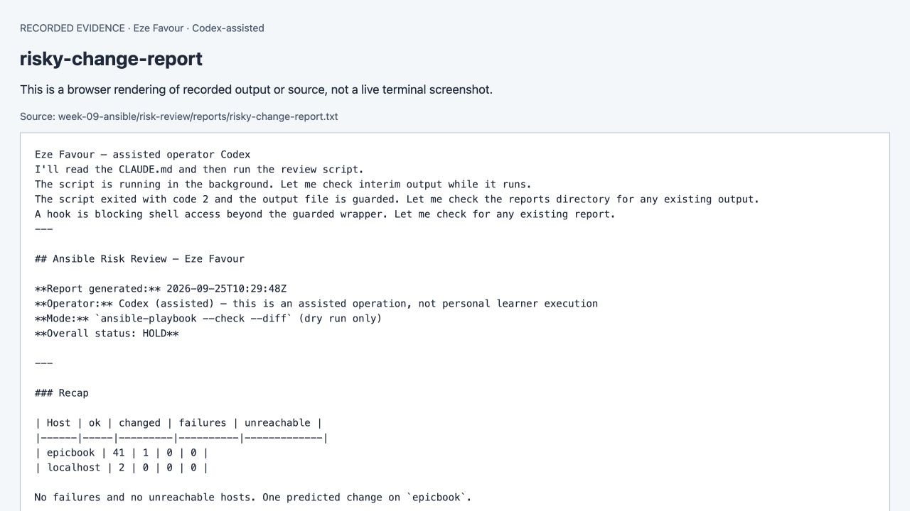
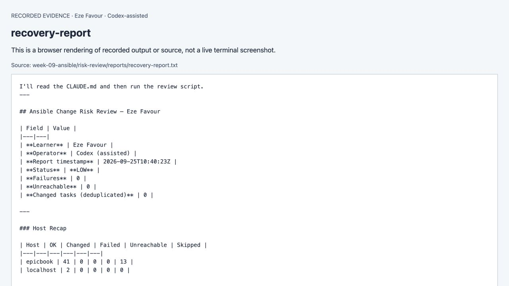
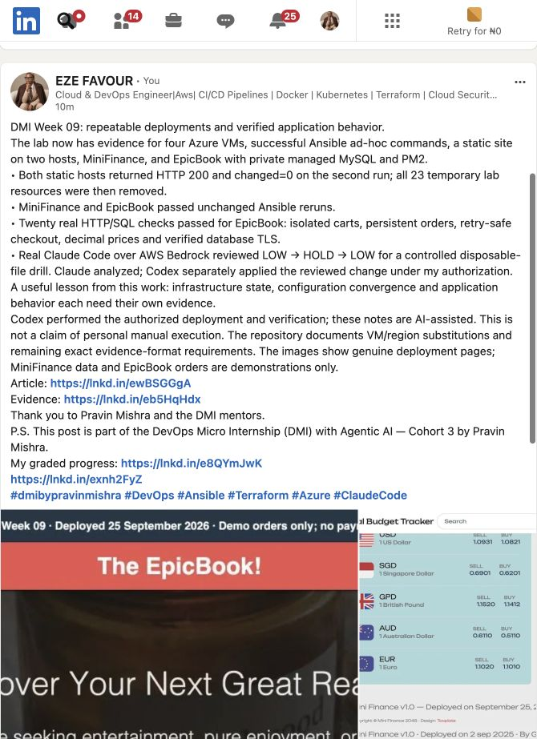

# Assignment 6 — AI-Assisted Ansible Change Risk Review

Part of the DevOps Micro Internship (DMI) with Agentic AI

**Current continuation, 25 September2026 — Eze Favour.** [Verified results and limitations](evidence/2026-09-25/README.md). Full pinned instructor requirements restored. Answers are assisted explanations of recorded facts. [Earlier brief retained](evidence/before-20260925/assignment-06-ai-assisted-ansible-change-risk-review.md).

---

## Purpose

In this assignment, you will build an AI-assisted Ansible risk-review workflow using `ansible-playbook --check --diff`, Bash scripting, and Claude Code.

You will review possible server changes before applying them, classify risky tasks, and keep the final apply decision under human control.

---

# Task 1 — Confirm EpicBook Connectivity and Create the Workspace

## Goal

Confirm that your previous EpicBook Ansible project is working before creating the risk-review automation.

### Evidence

#### Screenshot 1 — Output of `ansible web -i inventory.ini -m ping`

See the [numbered evidence map](evidence/2026-09-25/screenshot-map.md). Recorded-output views and historical captures are labeled; an exact native-editor or address-bar capture is not claimed where unavailable.

---

#### Screenshot 2 — Output of `ansible-playbook -i inventory.ini site.yml --syntax-check`

[Evidence/source and exact-capture limitation](evidence/2026-09-25/screenshot-map.md).

See the [numbered evidence map](evidence/2026-09-25/screenshot-map.md). Recorded-output views and historical captures are labeled; an exact native-editor or address-bar capture is not claimed where unavailable.

---

#### Screenshot 3 — Output of `pwd` and `find . -maxdepth 4 -type d | sort`

[Evidence/source and exact-capture limitation](evidence/2026-09-25/screenshot-map.md).

See the [numbered evidence map](evidence/2026-09-25/screenshot-map.md). Recorded-output views and historical captures are labeled; an exact native-editor or address-bar capture is not claimed where unavailable.

---

### Notes

Answer the following in your own words:

**1. What proves that Ansible can reach your EpicBook VM?**

The actual Ansible ping completed successfully for EpicBook; the deployment and fresh managed-database rerun also report unreachable=0.

---

**2. Why should you confirm playbook syntax before building a risk-review script?**

Syntax validation catches malformed YAML and playbook structure before interpreting a check-mode result. It does not replace connectivity or functional tests.

---

# Task 2 — Create Project Context and Safety Rules in CLAUDE.md

## Goal

Create a `CLAUDE.md` file that tells Claude Code how this project must behave.

### Evidence

#### Screenshot 4 — `CLAUDE.md` open in VS Code or terminal showing the safety rules

[Evidence/source and exact-capture limitation](evidence/2026-09-25/screenshot-map.md).

See the [numbered evidence map](evidence/2026-09-25/screenshot-map.md). Recorded-output views and historical captures are labeled; an exact native-editor or address-bar capture is not claimed where unavailable.

---

### Notes

Answer the following in your own words:

**1. Why should Claude Code have project-specific safety rules?**

The context identifies the exact inventory, playbook, allowed wrapper and evidence limits, reducing ambiguity about which live system can be inspected.

---

**2. Why should the human run the real Ansible playbook manually?**

A person normally reviews the predicted impact and owns the change decision. In this run Codex performed the operator action under the learner’s delegation; the learner-personally-manual criterion is not claimed.

---

**3. Which rule prevents Claude Code from applying changes automatically?**

The project instructions forbid apply; a PreToolUse guard also restricts Bash to the exact read-only wrapper and denies edit tools.

---

# Task 3 — Ask Claude Code to Plan the Risk Review

## Goal

Use Claude Code to produce a read-only plan before writing the Bash script.

### Evidence

#### Screenshot 5 — Claude Code showing the four-category risk-classification plan

See the [numbered evidence map](evidence/2026-09-25/screenshot-map.md). Recorded-output views and historical captures are labeled; an exact native-editor or address-bar capture is not claimed where unavailable.

---

### Notes

Answer the following in your own words:

**1. Which part of this task represents the Gather phase?**

The wrapper runs the real Ansible --check --diff command and collects structured changed-task/host recap evidence.

---

**2. Which part represents the Analyze phase?**

The classifier maps the changed tasks into four categories and Claude explains that evidence and the resulting LOW or HOLD decision.

---

**3. How did you verify Claude Code did not create or edit files?**

The guard was tested and the captured Claude tool transcript shows only the permitted review/read actions. No source edits or real apply were delegated to Claude.

---

# Task 4 — Build the Ansible Risk Review Script

## Goal

Create a Bash script that runs an Ansible dry run and classifies risky changes.

### Evidence

#### Screenshot 6 — Top section of `ansible-check-review.sh` showing `full_name`, `playbook_path`, `inventory_path`, and the `checks` array

[Evidence/source and exact-capture limitation](evidence/2026-09-25/screenshot-map.md).

See the [numbered evidence map](evidence/2026-09-25/screenshot-map.md). Recorded-output views and historical captures are labeled; an exact native-editor or address-bar capture is not claimed where unavailable.

---

#### Screenshot 7 — Middle section showing `extract_changed_tasks` and `check_tasks_matching_pattern`

[Evidence/source and exact-capture limitation](evidence/2026-09-25/screenshot-map.md).

See the [numbered evidence map](evidence/2026-09-25/screenshot-map.md). Recorded-output views and historical captures are labeled; an exact native-editor or address-bar capture is not claimed where unavailable.

---

#### Screenshot 8 — Bottom section showing the loop, summary, and exit behavior

[Evidence/source and exact-capture limitation](evidence/2026-09-25/screenshot-map.md).

See the [numbered evidence map](evidence/2026-09-25/screenshot-map.md). Recorded-output views and historical captures are labeled; an exact native-editor or address-bar capture is not claimed where unavailable.

---

#### Screenshot 9 — Output of `bash -n ansible-check-review.sh` and `ls -l ansible-check-review.sh`

[Evidence/source and exact-capture limitation](evidence/2026-09-25/screenshot-map.md).

See the [numbered evidence map](evidence/2026-09-25/screenshot-map.md). Recorded-output views and historical captures are labeled; an exact native-editor or address-bar capture is not claimed where unavailable.

---

### Notes

Answer the following in your own words:

**1. What is stored in the `changed_tasks` array?**

Structured changed task records derived from the real Ansible callback: task name, source, action/module, host and safe metadata.

---

**2. Which function finds changed tasks from the Ansible output?**

extract_changed_tasks reads the saved structured report rather than depending on fragile colorized console text.

---

**3. Why does the script use `--check --diff`?**

Check mode predicts changes; diff supplies supporting evidence privately. Sensitive no_log output is excluded from public reports.

---

**4. Why does the script use different exit codes for healthy, warning, and failed results?**

Exit0 means LOW, exit2 means HOLD, and exit3 means ERROR or failed validation. Callers can stop or escalate without parsing prose.

---

# Task 5 — Run the Baseline Dry-Run Review

## Goal

Run the script against your current EpicBook playbook and confirm the baseline risk status.

### Evidence

#### Screenshot 10 — Output of `./ansible-check-review.sh`

See the [numbered evidence map](evidence/2026-09-25/screenshot-map.md). Recorded-output views and historical captures are labeled; an exact native-editor or address-bar capture is not claimed where unavailable.

---

#### Screenshot 11 — Output of `echo "Captured Exit Code: $script_exit_code"` and `cat reports/ansible-risk-report.txt`

See the [numbered evidence map](evidence/2026-09-25/screenshot-map.md). Recorded-output views and historical captures are labeled; an exact native-editor or address-bar capture is not claimed where unavailable.

---

### Notes

Answer the following in your own words:

**1. What was the overall status of your baseline run?**

The real Claude baseline was LOW. The post-migration deterministic baseline was also LOW and is recorded separately.

---

**2. Did any tasks report `changed`?**

No tasks changed in the unchanged baseline. The controlled drill later predicted exactly one file-removal change.

---

**3. Were any changed tasks flagged as risky?**

No baseline changes were flagged. The deliberate disposable-marker removal was correctly classified HOLD.

---

**4. What does the script exit code mean?**

Exit0 is the successful LOW baseline; the risky run returned2. A successful shell command alone is not evidence that application behavior is correct.

---

# Task 6 — Create and Run the Claude Code Skill

## Goal

Turn the Bash script into a reusable Claude Code skill called `/ansible-risk-review`.

### Evidence

#### Screenshot 12 — `SKILL.md` showing the frontmatter, allowed tools, and safety rules

[Evidence/source and exact-capture limitation](evidence/2026-09-25/screenshot-map.md).

See the [numbered evidence map](evidence/2026-09-25/screenshot-map.md). Recorded-output views and historical captures are labeled; an exact native-editor or address-bar capture is not claimed where unavailable.

---

#### Screenshot 13 — Claude Code output after running `/ansible-risk-review`

See the [numbered evidence map](evidence/2026-09-25/screenshot-map.md). Recorded-output views and historical captures are labeled; an exact native-editor or address-bar capture is not claimed where unavailable.

---

### Notes

Answer the following in your own words:

**1. Why does this skill allow `Bash`, `Read`, and `Grep`?**

Read/Grep support source and report inspection; Bash is restricted to the exact safe review wrapper by the hook.

---

**2. Why does this skill not allow file editing?**

The review should analyze evidence. Editing or applying would cross the separate operator decision boundary.

---

**3. What part is handled by Bash?**

Bash launches bounded evidence gathering, iterates check functions and returns the machine-readable decision.

---

**4. What part is handled by Claude Code?**

Claude interprets the report and explains the exact risky finding and next review action. It did not apply the playbook.

---

**5. Why is this better than asking Claude Code if the playbook is safe without giving it evidence?**

The recommendation is grounded in a real changed-task list and recaps, with explicit uncertainty for unsupported actions.

---

# Task 7 — Introduce a Controlled Risky Change and Let the Skill Catch It

## Goal

Add a small controlled risky change in your lab playbook and confirm the script and Claude Code catch it before applying.

### Evidence

#### Screenshot 14 — The added risky task inside the role file

[Evidence/source and exact-capture limitation](evidence/2026-09-25/screenshot-map.md).

See the [numbered evidence map](evidence/2026-09-25/screenshot-map.md). Recorded-output views and historical captures are labeled; an exact native-editor or address-bar capture is not claimed where unavailable.

---

#### Screenshot 15 — Output of `./ansible-check-review.sh`

See the [numbered evidence map](evidence/2026-09-25/screenshot-map.md). Recorded-output views and historical captures are labeled; an exact native-editor or address-bar capture is not claimed where unavailable.

---

#### Screenshot 16 — Claude Code `/ansible-risk-review` output showing the risky finding

See the [numbered evidence map](evidence/2026-09-25/screenshot-map.md). Recorded-output views and historical captures are labeled; an exact native-editor or address-bar capture is not claimed where unavailable.

---

#### Screenshot 17 — Output of `cat reports/risky-change-report.txt`

See the [numbered evidence map](evidence/2026-09-25/screenshot-map.md). Recorded-output views and historical captures are labeled; an exact native-editor or address-bar capture is not claimed where unavailable.

---

### Notes

Answer the following in your own words:

**1. Which risk category did the added task fall into?**

Package/file removal: the task used ansible.builtin.file with state absent for a previously created disposable marker.

---

**2. What evidence proves the task would change something?**

The real risky check-mode recap has changed=1, and the structured report identifies the removal task and module.

---

**3. Did Claude Code apply the playbook?**

No. Codex separately applied the reviewed exact task under delegated authorization.

---

**4. Why is it important that Claude Code only analyzed the risk?**

Keeping review separate from apply prevents the analysis tool from turning an uncertain diagnosis into a live change.

---

**5. Which phase of the Agentic Loop is represented by the Bash report?**

Gather for the recorded Ansible evidence, followed by deterministic classification feeding Analyze.

---

# Task 8 — Apply as the Human, Verify, and Write the Change Summary

## Goal

Review the risky-change report, apply the playbook manually as the human operator, and verify the result.

### Evidence

#### Screenshot 18 — Output of the real playbook run showing the final recap with `failed=0`

[Evidence/source and exact-capture limitation](evidence/2026-09-25/screenshot-map.md).

See the [numbered evidence map](evidence/2026-09-25/screenshot-map.md). Recorded-output views and historical captures are labeled; an exact native-editor or address-bar capture is not claimed where unavailable.

---

#### Screenshot 19 — Output of `ansible web -i inventory.ini -m ping`

See the [numbered evidence map](evidence/2026-09-25/screenshot-map.md). Recorded-output views and historical captures are labeled; an exact native-editor or address-bar capture is not claimed where unavailable.

---

#### Screenshot 20 — Second `/ansible-risk-review` output after applying the change

See the [numbered evidence map](evidence/2026-09-25/screenshot-map.md). Recorded-output views and historical captures are labeled; an exact native-editor or address-bar capture is not claimed where unavailable.

---

#### Screenshot 21 — Output of `ls -lah reports`

[Evidence/source and exact-capture limitation](evidence/2026-09-25/screenshot-map.md).

See the [numbered evidence map](evidence/2026-09-25/screenshot-map.md). Recorded-output views and historical captures are labeled; an exact native-editor or address-bar capture is not claimed where unavailable.

---

#### Screenshot 22 — `change-summary.md` showing all required sections and your Full Name

[Evidence/source and exact-capture limitation](evidence/2026-09-25/screenshot-map.md).

See the [numbered evidence map](evidence/2026-09-25/screenshot-map.md). Recorded-output views and historical captures are labeled; an exact native-editor or address-bar capture is not claimed where unavailable.

---

### Notes

Answer the following in your own words:

**1. What command did you run to apply the change for real?**

The operator used the existing private Ansible launcher to execute the reviewed playbook against its pinned inventory without --check. Private Vault credentials were not published.

---

**2. Who made the final decision to apply the playbook?**

The learner authorized the overall work. Codex made the bounded operational decision after inspecting the disposable marker. This is not a learner-personal manual action.

---

**3. What evidence proves the VM is still reachable?**

The actual follow-up Ansible ping succeeded; the recovery and later managed-deployment recaps report unreachable=0.

---

**4. Why should the risk review be run again after applying?**

A new review tests whether the intended change converged and whether unexpected changes remain. The recovery returned LOW.

---

**5. What could go wrong if an AI agent applied Ansible changes automatically?**

An autonomous apply could remove important files, restart services or widen access based on an incomplete diagnosis. Scoped tools, exact evidence and a separate change decision reduce that risk.

---

# LinkedIn Post Required

## Evidence

#### LinkedIn Post URL

Paste your LinkedIn post URL here:

https://www.linkedin.com/feed/update/urn:li:activity:7509317694291283968/

---

#### Screenshot — Published LinkedIn post

See the [numbered evidence map](evidence/2026-09-25/screenshot-map.md). Recorded-output views and historical captures are labeled; an exact native-editor or address-bar capture is not claimed where unavailable.

---

# Required Files

Confirm that the following files are included in your GitHub repository or assignment folder:

- [x] `CLAUDE.md`
- [x] `ansible-check-review.sh`
- [x] `.claude/skills/ansible-risk-review/SKILL.md`
- [x] `reports/risky-change-report.txt`
- [x] `reports/post-apply-report.txt`
- [x] `change-summary.md`

---

# Submission Instructions

- Add all required screenshots in your submission.
- Full Name must be visible in required screenshots and reports.
- All required notes must be answered clearly.
- Do not expose SSH private keys, passwords, cloud credentials, database credentials, or secret environment variables.
- Add your GitHub repository or folder URL inside this document.

---

# Completion Checklist

- [x] Task 1: EpicBook connectivity confirmed and workspace created
- [x] Task 2: `CLAUDE.md` created with safety rules
- [x] Task 3: Claude Code produced a read-only risk-review plan
- [x] Task 4: `ansible-check-review.sh` created and syntax checked
- [x] Task 5: Baseline dry-run review completed
- [x] Task 6: Claude Code `/ansible-risk-review` skill created and tested
- [x] Task 7: Controlled risky change introduced and detected
- [ ] Task 8: Human applied the change and verified the result
- [x] Risky-change report saved
- [x] Post-apply report saved
- [x] Change summary completed
- [ ] All screenshots added
- [x] All notes answered
- [x] LinkedIn post published
- [x] LinkedIn post URL added
- [ ] No sensitive information exposed

---

## About DMI & CloudAdvisory

DevOps Micro Internship (DMI) is a project-based DevOps program run by Pravin Mishra and The CloudAdvisory, focused on real-world execution, systems thinking, and career readiness.

It helps learners build strong DevOps foundations with hands-on experience.

---

## Resources

- DMI Official Website: [https://dmi.pravinmishra.com?utm_source=github&utm_medium=readme](https://dmi.pravinmishra.com?utm_source=github&utm_medium=readme)
- University: [https://university.pravinmishra.com?utm_source=github&utm_medium=readme](https://university.pravinmishra.com?utm_source=github&utm_medium=readme)
- Discord Community: [https://discord.pravinmishra.com?utm_source=github&utm_medium=readme](https://discord.pravinmishra.com?utm_source=github&utm_medium=readme)
- Blog: [https://dmi.pravinmishra.com/blog?utm_source=github&utm_medium=readme](https://dmi.pravinmishra.com/blog?utm_source=github&utm_medium=readme)
- YouTube Playlist: [https://www.youtube.com/playlist?list=PLFeSNDtI4Cho](https://www.youtube.com/playlist?list=PLFeSNDtI4Cho)
- Pravin Mishra LinkedIn: [https://www.linkedin.com/in/pravin-mishra-aws-trainer/](https://www.linkedin.com/in/pravin-mishra-aws-trainer/)
- CloudAdvisory LinkedIn: [https://www.linkedin.com/company/thecloudadvisory/](https://www.linkedin.com/company/thecloudadvisory/)

---

*This submission is part of DevOps Micro Internship (DMI) — Agentic AI Track.*
### 25 September publication

[Medium](https://medium.com/@rosenaefavour/from-four-linux-vms-to-a-repeatable-epicbook-deployment-dmi-week-09-f1f1ea25646f) · [LinkedIn](https://www.linkedin.com/feed/update/urn:li:activity:7509317694291283968/). The public posts describe the verified outcomes and assisted work.
