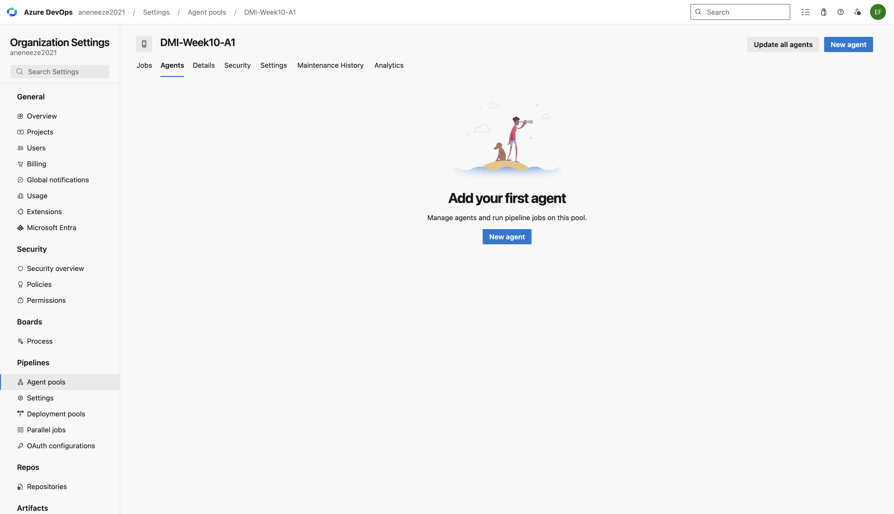
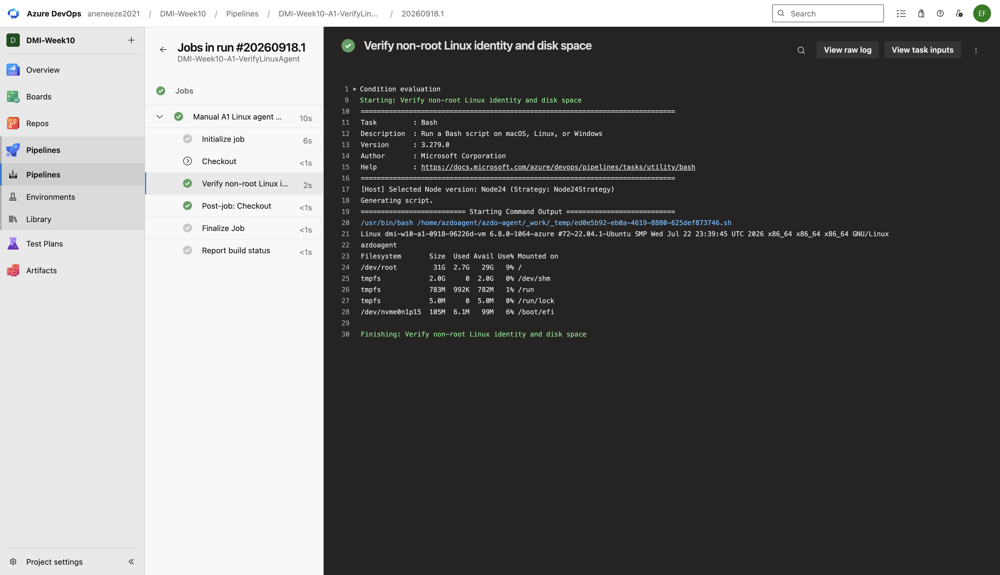

# Assignment 1 — Set Up a Self-Hosted Linux Agent for Azure DevOps (Ubuntu + PAT)

Part of the DevOps Micro Internship (DMI) Cohort 3 with Agentic AI

<!-- BEGIN WEEK10 A1 OFFLINE PREPARATION -->
## Historical source preparation — not a completed assignment

Eze Favour's [offline A1 project](self-hosted-agent/README.md) provides a manual-only verification pipeline, a human-operated runbook, and credential-free local tests. At the source-preparation checkpoint, the [seven-slot manifest](self-hosted-agent/evidence/manifest.json) was entirely pending; no live resource, agent, pipeline success, or screenshot was claimed. The current manifest and attachments below now record two genuine captures, with five slots still pending.

Fresh authorization is required before any cloud, PAT, SSH, agent registration, service, or pipeline operation. Screenshot capture and publication remain separately gated. The original task instructions, evidence requirements and unchecked checklist remain intact; current captures and attributed technical notes appear below. See the [Week 10 sequence](README.md) for the remaining assignments.
<!-- END WEEK10 A1 OFFLINE PREPARATION -->

---

## Purpose

In this assignment, you will set up a self-hosted Azure DevOps build agent on an Ubuntu VM (AWS or Azure), registering it with a Personal Access Token in a dedicated agent pool, running it as a system service, and verifying it by running a test pipeline.

---

# Task 1 — Create a Personal Access Token (PAT)

## Goal

Create a PAT with Agent Pools (Read & Manage) and Build (Read & Execute) scopes, and store it securely.

> No PAT value screenshot required. If you capture the token settings page, ensure the secret value is not visible.

---

# Task 2 — Create an Agent Pool

## Goal

Create a self-hosted agent pool (e.g. `SelfHostedPool`) in Azure DevOps Organization Settings.

### Evidence

#### Screenshot 1 — Azure DevOps Agent Pools page showing the newly created pool

<!-- BEGIN WEEK10 CAPTURE A1-S1 -->

Captured 19 September 2026. Shows the retained pool, **not an Online agent**. Human visual/privacy review is pending. [Provenance and remaining gaps](evidence/README.md).
<!-- END WEEK10 CAPTURE A1-S1 -->

---

# Task 3 — Provision the Ubuntu VM

## Goal

Create an Ubuntu 22.04 (or latest) VM in AWS or Azure with SSH access, and confirm connectivity.

### Evidence

#### Screenshot 2 — Cloud console showing the running Ubuntu VM and its public IP or DNS name

Add your screenshot here.

---

#### Screenshot 3 — Terminal showing a successful SSH login and Ubuntu version details

Add your screenshot here.

---

# Task 4 — Install and Configure the Agent

## Goal

Download the Linux agent package, register it with your organization/pool/PAT via `config.sh`, and install/start it as a system service.

### Evidence

#### Screenshot 4 — Terminal showing successful agent configuration without exposing the PAT

Add your screenshot here.

---

#### Screenshot 5 — Terminal showing the agent service running successfully

Add your screenshot here.

---

# Task 5 — Verify the Setup

## Goal

Confirm the agent service is running and the agent shows as Online in the Azure DevOps agent pool.

### Evidence

#### Screenshot 6 — Agent Pool listing showing the registered agent online

Add your screenshot here.

---

# Task 6 — Run a Test Pipeline

## Goal

Create and run a YAML pipeline targeting the self-hosted pool, running `uname -a`, `whoami`, and `df -h` on the VM.

### Evidence

#### Screenshot 7 — Successful test pipeline run output in Azure DevOps showing the Linux commands

<!-- BEGIN WEEK10 CAPTURE A1-S7 -->

Captured 19 September 2026 from **historical run 1 on 18 September**. The host was subsequently cleaned up; this is not current host-health evidence. Human visual/privacy review is pending. [Provenance and remaining gaps](evidence/README.md).
<!-- END WEEK10 CAPTURE A1-S7 -->

---

### Notes

Note the cloud platform used, your Azure DevOps organization/project name, and the agent pool name. Describe any issue you faced and how you resolved it.

<!-- BEGIN WEEK10 ANSWER A1-NOTES -->
**Recorded technical notes — personal reflection pending.** These notes summarize the [18 September operational receipt](self-hosted-agent/runtime-2026-09-18.json), not learner-performed actions. The trial was assistant-operated under the user's authorization.

- **Platform and registration:** Azure hosted Ubuntu 22.04 on x86_64. The Azure DevOps organization was `aneneeze2021`, the project was `DMI-Week10`, and the dedicated pool was `DMI-Week10-A1`. The verified Microsoft agent package was version `5.279.0`. Its service ran as the non-root account `azdoagent`; Online status was verified during that trial.
- **Actual verification:** [Manual run 1](https://dev.azure.com/aneneeze2021/DMI-Week10/_build/results?buildId=1&view=results) succeeded on 18 September 2026 at 10:30:20 UTC. Its output contained `uname -a`, `whoami` and `df -h`; `whoami` returned `azdoagent`. Screenshot 7 shows that historical output, not a new run or a currently running host.
- **Cleanup:** the service was stopped, disabled and uninstalled. Terraform cleanup verified empty state and the resource group, VM, OS disk and public IP absent at 10:41:37 UTC. Removal of the registered agent was verified at 10:53:08 UTC. No A1 VM or agent was left running by this trial; its authorization is retired.
- **Still unresolved:** PAT scope, server expiry and revocation were not independently verified. Screenshots 2–6 require a freshly authorized lab; visual/privacy review of the two attached images is pending. No token, private key, raw state or private log is included here.

**Learner input still required:** Eze Favour's own account of an issue encountered and how it was resolved has not been supplied. These factual technical notes do not replace that personal reflection or complete the assignment.
<!-- END WEEK10 ANSWER A1-NOTES -->

---

# Submission Instructions

- Add all required screenshots in your submission
- Do not display the PAT, SSH private key, or other secrets in screenshots or logs

---

# Completion Checklist

- [ ] Task 1: PAT created with required scopes and stored securely
- [ ] Task 2: Self-hosted agent pool created (Screenshot 1)
- [ ] Task 3: Ubuntu VM provisioned and SSH verified (Screenshots 2–3)
- [ ] Task 4: Agent installed, registered, and running as a service (Screenshots 4–5)
- [ ] Task 5: Agent verified Online (Screenshot 6)
- [ ] Task 6: Test pipeline run successfully (Screenshot 7)
- [ ] Platform/org/pool details and issue notes written (Notes)
- [ ] No secrets exposed

---

## 📌 About DMI & CloudAdvisory

DevOps Micro Internship (DMI) is a project-based DevOps program run by Pravin Mishra (The CloudAdvisory) focused on real-world execution, systems thinking, and career readiness.

It helps learners build strong DevOps foundations with hands-on experience.

---

## 📌 Resources

- 🌐 DMI Official Website: https://dmi.pravinmishra.com?utm_source=github&utm_medium=readme  
- 🎓 University: https://university.pravinmishra.com?utm_source=github&utm_medium=readme  
- 💬 Discord Community: https://discord.pravinmishra.com?utm_source=github&utm_medium=readme  
- 📝 Blog: https://dmi.pravinmishra.com/blog?utm_source=github&utm_medium=readme  
- ▶️ YouTube Playlist: https://www.youtube.com/playlist?list=PLFeSNDtI4Cho  
- 🔗 Pravin Mishra (LinkedIn): https://www.linkedin.com/in/pravin-mishra-aws-trainer/  
- 🏢 CloudAdvisory (LinkedIn): https://www.linkedin.com/company/thecloudadvisory/

---

*This submission is part of DevOps Micro Internship (DMI) Cohort 3 — Agentic AI Track.*
