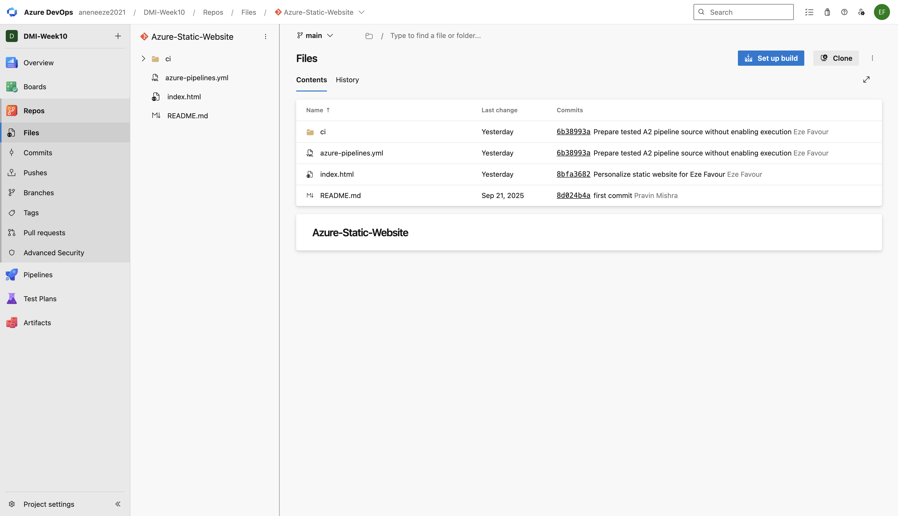
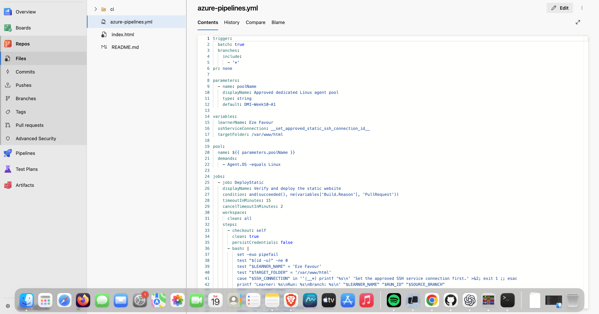
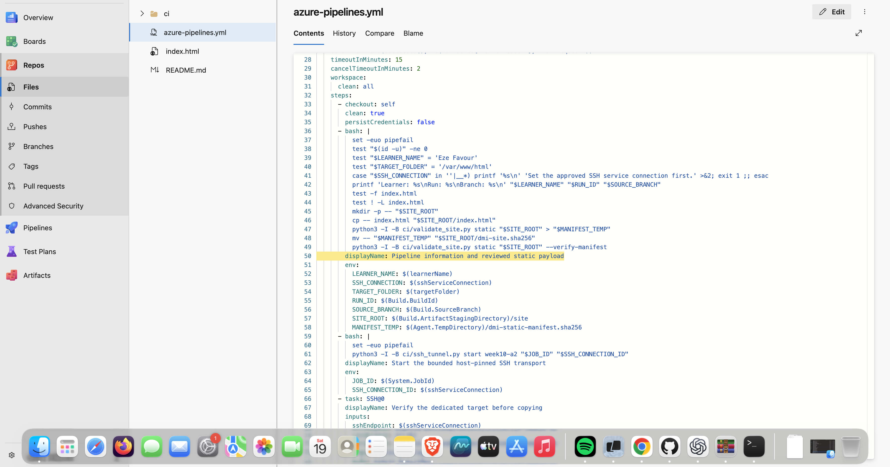
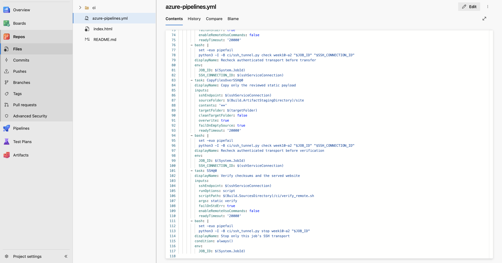
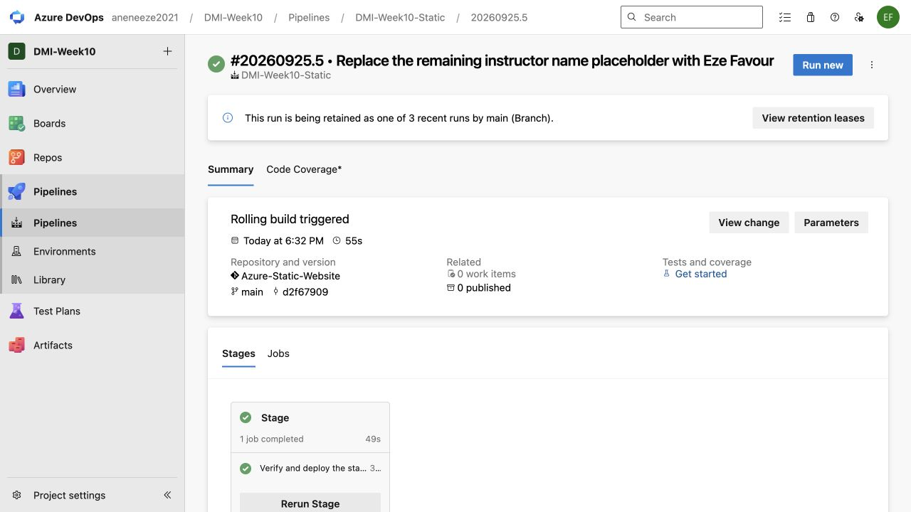
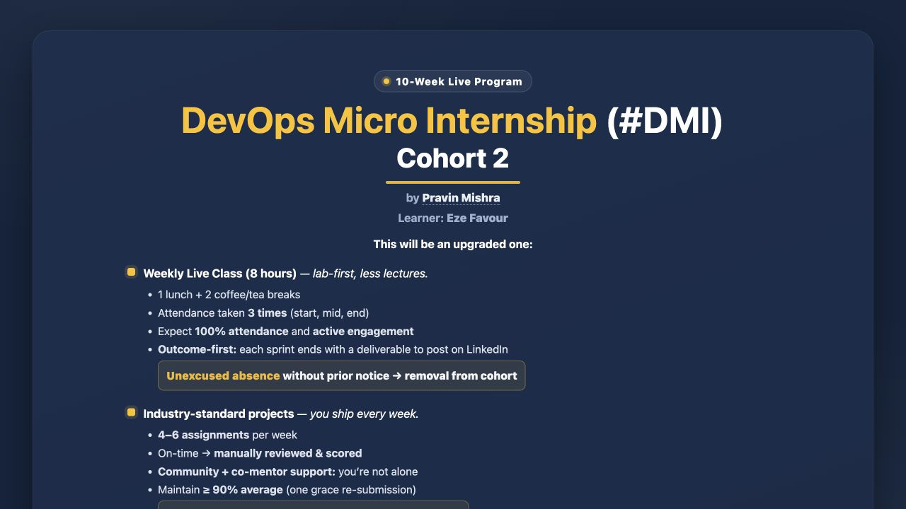

# Assignment 2 — Deploy A Static Website to AWS EC2 Using an Azure DevOps CI/CD Pipeline

**Current continuation, 25 September2026 — Eze Favour.** [Verified results, live URLs and limitations](evidence/2026-09-25/README.md) supersede historical pending-runtime statements below. Original requirements and earlier evidence remain preserved. Execution and notes are AI-assisted under delegation, not claims of learner-personal manual work. [Numbered evidence map](evidence/2026-09-25/screenshot-map.md).

Part of the DevOps Micro Internship (DMI) Cohort 3 with Agentic AI

> Template aligned to the [official brief at `9b394ef8efecd7db1f582995a03665f6f8afc2a4`](https://github.com/pravinmishraaws/devops-micro-internship-pravinmishra/blob/9b394ef8efecd7db1f582995a03665f6f8afc2a4/week-10-azure-devops/assignment-02-deploy-a-static-website-to-aws-ec2-using-an-azure-devops-cicd-pipeline.md) on 15 September 2026. The current results and remaining requirements are recorded in the continuation notice and evidence map.

---

## Purpose

In this assignment, you will import and personalize the Static Website, provision and configure an AWS EC2 instance using Terraform and Ansible, and create an Azure DevOps CI/CD pipeline that automatically deploys the website to Nginx through an SSH Service Connection.

Application source: https://github.com/pravinmishraaws/Azure-Static-Website

---

# Task 0 — Verify the Existing Tooling and Self-Hosted Agent

## Goal

Confirm that Terraform, Ansible, AWS CLI, SSH, and the self-hosted Azure Pipelines agent are ready.

No submission screenshot is required for this task.

---

# Task 1 — Import and Personalize the Azure Static Website Repository

## Goal

Import the Azure Static Website into Azure Repos and add your Full Name to the website.

## Evidence

### Screenshot 1 — Azure Static Website in Azure Repos

Add a screenshot of Azure Repos showing:

* Imported Azure Static Website repository
* Project files
* `index.html`

<!-- BEGIN WEEK10 CAPTURE A2-S1 -->

Captured 19 September 2026. This proves the repository/source view, **not deployment**. Human visual/privacy review is pending. [Provenance and remaining gaps](evidence/README.md).
<!-- END WEEK10 CAPTURE A2-S1 -->

---

# Task 2 — Provision and Configure the Target EC2 Instance

## Goal

Provision the AWS EC2 instance using Terraform and configure Nginx, SSH access, and deployment permissions using Ansible.

No additional submission screenshot is required for this task.

---

# Task 3 — Create the SSH Service Connection

## Goal

Create an Azure DevOps SSH Service Connection that can connect to the target EC2 instance using your selected SSH authentication method.

## Evidence

### Screenshot 2 — SSH Service Connection

[Evidence/source and exact-capture limitation](evidence/2026-09-25/screenshot-map.md).

Add a screenshot of the saved SSH Service Connection **Overview** page showing:

* Service Connection name
* SSH connection type

See the supporting evidence above and its scope in the numbered map.

> Do not expose a password, SSH private key, passphrase, or another credential.

---

# Task 4 — Create the Azure DevOps YAML Pipeline

## Goal

Create an Azure DevOps YAML pipeline that deploys the Azure Static Website to the target EC2 instance after a commit is pushed.

## Evidence

### Screenshot 3 — Azure Pipelines YAML

Add a screenshot of `azure-pipelines.yml` open in the Azure Repos editor showing:

* Push trigger
* Selected self-hosted agent pool
* Pipeline variables
* Repository checkout step
* Pipeline information step
* `CopyFilesOverSSH@0` task
* `SSH@0` verification task

<!-- BEGIN WEEK10 CAPTURE A2-S3 -->

Captured 19 September 2026 from the existing Azure Repos source revision `6b38993a18f75c2588803a42b6e7790c95e95b81`. These are three original viewport images for **one numbered slot**, not stitched or simulated output. The pool declaration/default is not Online-agent proof, and the SSH connection remains an unset placeholder. **This is source evidence, not a configured or successful deployment.** Human visual/privacy review is pending. [Provenance and remaining gates](evidence/README.md).
<!-- END WEEK10 CAPTURE A2-S3 -->

> Ensure that no password, SSH private key, PAT, or AWS credential is visible.

---

# Task 5 — Create, Authorize, and Run the Pipeline

## Goal

Run the Azure DevOps pipeline and confirm that the website files are transferred and verified successfully.

## Evidence

### Screenshot 4 — Successful Pipeline Run

Add a screenshot of the successful pipeline run and log summary showing:

* Overall pipeline status as **Succeeded**
* Pipeline information step completed
* File-copy step completed
* Remote-verification step completed
* Your Full Name visible in the pipeline output

See the supporting evidence above and its scope in the numbered map.

---

# Task 6 — Verify the Website and Automatic Trigger

## Goal

Confirm that the website is accessible through the EC2 public IP address and that a new pushed commit automatically triggers another deployment.

## Evidence

### Screenshot 5 — Deployed Azure Static Website

Add a browser screenshot showing:

* Deployed Azure Static Website
* EC2 public IP address in the browser address bar
* Your Full Name
* Updated website content after the automatic deployment

See the supporting evidence above and its scope in the numbered map.

## Final Website URL

`http://<target-vm-public-ip>`

Replace the placeholder with your actual website URL:

http://100.54.219.171/

---

# Assignment Summary

Write a short summary of the completed CI/CD workflow.

Terraform provisioned the AWS target and Ansible configured Nginx and scoped deployment access. Azure Repos main changes trigger the dedicated self-hosted pipeline. Native SSH@0 and CopyFilesOverSSH@0 transfer and verify the reviewed static content; manual run13 and automatic run17 succeeded. Eze Favour is visible on the live page.

---

# LinkedIn Requirement

## LinkedIn Post Screenshot

Add a screenshot of your LinkedIn post containing:

* What you automated
* How Terraform, Ansible, and Azure DevOps worked together
* Three to five lines describing the CI/CD workflow
* A screenshot of the successful pipeline or deployed website

See the supporting evidence above and its scope in the numbered map.

## LinkedIn Post URL

https://www.linkedin.com/posts/eze-favour-52732752_dmibypravinmishra-azuredevops-devops-ugcPost-7509319293323476992-Yf31/

> Do not expose AWS credentials, SSH private keys, passwords, PATs, or other sensitive information.

---

# Submission Instructions

* Include the short assignment summary.
* Include Screenshots 1–5.
* Include the final website URL.
* Include the LinkedIn post screenshot and URL.
* Confirm that the EC2 instance is running during grading.
* Do not expose a password, SSH private key, passphrase, PAT, AWS credential, account ID, or another secret.

---

# Completion Checklist

**Current checklist:** verified against the25September evidence index. The earlier source-only reconciliation is preserved in evidence/before-20260925.

* [x] The correct Azure Static Website repository was imported into Azure Repos
* [x] `index.html` is visible in Azure Repos
* [x] Your Full Name was added to the website
* [x] The target EC2 instance was provisioned using Terraform
* [x] A suitable Ubuntu image and EC2 size were selected
* [x] Nginx was configured using Ansible
* [x] SSH login works using the selected authentication method
* [x] The SSH user can write to `/var/www/html`
* [x] TCP ports 22 and 80 are configured correctly
* [x] The self-hosted Azure Pipelines agent is online
* [x] The SSH Service Connection was created successfully
* [x] The YAML trigger includes all branches
* [x] The YAML uses the correct self-hosted agent pool
* [x] The copy and remote-verification tasks completed successfully
* [x] The pipeline status is **Succeeded**
* [x] A new pushed commit triggered the pipeline automatically
* [x] The Azure Static Website loads through the EC2 public IP address
* [x] Your Full Name is visible on the deployed website
* [ ] Screenshots 1–5 are included and readable
* [x] The final website URL is included
* [x] The LinkedIn post screenshot and URL are included
* [ ] No sensitive information is exposed

---

## 📌 About DMI & CloudAdvisory

DevOps Micro Internship (DMI) is a project-based DevOps program run by Pravin Mishra (The CloudAdvisory) focused on real-world execution, systems thinking, and career readiness.

It helps learners build strong DevOps foundations with hands-on experience.

---

## 📌 Resources

- 🌐 DMI Official Website: https://dmi.pravinmishra.com?utm_source=github&utm_medium=readme
- 🎓 University: https://university.pravinmishra.com?utm_source=github&utm_medium=readme
- 💬 Discord Community: https://discord.pravinmishra.com?utm_source=github&utm_medium=readme
- 📝 Blog: https://dmi.pravinmishra.com/blog?utm_source=github&utm_medium=readme
- ▶️ YouTube Playlist: https://www.youtube.com/playlist?list=PLFeSNDtI4Cho
- 🔗 Pravin Mishra (LinkedIn): https://www.linkedin.com/in/pravin-mishra-aws-trainer/
- 🏢 CloudAdvisory (LinkedIn): https://www.linkedin.com/company/thecloudadvisory/

---

*This submission is part of DevOps Micro Internship (DMI) Cohort 3 — Agentic AI Track.*

### 25 September publication

[Blog article](https://favourcloud.github.io/devops-micro-internship-pravinmishra/blog/week-10.html) · [LinkedIn](https://www.linkedin.com/posts/eze-favour-52732752_dmibypravinmishra-azuredevops-devops-ugcPost-7509319293323476992-Yf31/). The public posts describe the verified outcomes and assisted work.
