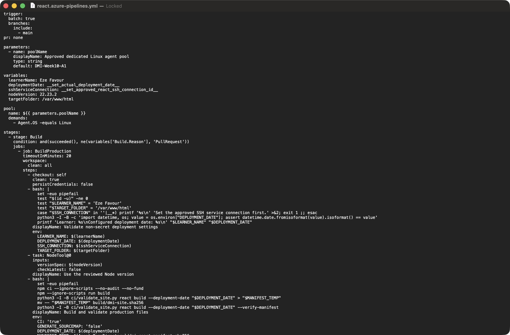
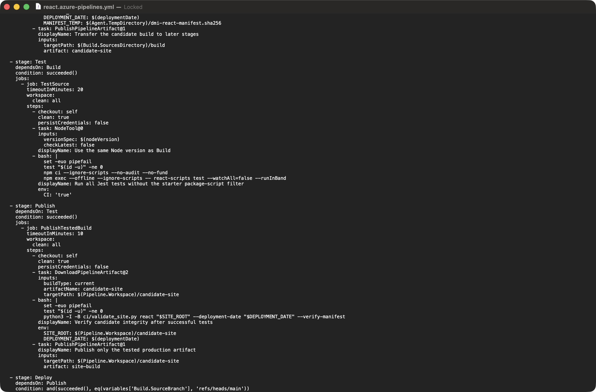
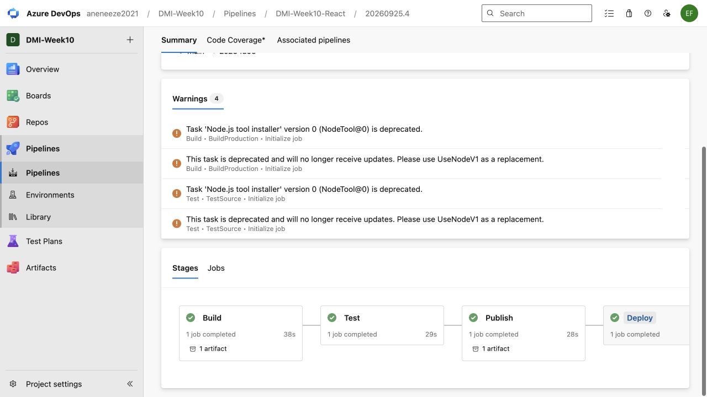
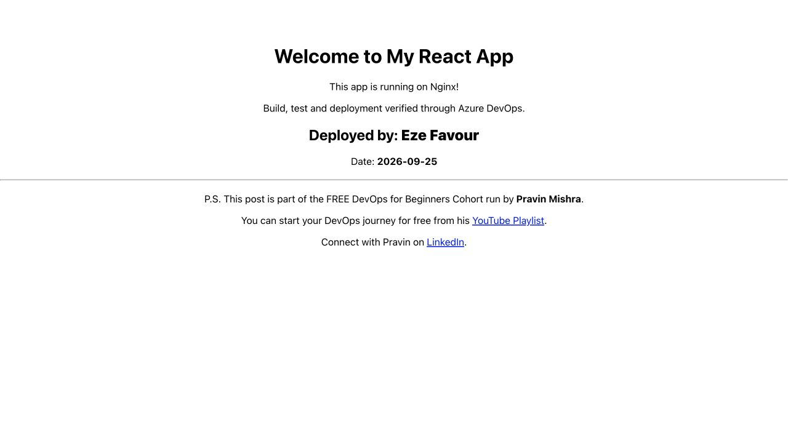
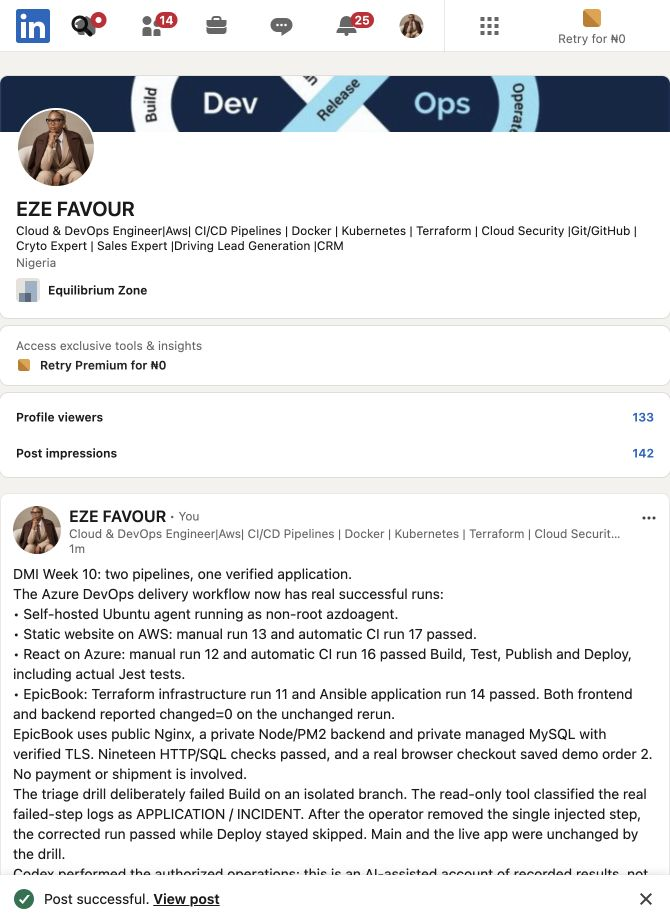

# Assignment 3 — Automate React App Deployment Using Azure DevOps CI/CD

**Current continuation, 25 September2026 — Eze Favour.** [Verified results, live URLs and limitations](evidence/2026-09-25/README.md) supersede historical pending-runtime statements below. Original requirements and earlier evidence remain preserved. Execution and notes are AI-assisted under delegation, not claims of learner-personal manual work. [Numbered evidence map](evidence/2026-09-25/screenshot-map.md).

Part of the DevOps Micro Internship (DMI) Cohort 3 with Agentic AI

> Template aligned to the [official brief at `9b394ef8efecd7db1f582995a03665f6f8afc2a4`](https://github.com/pravinmishraaws/devops-micro-internship-pravinmishra/blob/9b394ef8efecd7db1f582995a03665f6f8afc2a4/week-10-azure-devops/assignment-03-automate-react-app-deployment-using-azure-devops-cicd.md) on 15 September 2026. The current results and remaining requirements are recorded in the continuation notice and evidence map.

---

## Purpose

In this assignment, you will create a multi-stage Azure DevOps pipeline that builds, tests, publishes, and deploys a React application to an Ubuntu VM hosted on AWS or Azure. The pipeline will automatically run when changes are committed to `main`, transfer the production build as an artifact, and deploy it through Nginx.

Application source: https://github.com/pravinmishraaws/my-react-app

---

# Task 0 — Verify the Starting Environment

## Goal

Confirm that Azure DevOps, the pipeline agent, Terraform, Ansible, and the selected cloud environment are ready.

No submission screenshot is required for this task.

---

# Task 1 — Import and Personalize the React Application

## Goal

Import the React application into Azure Repos and add your Full Name and the current date.

## Evidence

### Screenshot 1 — Imported React Project in Azure Repos

[Evidence/source and exact-capture limitation](evidence/2026-09-25/screenshot-map.md).

Add a screenshot of Azure Repos showing:

* Imported React project
* Repository name
* `main` branch
* Project files

See the supporting evidence above and its scope in the numbered map.

---

# Task 2 — Provision and Configure the Target VM

## Goal

Provision an Ubuntu VM using Terraform and configure Nginx, React SPA routing, SSH access, and deployment permissions using Ansible.

No separate submission screenshot is required for this task.

---

# Task 3 — Create or Update the SSH Service Connection

## Goal

Create or update an Azure DevOps SSH Service Connection that allows the pipeline to connect securely to the target VM.

No separate submission screenshot is required for this task.

> Do not include the VM password, SSH private key, token, or another secret in the submission.

---

# Task 4 — Author the Multi-Stage Azure Pipeline

## Goal

Create an Azure Pipeline containing Build, Test, Publish, and Deploy stages with an automatic trigger for commits to `main`.

## Evidence

### Screenshot 2 — Multi-Stage Pipeline YAML

Add a screenshot of the Azure Pipeline YAML open in the editor showing:

* Trigger
* Build stage
* Test stage
* Publish stage
* Deploy stage

<!-- BEGIN WEEK10 CAPTURE A3-S2 -->

Captured 20 September 2026 at **00:56 and 01:01 UTC**. These two original native TextEdit views cover **one numbered source slot**, not two slots. The editor displayed a byte-identical, read-only copy of [the published YAML at `b84d90e`](https://github.com/Favourcloud/devops-micro-internship-pravinmishra/blob/b84d90ef20b525ce23440796166aeb2bf1f7b2b1/week-10-azure-devops/application-pipelines/react.azure-pipelines.yml). [Capture provenance](evidence/react-yaml-2026-09-20.json) binds the original PNG hashes, source hash, times and offline OCR checks.

**Source only, incomplete configuration:** the deployment date and SSH connection remain unset placeholders. The pool default is not an Online-agent check, and stage definitions are not successful stage results. This is not evidence of an Azure Repos application import, a created Azure DevOps pipeline, an application build or a live deployment. Human visual/privacy review is pending. No checklist item is completed by these images.
<!-- END WEEK10 CAPTURE A3-S2 -->

> Do not expose passwords, private keys, tokens, or cloud credentials.

---

# Task 5 — Run the Pipeline and Resolve Configuration Issues

## Goal

Complete a successful end-to-end pipeline run containing all four stages.

## Evidence

### Screenshot 3 — Successful Multi-Stage Pipeline Run

Add a screenshot of one Azure DevOps pipeline run showing all four stages succeeded:

* Build
* Test
* Publish
* Deploy

See the supporting evidence above and its scope in the numbered map.

---

# Task 6 — Verify the Deployment on the VM

## Goal

Confirm that the pipeline deployed the production-ready React files to the correct Nginx web root.

## Evidence

### Screenshot 4 — Post-Deployment Contents of /var/www/html

[Evidence/source and exact-capture limitation](evidence/2026-09-25/screenshot-map.md).

Add a screenshot of the pipeline SSH verification log or VM terminal showing the post-deployment contents of:

`/var/www/html`

See the supporting evidence above and its scope in the numbered map.

---

# Task 7 — Verify the Website and Automatic Trigger

## Goal

Confirm that the React application is accessible and that a commit to `main` automatically triggers the CI/CD pipeline.

## Evidence

### Screenshot 5 — Deployed React Application

Add a browser screenshot showing:

* Deployed React application
* VM public IP address in the browser address bar
* Your Full Name
* Deployment date

See the supporting evidence above and its scope in the numbered map.

## Final Application URL

`http://<vm-public-ip>`

Replace the placeholder and paste your final application URL below:

http://20.108.9.183/

---

# CI/CD Workflow Summary

Write a short explanation of the CI/CD workflow you created.

Azure Repos main changes trigger Build, Test, Publish and Deploy on the dedicated self-hosted agent. The pipeline builds production React assets, runs actual Jest tests, moves the artifact between stages and uses the native SSH service connection to deploy and verify Nginx content. Manual run12 and automatic run16 succeeded; only production assets are deployed. NodeTool@0 deprecation warnings are retained in evidence.

---

# LinkedIn Requirement

## Evidence

### Screenshot 6 — LinkedIn Post

Add a screenshot of your LinkedIn post showing:

* Post text
* At least one image or link

See the supporting evidence above and its scope in the numbered map.

## LinkedIn Post URL

https://www.linkedin.com/feed/update/urn:li:activity:7509319294388944897/

> Do not expose VM passwords, tokens, private keys, cloud credentials, or other sensitive information.

---

# Submission Instructions

* Complete all tasks in sequence.
* Include the short CI/CD workflow summary.
* Include Screenshots 1–6.
* Include the final application URL.
* Include the public LinkedIn post URL.
* Confirm that all screenshots are readable and show the required context.
* Do not expose passwords, PATs, private keys, cloud credentials, subscription IDs, account IDs, or other secrets.
* Follow the Assignment Submission Guidelines.

---

# Completion Checklist

* [ ] All tasks were completed in sequence
* [x] The correct React repository was imported into Azure Repos
* [x] Your Full Name and date were added to the application
* [x] The pipeline YAML was authored and committed to the repository
* [x] Commits to `main` trigger the pipeline automatically
* [x] The pipeline contains Build, Test, Publish, and Deploy stages
* [x] All four stages succeeded in the same pipeline run
* [x] The production build moved between stages as a pipeline artifact
* [x] The Deploy stage used the SSH Service Connection
* [x] No password or secret is stored in the YAML
* [x] `index.html` is directly inside `/var/www/html`
* [x] Raw React source code was not deployed to the Nginx web root
* [x] `node_modules/` was not deployed to the Nginx web root
* [x] Nginx is active
* [x] The application opens through the VM public IP address
* [ ] Your Full Name and date are visible in the browser screenshot
* [ ] Screenshots 1–6 are included and readable
* [ ] No password, token, private key, account ID, or other secret is visible
* [x] The final application URL is included
* [x] The LinkedIn post is published
* [x] The LinkedIn post URL is included

---

## 📌 About DMI & CloudAdvisory

DevOps Micro Internship (DMI) is a project-based DevOps program run by Pravin Mishra (The CloudAdvisory) focused on real-world execution, systems thinking, and career readiness.

It helps learners build strong DevOps foundations with hands-on experience.

---

## 📌 Resources

- 🌐 DMI Official Website: https://dmi.pravinmishra.com?utm_source=github&utm_medium=readme
- 🎓 University: https://university.pravinmishra.com?utm_source=github&utm_medium=readme
- 💬 Discord Community: https://discord.pravinmishra.com?utm_source=github&utm_medium=readme
- 📝 Blog: https://dmi.pravinmishra.com/blog?utm_source=github&utm_medium=readme
- ▶️ YouTube Playlist: https://www.youtube.com/playlist?list=PLFeSNDtI4Cho
- 🔗 Pravin Mishra (LinkedIn): https://www.linkedin.com/in/pravin-mishra-aws-trainer/
- 🏢 CloudAdvisory (LinkedIn): https://www.linkedin.com/company/thecloudadvisory/

---

*This submission is part of DevOps Micro Internship (DMI) Cohort 3 — Agentic AI Track.*

### 25 September publication

[Medium](https://medium.com/@rosenaefavour/two-pipelines-one-verified-app-dmi-week-10-with-azure-devops-d6b95cfff40a) · [LinkedIn](https://www.linkedin.com/feed/update/urn:li:activity:7509319294388944897/). The public posts describe the verified outcomes and assisted work.
