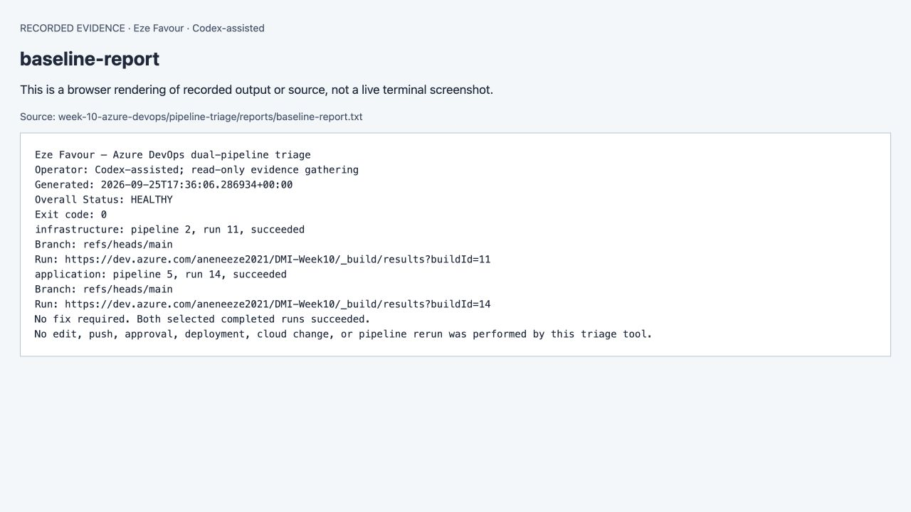
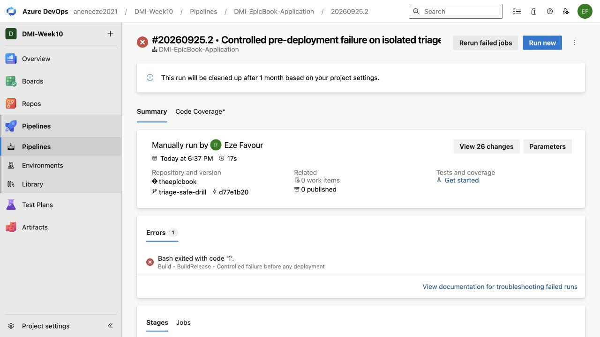
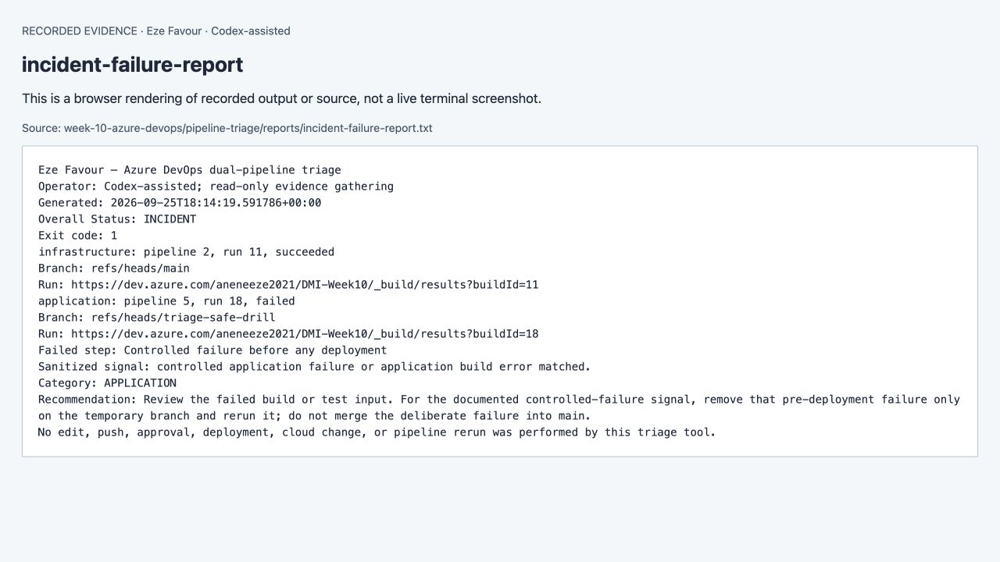
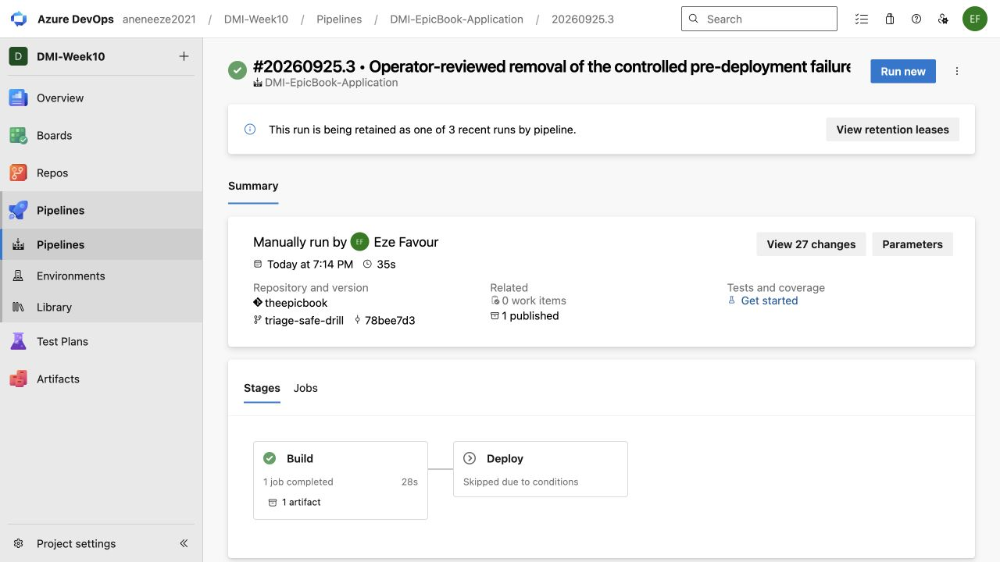
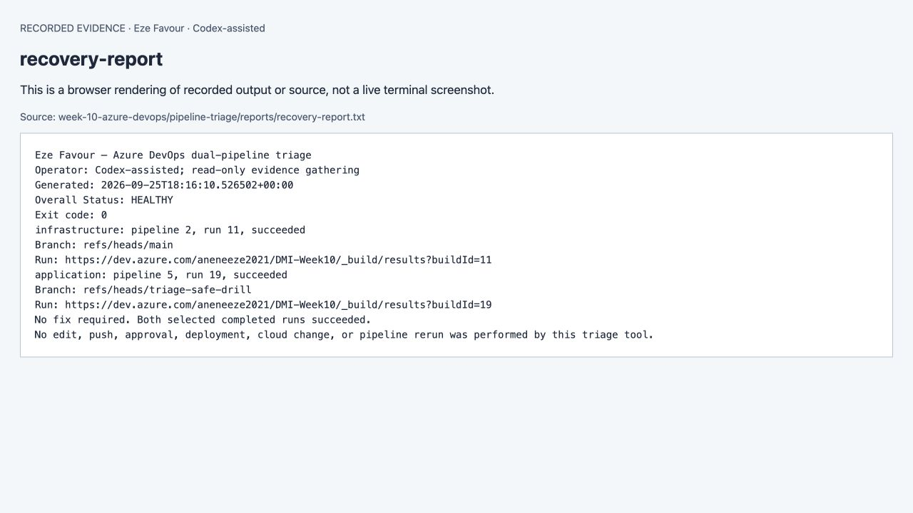

# Assignment 5 — AI-Assisted Azure DevOps Dual-Pipeline Failure Triage

**26 September 2026 update:** the AWS session was restored and the fresh `/pipeline-triage` Claude/Bedrock workflow completed: baseline HEALTHY → application run20 INCIDENT → operator correction → run21 HEALTHY. [Fresh responses, reports and captures](evidence/2026-09-26/README.md). September 25 images below remain historical supporting evidence. Learner-personal actions and supplied-kit provenance remain open.

**Current continuation, 25 September2026 — Eze Favour.** [Verified results, live URLs and limitations](evidence/2026-09-25/README.md) supersede historical pending-runtime statements below. Original requirements and earlier evidence remain preserved. Execution and notes are AI-assisted under delegation, not claims of learner-personal manual work. [Numbered evidence map](evidence/2026-09-25/screenshot-map.md).

Part of the DevOps Micro Internship (DMI) Cohort 3 with Agentic AI

> Template aligned to the [official brief at `9b394ef8efecd7db1f582995a03665f6f8afc2a4`](https://github.com/pravinmishraaws/devops-micro-internship-pravinmishra/blob/9b394ef8efecd7db1f582995a03665f6f8afc2a4/week-10-azure-devops/assignment-05-ai-assisted-azure-devops-dual-pipeline-failure-triage.md) on 15 September 2026. The current results and remaining requirements are recorded in the continuation notice and evidence map.

---

## Student Information

**Full Name:** Eze Favour

**GitHub Repository or Fork URL:** https://github.com/Favourcloud/devops-micro-internship-pravinmishra

**Public LinkedIn Post URL:** https://www.linkedin.com/posts/eze-favour-52732752_dmibypravinmishra-azuredevops-devops-ugcPost-7509319293323476992-Yf31/

---

## Purpose

In this assignment, you will configure an AI-assisted, read-only failure-triage workflow for the EpicBook Infrastructure and Application Pipelines. The workflow uses Bash to gather Azure DevOps pipeline evidence and Claude Code to analyze the evidence and recommend a recovery action while keeping all changes under human control.

---

# Task 0 — Verify Tools, Authentication, and Pipeline Details

## Goal

Verify the required tools, Azure DevOps authentication, organization and project details, and numeric pipeline IDs.

No screenshot is required for this task.

---

# Task 1 — Capture the Healthy Baseline and Prepare the Supplied Files

## Goal

Confirm that both EpicBook pipelines are healthy and place the supplied assignment files in the correct repository locations.

## Evidence

### Screenshot 1 — Healthy Baseline for Both Pipelines

Terminal output showing the latest completed Infrastructure and Application Pipeline runs with successful results.

See the supporting evidence above and its scope in the numbered map.

## Notes

### 1. What proves that both pipelines were healthy before the drill?

The saved read-only baseline identifies infrastructure run11 and application run14, both completed/succeeded, with HEALTHY and exit0.

### 2. Why is a healthy baseline necessary before introducing a controlled failure?

It proves the injected failure is being compared with known working runs rather than an already broken deployment.

---

# Task 2 — Configure and Review the Supplied CLAUDE.md

## Goal

Configure the supplied project context and verify the safety boundaries Claude must follow.

## Evidence

### Screenshot 2 — CLAUDE.md Context and Safety Rules

[Evidence/source and exact-capture limitation](evidence/2026-09-25/screenshot-map.md).

`CLAUDE.md` open in the editor with the Project Overview, Incident Workflow, Safety Rules, and Output Rules visible.

See the supporting evidence above and its scope in the numbered map.

## Notes

### 1. Why does Claude need project-specific operational context?

It defines the organization, project, selected pipeline IDs, branch, bounded wrapper and evidence limits.

### 2. Which rules keep the human responsible for the recovery action?

The context and hook forbid edits, pushes, approvals, deployment and reruns by Claude. Codex separately performed the operator recovery under delegated authorization; learner-personal execution is not claimed.

### 3. Which rules protect pipeline credentials and application secrets?

Credentials are injected only into the read-only gatherer; raw logs remain in memory. Public reports contain sanitized signals, not tokens, connection strings or state.

---

# Task 3 — Configure and Validate the Supplied Pipeline Triage Script

## Goal

Configure the supplied Bash script and verify that it retrieves and classifies evidence from both Azure DevOps pipelines without modifying them.

## Evidence

### Screenshot 3 — Pipeline Triage Script Configuration

[Evidence/source and exact-capture limitation](evidence/2026-09-25/screenshot-map.md).

Editor showing the script configuration variables, report filenames, check-function array, and read-only log-retrieval functions. Ensure that no token is visible.

See the supporting evidence above and its scope in the numbered map.

---

### Screenshot 4 — Script Validation

[Evidence/source and exact-capture limitation](evidence/2026-09-25/screenshot-map.md).

Terminal showing successful Bash syntax validation and executable file permission.

See the supporting evidence above and its scope in the numbered map.

## Notes

### 1. Why are pipeline metadata and step console logs handled separately?

Metadata identifies the selected run and result; timeline records identify failed steps; step console logs provide the actual failure signal. A green metadata request is not proof of application health.

### 2. How does the script obtain the actual console logs?

fetch.py uses authenticated read-only Azure DevOps GET requests to the selected build timeline and the actual failed task log URLs, with bounded volume and no credentials in reports.

### 3. How does the check-function array control the classification loop?

The Bash array names the auth, Terraform, Ansible and application check functions; the loop executes those checks in order and collects matched categories.

### 4. What prevents a failed but unmatched run from being reported as healthy?

Any failed, canceled or partially succeeded run remains INCIDENT even if no known signal matches; the fallback category is unclassified. Incomplete/invalid evidence returns ERROR.

### 5. Why are different exit codes useful to another automation tool?

Exit0 is HEALTHY, exit1 is INCIDENT and exit2 is ERROR. Another tool can stop on nonzero without interpreting narrative text.

---

# Task 4 — Run and Understand the Healthy-State Report

## Goal

Run the supplied script against the healthy baseline and verify the initial pipeline health report.

## Evidence

### Screenshot 5 — Healthy Pipeline Report

Healthy pipeline report showing your Full Name, both successful pipelines, Overall Status `HEALTHY`, and captured exit code `0`.

See the supporting evidence above and its scope in the numbered map.

## Notes

### 1. What evidence proves that both pipelines are healthy?

Baseline JSON and text reports record run11 and run14 as completed/succeeded. The genuine infrastructure and application run screenshots corroborate them.

### 2. Why must the baseline exit code be verified before the incident drill?

A nonzero baseline would mean the workflow or existing deployment is not yet known healthy, making the controlled drill ambiguous.

---

# Task 5 — Configure and Test the Supplied /pipeline-triage Skill

## Goal

Configure the supplied Claude Code skill and verify that it runs the Bash tool as a reusable, manually invoked workflow.

## Evidence

### Screenshot 6 — Pipeline-Triage Skill Definition

[Evidence/source and exact-capture limitation](evidence/2026-09-25/screenshot-map.md).

`SKILL.md` showing the frontmatter, manual-invocation setting, narrowly scoped tools, safety rules, and required output structure.

See the supporting evidence above and its scope in the numbered map.

---

### Screenshot 7 — Healthy Skill Result

[Evidence/source and exact-capture limitation](evidence/2026-09-25/screenshot-map.md).

Healthy `/pipeline-triage` result showing that both pipelines are healthy and no fix is required.

See the supporting evidence above and its scope in the numbered map.

## Notes

### 1. Why is `disable-model-invocation: true` appropriate for this skill?

It makes the custom skill explicitly invoked rather than automatically selected by the model for unrelated work.

### 2. Why should the skill avoid broad Bash approval?

Broad Bash access would allow writes or secret exposure beyond evidence gathering; the exact wrapper is the only permitted command.

### 3. What work is performed by Bash, and what work is performed by Claude?

Bash/Python gather and classify actual pipeline evidence. The 26 September `/pipeline-triage` Claude/Bedrock sessions analyzed fresh baseline, failure and recovery reports. Each response is saved separately from the deterministic report; its evidence timestamp is newer than the session start.

### 4. Why are permission rules required in addition to written safety instructions?

Written instructions can be misunderstood. The tested hook enforces the executable command boundary and denies mutation tools.

---

# Task 6 — Introduce a Safe Failure in the Application Pipeline

## Goal

Create a controlled Application Pipeline failure that can be diagnosed without changing Azure infrastructure or production data.

## Evidence

### Screenshot 8 — Controlled Application Pipeline Failure

Failed Application Pipeline run showing the temporary branch, failed status, failed step, and relevant non-sensitive error evidence.

See the supporting evidence above and its scope in the numbered map.

## Notes

### 1. What exact failure did you introduce?

One temporary-branch Build step printed DMI_CONTROLLED_FAILURE: missing demo build input and exited1 before the application build or deployment.

### 2. Which category should detect it?

APPLICATION, because the injected signal represents a missing application build input.

### 3. Why is the failure safe and easily reversible?

It is a single removable step on an isolated temporary branch. It fails before any deployment and the Deploy stage independently requires main.

### 4. How did you prevent the deliberate failure from reaching `main` or changing the deployed application?

The operator created triage-safe-drill from verified main, changed only that branch, and never merged the failing step. Both drill runs skipped Deploy.

---

# Task 7 — Diagnose and Save the Incident Evidence

## Goal

Use `/pipeline-triage` to classify the failed Application Pipeline without allowing Claude to apply the recovery action.

## Evidence

### Screenshot 9 — Failed-State Diagnosis and Incident Report

`/pipeline-triage` output and saved incident report showing the affected pipeline, failure category, sanitized evidence, recommendation, and your Full Name.

See the supporting evidence above and its scope in the numbered map.

## Notes

### 1. Which failure category was identified?

APPLICATION; overall INCIDENT, exit1.

### 2. What exact evidence supported the diagnosis?

Application run18 completed/failed. Its timeline identifies Controlled failure before any deployment, and the actual step log matched the documented marker. The saved failure report predates the fix.

### 3. Did Claude apply the fix or rerun the pipeline? Why is that important?

No. In the 26 September drill, Claude diagnosed application run20 and recommended removing the injected failing step. Codex saved that report, reviewed and removed exactly the step, then queued run21. Claude verified the fresh recovery without making changes.

### 4. Which part represents Gather, and which part represents Analyze?

Gather retrieves selected run/timeline/log evidence. The deterministic classifier produces the report, and the actual 26 September Claude/Bedrock calls explain that fresh evidence and recommend operator actions. The earlier September 25 drill used deterministic classification and Codex explanation only.

---

# Task 8 — Apply the Human-Reviewed Fix and Verify Recovery

## Goal

Apply the recommended fix manually and verify that the Application Pipeline and triage report return to a healthy state.

## Evidence

### Screenshot 10 — Corrected Application Pipeline Run

Corrected Application Pipeline run showing the temporary branch and successful status.

See the supporting evidence above and its scope in the numbered map.

---

### Screenshot 11 — Recovery Triage Result

Recovery `/pipeline-triage` output showing Overall Status `HEALTHY`, exit code `0`, your Full Name, and both saved report filenames.

See the supporting evidence above and its scope in the numbered map.

## Notes

### 1. What exact fix did you apply?

Removed exactly the injected failure step from azure-pipelines.yml on triage-safe-drill and queued corrected application run19.

### 2. Did the fix match Claude’s recommendation? Explain briefly.

It matched the deterministic report recommendation. There was no new Claude recommendation for this Week10 drill, and none is fabricated.

### 3. What evidence proves that the pipeline recovered?

Run19 completed/succeeded: Build succeeded and Deploy was skipped by its branch condition. The recovery evidence/report returned HEALTHY and exit0.

### 4. Why is a second triage run required after the pipeline becomes green?

The new triage ties the diagnosis to the corrected run and confirms both selected pipeline results, rather than trusting an old baseline or a green badge alone.

### 5. What risk would be created if Claude could automatically edit, push, approve, and rerun the pipeline?

A mistaken diagnosis could become a live source, infrastructure or credential change without a separate impact review. Narrow tools and explicit operator actions reduce that risk.

---

# LinkedIn Post — Mandatory

## LinkedIn Post URL

https://www.linkedin.com/posts/eze-favour-52732752_dmibypravinmishra-azuredevops-devops-ugcPost-7509319293323476992-Yf31/

## Evidence

### Screenshot 12 — Published LinkedIn Post

Published LinkedIn post showing its text and at least one image or link.

See the supporting evidence above and its scope in the numbered map.

---

# Required Repository Files

Confirm that the following files are available in your repository:

* [x] `CLAUDE.md`
* [x] `pipeline-triage.sh`
* [x] `.claude/skills/pipeline-triage/SKILL.md`
* [x] `reports/incident-failure-report.txt`
* [x] `reports/recovery-report.txt`

---

# Submission Instructions

* Complete all tasks in sequence.
* Include all 12 required screenshots.
* Answer every Notes question in your own words.
* Include your GitHub repository or fork URL.
* Include your public LinkedIn post URL.
* Ensure your Full Name appears in the required reports.
* Do not include raw logs containing sensitive information.
* Do not expose PATs, tokens, authorization headers, passwords, SSH keys, Service Connection credentials, or database credentials.

---

# Completion Checklist

* [x] Both Azure DevOps pipelines were healthy before the drill.
* [ ] The supplied files were copied to the correct repository locations.
* [ ] Only the required student-specific placeholders were updated.
* [x] `CLAUDE.md` contains the required context and safety rules.
* [x] `pipeline-triage.sh` passed Bash syntax validation.
* [x] The script has executable permission.
* [x] The script uses read-only Azure DevOps operations.
* [x] The script retrieves pipeline metadata and console logs.
* [x] No token or password is stored in the script.
* [x] The healthy baseline reported `HEALTHY` with exit code `0`.
* [ ] `/pipeline-triage` was invoked manually.
* [x] The skill does not have broad Bash approval.
* [x] The controlled failure affected only the Application Pipeline.
* [x] The failure occurred before deployment changes were applied.
* [x] The deliberate failure was not merged into `main`.
* [x] The failed-state report was saved before applying the fix.
* [x] Claude diagnosed the failure but did not apply the fix. (Verified in the 26 September run20/run21 drill.)
* [ ] The fix was reviewed and applied manually.
* [x] The corrected Application Pipeline completed successfully.
* [x] The recovery triage reported `HEALTHY` with exit code `0`.
* [x] `incident-failure-report.txt` exists.
* [x] `recovery-report.txt` exists.
* [x] All Notes questions have been answered.
* [ ] All 12 screenshots have been added.
* [x] The GitHub repository or fork URL has been included.
* [x] The LinkedIn post is public.
* [x] The LinkedIn post URL has been included.
* [ ] No sensitive information is exposed.

---

# Final Submission

**Full Name:** Eze Favour

**GitHub Repository or Fork URL:** https://github.com/Favourcloud/devops-micro-internship-pravinmishra

**LinkedIn Post URL:** https://www.linkedin.com/posts/eze-favour-52732752_dmibypravinmishra-azuredevops-devops-ugcPost-7509319293323476992-Yf31/

---

## 📌 About DMI & CloudAdvisory

DevOps Micro Internship (DMI) is a project-based DevOps program run by Pravin Mishra (The CloudAdvisory) focused on real-world execution, systems thinking, and career readiness.

It helps learners build strong DevOps foundations with hands-on experience.

---

## 📌 Resources

- 🌐 DMI Official Website: https://dmi.pravinmishra.com?utm_source=github&utm_medium=readme
- 🎓 University: https://university.pravinmishra.com?utm_source=github&utm_medium=readme
- 💬 Discord Community: https://discord.pravinmishra.com?utm_source=github&utm_medium=readme
- 📝 Blog: https://dmi.pravinmishra.com/blog?utm_source=github&utm_medium=readme
- ▶️ YouTube Playlist: https://www.youtube.com/playlist?list=PLFeSNDtI4Cho
- 🔗 Pravin Mishra (LinkedIn): https://www.linkedin.com/in/pravin-mishra-aws-trainer/
- 🏢 CloudAdvisory (LinkedIn): https://www.linkedin.com/company/thecloudadvisory/

---

*This submission is part of DevOps Micro Internship (DMI) Cohort 3 — Agentic AI Track.*

### 25 September publication

[Blog article](https://favourcloud.github.io/devops-micro-internship-pravinmishra/blog/week-10.html) · [LinkedIn](https://www.linkedin.com/posts/eze-favour-52732752_dmibypravinmishra-azuredevops-devops-ugcPost-7509319293323476992-Yf31/). The public posts describe the verified outcomes and assisted work.
