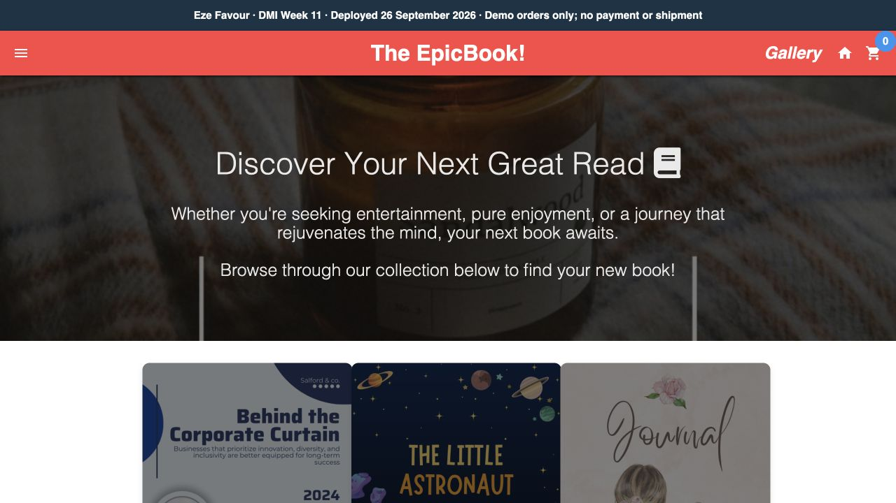

# Week 11 — Docker

**Eze Favour · Submission updated 27 September 2026 · DMI grading pending**

[Live EpicBook HTTPS demo](https://d209ibroel8p0b.cloudfront.net/) · [React demo](http://3.225.177.203/) · [Docker Hub](https://hub.docker.com/r/favourcloud/my-react-app) · [Blog](https://favourcloud.github.io/devops-micro-internship-pravinmishra/blog/week-11.html) · [LinkedIn receipt](publication/README.md)

The seven assignment files link to actual source, dated execution output and screenshots. Codex performed this work under my authorization; Claude Code on AWS Bedrock supplied read-only hardening analysis. No personally performed manual steps or external grades are invented.

| Assignment | Verified result |
|---|---|
| [1 — deploy a static website on a cloud vm using docker](assignment-01-deploy-a-static-website-on-a-cloud-vm-using-docker.md) | Cloud-init Docker, static Nginx on Ubuntu EC2 |
| [2 — multi stage docker build for a react application](assignment-02-multi-stage-docker-build-for-a-react-application.md) | Single/multi-stage builds; 88.97% image-size reduction |
| [3 — docker networking](assignment-03-docker-networking.md) | Default/custom/multiple/host networks and real MongoDB insert/read |
| [4 — docker volumes](assignment-04-docker-volumes.md) | Logs survive removal; shared-volume initial content and two updates |
| [5 — sharing the docker container on docker hub](assignment-05-sharing-the-docker-container-on-docker-hub.md) | Public image pushed; digest pulled and run on a different VM |
| [6 — capstone deploy a production grade stack for the epicbook](assignment-06-capstone-deploy-a-production-grade-stack-for-the-epicbook.md) | Split Compose app, HTTPS edge, real checkout, fault recovery and snapshot restore |
| [7 — ai assisted docker container hardening audit](assignment-07-ai-assisted-docker-container-hardening-audit.md) | Actual Bedrock plan/skill; training baseline 3 FAIL to 6 PASS; 15 behavior tests; fresh ordered rerun |

[Evidence index](evidence/README.md) · [Architecture and runbook](capstone/docs/09-runbook.md) · [Ordered rerun and operator review](hardening-audit/ordered-rerun/README.md)

## Scope and remaining assessor decisions

The app is a teaching deployment with synthetic orders, one VM, and HTTP from CloudFront to its origin. The optional CI/CD exercise was not selected. The learner requested continued hosting, so teardown is intentionally deferred. The audit used a separate training backend to avoid weakening the public service. Direct editor/terminal captures, dated-log reviews and delegated execution are disclosed for assessor review; submission readiness does not mean DMI has awarded completion or a perfect score.

The final revision adds a correctly ordered A7 rerun, direct screenshots for all 11 A7 slots, actual A4 browser updates, and direct Code OSS editor/terminal captures supporting the other assignments. A2 retains its verified original multistage-Dockerfile source capture. [Final revision evidence](evidence/2026-09-27-ordered-rerun/).
