# Assignment 1 — Deploy a Static Website on a Cloud VM Using Docker

Part of the DevOps Micro Internship (DMI) Cohort 3 with Agentic AI

**Eze Favour · Verified 26 September 2026 · DMI assessment pending**

The Ubuntu 24.04 labs VM was provisioned with Terraform and Docker installed by cloud-init. Static Nginx ran on port 80 before the networking exercises. Port 80 now serves the final React image; the static deployment is preserved in its dated evidence. Instructor checkouts were explicitly verified after initial copy/build, as shown by the timestamps.

**Evidence method:** Codex executed and documented these exercises under delegation. App screenshots are actual browser captures. Numbered command/editor slots link to labelled browser renderings of saved command output or source, with originals alongside them; they are not represented as live Terminal or VS Code captures. Full-name captions identify the submission without claiming personal learner execution.

---

## Purpose

In this assignment, you will provision a cloud VM (AWS or Azure), automate Docker installation using Cloud-Init, containerize a static website with Docker and Nginx, and deploy it so it's accessible through the VM's public IP.

---

# Task 1 — Launch the Cloud Virtual Machine

## Goal

Provision an Ubuntu VM on AWS or Azure with a public IP and Security Group/NSG rules allowing SSH (22) and HTTP (80).

### Evidence

#### Screenshot 1 — Cloud VM overview page showing the running VM, public IP, and security rules

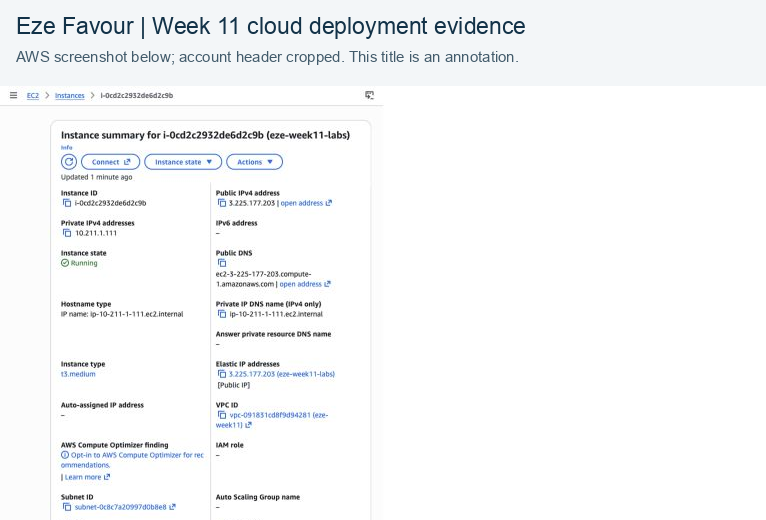

The AWS capture is cropped above the account ARN section; the account header is also omitted.

---

# Task 2 — Configure Cloud-Init for Docker Installation

## Goal

Configure User Data (AWS) or Custom Data (Azure) to automatically install Docker during VM provisioning.

### Evidence

#### Screenshot 2 — Output of `cat /var/log/cloud-init-output.log` showing Docker installation activity

[Original record/source](evidence/2026-09-26/a1-bootstrap.txt) · [Screenshot page 1](screenshots/a1-bootstrap-p01.png) · [Screenshot page 2](screenshots/a1-bootstrap-p02.png) · [Screenshot page 3](screenshots/a1-bootstrap-p03.png) · [Screenshot page 4](screenshots/a1-bootstrap-p04.png). Captured from the labelled saved-output/source viewer.

---

# Task 3 — Verify Docker Installation

## Goal

Connect via SSH and confirm Docker is installed and running.

### Evidence

#### Screenshot 3 — Terminal showing `docker --version` and `docker ps`

[Original record/source](evidence/2026-09-26/a1-bootstrap.txt) · [Screenshot page 1](screenshots/a1-bootstrap-p01.png) · [Screenshot page 2](screenshots/a1-bootstrap-p02.png) · [Screenshot page 3](screenshots/a1-bootstrap-p03.png) · [Screenshot page 4](screenshots/a1-bootstrap-p04.png). Captured from the labelled saved-output/source viewer.

---

# Task 4 — Clone the Application Repository

## Goal

Clone `https://github.com/pravinmishraaws/Azure-Static-Website.git` and verify the project files.

### Evidence

#### Screenshot 4 — Terminal showing the project directory contents

[Original record/source](evidence/2026-09-26/a1-a2-upstream-checkouts.txt) · [Screenshot page 1](screenshots/a1-a2-upstream-checkouts-p01.png). Captured from the labelled saved-output/source viewer.

---

# Task 5 — Create a Dockerfile

## Goal

Create a Dockerfile that serves the static site with `nginx:alpine`.

### Evidence

#### Screenshot 5 — Dockerfile contents

[Original record/source](evidence/2026-09-26/a1-static.txt) · [Screenshot page 1](screenshots/a1-static-p01.png) · [Screenshot page 2](screenshots/a1-static-p02.png). Captured from the labelled saved-output/source viewer.

---

# Task 6 — Build the Docker Image

## Goal

Build the image tagged `static-site:latest`.

### Evidence

#### Screenshot 6 — Terminal showing `docker images` with the `static-site:latest` image

[Original record/source](evidence/2026-09-26/a1-static.txt) · [Screenshot page 1](screenshots/a1-static-p01.png) · [Screenshot page 2](screenshots/a1-static-p02.png). Captured from the labelled saved-output/source viewer.

---

# Task 7 — Deploy the Docker Container

## Goal

Run the container mapping port 80, named `static-site`.

### Evidence

#### Screenshot 7 — Terminal showing `docker ps` displaying the running container

[Original record/source](evidence/2026-09-26/a1-static.txt) · [Screenshot page 1](screenshots/a1-static-p01.png) · [Screenshot page 2](screenshots/a1-static-p02.png). Captured from the labelled saved-output/source viewer.

---

# Task 8 — Verify the Deployment

## Goal

Confirm the site is accessible through the VM's public IP in a browser.

### Evidence

#### Screenshot 8 — Terminal showing the Public IP

[Original record/source](evidence/2026-09-26/a1-cloud-inventory.json) · [Screenshot page 1](screenshots/a1-cloud-inventory-p01.png) · [Screenshot page 2](screenshots/a1-cloud-inventory-p02.png) · [Screenshot page 3](screenshots/a1-cloud-inventory-p03.png). Captured from the labelled saved-output/source viewer.

---

#### Screenshot 9 — Browser displaying the deployed website

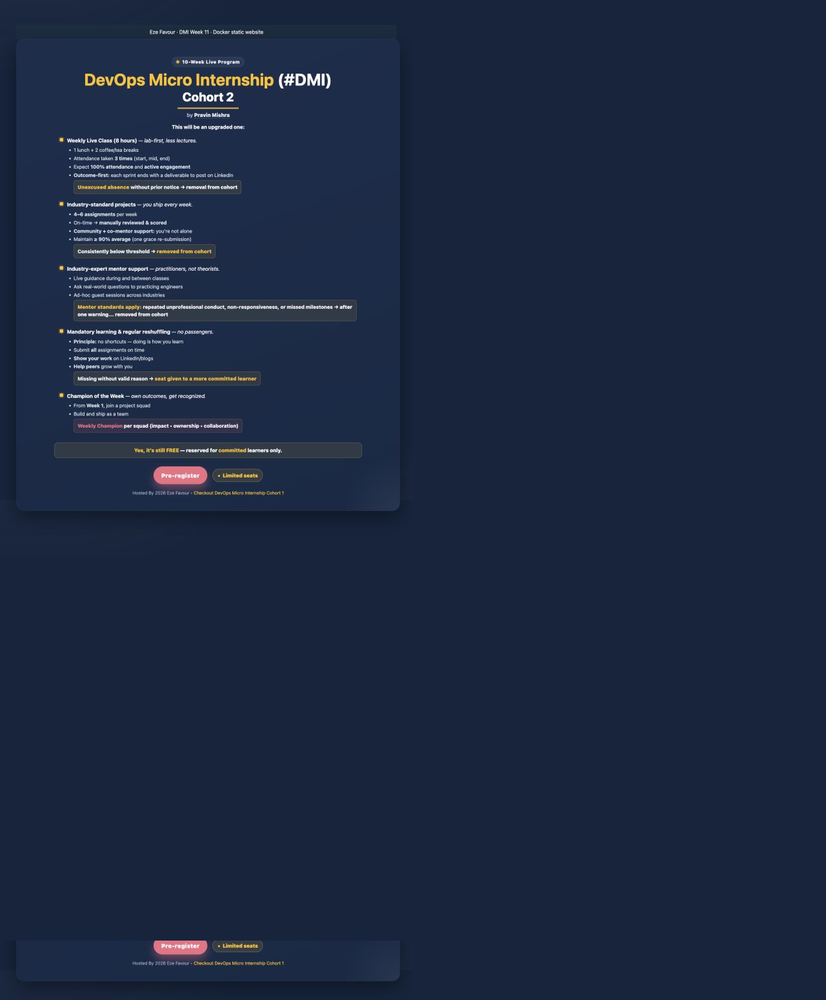

---

# LinkedIn Post (Optional)

## Goal

Create a LinkedIn post describing what you deployed, the deployment process, and key learning outcomes.

## Evidence

#### LinkedIn Post URL

The weekly post covers this assignment and the EpicBook capstone.

[Published Week 11 LinkedIn post](https://www.linkedin.com/posts/eze-favour-52732752_dmibypravinmishra-docker-devops-share-7509737427876454400-cxc1/) · [receipt](publication/README.md).

---

#### Screenshot — Published LinkedIn post

See [the weekly publication receipt](publication/README.md) and its published-post capture.

---

# Submission Instructions

- Add all required screenshots in your submission
- Full name must be visible in required screenshots
- Do not expose sensitive information (passwords, keys, account IDs)

---

# Completion Checklist

- [x] Task 1: Cloud VM provisioned with required networking (Screenshot 1)
- [x] Task 2: Docker installed via Cloud-Init (Screenshot 2)
- [x] Task 3: Docker installation verified (Screenshot 3)
- [x] Task 4: Application repository cloned (Screenshot 4)
- [x] Task 5: Dockerfile created (Screenshot 5)
- [x] Task 6: Docker image built (Screenshot 6)
- [x] Task 7: Container deployed and running (Screenshot 7)
- [x] Task 8: Website accessible via public IP (Screenshots 8–9)
- [x] No sensitive information exposed

---

## 📌 About DMI & CloudAdvisory

DevOps Micro Internship (DMI) is a project-based DevOps program run by Pravin Mishra (The CloudAdvisory) focused on real-world execution, systems thinking, and career readiness.

It helps learners build strong DevOps foundations with hands-on experience.

---

## 📌 Resources

- 🌐 DMI Official Website: https://dmi.pravinmishra.com?utm_source=github&utm_medium=readme  
- 🎓 University: https://university.pravinmishra.com?utm_source=github&utm_medium=readme  
- 💬 Discord Community: https://discord.pravinmishra.com?utm_source=github&utm_medium=readme  
- 📝 Blog: https://dmi.pravinmishra.com/blog?utm_source=github&utm_medium=readme  
- ▶️ YouTube Playlist: https://www.youtube.com/playlist?list=PLFeSNDtI4Cho  
- 🔗 Pravin Mishra (LinkedIn): https://www.linkedin.com/in/pravin-mishra-aws-trainer/  
- 🏢 CloudAdvisory (LinkedIn): https://www.linkedin.com/company/thecloudadvisory/

---

*This submission is part of DevOps Micro Internship (DMI) Cohort 3 — Agentic AI Track.*

Applied network settings: [sanitized inventory](evidence/2026-09-26/a1-cloud-inventory.json); SSH is operator /32, HTTP/HTTPS public, port 3000 operator-only.

## Recorded evidence gallery

Each figure is captured once and may support multiple related screenshot slots. Page links above identify the same original evidence, not separate repeated executions.

### a1-bootstrap

[Original](evidence/2026-09-26/a1-bootstrap.txt)

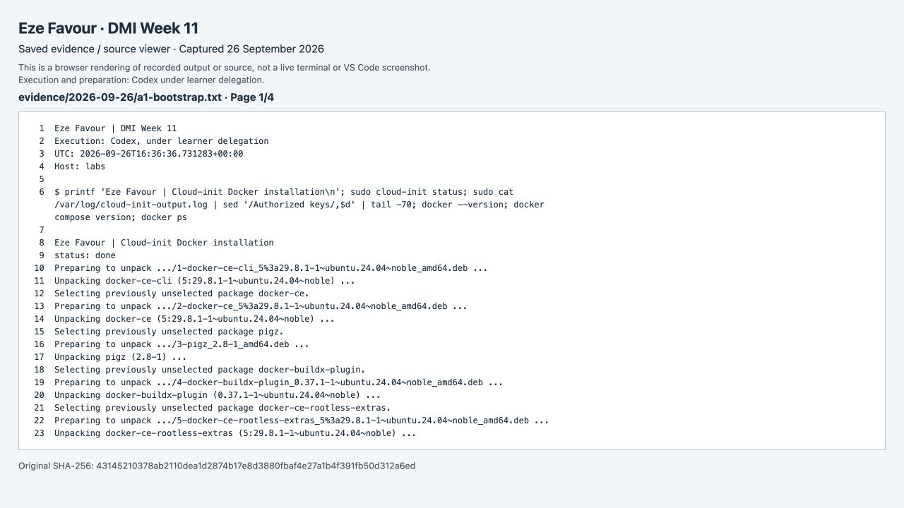

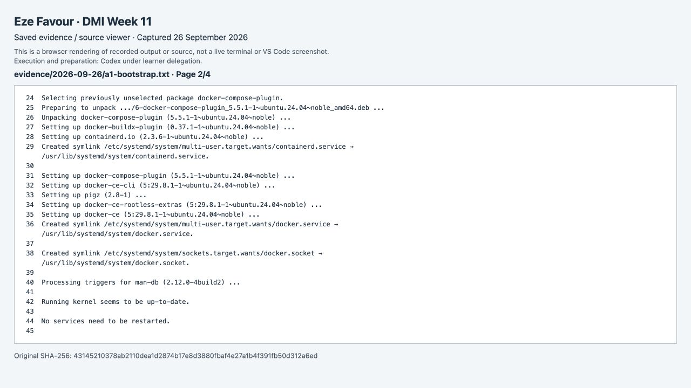

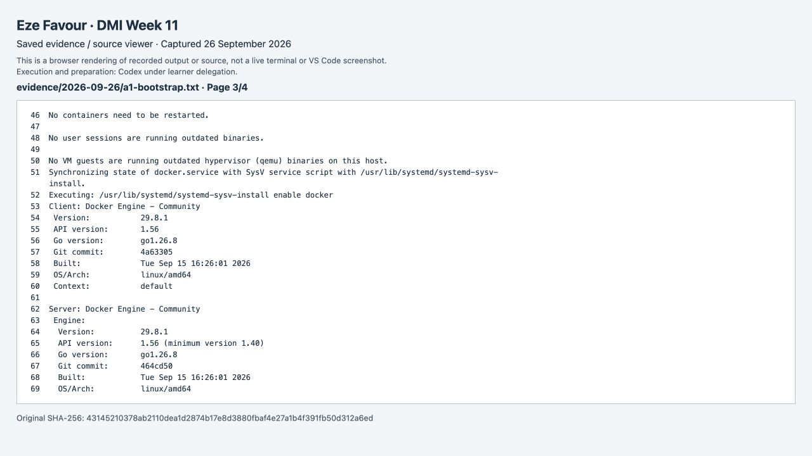

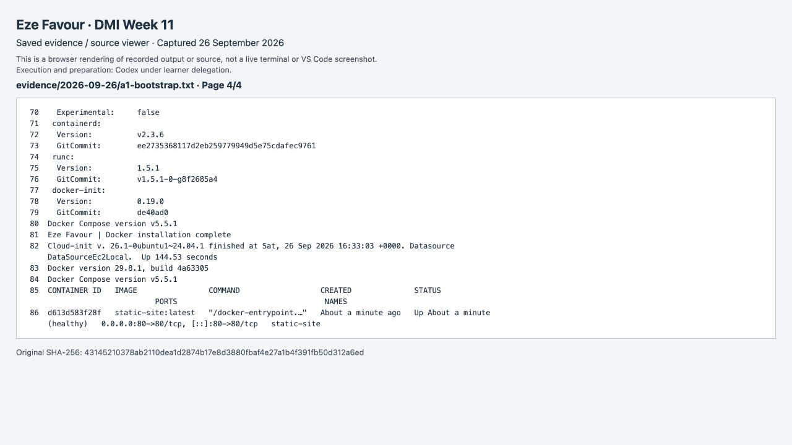

### a1-a2-upstream-checkouts

[Original](evidence/2026-09-26/a1-a2-upstream-checkouts.txt)

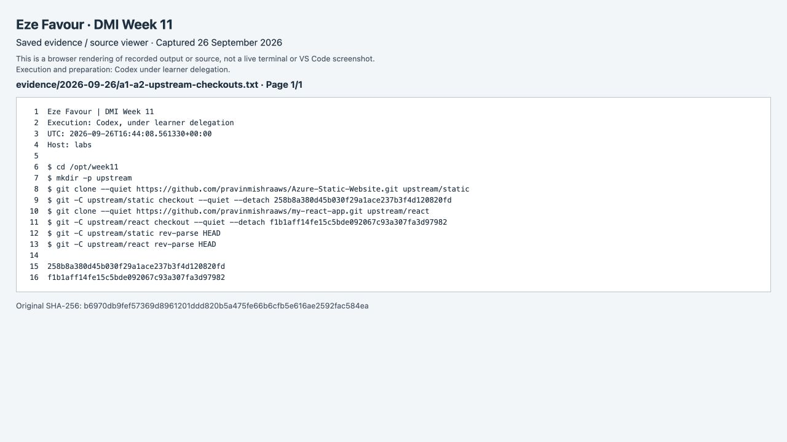

### a1-static

[Original](evidence/2026-09-26/a1-static.txt)

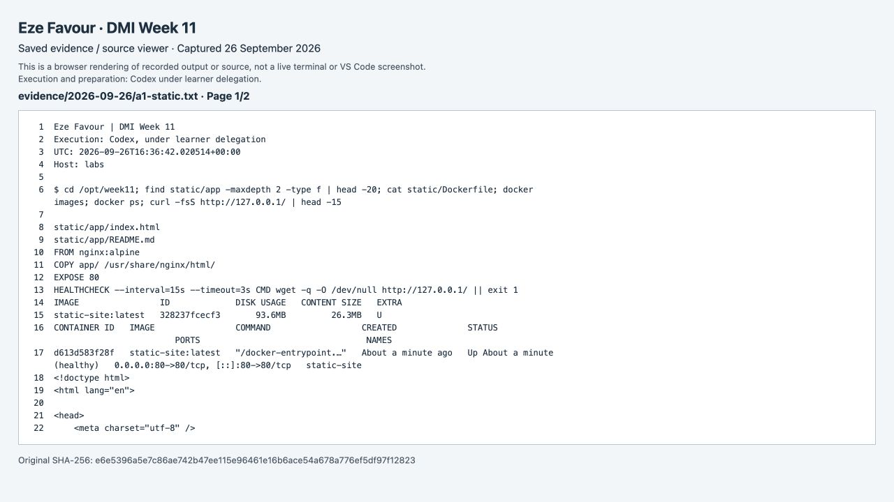

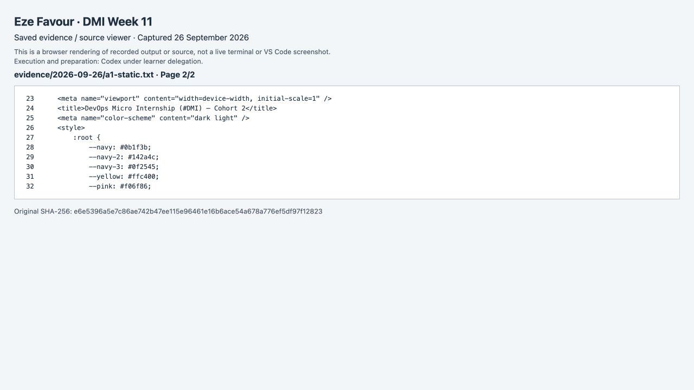

### a1-cloud-inventory

[Original](evidence/2026-09-26/a1-cloud-inventory.json)

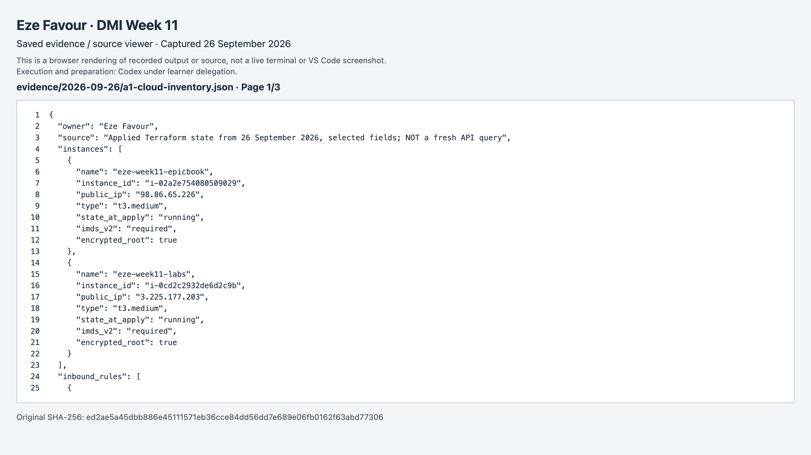

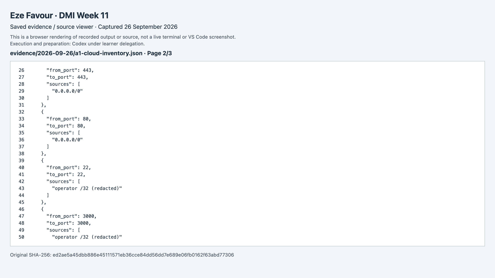

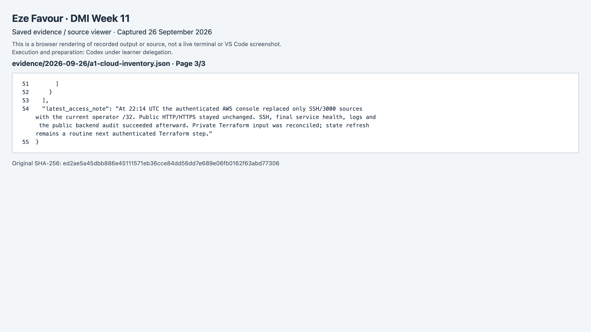

[Current security rules, captured from AWS Console](evidence/2026-09-26/a1-security-rules.txt) · [Original VM screenshot](screenshots/a1-aws-vm.png).
