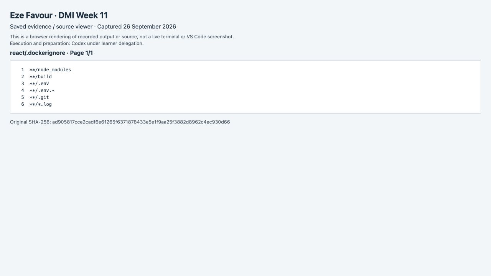
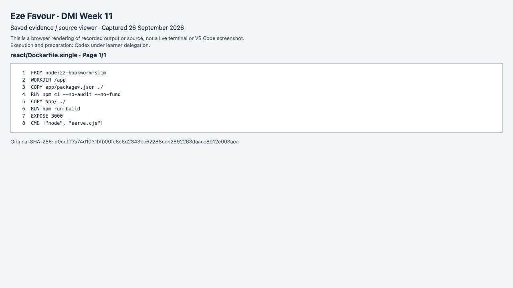
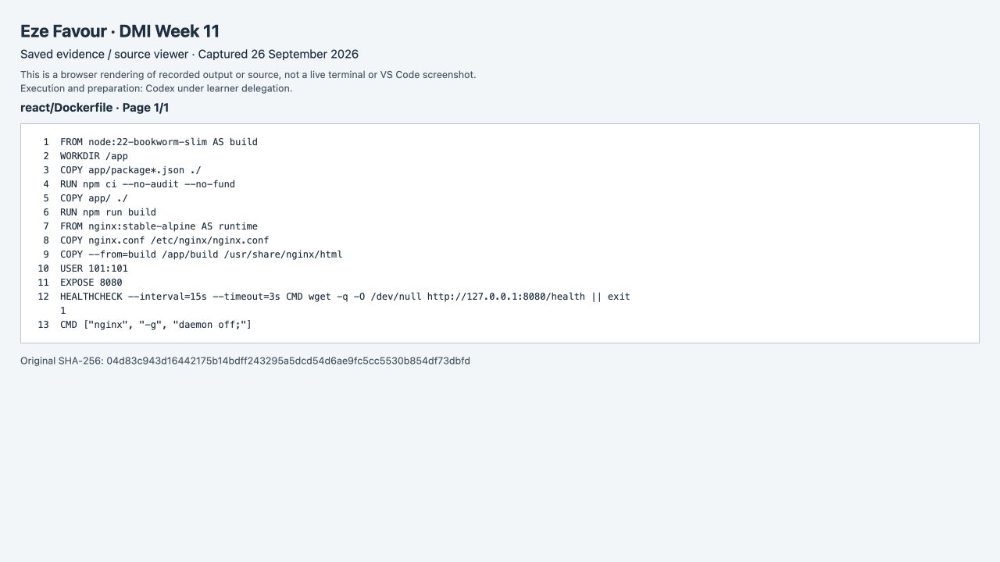
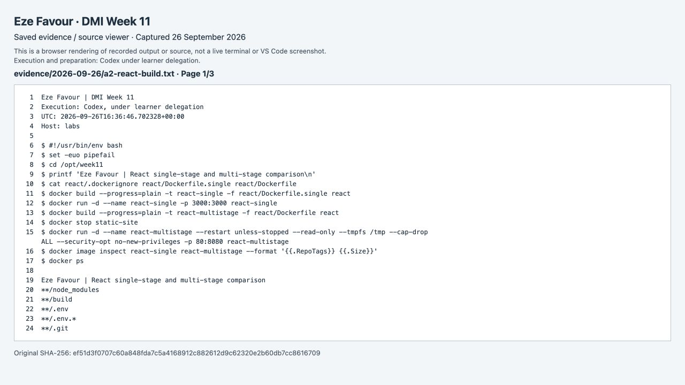
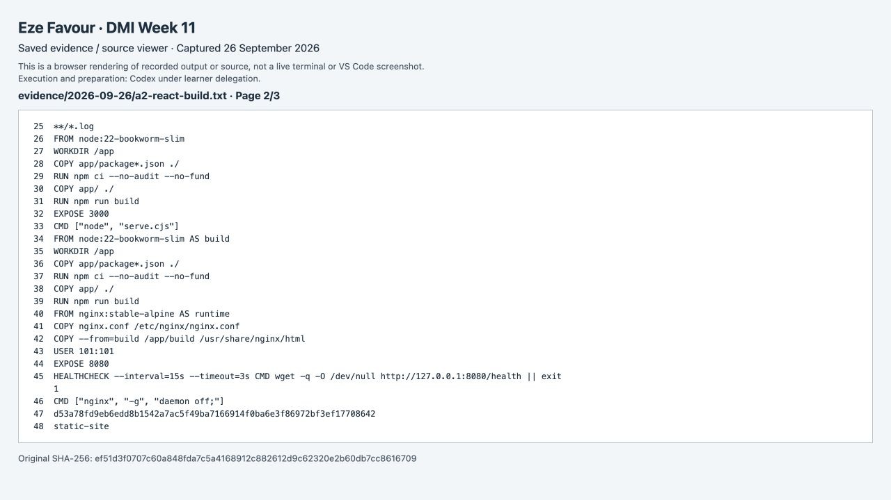
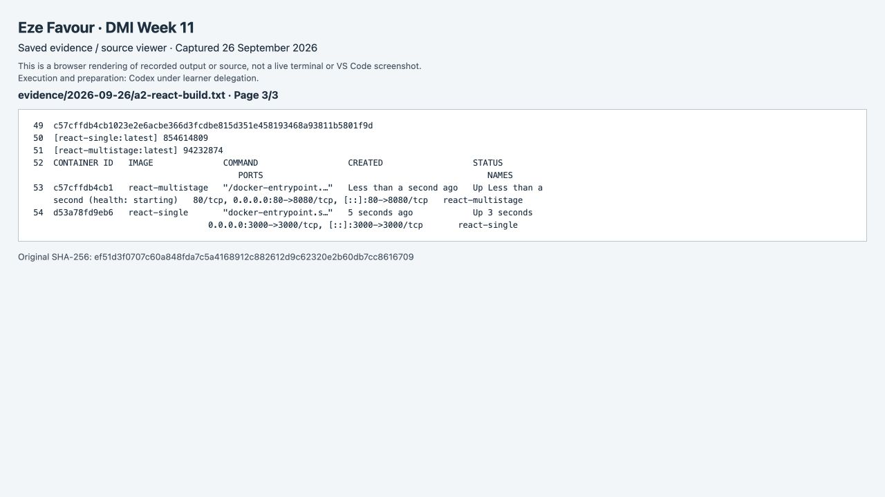
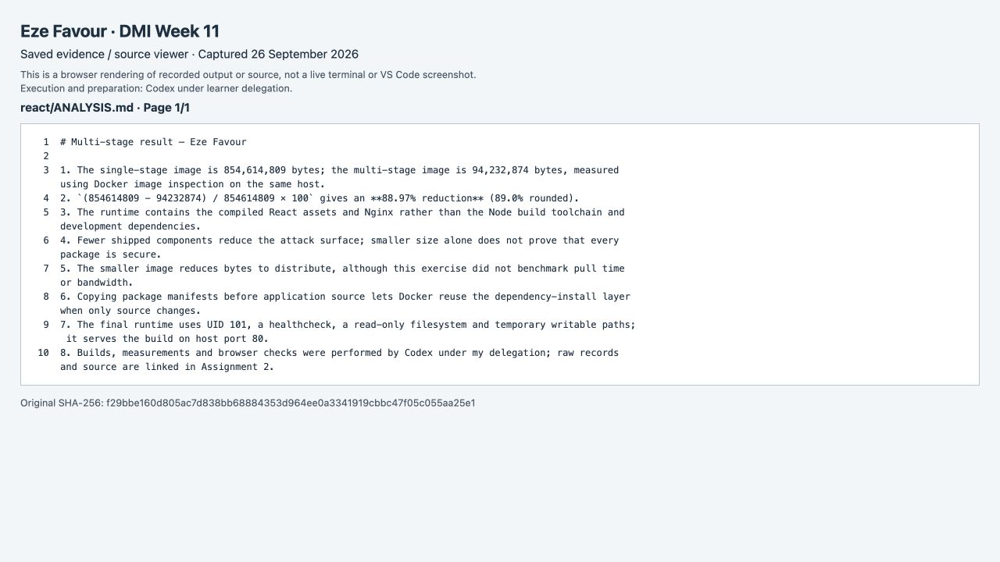

# Assignment 2 — Multi-Stage Docker Build for a React Application

Part of the DevOps Micro Internship (DMI) Cohort 3 with Agentic AI

**Eze Favour · Verified 26 September 2026 · DMI assessment pending**

Both builds came from the same instructor React revision. Docker reported 854,614,809 bytes for single-stage and 94,232,874 bytes for multi-stage: 88.97% less. Single-stage ran on port 3000 for verification; the retained multi-stage demo is on port 80.

**Evidence method:** Codex executed these exercises under delegation. App screenshots are direct browser captures; source screenshots use the actual Code OSS editor except the explicitly labelled original multistage-Dockerfile source capture in A2. Terminal-review screenshots show the original dated saved command output or source in its integrated terminal, explicitly labelled as a review rather than a new execution. Originals and hashes remain linked. Newly executed A4 updates and A6 live logs are identified separately. No learner-personal execution is claimed.

---

## Purpose

In this assignment, you will build both a single-stage and an optimized multi-stage Docker image for a React application, compare the resulting image sizes, and deploy the optimized version using a production-ready Nginx runtime container.

---

# Task 1 — Prepare the Project

## Goal

Clone `https://github.com/pravinmishraaws/my-react-app.git` and create a `.dockerignore` excluding `node_modules`, `build`, and `.env`.

### Evidence

#### Screenshot 1 — Contents of the `.dockerignore` file

[Original record/source](react/.dockerignore) · [Editor screenshot](screenshots/ordered-rerun/a2-_dockerignore.png). Direct capture of the actual Code OSS editor; displayed source is byte-identical to the linked file.

---

# Task 2 — Create a Single-Stage Docker Image

## Goal

Create `Dockerfile.single`, build `react-single`, and run it on port 3000.

### Evidence

#### Screenshot 2 — Contents of `Dockerfile.single`

[Original record/source](react/Dockerfile.single) · [Editor screenshot](screenshots/ordered-rerun/a2-Dockerfile_single.png). Direct capture of the actual Code OSS editor; displayed source is byte-identical to the linked file.

---

#### Screenshot 3 — Browser displaying the application running from the single-stage container

---

# Task 3 — Create a Multi-Stage Docker Build

## Goal

Create a multi-stage Dockerfile with separate build and Nginx runtime stages, build `react-multistage`, and run it on port 80.

### Evidence

#### Screenshot 4 — Contents of the multi-stage Dockerfile

[Original record/source](react/Dockerfile) · [Verified source screenshot](screenshots/react-Dockerfile-p01.png). This original labelled source-viewer capture shows the complete multistage Dockerfile. The attempted replacement selected Dockerfile.single and was rejected during validation; browser capture then became unavailable, so this already verified source capture is retained.

---

#### Screenshot 5 — Browser displaying the application running from the multi-stage container

---

# Task 4 — Compare Docker Image Sizes

## Goal

Compare the single-stage and multi-stage image sizes and calculate the percentage reduction.

### Evidence

#### Screenshot 6 — Docker image list showing both image sizes

[Original record/source](evidence/2026-09-26/a2-react-build.txt) · [Terminal page 1](screenshots/terminal-review/a2-react-build-terminal-01.png) · [Terminal page 2](screenshots/terminal-review/a2-react-build-terminal-02.png) · [Terminal page 3](screenshots/terminal-review/a2-react-build-terminal-03.png). Direct Code OSS terminal capture while reviewing this dated original log; not a new execution.

---

# Task 5 — Analyze the Optimization Results

## Goal

Write a 5–8 line analysis covering the percentage reduction, security benefits, reduced attack surface, faster distribution, and one build-caching optimization used.

### Evidence

#### Screenshot 7 — Analysis included in your submission document

[Original record/source](react/ANALYSIS.md) · [Editor screenshot](screenshots/ordered-rerun/a2-ANALYSIS_md.png). Direct capture of the actual Code OSS editor; displayed source is byte-identical to the linked file.

---

### Notes

1. The single-stage image is 854,614,809 bytes; the multi-stage image is 94,232,874 bytes, measured using Docker image inspection on the same host.
2. `(854614809 - 94232874) / 854614809 × 100` gives an **88.97% reduction** (89.0% rounded).
3. The runtime contains the compiled React assets and Nginx rather than the Node build toolchain and development dependencies.
4. Fewer shipped components reduce the attack surface; smaller size alone does not prove that every package is secure.
5. The smaller image reduces bytes to distribute, although this exercise did not benchmark pull time or bandwidth.
6. Copying package manifests before application source lets Docker reuse the dependency-install layer when only source changes.
7. The final runtime uses UID 101, a healthcheck, a read-only filesystem and temporary writable paths; it serves the build on host port 80.
8. Builds, measurements and browser checks were performed by Codex under my delegation; raw records and source are linked in Assignment 2.

[Analysis screenshots and source](react/ANALYSIS.md) accompany the actual image-size record.

---

# Task 6 — Explore Additional Production Optimizations (Optional)

## Goal

Optionally configure an Nginx health check, cache headers, parameterized ports via environment variables, or a lighter runtime image, and compare results.

> Screenshot optional.

---

# LinkedIn Post (Optional)

## Goal

Create a LinkedIn post describing what you built, what a multi-stage Docker build is, the image size reduction achieved, and key learnings.

## Evidence

#### LinkedIn Post URL

The weekly post covers this assignment and the EpicBook capstone.

[Published Week 11 LinkedIn post](https://www.linkedin.com/posts/eze-favour-52732752_dmibypravinmishra-docker-devops-share-7509737427876454400-cxc1/) · [receipt](publication/README.md).

---

#### Screenshot — Published LinkedIn post

See [the weekly publication receipt](publication/README.md) and its published-post capture.

---

# Submission Instructions

- Add all required screenshots in your submission
- Full name must be visible in required screenshots
- Do not expose sensitive information

---

# Completion Checklist

- [x] Task 1: `.dockerignore` created (Screenshot 1)
- [x] Task 2: Single-stage image built and verified (Screenshots 2–3)
- [x] Task 3: Multi-stage image built and verified (Screenshots 4–5)
- [x] Task 4: Image sizes compared (Screenshot 6)
- [x] Task 5: Analysis written (Screenshot 7 & Notes)
- [x] Task 6: Optional production optimizations explored
- [x] No sensitive information exposed

---

## 📌 About DMI & CloudAdvisory

DevOps Micro Internship (DMI) is a project-based DevOps program run by Pravin Mishra (The CloudAdvisory) focused on real-world execution, systems thinking, and career readiness.

It helps learners build strong DevOps foundations with hands-on experience.

---

## 📌 Resources

- 🌐 DMI Official Website: https://dmi.pravinmishra.com?utm_source=github&utm_medium=readme  
- 🎓 University: https://university.pravinmishra.com?utm_source=github&utm_medium=readme  
- 💬 Discord Community: https://discord.pravinmishra.com?utm_source=github&utm_medium=readme  
- 📝 Blog: https://dmi.pravinmishra.com/blog?utm_source=github&utm_medium=readme  
- ▶️ YouTube Playlist: https://www.youtube.com/playlist?list=PLFeSNDtI4Cho  
- 🔗 Pravin Mishra (LinkedIn): https://www.linkedin.com/in/pravin-mishra-aws-trainer/  
- 🏢 CloudAdvisory (LinkedIn): https://www.linkedin.com/company/thecloudadvisory/

---

*This submission is part of DevOps Micro Internship (DMI) Cohort 3 — Agentic AI Track.*

## Recorded evidence gallery

Each figure is captured once and may support multiple related screenshot slots. Page links above identify the same original evidence, not separate repeated executions.

### react-_dockerignore

[Original](react/.dockerignore)

### react-Dockerfile_single

[Original](react/Dockerfile.single)

### react-Dockerfile

[Original](react/Dockerfile)

### a2-react-build

[Original](evidence/2026-09-26/a2-react-build.txt)

### react-ANALYSIS_md

[Original](react/ANALYSIS.md)

