# Assignment 4 — Docker Volumes

Part of the DevOps Micro Internship (DMI) Cohort 3 with Agentic AI

**Eze Favour · Verified 26 September 2026 · DMI assessment pending**

Nginx log files and their checksums remained after container removal. A named shared volume served the initial message and two updates to a read-only frontend. A write attempt from the reader was rejected, and the last data remained after exercise-container cleanup.

**Evidence method:** Codex executed and documented these exercises under delegation. App screenshots are actual browser captures. Numbered command/editor slots link to labelled browser renderings of saved command output or source, with originals alongside them; they are not represented as live Terminal or VS Code captures. Full-name captions identify the submission without claiming personal learner execution.

---

## Purpose

In this assignment, you will learn how Docker Volumes and Bind Mounts provide persistent storage for containers, deploying applications that retain logs and data even after containers are stopped or removed.

---

# Task 1 — Deploy a Standalone Application with Persistent Logs Using Bind Mounts

## Goal

Run an Nginx container (`myweb`) with a Bind Mount from `~/nginx-logs` to `/var/log/nginx`, verify the site loads, confirm logs are written, remove the container, and confirm the logs persist on the host.

### Evidence

#### Screenshot 1 — Output of `docker images`

[Original record/source](evidence/2026-09-26/a4-bind-mount.txt) · [Screenshot page 1](screenshots/a4-bind-mount-p01.png) · [Screenshot page 2](screenshots/a4-bind-mount-p02.png) · [Screenshot page 3](screenshots/a4-bind-mount-p03.png) · [Screenshot page 4](screenshots/a4-bind-mount-p04.png). Captured from the labelled saved-output/source viewer.

---

#### Screenshot 2 — Output of `docker search nginx`

[Original record/source](evidence/2026-09-26/a4-bind-mount.txt) · [Screenshot page 1](screenshots/a4-bind-mount-p01.png) · [Screenshot page 2](screenshots/a4-bind-mount-p02.png) · [Screenshot page 3](screenshots/a4-bind-mount-p03.png) · [Screenshot page 4](screenshots/a4-bind-mount-p04.png). Captured from the labelled saved-output/source viewer.

---

#### Screenshot 3 — Successful `docker pull nginx` (if applicable)

[Original record/source](evidence/2026-09-26/a4-bind-mount.txt) · [Screenshot page 1](screenshots/a4-bind-mount-p01.png) · [Screenshot page 2](screenshots/a4-bind-mount-p02.png) · [Screenshot page 3](screenshots/a4-bind-mount-p03.png) · [Screenshot page 4](screenshots/a4-bind-mount-p04.png). Captured from the labelled saved-output/source viewer.

---

#### Screenshot 4 — Creation of the `~/nginx-logs` directory

[Original record/source](evidence/2026-09-26/a4-bind-mount.txt) · [Screenshot page 1](screenshots/a4-bind-mount-p01.png) · [Screenshot page 2](screenshots/a4-bind-mount-p02.png) · [Screenshot page 3](screenshots/a4-bind-mount-p03.png) · [Screenshot page 4](screenshots/a4-bind-mount-p04.png). Captured from the labelled saved-output/source viewer.

---

#### Screenshot 5 — Output of `docker run` with the Bind Mount

[Original record/source](evidence/2026-09-26/a4-bind-mount.txt) · [Screenshot page 1](screenshots/a4-bind-mount-p01.png) · [Screenshot page 2](screenshots/a4-bind-mount-p02.png) · [Screenshot page 3](screenshots/a4-bind-mount-p03.png) · [Screenshot page 4](screenshots/a4-bind-mount-p04.png). Captured from the labelled saved-output/source viewer.

---

#### Screenshot 6 — Output of `docker ps` showing the running `myweb` container

[Original record/source](evidence/2026-09-26/a4-bind-mount.txt) · [Screenshot page 1](screenshots/a4-bind-mount-p01.png) · [Screenshot page 2](screenshots/a4-bind-mount-p02.png) · [Screenshot page 3](screenshots/a4-bind-mount-p03.png) · [Screenshot page 4](screenshots/a4-bind-mount-p04.png). Captured from the labelled saved-output/source viewer.

---

#### Screenshot 7 — Browser displaying the Nginx Welcome Page

---

#### Screenshot 8 — Output of `ls ~/nginx-logs` showing `access.log` and `error.log`

[Original record/source](evidence/2026-09-26/a4-bind-mount.txt) · [Screenshot page 1](screenshots/a4-bind-mount-p01.png) · [Screenshot page 2](screenshots/a4-bind-mount-p02.png) · [Screenshot page 3](screenshots/a4-bind-mount-p03.png) · [Screenshot page 4](screenshots/a4-bind-mount-p04.png). Captured from the labelled saved-output/source viewer.

---

#### Screenshot 9 — Successful removal of the container

[Original record/source](evidence/2026-09-26/a4-bind-removal.txt) · [Screenshot page 1](screenshots/a4-bind-removal-p01.png) · [Screenshot page 2](screenshots/a4-bind-removal-p02.png). Captured from the labelled saved-output/source viewer.

---

#### Screenshot 10 — Output of `ls ~/nginx-logs` confirming the log files remain after the container has been removed

[Original record/source](evidence/2026-09-26/a4-bind-removal.txt) · [Screenshot page 1](screenshots/a4-bind-removal-p01.png) · [Screenshot page 2](screenshots/a4-bind-removal-p02.png). Captured from the labelled saved-output/source viewer.

---

# Task 2 — Deploy Two Containers with Persistent Data Using Docker Volumes

## Goal

Create a custom network `mynetwork` and a Docker volume `shared-data`, build and run a `backend` container that writes to the shared volume and a `frontend` container that reads from it, and confirm updates are reflected immediately.

### Evidence

#### Screenshot 1 — Project folder structure

[Original record/source](evidence/2026-09-26/a4-shared-volume.txt) · [Screenshot page 1](screenshots/a4-shared-volume-p01.png) · [Screenshot page 2](screenshots/a4-shared-volume-p02.png) · [Screenshot page 3](screenshots/a4-shared-volume-p03.png). Captured from the labelled saved-output/source viewer.

---

#### Screenshot 2 — Output of `docker network create mynetwork`

[Original record/source](evidence/2026-09-26/a4-shared-volume.txt) · [Screenshot page 1](screenshots/a4-shared-volume-p01.png) · [Screenshot page 2](screenshots/a4-shared-volume-p02.png) · [Screenshot page 3](screenshots/a4-shared-volume-p03.png). Captured from the labelled saved-output/source viewer.

---

#### Screenshot 3 — Output of `docker volume create shared-data`

[Original record/source](evidence/2026-09-26/a4-shared-volume.txt) · [Screenshot page 1](screenshots/a4-shared-volume-p01.png) · [Screenshot page 2](screenshots/a4-shared-volume-p02.png) · [Screenshot page 3](screenshots/a4-shared-volume-p03.png). Captured from the labelled saved-output/source viewer.

---

#### Screenshot 4 — Backend Dockerfile

[Original record/source](evidence/2026-09-26/a4-shared-volume.txt) · [Screenshot page 1](screenshots/a4-shared-volume-p01.png) · [Screenshot page 2](screenshots/a4-shared-volume-p02.png) · [Screenshot page 3](screenshots/a4-shared-volume-p03.png). Captured from the labelled saved-output/source viewer.

---

#### Screenshot 5 — Successful backend image build

[Original record/source](evidence/2026-09-26/a4-shared-volume-build-stderr.txt) · [Screenshot page 1](screenshots/a4-shared-volume-build-stderr-p01.png) · [Screenshot page 2](screenshots/a4-shared-volume-build-stderr-p02.png) · [Screenshot page 3](screenshots/a4-shared-volume-build-stderr-p03.png) · [Screenshot page 4](screenshots/a4-shared-volume-build-stderr-p04.png) · [Screenshot page 5](screenshots/a4-shared-volume-build-stderr-p05.png) · [Screenshot page 6](screenshots/a4-shared-volume-build-stderr-p06.png). Captured from the labelled saved-output/source viewer.

---

#### Screenshot 6 — Frontend Dockerfile

[Original record/source](evidence/2026-09-26/a4-shared-volume.txt) · [Screenshot page 1](screenshots/a4-shared-volume-p01.png) · [Screenshot page 2](screenshots/a4-shared-volume-p02.png) · [Screenshot page 3](screenshots/a4-shared-volume-p03.png). Captured from the labelled saved-output/source viewer.

---

#### Screenshot 7 — Successful frontend image build

[Original record/source](evidence/2026-09-26/a4-shared-volume-build-stderr.txt) · [Screenshot page 1](screenshots/a4-shared-volume-build-stderr-p01.png) · [Screenshot page 2](screenshots/a4-shared-volume-build-stderr-p02.png) · [Screenshot page 3](screenshots/a4-shared-volume-build-stderr-p03.png) · [Screenshot page 4](screenshots/a4-shared-volume-build-stderr-p04.png) · [Screenshot page 5](screenshots/a4-shared-volume-build-stderr-p05.png) · [Screenshot page 6](screenshots/a4-shared-volume-build-stderr-p06.png). Captured from the labelled saved-output/source viewer.

---

#### Screenshot 8 — Output of `docker ps` showing both containers

[Original record/source](evidence/2026-09-26/a4-shared-volume.txt) · [Screenshot page 1](screenshots/a4-shared-volume-p01.png) · [Screenshot page 2](screenshots/a4-shared-volume-p02.png) · [Screenshot page 3](screenshots/a4-shared-volume-p03.png). Captured from the labelled saved-output/source viewer.

---

#### Screenshot 9 — Successful execution of `docker exec backend curl http://localhost/write`

[Original record/source](evidence/2026-09-26/a4-shared-volume.txt) · [Screenshot page 1](screenshots/a4-shared-volume-p01.png) · [Screenshot page 2](screenshots/a4-shared-volume-p02.png) · [Screenshot page 3](screenshots/a4-shared-volume-p03.png). Captured from the labelled saved-output/source viewer.

---

#### Screenshot 10 — Browser displaying "Hello from Backend!"

---

#### Screenshot 11 — Browser displaying "Test Data 1" after the first update

[Original record/source](evidence/2026-09-26/a4-volume-update1.txt) · [Screenshot page 1](screenshots/a4-volume-update1-p01.png). Captured from the labelled saved-output/source viewer.

---

#### Screenshot 12 — Browser displaying "Test Data 2 - New Update" after the second update

[Original record/source](evidence/2026-09-26/a4-volume-update2.txt) · [Screenshot page 1](screenshots/a4-volume-update2-p01.png). Captured from the labelled saved-output/source viewer.

---

# LinkedIn Post (Optional)

## Goal

Create a LinkedIn post covering the assignment, Docker Hub repository, steps performed, and key learning outcomes.

## Evidence

#### LinkedIn Post URL

The weekly post covers this assignment and the EpicBook capstone.

[Published Week 11 LinkedIn post](https://www.linkedin.com/posts/eze-favour-52732752_dmibypravinmishra-docker-devops-share-7509737427876454400-cxc1/) · [receipt](publication/README.md).

---

#### Screenshot — Published LinkedIn post

See [the weekly publication receipt](publication/README.md) and its published-post capture.

---

# Submission Instructions

- Add all required screenshots in your submission
- Full name must be visible in required screenshots
- Do not expose sensitive information

---

# Completion Checklist

- [x] Task 1: Bind-mounted persistent logs verified before and after container removal (Screenshots 1–10)
- [x] Task 2: Docker volume shared between frontend and backend verified (Screenshots 1–12)
- [x] No sensitive information exposed

---

## 📌 About DMI & CloudAdvisory

DevOps Micro Internship (DMI) is a project-based DevOps program run by Pravin Mishra (The CloudAdvisory) focused on real-world execution, systems thinking, and career readiness.

It helps learners build strong DevOps foundations with hands-on experience.

---

## 📌 Resources

- 🌐 DMI Official Website: https://dmi.pravinmishra.com?utm_source=github&utm_medium=readme  
- 🎓 University: https://university.pravinmishra.com?utm_source=github&utm_medium=readme  
- 💬 Discord Community: https://discord.pravinmishra.com?utm_source=github&utm_medium=readme  
- 📝 Blog: https://dmi.pravinmishra.com/blog?utm_source=github&utm_medium=readme  
- ▶️ YouTube Playlist: https://www.youtube.com/playlist?list=PLFeSNDtI4Cho  
- 🔗 Pravin Mishra (LinkedIn): https://www.linkedin.com/in/pravin-mishra-aws-trainer/  
- 🏢 CloudAdvisory (LinkedIn): https://www.linkedin.com/company/thecloudadvisory/

---

*This submission is part of DevOps Micro Internship (DMI) Cohort 3 — Agentic AI Track.*

## Recorded evidence gallery

Each figure is captured once and may support multiple related screenshot slots. Page links above identify the same original evidence, not separate repeated executions.

### a4-bind-mount

[Original](evidence/2026-09-26/a4-bind-mount.txt)

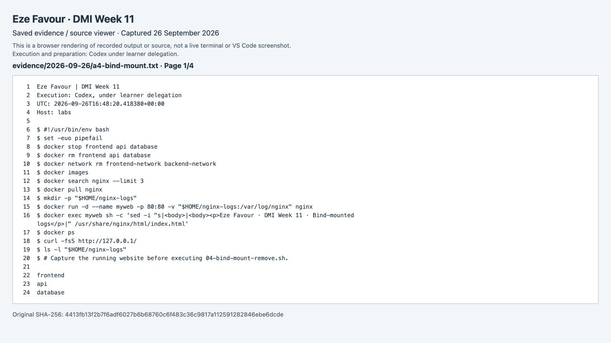

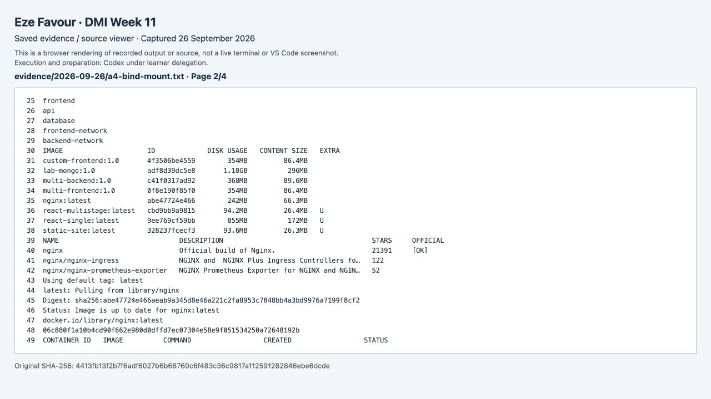

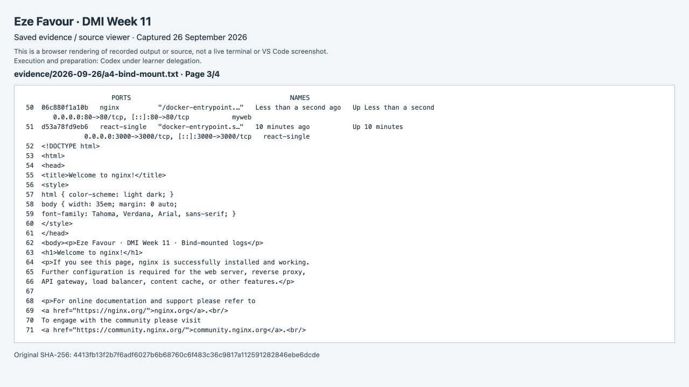

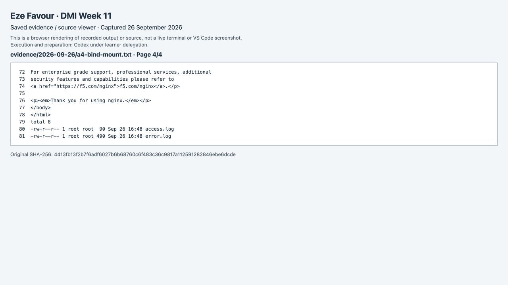

### a4-bind-removal

[Original](evidence/2026-09-26/a4-bind-removal.txt)

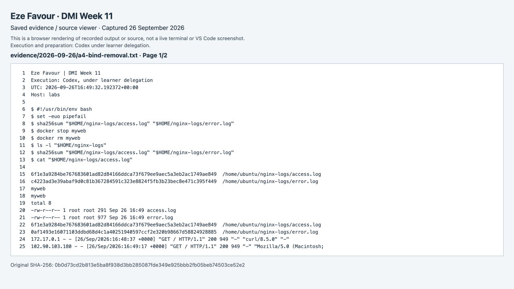

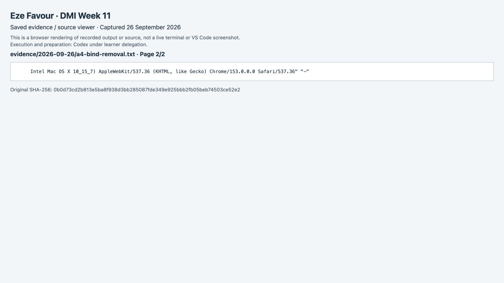

### a4-shared-volume

[Original](evidence/2026-09-26/a4-shared-volume.txt)

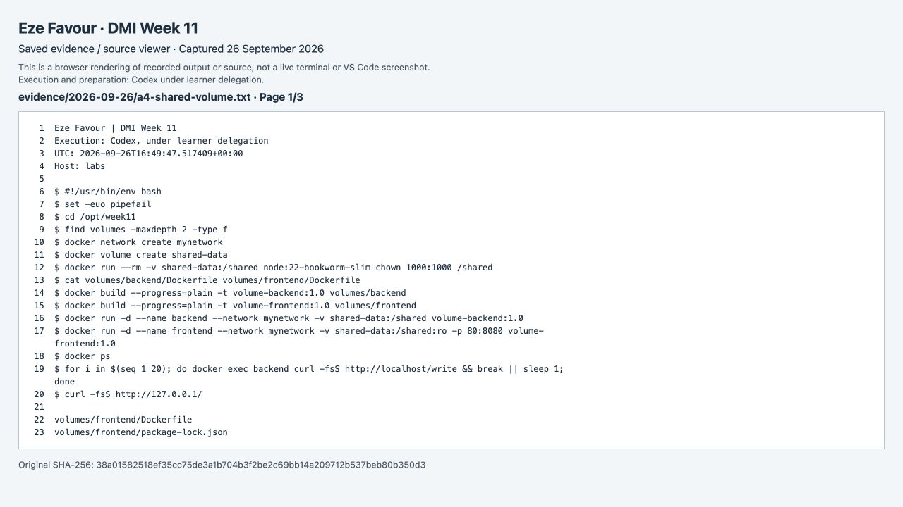

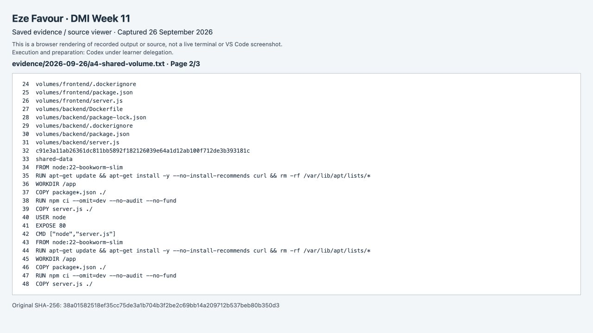

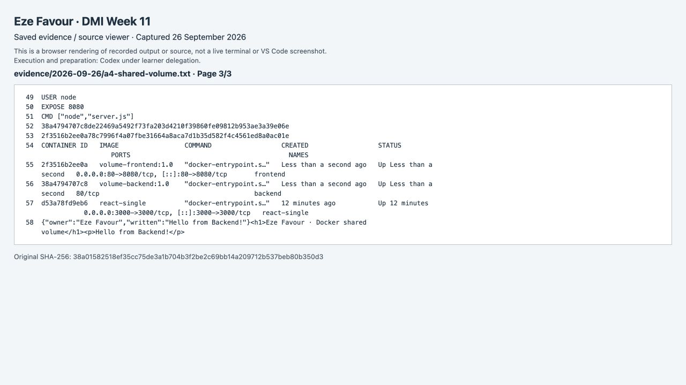

### a4-shared-volume-build-stderr

[Original](evidence/2026-09-26/a4-shared-volume-build-stderr.txt)

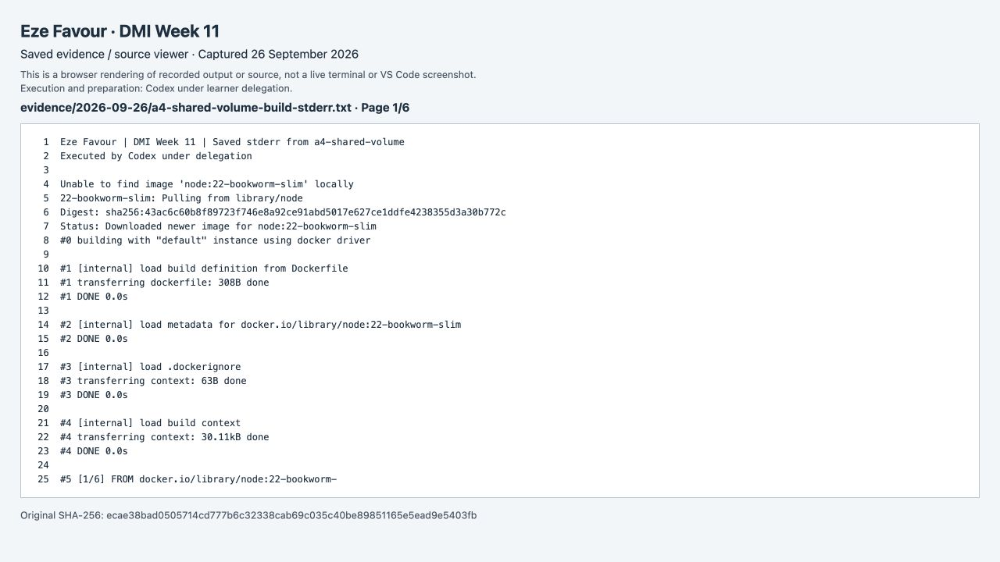

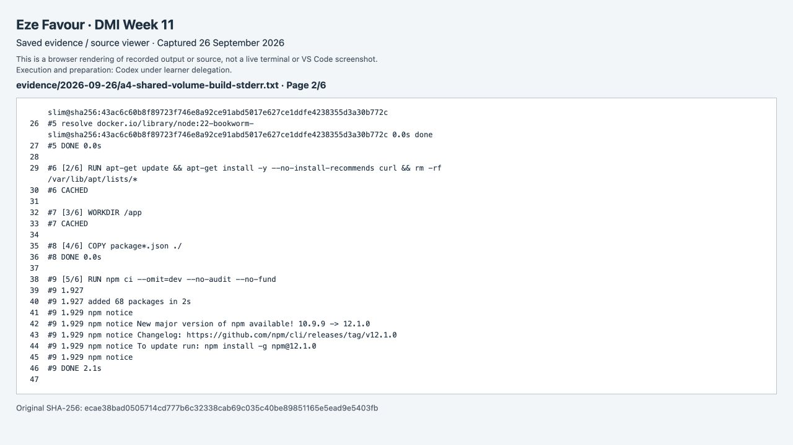

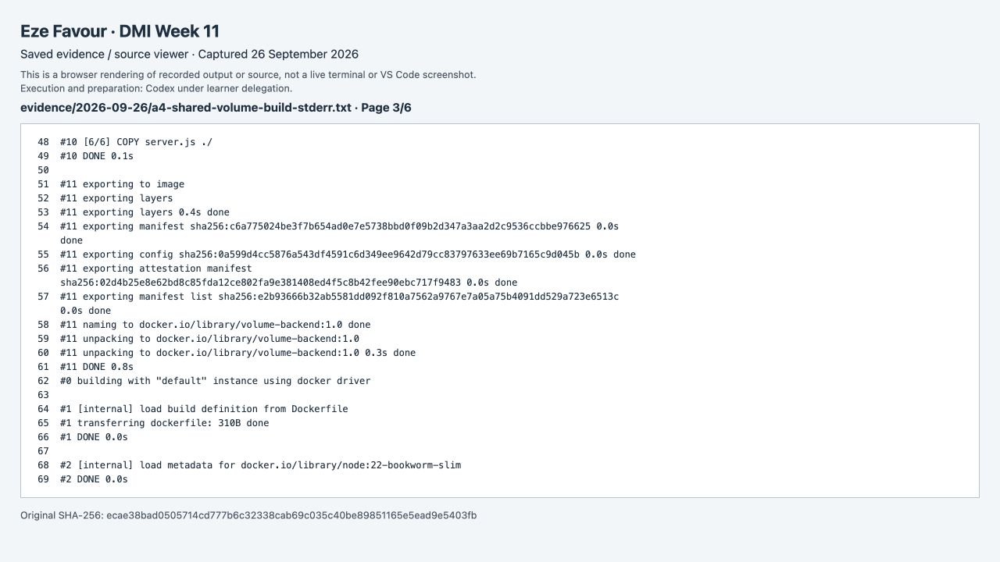

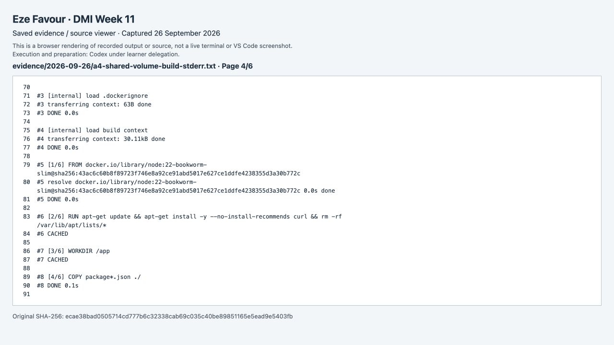

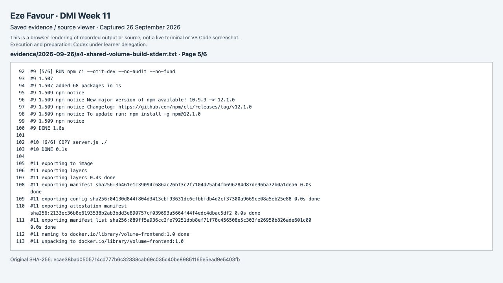

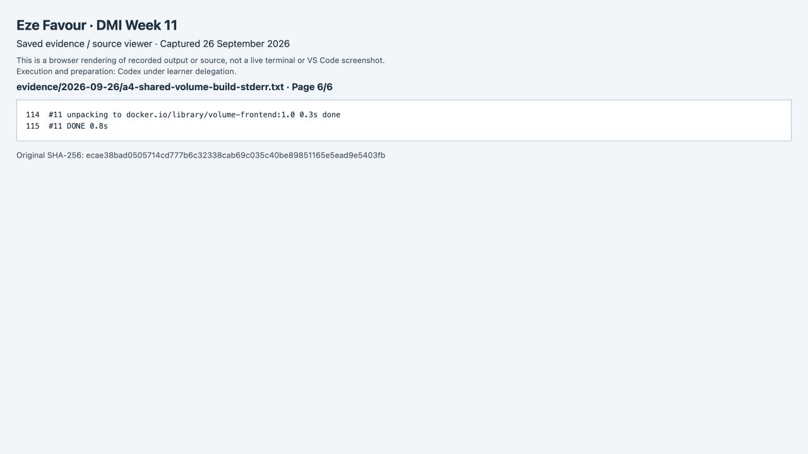

### a4-volume-update1

[Original](evidence/2026-09-26/a4-volume-update1.txt)

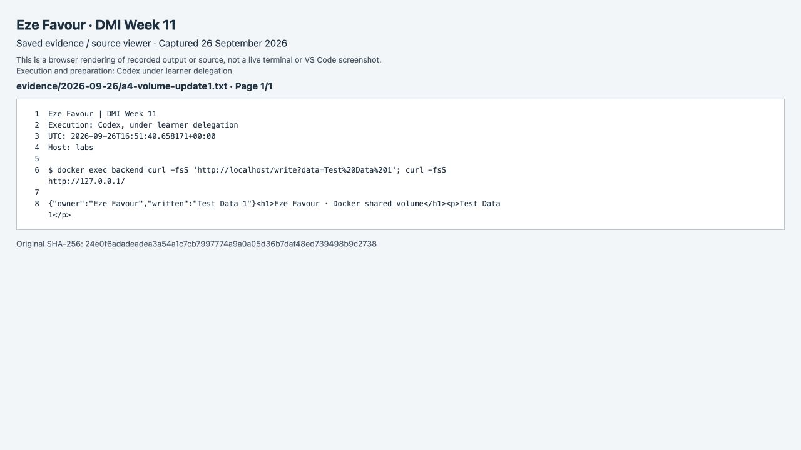

### a4-volume-update2

[Original](evidence/2026-09-26/a4-volume-update2.txt)

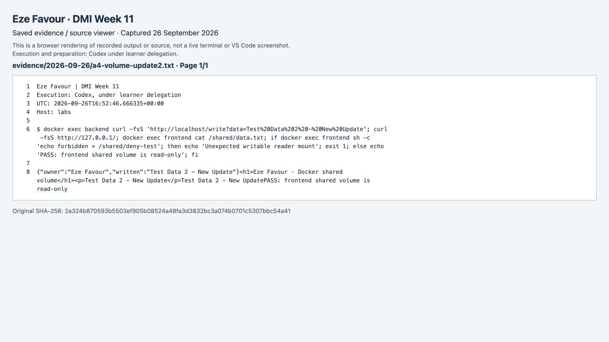
