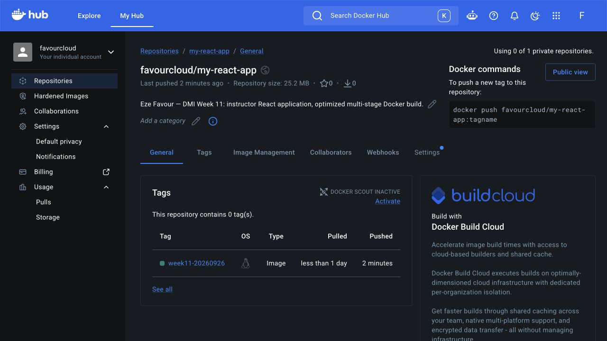
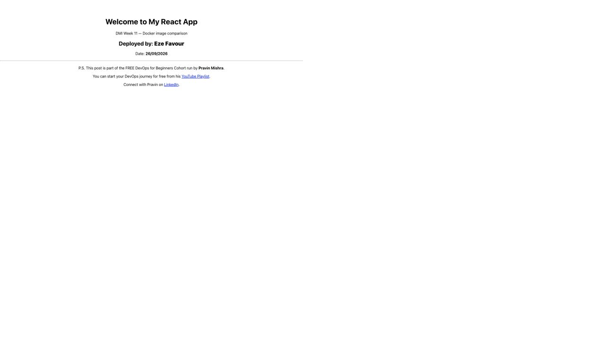
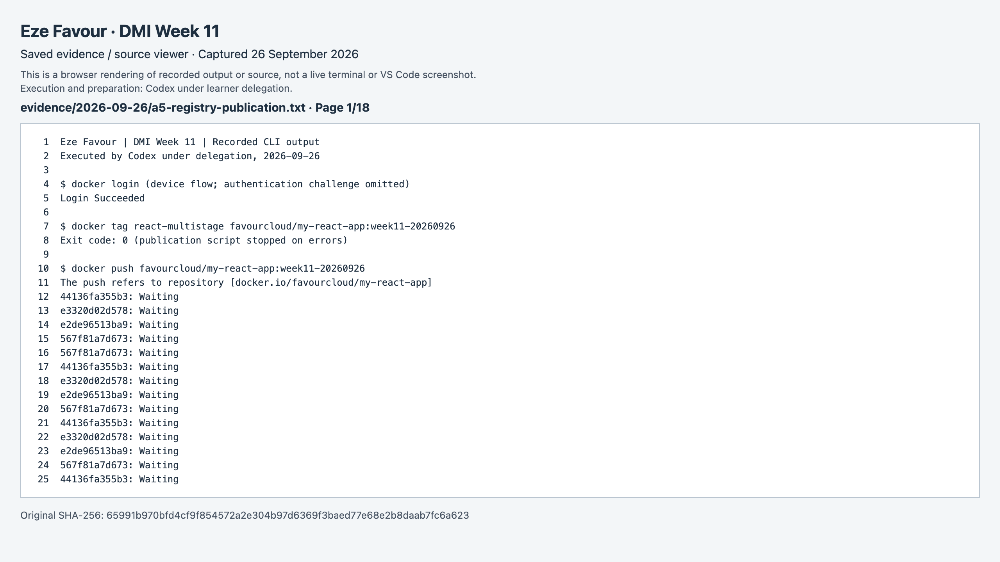
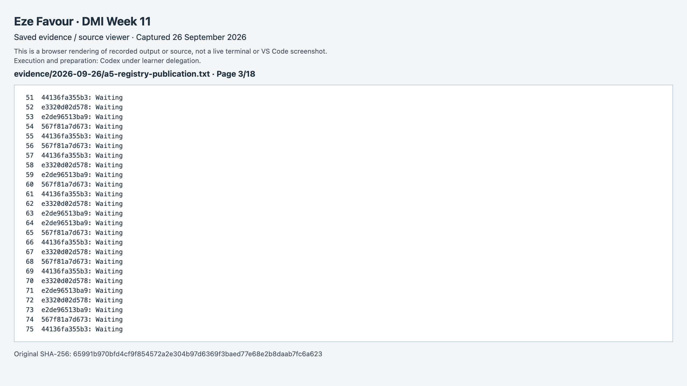
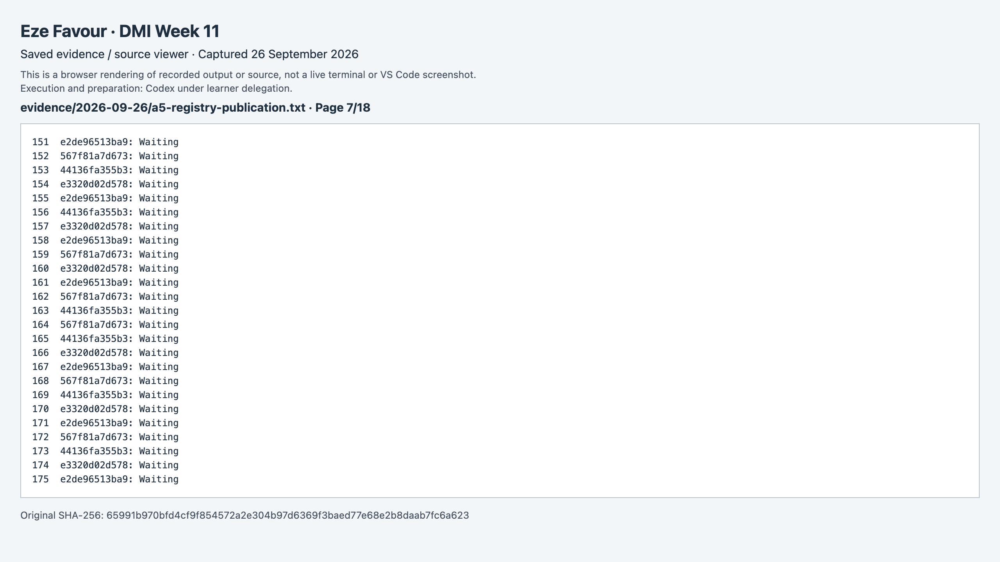
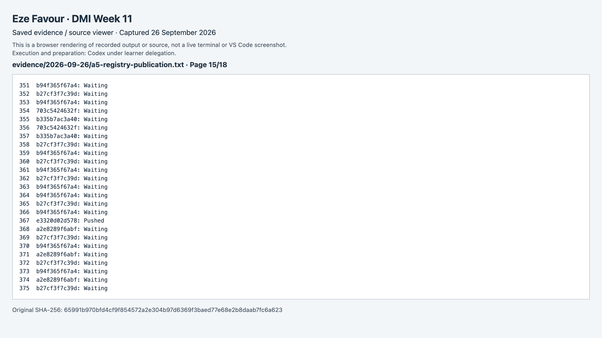
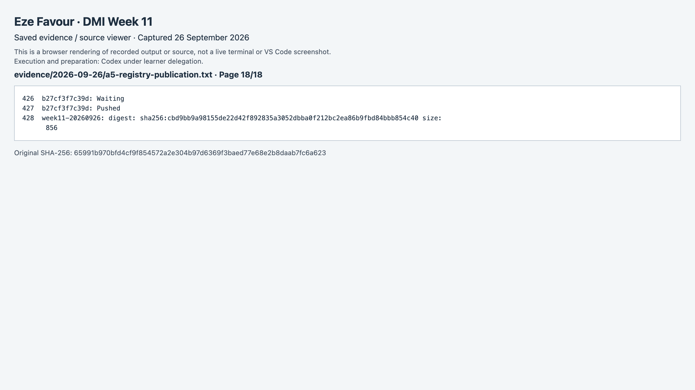
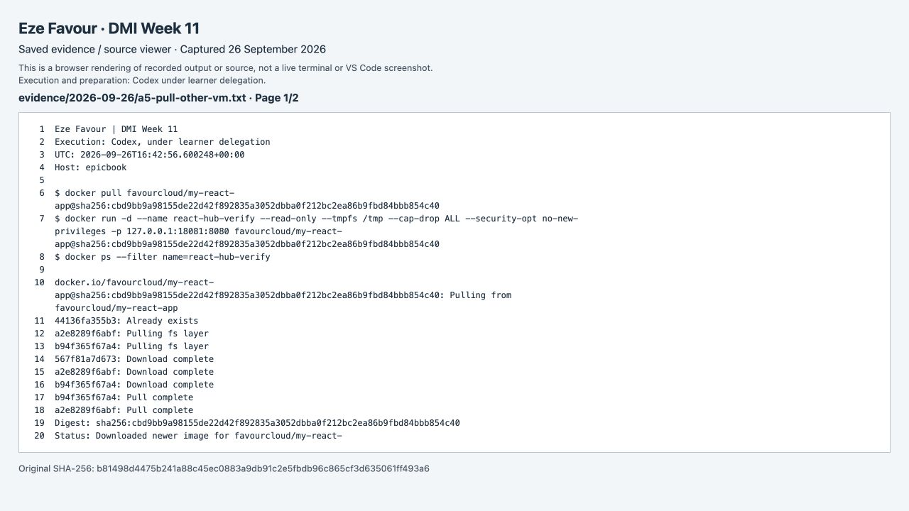
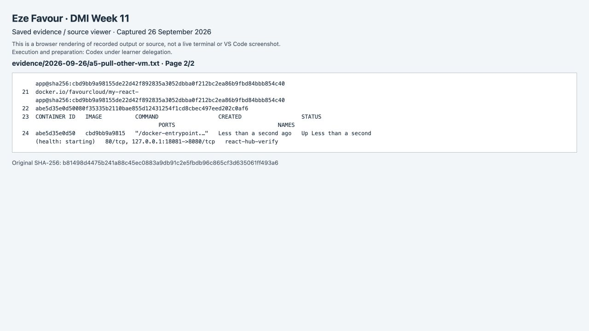

# Assignment 5 — Sharing the Docker Container on Docker Hub

Part of the DevOps Micro Internship (DMI) Cohort 3 with Agentic AI

**Eze Favour · Verified 26 September 2026 · DMI assessment pending**

The public repository is [favourcloud/my-react-app](https://hub.docker.com/r/favourcloud/my-react-app). Tag: `week11-20260926`. It was pushed from the operator system after exporting the cloud-built image, then pulled by digest on the separate EpicBook VM and tested through a private SSH tunnel. Digest: `sha256:cbd9bb9a98155de22d42f892835a3052dbba0f212bc2ea86b9fbd84bbb854c40`.

**Evidence method:** Codex executed and documented these exercises under delegation. App screenshots are actual browser captures. Numbered command/editor slots link to labelled browser renderings of saved command output or source, with originals alongside them; they are not represented as live Terminal or VS Code captures. Full-name captions identify the submission without claiming personal learner execution.

---

## Purpose

In this assignment, you will publish a Dockerized React application to Docker Hub, then pull and run it to verify it can be downloaded and executed from another system.

---

# Task 1 — Publish a Docker Image to Docker Hub

## Goal

Create a Docker Hub repository (`my-react-app`), log in from the CLI, tag and push your local image, verify it on Docker Hub, then pull and run it to confirm the application is accessible.

### Evidence

#### Screenshot 1 — Docker Hub repository (`my-react-app`)

---

#### Screenshot 2 — Successful `docker login`

[Original record/source](evidence/2026-09-26/a5-registry-publication.txt) · [Screenshot page 1](screenshots/a5-registry-publication-p01.png) · [Screenshot page 2](screenshots/a5-registry-publication-p02.png) · [Screenshot page 3](screenshots/a5-registry-publication-p03.png) · [Screenshot page 4](screenshots/a5-registry-publication-p04.png) · [Screenshot page 5](screenshots/a5-registry-publication-p05.png) · [Screenshot page 6](screenshots/a5-registry-publication-p06.png) · [Screenshot page 7](screenshots/a5-registry-publication-p07.png) · [Screenshot page 8](screenshots/a5-registry-publication-p08.png) · [Screenshot page 9](screenshots/a5-registry-publication-p09.png) · [Screenshot page 10](screenshots/a5-registry-publication-p10.png) · [Screenshot page 11](screenshots/a5-registry-publication-p11.png) · [Screenshot page 12](screenshots/a5-registry-publication-p12.png) · [Screenshot page 13](screenshots/a5-registry-publication-p13.png) · [Screenshot page 14](screenshots/a5-registry-publication-p14.png) · [Screenshot page 15](screenshots/a5-registry-publication-p15.png) · [Screenshot page 16](screenshots/a5-registry-publication-p16.png) · [Screenshot page 17](screenshots/a5-registry-publication-p17.png) · [Screenshot page 18](screenshots/a5-registry-publication-p18.png). Captured from the labelled saved-output/source viewer.

---

#### Screenshot 3 — Successful `docker tag`

[Original record/source](evidence/2026-09-26/a5-registry-publication.txt) · [Screenshot page 1](screenshots/a5-registry-publication-p01.png) · [Screenshot page 2](screenshots/a5-registry-publication-p02.png) · [Screenshot page 3](screenshots/a5-registry-publication-p03.png) · [Screenshot page 4](screenshots/a5-registry-publication-p04.png) · [Screenshot page 5](screenshots/a5-registry-publication-p05.png) · [Screenshot page 6](screenshots/a5-registry-publication-p06.png) · [Screenshot page 7](screenshots/a5-registry-publication-p07.png) · [Screenshot page 8](screenshots/a5-registry-publication-p08.png) · [Screenshot page 9](screenshots/a5-registry-publication-p09.png) · [Screenshot page 10](screenshots/a5-registry-publication-p10.png) · [Screenshot page 11](screenshots/a5-registry-publication-p11.png) · [Screenshot page 12](screenshots/a5-registry-publication-p12.png) · [Screenshot page 13](screenshots/a5-registry-publication-p13.png) · [Screenshot page 14](screenshots/a5-registry-publication-p14.png) · [Screenshot page 15](screenshots/a5-registry-publication-p15.png) · [Screenshot page 16](screenshots/a5-registry-publication-p16.png) · [Screenshot page 17](screenshots/a5-registry-publication-p17.png) · [Screenshot page 18](screenshots/a5-registry-publication-p18.png). Captured from the labelled saved-output/source viewer.

---

#### Screenshot 4 — Successful `docker push`

[Original record/source](evidence/2026-09-26/a5-registry-publication.txt) · [Screenshot page 1](screenshots/a5-registry-publication-p01.png) · [Screenshot page 2](screenshots/a5-registry-publication-p02.png) · [Screenshot page 3](screenshots/a5-registry-publication-p03.png) · [Screenshot page 4](screenshots/a5-registry-publication-p04.png) · [Screenshot page 5](screenshots/a5-registry-publication-p05.png) · [Screenshot page 6](screenshots/a5-registry-publication-p06.png) · [Screenshot page 7](screenshots/a5-registry-publication-p07.png) · [Screenshot page 8](screenshots/a5-registry-publication-p08.png) · [Screenshot page 9](screenshots/a5-registry-publication-p09.png) · [Screenshot page 10](screenshots/a5-registry-publication-p10.png) · [Screenshot page 11](screenshots/a5-registry-publication-p11.png) · [Screenshot page 12](screenshots/a5-registry-publication-p12.png) · [Screenshot page 13](screenshots/a5-registry-publication-p13.png) · [Screenshot page 14](screenshots/a5-registry-publication-p14.png) · [Screenshot page 15](screenshots/a5-registry-publication-p15.png) · [Screenshot page 16](screenshots/a5-registry-publication-p16.png) · [Screenshot page 17](screenshots/a5-registry-publication-p17.png) · [Screenshot page 18](screenshots/a5-registry-publication-p18.png). Captured from the labelled saved-output/source viewer.

---

#### Screenshot 5 — Docker Hub repository showing the uploaded image

---

#### Screenshot 6 — Successful `docker pull`

[Original record/source](evidence/2026-09-26/a5-pull-other-vm.txt) · [Screenshot page 1](screenshots/a5-pull-other-vm-p01.png) · [Screenshot page 2](screenshots/a5-pull-other-vm-p02.png). Captured from the labelled saved-output/source viewer.

---

#### Screenshot 7 — Output of `docker ps`

[Original record/source](evidence/2026-09-26/a5-pull-other-vm.txt) · [Screenshot page 1](screenshots/a5-pull-other-vm-p01.png) · [Screenshot page 2](screenshots/a5-pull-other-vm-p02.png). Captured from the labelled saved-output/source viewer.

---

#### Screenshot 8 — Browser displaying the running React application

---

# LinkedIn Post (Optional)

## Goal

Create a LinkedIn post covering the assignment title, the Docker Hub repository created, steps performed, key learning outcomes, and a screenshot of the published image.

## Evidence

#### LinkedIn Post URL

The weekly post covers this assignment and the EpicBook capstone.

[Published Week 11 LinkedIn post](https://www.linkedin.com/posts/eze-favour-52732752_dmibypravinmishra-docker-devops-share-7509737427876454400-cxc1/) · [receipt](publication/README.md).

---

#### Screenshot — Published LinkedIn post

See [the weekly publication receipt](publication/README.md) and its published-post capture.

---

# Submission Instructions

- Add all required screenshots in your submission
- Include the Docker Hub repository URL
- Full name must be visible in required screenshots
- Do not expose passwords or sensitive credentials

---

# Completion Checklist

- [x] Docker Hub account and repository created
- [x] Docker image tagged and pushed successfully (Screenshots 1–5)
- [x] Docker image pulled and container run successfully (Screenshots 6–7)
- [x] React application accessible in the browser (Screenshot 8)
- [x] No sensitive information exposed

---

## 📌 About DMI & CloudAdvisory

DevOps Micro Internship (DMI) is a project-based DevOps program run by Pravin Mishra (The CloudAdvisory) focused on real-world execution, systems thinking, and career readiness.

It helps learners build strong DevOps foundations with hands-on experience.

---

## 📌 Resources

- 🌐 DMI Official Website: https://dmi.pravinmishra.com?utm_source=github&utm_medium=readme  
- 🎓 University: https://university.pravinmishra.com?utm_source=github&utm_medium=readme  
- 💬 Discord Community: https://discord.pravinmishra.com?utm_source=github&utm_medium=readme  
- 📝 Blog: https://dmi.pravinmishra.com/blog?utm_source=github&utm_medium=readme  
- ▶️ YouTube Playlist: https://www.youtube.com/playlist?list=PLFeSNDtI4Cho  
- 🔗 Pravin Mishra (LinkedIn): https://www.linkedin.com/in/pravin-mishra-aws-trainer/  
- 🏢 CloudAdvisory (LinkedIn): https://www.linkedin.com/company/thecloudadvisory/

---

*This submission is part of DevOps Micro Internship (DMI) Cohort 3 — Agentic AI Track.*

## Recorded evidence gallery

Each figure is captured once and may support multiple related screenshot slots. Page links above identify the same original evidence, not separate repeated executions.

### a5-registry-publication

[Original](evidence/2026-09-26/a5-registry-publication.txt)

### a5-pull-other-vm

[Original](evidence/2026-09-26/a5-pull-other-vm.txt)

