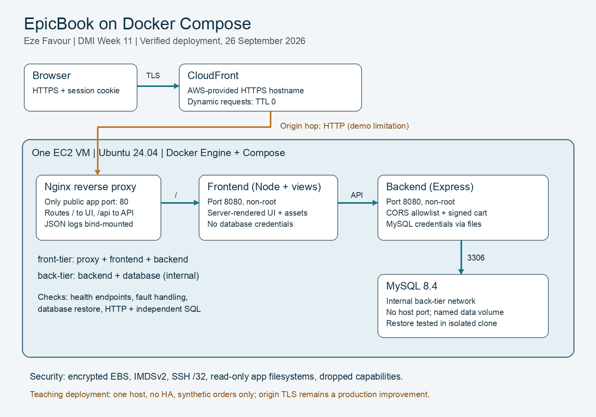
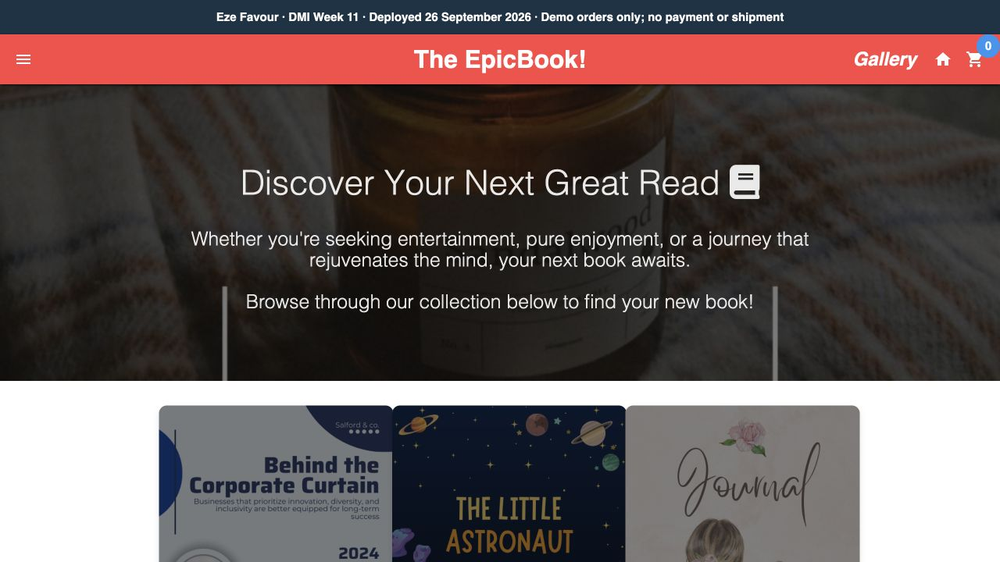
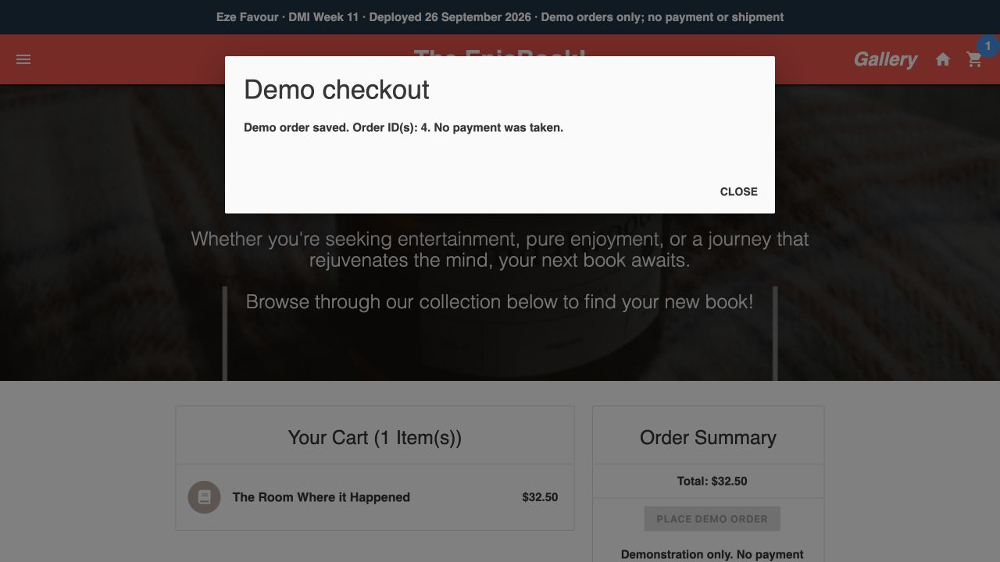
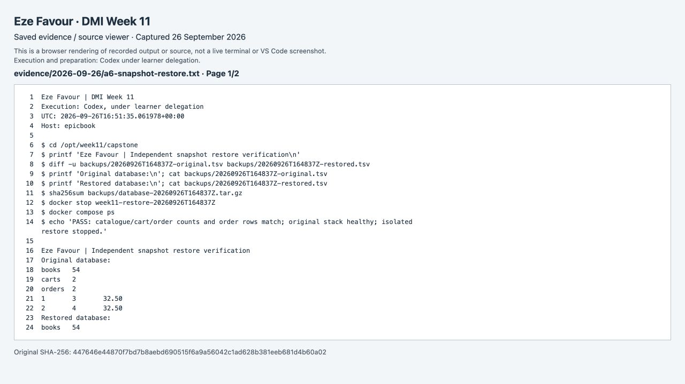
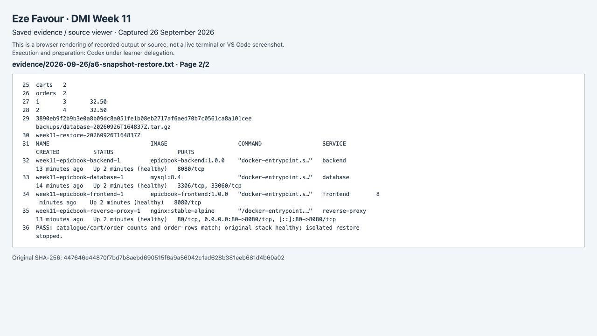
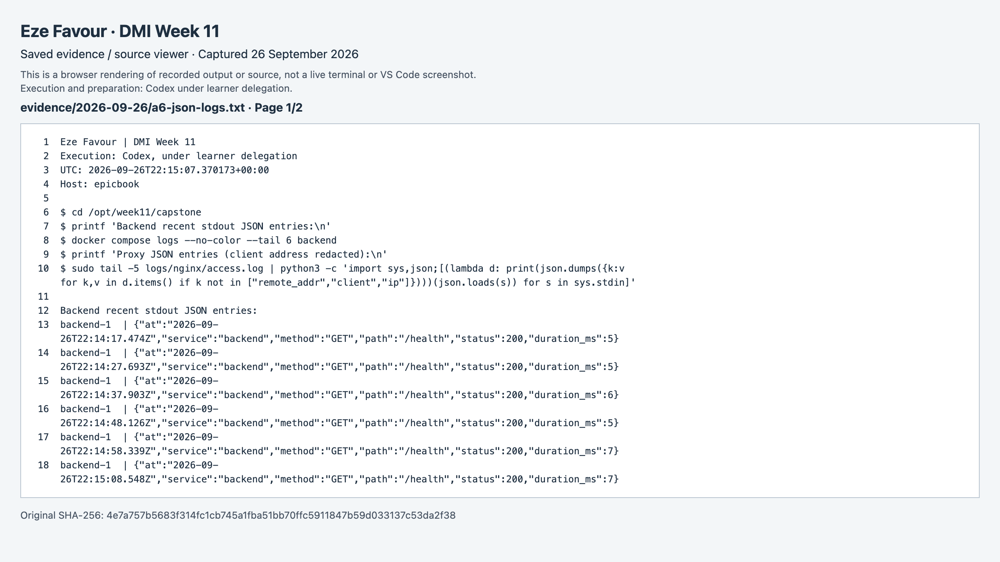
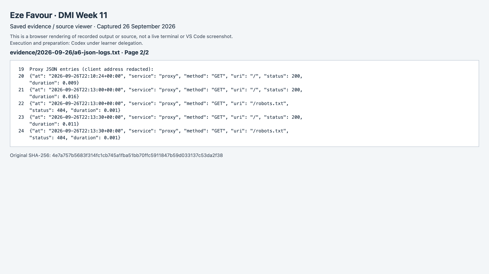

# Assignment 6 — Capstone: Deploy a Production-Grade Stack for The EpicBook

Part of the DevOps Micro Internship (DMI) Cohort 3 with Agentic AI

**Eze Favour · Verified 26 September 2026 · DMI assessment pending**

The working capstone is [EpicBook over HTTPS](https://d209ibroel8p0b.cloudfront.net/), also verified at [the cloud origin IP](http://98.86.65.226/). UI and API are separate services; only the proxy publishes a host port. Snapshot restoration, dependency failures, signed cart isolation and transactional demo checkout were exercised. HTTPS terminates at CloudFront and its origin connection is HTTP. This single-host teaching deployment does not claim high availability or real-payment readiness.

**Evidence method:** Codex executed and documented these exercises under delegation. App screenshots are actual browser captures. Numbered command/editor slots link to labelled browser renderings of saved command output or source, with originals alongside them; they are not represented as live Terminal or VS Code captures. Full-name captions identify the submission without claiming personal learner execution.

---

## Purpose

In this capstone assignment, you will take the EpicBook application from source code to a fully hardened, production-ready Docker Compose deployment on a cloud VM: multi-stage Dockerfiles, network isolation, healthchecks, persistent volumes with a backup plan, structured logging, a secure reverse proxy, and an operations runbook — with an optional CI/CD pipeline.

---

# Task 0 — App Discovery & Architecture

## Goal

Explore the `theepicbook` repository, identify its components (UI, API, DB, workers), document required environment variables/ports/persistence paths, and draw a component architecture diagram.

### Evidence

#### Deliverable — `docs/01-architecture-diagram.png`

---

#### Deliverable — `docs/02-env-and-ports.md`

[Open deliverable](capstone/docs/02-env-and-ports.md)

---

# Task 1 — Multi-Stage Dockerfiles

## Goal

Create minimal multi-stage Dockerfiles for the frontend and backend services, with `.dockerignore` files to keep the build context lightweight.

### Evidence

#### Deliverable — `frontend/Dockerfile`, `backend/Dockerfile`, and `.dockerignore` files, with a note on layer optimizations and security benefits

[Frontend Dockerfile](capstone/frontend/Dockerfile) · [backend Dockerfile](capstone/backend/Dockerfile) · [frontend ignore file](capstone/frontend/.dockerignore) · [backend ignore file](capstone/backend/.dockerignore). Manifests are copied before source for cache reuse; production dependencies are copied into non-root runtime stages without the build cache.

---

# Task 2 — Compose Stack & Networks

## Goal

Author `docker-compose.yml` defining the reverse-proxy, frontend, backend, and database services, isolated front-tier/back-tier networks, and named volumes.

### Evidence

#### Deliverable — `docker-compose.yml`

[Compose stack](capstone/docker-compose.yml)

---

# Task 3 — Healthchecks & Startup Order

## Goal

Add a database healthcheck, a `/health` endpoint check on the backend, and `depends_on` conditions checking `service_healthy`.

### Evidence

#### Deliverable — `docs/03-healthchecks-and-depends-on.md`

[Open deliverable](capstone/docs/03-healthchecks-and-depends-on.md)

---

# Task 4 — Reverse Proxy & CORS Config

## Goal

Configure Nginx or Traefik to route `/api` to the backend and `/` to the frontend, with an appropriate CORS allowlist on the backend.

### Evidence

#### Deliverable — `docs/04-proxy-routing-and-cors.md`

[Open deliverable](capstone/docs/04-proxy-routing-and-cors.md)

---

# Task 5 — Persistence & Backups

## Goal

Mount the database data directory to a named volume, document a snapshot/backup plan, and run a live snapshot restore drill.

### Evidence

#### Deliverable — `docs/05-persistence-and-backup.md`

[Open deliverable](capstone/docs/05-persistence-and-backup.md)

---

#### Screenshot — System state before and after a manual snapshot restore cycle

[Original record/source](evidence/2026-09-26/a6-snapshot-restore.txt) · [Screenshot page 1](screenshots/a6-snapshot-restore-p01.png) · [Screenshot page 2](screenshots/a6-snapshot-restore-p02.png). Captured from the labelled saved-output/source viewer.

---

# Task 6 — Logging & Observability

## Goal

Bind-mount the reverse proxy log directory to the host, redirect application logs to stdout or named volumes, and enable structured JSON logging where supported.

### Evidence

#### Deliverable — `docs/06-logging-layout.md`

[Open deliverable](capstone/docs/06-logging-layout.md)

---

#### Screenshot — Live running JSON container log entries

[Original record/source](evidence/2026-09-26/a6-json-logs.txt) · [Screenshot page 1](screenshots/a6-json-logs-p01.png) · [Screenshot page 2](screenshots/a6-json-logs-p02.png). Captured from the labelled saved-output/source viewer.

---

# Task 7 — Cloud Deployment (AWS or Azure)

## Goal

Provision a VM per the security requirements (SSH restricted to your IP; HTTP/HTTPS open), install Docker, and bring the full stack up with a working public URL.

### Evidence

#### Deliverable — `docs/07-cloud-deployment-notes.md` (ports, firewall rules, deployment link)

[Open deliverable](capstone/docs/07-cloud-deployment-notes.md)

---

#### Screenshot — Browser showing successful web UI retrieval via the cloud public IP

---

#### Screenshot — Active page interaction confirming backend API data fetches succeed

---

# Task 8 — CI/CD Pipeline (Optional)

## Goal

Build a pipeline (Azure Pipelines or GitHub Actions) that builds and tags multi-stage images and automates deployment via SSH restart steps.

### Evidence

#### Deliverable — `docs/08-ci-cd-pipeline.md`

[Open deliverable](capstone/docs/08-ci-cd-pipeline.md)

---

#### Screenshot (optional) — Completed automated pipeline run

Optional CI/CD was not selected; see the explicit scope in the pipeline document.

---

# Task 9 — Reliability Tests & Ops Runbook

## Goal

Inject faults (drop backend/database dependencies) and evaluate frontend error handling, then write an operations runbook covering startup, shutdown, secret rotation, and disaster recovery.

### Evidence

#### Deliverable — `docs/09-runbook.md`

[Open deliverable](capstone/docs/09-runbook.md)

---

#### Deliverable — `docs/10-reliability-tests.md`

[Open deliverable](capstone/docs/10-reliability-tests.md)

---

# LinkedIn Post (Required)

## Goal

Publish a 6–10 line LinkedIn post covering the architectural decision that most improved reliability, the biggest image size reduction achieved (with numbers), and your key production-hardening takeaways.

## Evidence

#### LinkedIn Post URL

The weekly post covers this assignment and the EpicBook capstone.

[Published Week 11 LinkedIn post](https://www.linkedin.com/posts/eze-favour-52732752_dmibypravinmishra-docker-devops-share-7509737427876454400-cxc1/) · [receipt](publication/README.md).

---

#### Screenshot — Published LinkedIn post showing the text body and a deployment verification image

See [the weekly publication receipt](publication/README.md) and its published-post capture.

---

# Submission Instructions

- Add all required deliverables, screenshots, and links in your submission
- Full name must be visible in required screenshots
- Do not expose passwords, API tokens, cloud account IDs, or private keys

---

# Completion Checklist

- [x] Task 0: Architecture diagram and env/ports doc completed
- [x] Task 1: Multi-stage Dockerfiles and `.dockerignore` files created
- [x] Task 2: `docker-compose.yml` with isolated networks and volumes authored
- [x] Task 3: Healthchecks and `depends_on` conditions configured
- [x] Task 4: Reverse proxy routing and CORS configured
- [x] Task 5: Persistence and backup plan tested (Screenshot)
- [x] Task 6: Logging and observability configured (Screenshot)
- [x] Task 7: Cloud deployment live and verified (Screenshots)
- Optional CI/CD: not selected, documented in Task 8.
- [x] Task 9: Reliability tests and runbook completed
- [x] LinkedIn post published and URL submitted
- [x] No sensitive information exposed
- Teardown deferred: the learner explicitly requested that the demo stay online until cleanup is requested.

---

## 📌 About DMI & CloudAdvisory

DevOps Micro Internship (DMI) is a project-based DevOps program run by Pravin Mishra (The CloudAdvisory) focused on real-world execution, systems thinking, and career readiness.

It helps learners build strong DevOps foundations with hands-on experience.

---

## 📌 Resources

- 🌐 DMI Official Website: https://dmi.pravinmishra.com?utm_source=github&utm_medium=readme  
- 🎓 University: https://university.pravinmishra.com?utm_source=github&utm_medium=readme  
- 💬 Discord Community: https://discord.pravinmishra.com?utm_source=github&utm_medium=readme  
- 📝 Blog: https://dmi.pravinmishra.com/blog?utm_source=github&utm_medium=readme  
- ▶️ YouTube Playlist: https://www.youtube.com/playlist?list=PLFeSNDtI4Cho  
- 🔗 Pravin Mishra (LinkedIn): https://www.linkedin.com/in/pravin-mishra-aws-trainer/  
- 🏢 CloudAdvisory (LinkedIn): https://www.linkedin.com/company/thecloudadvisory/

---

*This submission is part of DevOps Micro Internship (DMI) Cohort 3 — Agentic AI Track.*

## Recorded evidence gallery

Each figure is captured once and may support multiple related screenshot slots. Page links above identify the same original evidence, not separate repeated executions.

### a6-snapshot-restore

[Original](evidence/2026-09-26/a6-snapshot-restore.txt)

### a6-json-logs

[Original](evidence/2026-09-26/a6-json-logs.txt)

