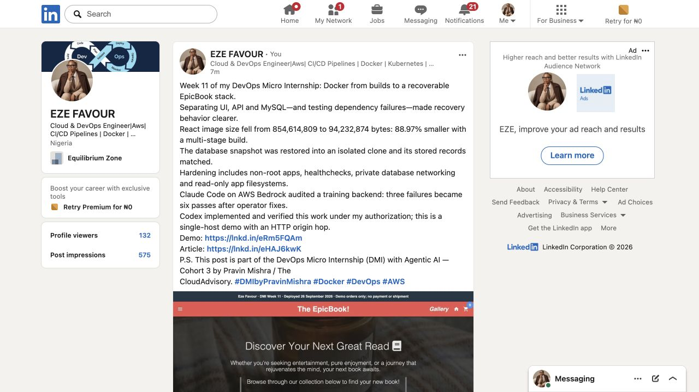
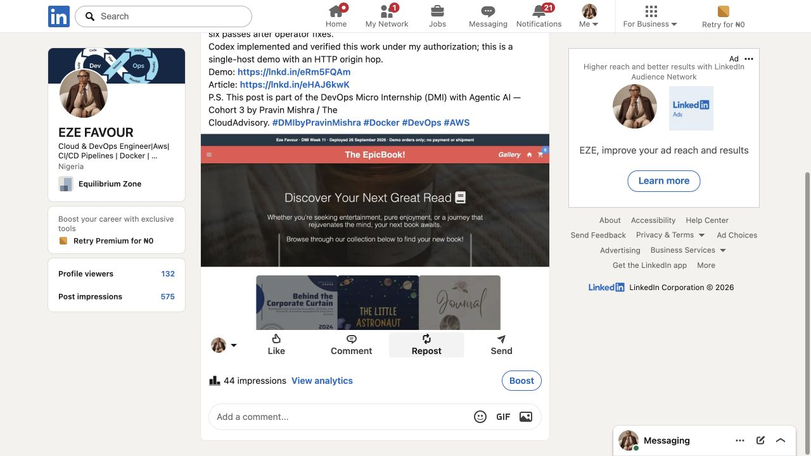

# Week 11 publication — Eze Favour

Published and verified 26 September 2026.

- [Public article](https://favourcloud.github.io/devops-micro-internship-pravinmishra/blog/week-11.html) — more than 200 words, own clickable DMI profile link, mentor credit, actual results and assistance disclosure. Pages commit `7c78209`.
- [Published LinkedIn post](https://www.linkedin.com/posts/eze-favour-52732752_dmibypravinmishra-docker-devops-share-7509737427876454400-cxc1/) — 10 content lines with architecture, measured image-size reduction, recovery/hardening results and an actual deployment image.
- [Exact submitted text](linkedin-post.txt) and [publication receipt](published.json).

The canonical `/posts/` link was obtained from LinkedIn's copy-link control and resolved to this specific Week 11 post. Publication does not establish DMI grading.
